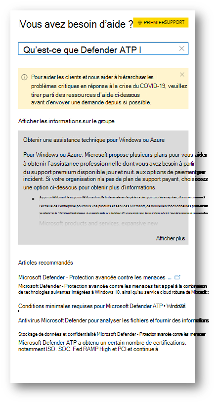

# Contacter le support Microsoft Defender pour point de terminaison

[!INCLUDE [Microsoft 365 Defender rebranding](../../includes/microsoft-defender.md)]

**S’applique à :**
- [Microsoft Defender pour point de terminaison](https://go.microsoft.com/fwlink/p/?linkid=2154037)
- [Microsoft 365 Defender](https://go.microsoft.com/fwlink/?linkid=2118804)

>Vous souhaitez faire l'expérience de Defender for Endpoint ? [Inscrivez-vous à un essai gratuit.](https://www.microsoft.com/microsoft-365/windows/microsoft-defender-atp?ocid=docs-wdatp-assignaccess-abovefoldlink)

Defender pour le point de terminaison a récemment mis à niveau le processus de support pour offrir une expérience de support plus moderne et avancée. 

Le nouveau widget permet aux clients de :
- Trouver des solutions aux problèmes courants
- Soumettre un dossier de support à l'équipe de support Technique Microsoft

## Conditions préalables
Il est important de connaître les rôles spécifiques qui sont autorisés à ouvrir des cas de support.

Au minimum, vous devez avoir un rôle d'administrateur du support technique **OU** d'administrateur du support technique.

Pour plus d'informations sur les rôles qui ont des autorisations, voir les [autorisations d'administrateur de sécurité.](https://docs.microsoft.com/azure/active-directory/users-groups-roles/directory-assign-admin-roles#security-administrator-permissions) Les rôles qui incluent l'action `microsoft.office365.supportTickets/allEntities/allTasks` peuvent soumettre un cas.

Pour obtenir des informations générales sur les rôles d'administrateur, voir [à propos des rôles d'administrateur.](https://docs.microsoft.com/microsoft-365/admin/add-users/about-admin-roles?view=o365-worldwide&preserve-view=true)

## Accéder au widget
L'accès au nouveau widget de support peut être effectué de deux manières :

1.  Cliquez sur le point d'interrogation en haut à droite du portail, puis sur « Support Microsoft » :

    

2. Vous avez besoin **d'aide en cliquant sur ?**  dans le coin inférieur droit du Centre de sécurité Microsoft Defender :

    

Deux options s’offrent à vous dans le widget :

- Trouver des solutions aux problèmes courants    
- Ouvrir une demande de service  

## Trouver des solutions aux problèmes courants
Cette option inclut des articles qui peuvent être liés à la question que vous pouvez poser. Commencez simplement à taper la question dans la zone de recherche et les articles relatifs à votre recherche seront mis en avant.

Si les articles suggérés ne sont pas suffisants, vous pouvez ouvrir une demande de service.

## Ouvrir une demande de service

Découvrez comment ouvrir des tickets de support en contactant le support de Defender pour Endpoint. 

> [!Note]
> Si vous avez un contrat de support permier avec Microsoft, vous verrez la balise premier sur le widget. Si ce n’est pas le cas, contactez votre gestionnaire de comptes Microsoft.

### Contacter l’assistance
Cette option est disponible en cliquant sur l’icône qui ressemble à un casque. Vous recevez ensuite la page suivante pour soumettre votre dossier de support :

1. Remplissez un titre et une description du problème auquel vous êtes confronté, ainsi qu’un numéro de téléphone et une adresse de messagerie où nous pouvons vous joindre. 

2. (Facultatif) Inclure jusqu’à cinq pièces jointes pertinentes pour le problème afin de fournir un contexte supplémentaire pour le cas de support. 

3. Sélectionnez votre fuseau horaire et une autre langue, le cas échéant. La demande est envoyée à l’équipe de support Technique Microsoft. L’équipe répondra prochainement à votre demande de service.

## Voir aussi
- [Résoudre des problèmes de service](troubleshoot-mdatp.md)
- [Vérifier l’état du service](service-status.md).
