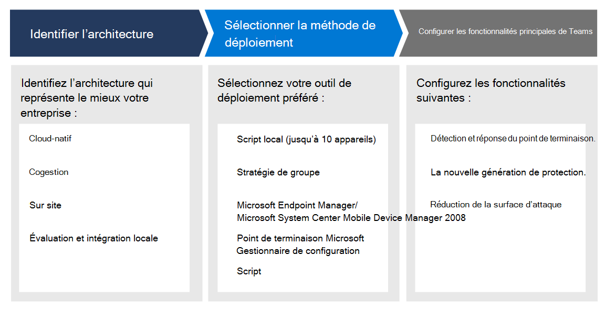

# Planifier votre déploiement de Microsoft Defender pour les points de terminaisonPlan your Microsoft Defender for Endpoint deployment 

[!INCLUDE [Microsoft 365 Defender rebranding](../../includes/microsoft-defender.md)]

**S’applique à :****Applies to:**
- [Microsoft Defender pour point de terminaisonMicrosoft Defender for Endpoint](https://go.microsoft.com/fwlink/p/?linkid=2154037)
- [Microsoft 365 DefenderMicrosoft 365 Defender](https://go.microsoft.com/fwlink/?linkid=2118804)

>Vous souhaitez faire l’expérience de Defender for Endpoint ?Want to experience Defender for Endpoint? [Inscrivez-vous à un essai gratuit.Sign up for a free trial.](https://www.microsoft.com/microsoft-365/windows/microsoft-defender-atp?ocid=docs-wdatp-secopsdashboard-abovefoldlink) 

Planifiez votre déploiement de Microsoft Defender for Endpoint afin d’optimiser les fonctionnalités de sécurité de la suite et de mieux protéger votre entreprise contre les cybermenaces.Plan your Microsoft Defender for Endpoint deployment so that you can maximize the security capabilities within the suite and better protect your enterprise from cyber threats.

Cette solution fournit des conseils sur l’identification de l’architecture de votre environnement, la sélection du type d’outil de déploiement qui répond le mieux à vos besoins et des instructions sur la configuration des fonctionnalités.This solution provides guidance on how to identify your environment architecture, select the type of deployment tool that best fits your needs, and guidance on how to configure capabilities.

## Étape 1 : identifier l’architectureStep 1: Identify architecture
Comme nous savons que chaque environnement d’entreprise est unique, nous avons fourni plusieurs options pour vous offrir la flexibilité nécessaire pour choisir le déploiement du service.We understand that every enterprise environment is unique, so we've provided several options to give you the flexibility in choosing how to deploy the service.

Selon votre environnement, certains outils conviennent mieux à certaines architectures.Depending on your environment, some tools are better suited for certain architectures. 

Utilisez les documents suivants pour sélectionner l’architecture defender pour point de terminaison appropriée qui convient le mieux à votre organisation.Use the following material to select the appropriate Defender for Endpoint architecture that best suites your organization.

| ItemItem | DescriptionDescription |
|:-----|:-----|
|  [PDF](https://github.com/MicrosoftDocs/microsoft-365-docs/raw/public/microsoft-365/security/defender-endpoint/downloads/mdatp-deployment-strategy.pdf)  \| [Visio](https://github.com/MicrosoftDocs/microsoft-365-docs/raw/public/microsoft-365/security/defender-endpoint/downloads/mdatp-deployment-strategy.vsdx)[PDF](https://github.com/MicrosoftDocs/microsoft-365-docs/raw/public/microsoft-365/security/defender-endpoint/downloads/mdatp-deployment-strategy.pdf)  \| [Visio](https://github.com/MicrosoftDocs/microsoft-365-docs/raw/public/microsoft-365/security/defender-endpoint/downloads/mdatp-deployment-strategy.vsdx) | Le matériel architectural vous aide à planifier votre déploiement pour les architectures suivantes :The architectural material helps you plan your deployment for the following architectures: <ul><li> Cloud-natifCloud-native </li><li> CogestionCo-management </li><li> Sur siteOn-premise</li><li>Évaluation et intégration localeEvaluation and local onboarding</li>

## Étape 2 : sélectionner la méthode de déploiementStep 2: Select deployment method
Defender pour le point de terminaison prend en charge divers points de terminaison que vous pouvez intégrer au service.Defender for Endpoint supports a variety of endpoints that you can onboard to the service. 

Le tableau suivant répertorie les points de terminaison pris en charge et l’outil de déploiement correspondant que vous pouvez utiliser pour planifier le déploiement de manière appropriée.The following table lists the supported endpoints and the corresponding deployment tool that you can use so that you can plan the deployment appropriately.

| Point de terminaisonEndpoint     | Outil de déploiementDeployment tool                       |
|--------------|------------------------------------------|
| **Windows****Windows**  |  [Script local (jusqu’à 10 appareils)Local script (up to 10 devices)](configure-endpoints-script.md)    [Stratégie de groupeGroup Policy](configure-endpoints-gp.md)    [Gestionnaire de point de terminaison Microsoft/ Gestionnaire d’appareils mobilesMicrosoft Endpoint Manager/ Mobile Device Manager](configure-endpoints-mdm.md)     [Microsoft Endpoint Configuration ManagerMicrosoft Endpoint Configuration Manager](configure-endpoints-sccm.md)   [Scripts VDIVDI scripts](configure-endpoints-vdi.md)   |
| **MacOS****macOS**    | [Script localLocal script](mac-install-manually.md)   [Microsoft Endpoint ManagerMicrosoft Endpoint Manager](mac-install-with-intune.md)   [JAMF ProJAMF Pro](mac-install-with-jamf.md)   [Gestion des appareils mobilesMobile Device Management](mac-install-with-other-mdm.md) |
| **Serveur Linux****Linux Server** | [Script localLocal script](linux-install-manually.md)   [SondentPuppet](linux-install-with-puppet.md)   [AnsibleAnsible](linux-install-with-ansible.md)|
| **iOS****iOS**      | [Basée sur l’applicationApp-based](ios-install.md)                                |
| **Android****Android**  | [Microsoft Endpoint ManagerMicrosoft Endpoint Manager](android-intune.md)               | 

## Étape 3 : Configurer les fonctionnalitésStep 3: Configure capabilities
Après l’intégration des points de terminaison, configurez les fonctionnalités de sécurité dans Defender pour le point de terminaison afin que vous pouvez optimiser la protection de sécurité robuste disponible dans la suite.After onboarding endpoints, configure the security capabilities in Defender for Endpoint so that you can maximize the robust security protection available in the suite. Les fonctionnalités sont les suivantes :Capabilities include:

- Détection et réponse au point de terminaisonEndpoint detection and response
- Protection nouvelle générationNext-generation protection
- Réduction de la surface d’attaqueAttack surface reduction

  
## Voir aussiRelated topics
- [Phases de déploiementDeployment phases](deployment-phases.md)
