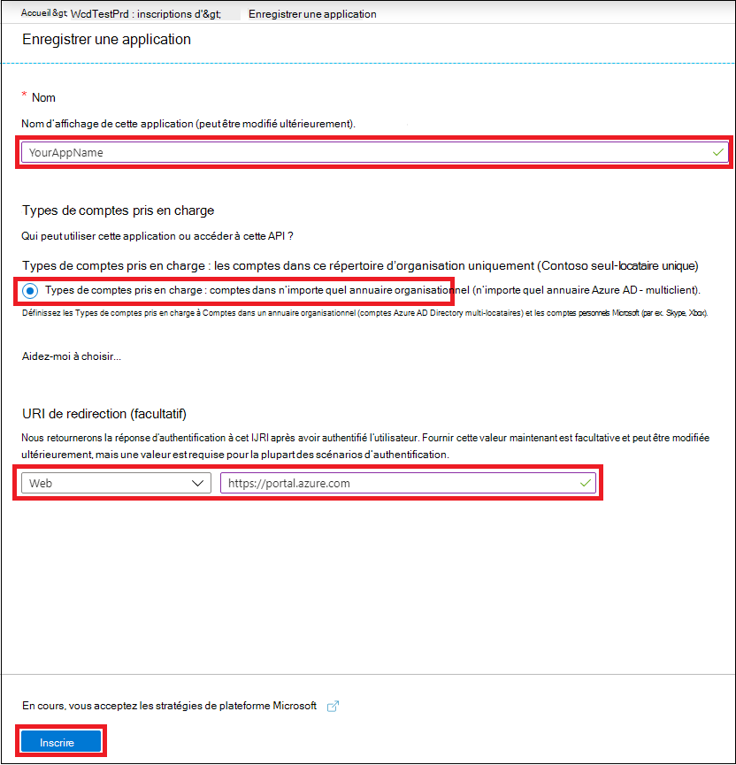
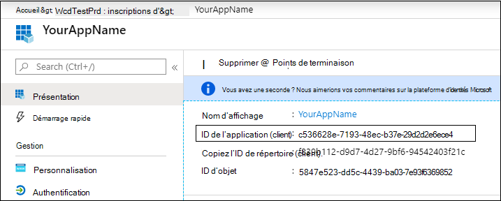
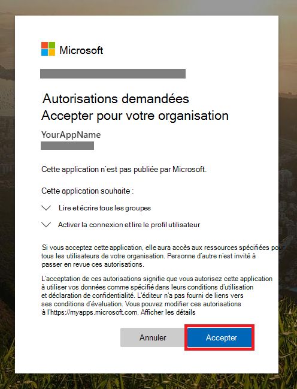

# <a name="partner-access-through-microsoft-defender-for-endpoint-apis"></a><span data-ttu-id="968b7-104">Accès des partenaires via les API microsoft Defender pour les points de terminaison</span><span class="sxs-lookup"><span data-stu-id="968b7-104">Partner access through Microsoft Defender for Endpoint APIs</span></span>

[!INCLUDE [Microsoft 365 Defender rebranding](../../includes/microsoft-defender.md)]


<span data-ttu-id="968b7-105">**S’applique à :** [Microsoft Defender for Endpoint](https://go.microsoft.com/fwlink/?linkid=2154037)</span><span class="sxs-lookup"><span data-stu-id="968b7-105">**Applies to:** [Microsoft Defender for Endpoint](https://go.microsoft.com/fwlink/?linkid=2154037)</span></span>

> <span data-ttu-id="968b7-106">Vous souhaitez découvrir Microsoft Defender pour le point de terminaison ?</span><span class="sxs-lookup"><span data-stu-id="968b7-106">Want to experience Microsoft Defender for Endpoint?</span></span> [<span data-ttu-id="968b7-107">Inscrivez-vous à un essai gratuit.</span><span class="sxs-lookup"><span data-stu-id="968b7-107">Sign up for a free trial.</span></span>](https://www.microsoft.com/microsoft-365/windows/microsoft-defender-atp?ocid=docs-wdatp-exposedapis-abovefoldlink)

[!include[Microsoft Defender for Endpoint API URIs for US Government](../../includes/microsoft-defender-api-usgov.md)]

[!include[Improve request performance](../../includes/improve-request-performance.md)]

<span data-ttu-id="968b7-108">Cette page décrit comment créer une application Azure Active Directory (Azure AD) pour obtenir un accès par programmation à Microsoft Defender pour endpoint pour le compte de vos clients.</span><span class="sxs-lookup"><span data-stu-id="968b7-108">This page describes how to create an Azure Active Directory (Azure AD) application to get programmatic access to Microsoft Defender for Endpoint on behalf of your customers.</span></span>


<span data-ttu-id="968b7-109">Microsoft Defender pour point de terminaison expose la plupart de ses données et actions par le biais d’un ensemble d’API de programmation.</span><span class="sxs-lookup"><span data-stu-id="968b7-109">Microsoft Defender for Endpoint exposes much of its data and actions through a set of programmatic APIs.</span></span> <span data-ttu-id="968b7-110">Ces API vous aideront à automatiser les flux de travail et à innover en fonction des fonctionnalités de Microsoft Defender for Endpoint.</span><span class="sxs-lookup"><span data-stu-id="968b7-110">Those APIs will help you automate work flows and innovate based on Microsoft Defender for Endpoint capabilities.</span></span> <span data-ttu-id="968b7-111">L’accès à l’API nécessite une authentification OAuth2.0.</span><span class="sxs-lookup"><span data-stu-id="968b7-111">The API access requires OAuth2.0 authentication.</span></span> <span data-ttu-id="968b7-112">Pour plus d’informations, [voir code d’autorisation OAuth 2.0 Flow](/azure/active-directory/develop/active-directory-v2-protocols-oauth-code).</span><span class="sxs-lookup"><span data-stu-id="968b7-112">For more information, see [OAuth 2.0 Authorization Code Flow](/azure/active-directory/develop/active-directory-v2-protocols-oauth-code).</span></span>

<span data-ttu-id="968b7-113">En règle générale, vous devez suivre les étapes suivantes pour utiliser les API :</span><span class="sxs-lookup"><span data-stu-id="968b7-113">In general, you’ll need to take the following steps to use the APIs:</span></span>
- <span data-ttu-id="968b7-114">Créez une application Azure AD **multi-locataire.**</span><span class="sxs-lookup"><span data-stu-id="968b7-114">Create a **multi-tenant** Azure AD application.</span></span>
- <span data-ttu-id="968b7-115">Obtenez l’autorisation (consentement) de votre administrateur client pour que votre application accède aux ressources Defender for Endpoint dont elle a besoin.</span><span class="sxs-lookup"><span data-stu-id="968b7-115">Get authorized(consent) by your customer administrator for your application to access Defender for Endpoint resources it needs.</span></span>
- <span data-ttu-id="968b7-116">Obtenez un jeton d’accès à l’aide de cette application.</span><span class="sxs-lookup"><span data-stu-id="968b7-116">Get an access token using this application.</span></span>
- <span data-ttu-id="968b7-117">Utilisez le jeton pour accéder à l’API Microsoft Defender for Endpoint.</span><span class="sxs-lookup"><span data-stu-id="968b7-117">Use the token to access Microsoft Defender for Endpoint API.</span></span>

<span data-ttu-id="968b7-118">Les étapes suivantes vous guident pour créer une application Azure AD, obtenir un jeton d’accès à Microsoft Defender pour le point de terminaison et valider le jeton.</span><span class="sxs-lookup"><span data-stu-id="968b7-118">The following steps will guide you how to create an Azure AD application, get an access token to Microsoft Defender for Endpoint and validate the token.</span></span>

## <a name="create-the-multi-tenant-app"></a><span data-ttu-id="968b7-119">Créer l’application multi-client</span><span class="sxs-lookup"><span data-stu-id="968b7-119">Create the multi-tenant app</span></span>

1. <span data-ttu-id="968b7-120">Connectez-vous à votre [client Azure avec](https://portal.azure.com) un utilisateur ayant le rôle **Administrateur** général.</span><span class="sxs-lookup"><span data-stu-id="968b7-120">Sign in to your [Azure tenant](https://portal.azure.com) with user that has **Global Administrator** role.</span></span>

2. <span data-ttu-id="968b7-121">Accédez à **Azure Active Directory**  >  **Inscription de l’application Nouvelle**  >  **inscription.**</span><span class="sxs-lookup"><span data-stu-id="968b7-121">Navigate to **Azure Active Directory** > **App registrations** > **New registration**.</span></span> 

   

3. <span data-ttu-id="968b7-123">Dans le formulaire d’inscription :</span><span class="sxs-lookup"><span data-stu-id="968b7-123">In the registration form:</span></span>

   - <span data-ttu-id="968b7-124">Choisissez un nom pour votre application.</span><span class="sxs-lookup"><span data-stu-id="968b7-124">Choose a name for your application.</span></span>

   - <span data-ttu-id="968b7-125">Types de comptes pris en charge : comptes dans n’importe quel annuaire d’organisation.</span><span class="sxs-lookup"><span data-stu-id="968b7-125">Supported account types - accounts in any organizational directory.</span></span>

   - <span data-ttu-id="968b7-126">URI de redirection - type : Web, URI : https://portal.azure.com</span><span class="sxs-lookup"><span data-stu-id="968b7-126">Redirect URI - type: Web, URI: https://portal.azure.com</span></span>

   


4. <span data-ttu-id="968b7-128">Autorisez votre application à accéder à Microsoft Defender pour le point de terminaison et à l’affecter avec le jeu minimal d’autorisations requis pour terminer l’intégration.</span><span class="sxs-lookup"><span data-stu-id="968b7-128">Allow your Application to access Microsoft Defender for Endpoint and assign it with the minimal set of permissions required to complete the integration.</span></span>

   - <span data-ttu-id="968b7-129">Dans la page de votre application, sélectionnez **Autorisations API** Ajouter des API d’autorisation que mon  >    >   organisation > **tapez WindowsDefenderATP** et sélectionnez **sur WindowsDefenderATP**.</span><span class="sxs-lookup"><span data-stu-id="968b7-129">On your application page, select **API Permissions** > **Add permission** > **APIs my organization uses** > type **WindowsDefenderATP** and select on **WindowsDefenderATP**.</span></span>

   - <span data-ttu-id="968b7-130">**Remarque**: *WindowsDefenderATP* n’apparaît pas dans la liste d’origine.</span><span class="sxs-lookup"><span data-stu-id="968b7-130">**Note**: *WindowsDefenderATP* does not appear in the original list.</span></span> <span data-ttu-id="968b7-131">Commencez à écrire son nom dans la zone de texte pour le voir apparaître.</span><span class="sxs-lookup"><span data-stu-id="968b7-131">Start writing its name in the text box to see it appear.</span></span>

   
   
   ### <a name="request-api-permissions"></a><span data-ttu-id="968b7-133">Demander des autorisations d’API</span><span class="sxs-lookup"><span data-stu-id="968b7-133">Request API permissions</span></span>

   <span data-ttu-id="968b7-134">Pour déterminer l’autorisation qui vous est nécessaire, appelez la section **Autorisations** de l’API que vous souhaitez appeler.</span><span class="sxs-lookup"><span data-stu-id="968b7-134">To determine which permission you need, review the **Permissions** section in the API you are interested to call.</span></span> <span data-ttu-id="968b7-135">Par exemple :</span><span class="sxs-lookup"><span data-stu-id="968b7-135">For instance:</span></span>

   - <span data-ttu-id="968b7-136">Pour [exécuter des requêtes avancées,](run-advanced-query-api.md)sélectionnez l’autorisation « Exécuter des requêtes avancées »</span><span class="sxs-lookup"><span data-stu-id="968b7-136">To [run advanced queries](run-advanced-query-api.md), select 'Run advanced queries' permission</span></span>
   
   - <span data-ttu-id="968b7-137">Pour [isoler un appareil,](isolate-machine.md)sélectionnez l’autorisation « Isoler l’ordinateur »</span><span class="sxs-lookup"><span data-stu-id="968b7-137">To [isolate a device](isolate-machine.md), select 'Isolate machine' permission</span></span>

   <span data-ttu-id="968b7-138">Dans l’exemple suivant, nous allons utiliser **l’autorisation** « Lire toutes les alertes » :</span><span class="sxs-lookup"><span data-stu-id="968b7-138">In the following example we will use **'Read all alerts'** permission:</span></span>

   <span data-ttu-id="968b7-139">Choose **Application permissions**  >  **Alert.Read.All** > select on **Add permissions**</span><span class="sxs-lookup"><span data-stu-id="968b7-139">Choose **Application permissions** > **Alert.Read.All** > select on **Add permissions**</span></span>

   


5. <span data-ttu-id="968b7-141">Sélectionnez **Accorder le consentement**</span><span class="sxs-lookup"><span data-stu-id="968b7-141">Select **Grant consent**</span></span>

   - <span data-ttu-id="968b7-142">**Remarque**: chaque fois que vous ajoutez une autorisation, vous devez sélectionner accordez **l’autorisation** pour que la nouvelle autorisation prenne effet.</span><span class="sxs-lookup"><span data-stu-id="968b7-142">**Note**: Every time you add permission you must select on **Grant consent** for the new permission to take effect.</span></span>

   

6. <span data-ttu-id="968b7-144">Ajoutez un secret à l’application.</span><span class="sxs-lookup"><span data-stu-id="968b7-144">Add a secret to the application.</span></span>

   - <span data-ttu-id="968b7-145">Select **Certificates & secrets,** add description to the secret and select **Add**.</span><span class="sxs-lookup"><span data-stu-id="968b7-145">Select **Certificates & secrets**, add description to the secret and select **Add**.</span></span>

    <span data-ttu-id="968b7-146">**Important**: après avoir cliqué sur Ajouter, **copiez la valeur de secret générée.**</span><span class="sxs-lookup"><span data-stu-id="968b7-146">**Important**: After click Add, **copy the generated secret value**.</span></span> <span data-ttu-id="968b7-147">Vous ne pourrez plus récupérer une fois que vous êtes parti !</span><span class="sxs-lookup"><span data-stu-id="968b7-147">You won't be able to retrieve after you leave!</span></span>

    

7. <span data-ttu-id="968b7-149">Notez votre ID d’application :</span><span class="sxs-lookup"><span data-stu-id="968b7-149">Write down your application ID:</span></span>

   - <span data-ttu-id="968b7-150">Dans la page de votre application, allez à **Vue d’ensemble** et copiez les informations suivantes :</span><span class="sxs-lookup"><span data-stu-id="968b7-150">On your application page, go to **Overview** and copy the following information:</span></span>

   

8. <span data-ttu-id="968b7-152">Ajoutez l’application au client de votre client.</span><span class="sxs-lookup"><span data-stu-id="968b7-152">Add the application to your customer's tenant.</span></span>

   <span data-ttu-id="968b7-153">Votre application doit être approuvée dans chaque client où vous avez l’intention de l’utiliser.</span><span class="sxs-lookup"><span data-stu-id="968b7-153">You need your application to be approved in each customer tenant where you intend to use it.</span></span> <span data-ttu-id="968b7-154">En effet, votre application interagit avec Microsoft Defender pour l’application Endpoint pour le compte de votre client.</span><span class="sxs-lookup"><span data-stu-id="968b7-154">This is because your application interacts with Microsoft Defender for Endpoint application on behalf of your customer.</span></span>

   <span data-ttu-id="968b7-155">Un utilisateur dont **l’administrateur général** est issu du client de votre client doit sélectionner le lien de consentement et approuver votre application.</span><span class="sxs-lookup"><span data-stu-id="968b7-155">A user with **Global Administrator** from your customer's tenant need to select the consent link and approve your application.</span></span>

   <span data-ttu-id="968b7-156">Le lien de consentement est de la forme :</span><span class="sxs-lookup"><span data-stu-id="968b7-156">Consent link is of the form:</span></span>

   ```http
   https://login.microsoftonline.com/common/oauth2/authorize?prompt=consent&client_id=00000000-0000-0000-0000-000000000000&response_type=code&sso_reload=true
   ```

   <span data-ttu-id="968b7-157">Où 000000000-0000-0000-0000-000000000000 doit être remplacé par votre ID d’application</span><span class="sxs-lookup"><span data-stu-id="968b7-157">Where 00000000-0000-0000-0000-000000000000 should be replaced with your Application ID</span></span>

   <span data-ttu-id="968b7-158">Après avoir cliqué sur le lien de consentement, connectez-vous avec l’administrateur général du client du client et consentez à l’application.</span><span class="sxs-lookup"><span data-stu-id="968b7-158">After clicking on the consent link, sign in with the Global Administrator of the customer's tenant and consent the application.</span></span>

   

   <span data-ttu-id="968b7-160">En outre, vous devrez demander à votre client son ID de locataire et l’enregistrer pour une utilisation ultérieure lors de l’acquisition du jeton.</span><span class="sxs-lookup"><span data-stu-id="968b7-160">In addition, you will need to ask your customer for their tenant ID and save it for future use when acquiring the token.</span></span>

- <span data-ttu-id="968b7-161">**Terminé !**</span><span class="sxs-lookup"><span data-stu-id="968b7-161">**Done!**</span></span> <span data-ttu-id="968b7-162">Vous avez réussi à inscrire une application !</span><span class="sxs-lookup"><span data-stu-id="968b7-162">You have successfully registered an application!</span></span>
- <span data-ttu-id="968b7-163">Voir les exemples ci-dessous pour l’acquisition et la validation des jetons.</span><span class="sxs-lookup"><span data-stu-id="968b7-163">See examples below for token acquisition and validation.</span></span>

## <a name="get-an-access-token-example"></a><span data-ttu-id="968b7-164">Obtenir un exemple de jeton d’accès</span><span class="sxs-lookup"><span data-stu-id="968b7-164">Get an access token example</span></span>

<span data-ttu-id="968b7-165">**Remarque :** Pour obtenir un jeton d’accès au nom de votre client, utilisez l’ID de locataire du client sur les acquisitions de jeton suivantes.</span><span class="sxs-lookup"><span data-stu-id="968b7-165">**Note:** To get access token on behalf of your customer, use the customer's tenant ID on the following token acquisitions.</span></span>

<span data-ttu-id="968b7-166">Pour plus d’informations sur le jeton AAD, voir [le didacticiel AAD](/azure/active-directory/develop/active-directory-v2-protocols-oauth-client-creds)</span><span class="sxs-lookup"><span data-stu-id="968b7-166">For more information on AAD token, see [AAD tutorial](/azure/active-directory/develop/active-directory-v2-protocols-oauth-client-creds)</span></span>

### <a name="using-powershell"></a><span data-ttu-id="968b7-167">Utiliser PowerShell</span><span class="sxs-lookup"><span data-stu-id="968b7-167">Using PowerShell</span></span>

```powershell
# That code gets the App Context Token and save it to a file named "Latest-token.txt" under the current directory
# Paste below your Tenant ID, App ID and App Secret (App key).

$tenantId = '' ### Paste your tenant ID here
$appId = '' ### Paste your Application ID here
$appSecret = '' ### Paste your Application key here

$resourceAppIdUri = 'https://api.securitycenter.microsoft.com'
$oAuthUri = "https://login.microsoftonline.com/$TenantId/oauth2/token"
$authBody = [Ordered] @{
    resource = "$resourceAppIdUri"
    client_id = "$appId"
    client_secret = "$appSecret"
    grant_type = 'client_credentials'
}
$authResponse = Invoke-RestMethod -Method Post -Uri $oAuthUri -Body $authBody -ErrorAction Stop
$token = $authResponse.access_token
Out-File -FilePath "./Latest-token.txt" -InputObject $token
return $token
```

### <a name="using-c"></a><span data-ttu-id="968b7-168">Utilisation de C #</span><span class="sxs-lookup"><span data-stu-id="968b7-168">Using C#</span></span>

> <span data-ttu-id="968b7-169">Le code ci-dessous a été testé avec Nuget Microsoft.IdentityModel.Clients.ActiveDirectory</span><span class="sxs-lookup"><span data-stu-id="968b7-169">The below code was tested with Nuget Microsoft.IdentityModel.Clients.ActiveDirectory</span></span>

- <span data-ttu-id="968b7-170">Créer une application console</span><span class="sxs-lookup"><span data-stu-id="968b7-170">Create a new Console Application</span></span>
- <span data-ttu-id="968b7-171">Installer NuGet [Microsoft.IdentityModel.Clients.ActiveDirectory](https://www.nuget.org/packages/Microsoft.IdentityModel.Clients.ActiveDirectory/)</span><span class="sxs-lookup"><span data-stu-id="968b7-171">Install NuGet [Microsoft.IdentityModel.Clients.ActiveDirectory](https://www.nuget.org/packages/Microsoft.IdentityModel.Clients.ActiveDirectory/)</span></span>
- <span data-ttu-id="968b7-172">Ajouter les valeurs ci-dessous à l’aide</span><span class="sxs-lookup"><span data-stu-id="968b7-172">Add the below using</span></span>

    ```console
    using Microsoft.IdentityModel.Clients.ActiveDirectory;
    ```

- <span data-ttu-id="968b7-173">Copiez/collez le code ci-dessous dans votre application (n’oubliez pas de mettre à jour les trois variables : `tenantId` `appId` , et `appSecret` )</span><span class="sxs-lookup"><span data-stu-id="968b7-173">Copy/Paste the below code in your application (do not forget to update the three variables: `tenantId`, `appId`, and `appSecret`)</span></span>

    ```console
    string tenantId = "00000000-0000-0000-0000-000000000000"; // Paste your own tenant ID here
    string appId = "11111111-1111-1111-1111-111111111111"; // Paste your own app ID here
    string appSecret = "22222222-2222-2222-2222-222222222222"; // Paste your own app secret here for a test, and then store it in a safe place! 

    const string authority = "https://login.microsoftonline.com";
    const string wdatpResourceId = "https://api.securitycenter.microsoft.com";

    AuthenticationContext auth = new AuthenticationContext($"{authority}/{tenantId}/");
    ClientCredential clientCredential = new ClientCredential(appId, appSecret);
    AuthenticationResult authenticationResult = auth.AcquireTokenAsync(wdatpResourceId, clientCredential).GetAwaiter().GetResult();
    string token = authenticationResult.AccessToken;
    ```

### <a name="using-python"></a><span data-ttu-id="968b7-174">Utilisation de Python</span><span class="sxs-lookup"><span data-stu-id="968b7-174">Using Python</span></span>

<span data-ttu-id="968b7-175">Voir Obtenir [un jeton à l’aide de Python](run-advanced-query-sample-python.md#get-token)</span><span class="sxs-lookup"><span data-stu-id="968b7-175">Refer to [Get token using Python](run-advanced-query-sample-python.md#get-token)</span></span>

### <a name="using-curl"></a><span data-ttu-id="968b7-176">Utilisation de l’outil</span><span class="sxs-lookup"><span data-stu-id="968b7-176">Using Curl</span></span>

> [!NOTE]
> <span data-ttu-id="968b7-177">La procédure ci-dessous supposée Windows est déjà installée sur votre ordinateur</span><span class="sxs-lookup"><span data-stu-id="968b7-177">The below procedure supposed Curl for Windows is already installed on your computer</span></span>

- <span data-ttu-id="968b7-178">Ouvrir une fenêtre de commande</span><span class="sxs-lookup"><span data-stu-id="968b7-178">Open a command window</span></span>
- <span data-ttu-id="968b7-179">Définir CLIENT_ID sur votre ID d’application Azure</span><span class="sxs-lookup"><span data-stu-id="968b7-179">Set CLIENT_ID to your Azure application ID</span></span>
- <span data-ttu-id="968b7-180">Définir CLIENT_SECRET sur votre secret d’application Azure</span><span class="sxs-lookup"><span data-stu-id="968b7-180">Set CLIENT_SECRET to your Azure application secret</span></span>
- <span data-ttu-id="968b7-181">Définissez TENANT_ID sur l’ID de client Azure du client qui souhaite utiliser votre application pour accéder à Microsoft Defender pour l’application Endpoint</span><span class="sxs-lookup"><span data-stu-id="968b7-181">Set TENANT_ID to the Azure tenant ID of the customer that wants to use your application to access Microsoft Defender for Endpoint application</span></span>
- <span data-ttu-id="968b7-182">Exécutez la commande ci-dessous :</span><span class="sxs-lookup"><span data-stu-id="968b7-182">Run the below command:</span></span>

```curl
curl -i -X POST -H "Content-Type:application/x-www-form-urlencoded" -d "grant_type=client_credentials" -d "client_id=%CLIENT_ID%" -d "scope=https://securitycenter.onmicrosoft.com/windowsatpservice/.default" -d "client_secret=%CLIENT_SECRET%" "https://login.microsoftonline.com/%TENANT_ID%/oauth2/v2.0/token" -k
```

<span data-ttu-id="968b7-183">Vous recevez une réponse du formulaire :</span><span class="sxs-lookup"><span data-stu-id="968b7-183">You will get an answer of the form:</span></span>

```console
{"token_type":"Bearer","expires_in":3599,"ext_expires_in":0,"access_token":"eyJ0eXAiOiJKV1QiLCJhbGciOiJSUzI1NiIsIn <truncated> aWReH7P0s0tjTBX8wGWqJUdDA"}
```

## <a name="validate-the-token"></a><span data-ttu-id="968b7-184">Valider le jeton</span><span class="sxs-lookup"><span data-stu-id="968b7-184">Validate the token</span></span>

<span data-ttu-id="968b7-185">Vérifiez que vous avez reçu un jeton correct :</span><span class="sxs-lookup"><span data-stu-id="968b7-185">Sanity check to make sure you got a correct token:</span></span>

- <span data-ttu-id="968b7-186">Copier/coller dans [JWT](https://jwt.ms) le jeton que vous obtenez à l’étape précédente afin de le décoder</span><span class="sxs-lookup"><span data-stu-id="968b7-186">Copy/paste into [JWT](https://jwt.ms) the token you get in the previous step in order to decode it</span></span>
- <span data-ttu-id="968b7-187">Valider que vous obtenez une revendication « rôles » avec les autorisations souhaitées</span><span class="sxs-lookup"><span data-stu-id="968b7-187">Validate you get a 'roles' claim with the desired permissions</span></span>
- <span data-ttu-id="968b7-188">Dans la capture d’écran ci-dessous, vous pouvez voir un jeton décodé acquis à partir d’une application avec plusieurs autorisations pour Microsoft Defender pour le point de terminaison :</span><span class="sxs-lookup"><span data-stu-id="968b7-188">In the screenshot below, you can see a decoded token acquired from an Application with multiple permissions to  Microsoft Defender for Endpoint:</span></span>
- <span data-ttu-id="968b7-189">La revendication « tid » est l’ID de client à qui appartient le jeton.</span><span class="sxs-lookup"><span data-stu-id="968b7-189">The "tid" claim is the tenant ID the token belongs to.</span></span>


## <a name="use-the-token-to-access-microsoft-defender-for-endpoint-api"></a><span data-ttu-id="968b7-191">Utiliser le jeton pour accéder à l’API Microsoft Defender for Endpoint</span><span class="sxs-lookup"><span data-stu-id="968b7-191">Use the token to access Microsoft Defender for Endpoint API</span></span>

- <span data-ttu-id="968b7-192">Choisissez l’API que vous souhaitez utiliser, pour plus d’informations, voir API De Microsoft Defender pris en [charge pour les points de terminaison](exposed-apis-list.md)</span><span class="sxs-lookup"><span data-stu-id="968b7-192">Choose the API you want to use, for more information, see [Supported Microsoft Defender for Endpoint APIs](exposed-apis-list.md)</span></span>
- <span data-ttu-id="968b7-193">Définissez l’en-tête d’autorisation dans la requête Http que vous envoyez à « Bearer {token} » (le porteur est le schéma d’autorisation)</span><span class="sxs-lookup"><span data-stu-id="968b7-193">Set the Authorization header in the Http request you send to "Bearer {token}" (Bearer is the Authorization scheme)</span></span>
- <span data-ttu-id="968b7-194">Le délai d’expiration du jeton est de 1 heure (vous pouvez envoyer plusieurs demandes avec le même jeton)</span><span class="sxs-lookup"><span data-stu-id="968b7-194">The Expiration time of the token is 1 hour (you can send more than one request with the same token)</span></span>

- <span data-ttu-id="968b7-195">Exemple d’envoi d’une demande pour obtenir une liste d’alertes à **l’aide C#**</span><span class="sxs-lookup"><span data-stu-id="968b7-195">Example of sending a request to get a list of alerts **using C#**</span></span>

    ```csharp
    var httpClient = new HttpClient();

    var request = new HttpRequestMessage(HttpMethod.Get, "https://api.securitycenter.microsoft.com/api/alerts");

    request.Headers.Authorization = new AuthenticationHeaderValue("Bearer", token);

    var response = httpClient.SendAsync(request).GetAwaiter().GetResult();

    // Do something useful with the response
    ```

## <a name="see-also"></a><span data-ttu-id="968b7-196">Voir aussi</span><span class="sxs-lookup"><span data-stu-id="968b7-196">See also</span></span>

- [<span data-ttu-id="968b7-197">API prises en charge Microsoft Defender pour point de terminaison</span><span class="sxs-lookup"><span data-stu-id="968b7-197">Supported Microsoft Defender for Endpoint APIs</span></span>](exposed-apis-list.md)
- [<span data-ttu-id="968b7-198">Accéder à Microsoft Defender pour le point de terminaison au nom d’un utilisateur</span><span class="sxs-lookup"><span data-stu-id="968b7-198">Access Microsoft Defender for Endpoint on behalf of a user</span></span>](exposed-apis-create-app-nativeapp.md)
