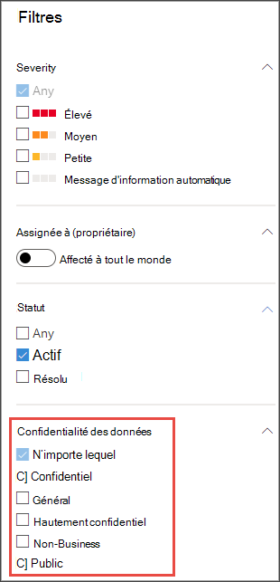
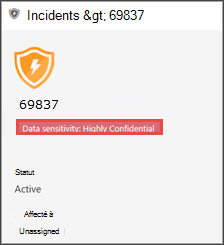

# Utiliser des étiquettes de confidentialité pour hiérarchiser les réponses aux incidentsUse sensitivity labels to prioritize incident response  

[!INCLUDE [Microsoft 365 Defender rebranding](../../includes/microsoft-defender.md)]

**S’applique à :****Applies to:**
- [Microsoft Defender pour point de terminaisonMicrosoft Defender for Endpoint](https://go.microsoft.com/fwlink/p/?linkid=2154037)
- [Microsoft 365 DefenderMicrosoft 365 Defender](https://go.microsoft.com/fwlink/?linkid=2118804)

> Vous souhaitez faire l’expérience de Defender pour point de terminaison ?Want to experience Defender for Endpoint? [Inscrivez-vous à un essai gratuit.Sign up for a free trial.](https://www.microsoft.com/microsoft-365/windows/microsoft-defender-atp?ocid=docs-wdatp-exposedapis-abovefoldlink) 

Un cycle de vie classique des menaces avancées persistantes implique l’exfiltration des données.A typical advanced persistent threat lifecycle involves data exfiltration. Dans un incident de sécurité, il est important de pouvoir hiérarchiser les enquêtes dans les cas où les fichiers sensibles peuvent être insécurisés afin que les données et les informations d’entreprise soient protégées.In a security incident, it's important to have the ability to prioritize investigations where sensitive files may be jeopardy so that corporate data and information are protected.

Defender pour le point de terminaison facilite la hiérquisation des incidents de sécurité avec l’utilisation d’étiquettes de niveau de sensibilité.Defender for Endpoint helps to make the prioritization of security incidents much simpler with the use of sensitivity labels. Les étiquettes de confidentialité identifient rapidement les incidents qui peuvent impliquer des appareils avec des informations sensibles telles que des informations confidentielles.Sensitivity labels quickly identify incidents that may involve devices with sensitive information such as confidential information. 

## Examiner les incidents impliquant des données sensiblesInvestigate incidents that involve sensitive data
Découvrez comment utiliser des étiquettes de sensibilité aux données pour hiérarchiser l’examen des incidents.Learn how to use data sensitivity labels to prioritize incident investigation.

>[!NOTE]
>Les étiquettes sont détectées pour Windows 10, version 1809 ou ultérieure.Labels are detected for Windows 10, version 1809 or later.

1. Dans Centre de sécurité Microsoft Defender, sélectionnez **Incidents**.In Microsoft Defender Security Center, select **Incidents**. 

2. Faites défiler vers la droite pour voir la colonne **Sensibilité aux** données.Scroll to the right to see the **Data sensitivity** column. Cette colonne reflète les étiquettes de niveau de sensibilité observées sur les appareils liés aux incidents, ce qui indique si les fichiers sensibles peuvent être touchés par l’incident.This column reflects sensitivity labels that have been observed on devices related to the incidents providing an indication of whether sensitive files may be impacted by the incident.

    

    Vous pouvez également filtrer en fonction du **niveau de sensibilité des données**You can also filter based on **Data sensitivity** 

    

3. Ouvrez la page incident pour examiner plus en détail.Open the incident page to further investigate.

    

4. Sélectionnez **l’onglet Appareils** pour identifier les appareils stockant des fichiers avec des étiquettes de sensibilité.Select the **Devices** tab to identify devices storing files with sensitivity labels.

    
   

5. Sélectionnez les appareils qui stockent des données sensibles et recherchez dans la chronologie pour identifier les fichiers qui peuvent être touchés, puis prenez les mesures appropriées pour vous assurer que les données sont protégées.Select the devices that store sensitive data and search through the timeline to identify which files may be impacted then take appropriate action to ensure that data is protected. 

   Vous pouvez affiner les événements affichés sur la chronologie de l’appareil en recherchant des étiquettes de sensibilité aux données.You can narrow down the events shown on the device timeline by searching for data sensitivity labels. Cela n’affichera que les événements associés aux fichiers qui ont ce nom d’étiquette.Doing this will show only events associated with files that have said label name.

    

>[!TIP]
>Ces points de données sont également exposés par le biais de « DeviceFileEvents » dans le repérage avancé, ce qui permet aux requêtes avancées et à la détection de planifier la détection de prendre en compte les étiquettes de sensibilité et l’état de protection des fichiers.These data points are also exposed through the ‘DeviceFileEvents’ in advanced hunting, allowing advanced queries and schedule detection to take into account sensitivity labels and file protection status. 
