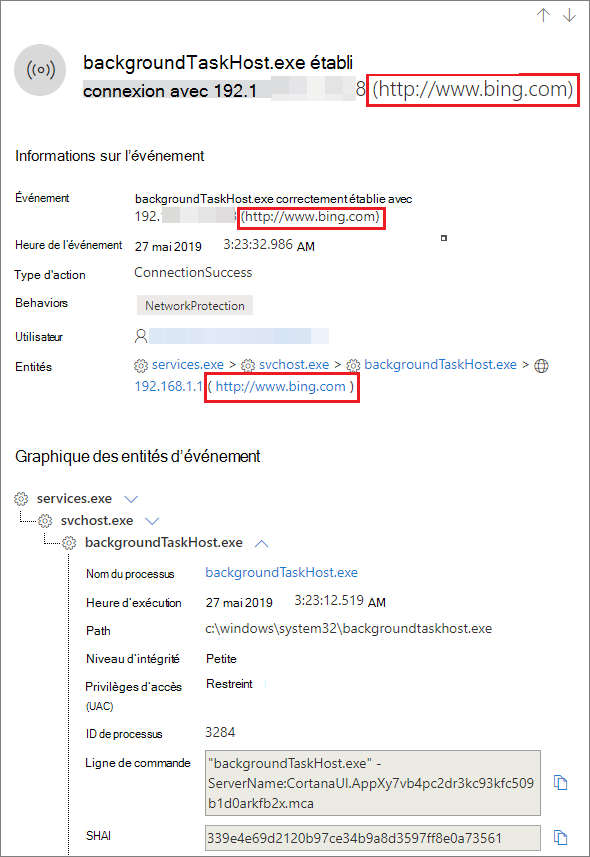
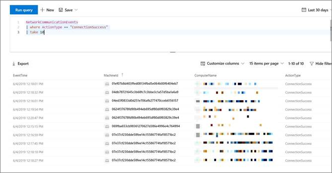

# <a name="investigate-connection-events-that-occur-behind-forward-proxies"></a><span data-ttu-id="37f9a-104">Examiner des événements de connexion qui se produisent d’arrière vers l’avant des proxys</span><span class="sxs-lookup"><span data-stu-id="37f9a-104">Investigate connection events that occur behind forward proxies</span></span>

[!INCLUDE [Microsoft 365 Defender rebranding](../../includes/microsoft-defender.md)]

<span data-ttu-id="37f9a-105">**S’applique à :**</span><span class="sxs-lookup"><span data-stu-id="37f9a-105">**Applies to:**</span></span>
- [<span data-ttu-id="37f9a-106">Microsoft Defender pour point de terminaison</span><span class="sxs-lookup"><span data-stu-id="37f9a-106">Microsoft Defender for Endpoint</span></span>](https://go.microsoft.com/fwlink/p/?linkid=2154037)
- [<span data-ttu-id="37f9a-107">Microsoft 365 Defender</span><span class="sxs-lookup"><span data-stu-id="37f9a-107">Microsoft 365 Defender</span></span>](https://go.microsoft.com/fwlink/?linkid=2118804)

> <span data-ttu-id="37f9a-108">Vous souhaitez faire l’expérience de Defender for Endpoint ?</span><span class="sxs-lookup"><span data-stu-id="37f9a-108">Want to experience Defender for Endpoint?</span></span> [<span data-ttu-id="37f9a-109">Inscrivez-vous à un essai gratuit.</span><span class="sxs-lookup"><span data-stu-id="37f9a-109">Sign up for a free trial.</span></span>](https://www.microsoft.com/microsoft-365/windows/microsoft-defender-atp?ocid=docs-wdatp-investigatemachines-abovefoldlink)

<span data-ttu-id="37f9a-110">Defender pour le point de terminaison prend en charge la surveillance des connexions réseau à partir de différents niveaux de la pile réseau.</span><span class="sxs-lookup"><span data-stu-id="37f9a-110">Defender for Endpoint supports network connection monitoring from different levels of the network stack.</span></span> <span data-ttu-id="37f9a-111">Un cas difficile est que le réseau utilise un proxy avant comme passerelle vers Internet.</span><span class="sxs-lookup"><span data-stu-id="37f9a-111">A challenging case is when the network uses a forward proxy as a gateway to the Internet.</span></span>

<span data-ttu-id="37f9a-112">Le proxy agit comme s’il s’agissait du point de terminaison cible.</span><span class="sxs-lookup"><span data-stu-id="37f9a-112">The proxy acts as if it was the target endpoint.</span></span>  <span data-ttu-id="37f9a-113">Dans ce cas, les moniteurs de connexion réseau simples auditent les connexions avec le proxy, ce qui est correct mais qui a une valeur d’investigation inférieure.</span><span class="sxs-lookup"><span data-stu-id="37f9a-113">In these cases, simple network connection monitors will audit the connections with the proxy which is correct but has lower investigation value.</span></span> 

<span data-ttu-id="37f9a-114">Defender pour le point de terminaison prend en charge la surveillance avancée au niveau HTTP via la protection réseau.</span><span class="sxs-lookup"><span data-stu-id="37f9a-114">Defender for Endpoint supports advanced HTTP level monitoring through network protection.</span></span> <span data-ttu-id="37f9a-115">Lorsqu’il est allumé, un nouveau type d’événement est exposé, qui expose les noms de domaine cibles réels.</span><span class="sxs-lookup"><span data-stu-id="37f9a-115">When turned on, a new type of event is surfaced which exposes the real target domain names.</span></span>

## <a name="use-network-protection-to-monitor-network-connection-behind-a-firewall"></a><span data-ttu-id="37f9a-116">Utiliser la protection réseau pour surveiller la connexion réseau derrière un pare-feu</span><span class="sxs-lookup"><span data-stu-id="37f9a-116">Use network protection to monitor network connection behind a firewall</span></span>
<span data-ttu-id="37f9a-117">La surveillance de la connexion réseau derrière un proxy avant est possible en raison d’événements réseau supplémentaires qui proviennent de la protection du réseau.</span><span class="sxs-lookup"><span data-stu-id="37f9a-117">Monitoring network connection behind a forward proxy is possible due to additional network events that originate from network protection.</span></span> <span data-ttu-id="37f9a-118">Pour les voir sur une chronologie d’appareil, activer la protection réseau (au minimum en mode audit).</span><span class="sxs-lookup"><span data-stu-id="37f9a-118">To see them on a device timeline, turn network protection on (at the minimum in audit mode).</span></span> 

<span data-ttu-id="37f9a-119">La protection réseau peut être contrôlée à l’aide des modes suivants :</span><span class="sxs-lookup"><span data-stu-id="37f9a-119">Network protection can be controlled using the following modes:</span></span>

- <span data-ttu-id="37f9a-120">**Bloquer**</span><span class="sxs-lookup"><span data-stu-id="37f9a-120">**Block**</span></span> <br> <span data-ttu-id="37f9a-121">Les utilisateurs ou les applications ne pourront pas se connecter à des domaines dangereux.</span><span class="sxs-lookup"><span data-stu-id="37f9a-121">Users or apps will be blocked from connecting to dangerous domains.</span></span> <span data-ttu-id="37f9a-122">Vous pourrez voir cette activité dans Centre de sécurité Microsoft Defender.</span><span class="sxs-lookup"><span data-stu-id="37f9a-122">You will be able to see this activity in Microsoft Defender Security Center.</span></span>
- <span data-ttu-id="37f9a-123">**Audit**</span><span class="sxs-lookup"><span data-stu-id="37f9a-123">**Audit**</span></span> <br> <span data-ttu-id="37f9a-124">La connexion à des domaines dangereux ne sera pas bloquée pour les utilisateurs ou les applications.</span><span class="sxs-lookup"><span data-stu-id="37f9a-124">Users or apps will not be blocked from connecting to dangerous domains.</span></span> <span data-ttu-id="37f9a-125">Toutefois, vous verrez toujours cette activité dans Centre de sécurité Microsoft Defender.</span><span class="sxs-lookup"><span data-stu-id="37f9a-125">However, you will still see this activity in Microsoft Defender Security Center.</span></span>


<span data-ttu-id="37f9a-126">Si vous désactiver la protection réseau, les utilisateurs ou les applications ne seront pas bloqués pour se connecter à des domaines dangereux.</span><span class="sxs-lookup"><span data-stu-id="37f9a-126">If you turn network protection off, users or apps will not be blocked from connecting to dangerous domains.</span></span> <span data-ttu-id="37f9a-127">Aucune activité réseau ne s’Centre de sécurité Microsoft Defender.</span><span class="sxs-lookup"><span data-stu-id="37f9a-127">You will not see any network activity in Microsoft Defender Security Center.</span></span>

<span data-ttu-id="37f9a-128">Si vous ne la configurez pas, le blocage du réseau est désactivé par défaut.</span><span class="sxs-lookup"><span data-stu-id="37f9a-128">If you do not configure it, network blocking will be turned off by default.</span></span>

<span data-ttu-id="37f9a-129">Pour plus d’informations, voir [Activer la protection réseau.](enable-network-protection.md)</span><span class="sxs-lookup"><span data-stu-id="37f9a-129">For more information, see [Enable network protection](enable-network-protection.md).</span></span>

## <a name="investigation-impact"></a><span data-ttu-id="37f9a-130">Impact de l’examen</span><span class="sxs-lookup"><span data-stu-id="37f9a-130">Investigation impact</span></span>
<span data-ttu-id="37f9a-131">Lorsque la protection réseau est allumée, vous verrez que, sur la chronologie d’un appareil, l’adresse IP continuera à représenter le proxy, tandis que l’adresse cible réelle s’affiche.</span><span class="sxs-lookup"><span data-stu-id="37f9a-131">When network protection is turned on, you'll see that on a device's timeline the IP address will keep representing the proxy, while the real target address shows up.</span></span>


<span data-ttu-id="37f9a-133">D’autres événements déclenchés par la couche de protection réseau sont désormais disponibles pour faire surface des noms de domaine réels, même derrière un proxy.</span><span class="sxs-lookup"><span data-stu-id="37f9a-133">Additional events triggered by the network protection layer are now available to surface the real domain names even behind a proxy.</span></span>

<span data-ttu-id="37f9a-134">Informations sur l’événement :</span><span class="sxs-lookup"><span data-stu-id="37f9a-134">Event's information:</span></span>




## <a name="hunt-for-connection-events-using-advanced-hunting"></a><span data-ttu-id="37f9a-136">Recherche des événements de connexion à l’aide de la recherche avancée</span><span class="sxs-lookup"><span data-stu-id="37f9a-136">Hunt for connection events using advanced hunting</span></span> 
<span data-ttu-id="37f9a-137">Tous les nouveaux événements de connexion sont également disponibles pour la recherche avancée.</span><span class="sxs-lookup"><span data-stu-id="37f9a-137">All new connection events are available for you to hunt on through advanced hunting as well.</span></span> <span data-ttu-id="37f9a-138">Étant donné que ces événements sont des événements de connexion, vous pouvez les trouver sous la table DeviceNetworkEvents sous le `ConnecionSuccess` type d’action.</span><span class="sxs-lookup"><span data-stu-id="37f9a-138">Since these events are connection events, you can find them under the DeviceNetworkEvents table under the `ConnecionSuccess` action type.</span></span>

<span data-ttu-id="37f9a-139">L’utilisation de cette requête simple vous montre tous les événements pertinents :</span><span class="sxs-lookup"><span data-stu-id="37f9a-139">Using this simple query will show you all the relevant events:</span></span>

```
DeviceNetworkEvents
| where ActionType == "ConnectionSuccess" 
| take 10
```



<span data-ttu-id="37f9a-141">Vous pouvez également filtrer les événements liés à la connexion au proxy lui-même.</span><span class="sxs-lookup"><span data-stu-id="37f9a-141">You can also filter out  events that are related to connection to the proxy itself.</span></span> 

<span data-ttu-id="37f9a-142">Utilisez la requête suivante pour filtrer les connexions au proxy :</span><span class="sxs-lookup"><span data-stu-id="37f9a-142">Use the following query to filter out the connections to the proxy:</span></span>

```
DeviceNetworkEvents
| where ActionType == "ConnectionSuccess" and RemoteIP != "ProxyIP"  
| take 10
```


## <a name="related-topics"></a><span data-ttu-id="37f9a-143">Voir aussi</span><span class="sxs-lookup"><span data-stu-id="37f9a-143">Related topics</span></span>
- [<span data-ttu-id="37f9a-144">Application de la protection réseau avec la stratégie de groupe - CSP de stratégie</span><span class="sxs-lookup"><span data-stu-id="37f9a-144">Applying network protection with GP - policy CSP</span></span>](/windows/client-management/mdm/policy-csp-defender#defender-enablenetworkprotection)
