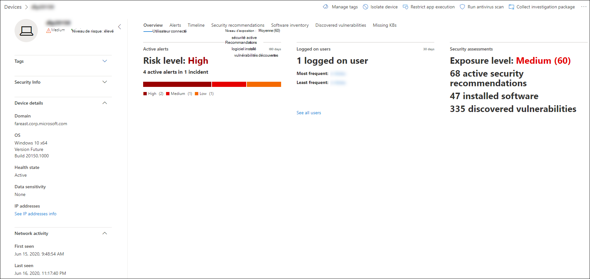
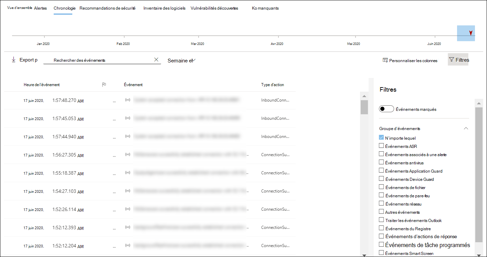
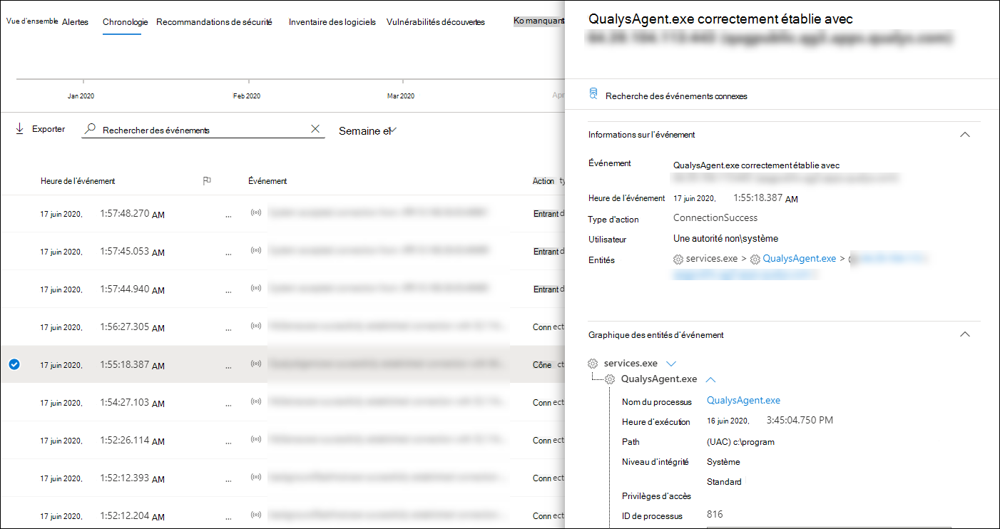
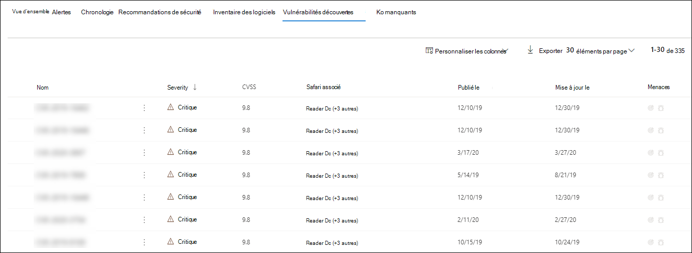
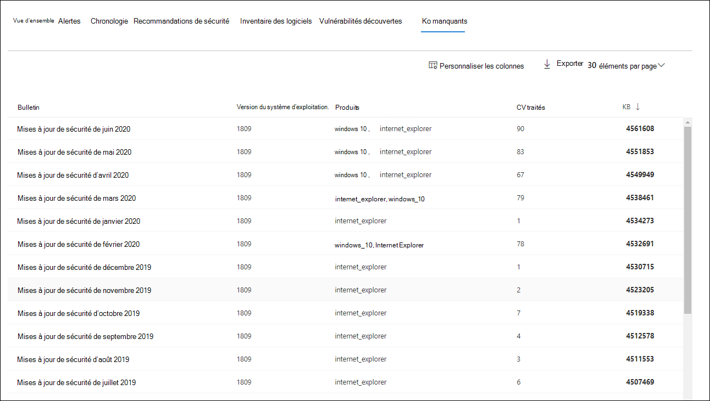
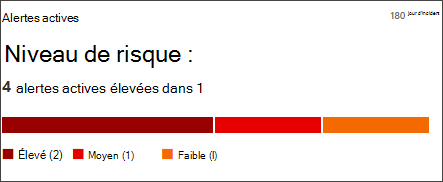

# Examiner les appareils de la liste Microsoft Defender pour les appareils de point de terminaisonInvestigate devices in the Microsoft Defender for Endpoint Devices list

[!INCLUDE [Microsoft 365 Defender rebranding](../../includes/microsoft-defender.md)]

**S’applique à :****Applies to:**
- [Microsoft Defender pour point de terminaisonMicrosoft Defender for Endpoint](https://go.microsoft.com/fwlink/p/?linkid=2154037)
- [Microsoft 365 DefenderMicrosoft 365 Defender](https://go.microsoft.com/fwlink/?linkid=2118804)

>Vous souhaitez faire l’expérience de Defender for Endpoint ?Want to experience Defender for Endpoint? [Inscrivez-vous à un essai gratuit.Sign up for a free trial.](https://www.microsoft.com/microsoft-365/windows/microsoft-defender-atp?ocid=docs-wdatp-investigatemachines-abovefoldlink)

Examinez les détails d’une alerte sur un appareil spécifique pour identifier d’autres comportements ou événements qui peuvent être liés à l’alerte ou à l’étendue potentielle de la violation.Investigate the details of an alert raised on a specific device to identify other behaviors or events that might be related to the alert or the potential scope of the breach.

> [!NOTE]
> Dans le cadre du processus d’examen ou de réponse, vous pouvez collecter un package d’enquête à partir d’un appareil.As part of the investigation or response process, you can collect an investigation package from a device. Voici comment : Collecter un [package d’enquête à partir d’appareils.](/microsoft-365/security/defender-endpoint/respond-machine-alerts#collect-investigation-package-from-devices)Here's how: [Collect investigation package from devices](/microsoft-365/security/defender-endpoint/respond-machine-alerts#collect-investigation-package-from-devices).

Vous pouvez cliquer sur les appareils concernés chaque fois que vous les voyez dans le portail pour ouvrir un rapport détaillé sur cet appareil.You can click on affected devices whenever you see them in the portal to open a detailed report about that device. Les appareils concernés sont identifiés dans les zones suivantes :Affected devices are identified in the following areas:

- [Liste des appareilsDevices list](investigate-machines.md)
- [File d’attente des alertesAlerts queue](alerts-queue.md)
- [Tableau de bord des opérations de sécuritéSecurity operations dashboard](security-operations-dashboard.md)
- Toute alerte individuelleAny individual alert
- Affichage des détails d’un fichier individuelAny individual file details view
- N’importe quelle adresse IP ou vue des détails de domaineAny IP address or domain details view

Lorsque vous examinez un appareil spécifique, vous voyez :When you investigate a specific device, you'll see:

- Détails de l’appareilDevice details
- Actions de réponseResponse actions
- Onglets (vue d’ensemble, alertes, chronologie, recommandations en matière de sécurité, inventaire logiciel, vulnérabilités découvertes, ko manquants)Tabs (overview, alerts, timeline, security recommendations, software inventory, discovered vulnerabilities, missing KBs)
- Cartes (alertes actives, utilisateurs connectés, évaluation de la sécurité)Cards (active alerts, logged on users, security assessment)

## Détails de l’appareilDevice details

La section Détails de l’appareil fournit des informations telles que le domaine, le système d’exploitation et l’état d’état de l’appareil.The device details section provides information such as the domain, OS, and health state of the device. Si un package d’enquête est disponible sur l’appareil, vous verrez un lien qui vous permet de télécharger le package.If there's an investigation package available on the device, you'll see a link that allows you to download the package.

## Actions de réponseResponse actions

Les actions de réponse s’exécutent le long de la partie supérieure d’une page d’appareil spécifique et incluent :Response actions run along the top of a specific device page and include:

- Gérer des balisesManage tags
- Isoler l’appareilIsolate device
- Restreindre l’exécution des applicationsRestrict app execution
- Exécuter une analyse antivirusRun antivirus scan
- Collecter un package d’examenCollect investigation package
- Lancer une session de réponse en directInitiate Live Response Session
- Lancer une enquête automatiséeInitiate automated investigation
- Consulter un spécialiste des menacesConsult a threat expert
- Centre de notificationsAction center

Vous pouvez prendre des mesures de réponse dans le centre de réponse, dans une page d’appareil spécifique ou dans une page de fichier spécifique.You can take response actions in the Action center, in a specific device page, or in a specific file page.

Pour plus d’informations sur la façon d’agir sur un appareil, voir [Prendre une action de réponse sur un appareil.](respond-machine-alerts.md)For more information on how to take action on a device, see [Take response action on a device](respond-machine-alerts.md).

Pour plus d’informations, voir [Examiner les entités utilisateur.](investigate-user.md)For more information, see [Investigate user entities](investigate-user.md).

## OngletsTabs

Les onglets fournissent des informations pertinentes sur la sécurité et la prévention des menaces relatives à l’appareil.The tabs provide relevant security and threat prevention information related to the device. Dans chaque onglet, vous pouvez personnaliser les  colonnes affichées en sélectionnant Personnaliser les colonnes dans la barre au-dessus des en-têtes de colonne.In each tab, you can customize the columns that are shown by selecting **Customize columns** from the bar above the column headers.

### Vue d’ensembleOverview
**L’onglet** Vue d’ensemble affiche les [cartes](#cards) pour les alertes actives, les utilisateurs connectés et l’évaluation de la sécurité.The **Overview** tab displays the [cards](#cards) for active alerts, logged on users, and security assessment.

### AlertesAlerts

**L’onglet Alertes** fournit une liste des alertes associées à l’appareil.The **Alerts** tab provides a list of alerts that are associated with the device. Cette liste est une version filtrée de la file d’attente des [alertes](alerts-queue.md)et affiche une brève description de l’alerte, de la gravité (élevée, moyenne, faible, informationnelle), de l’état dans la file d’attente (nouveau, en cours, résolu), de la classification (non définie, false alerte, alerte vraie), de l’état d’investigation, de la catégorie d’alerte, de la personne qui résout l’alerte et de la dernière activité.This list is a filtered version of the [Alerts queue](alerts-queue.md), and shows a short description of the alert, severity (high, medium, low, informational), status in the queue (new, in progress, resolved), classification (not set, false alert, true alert), investigation state, category of alert, who is addressing the alert, and last activity. Vous pouvez également filtrer les alertes.You can also filter the alerts.

Lorsque l’icône de cercle à gauche d’une alerte est sélectionnée, un volant s’affiche.When the circle icon to the left of an alert is selected, a fly-out appears. À partir de ce panneau, vous pouvez gérer l’alerte et afficher plus de détails, tels que le numéro d’incident et les appareils associés.From this panel you can manage the alert and view more details such as incident number and related devices. Plusieurs alertes peuvent être sélectionnées à la fois.Multiple alerts can be selected at a time.

Pour afficher une vue de page complète d’une alerte, y compris le graphique d’incident et l’arborescence de processus, sélectionnez le titre de l’alerte.To see a full page view of an alert including incident graph and process tree, select the title of the alert.

### ChronologieTimeline

**L’onglet** Chronologie fournit une vue chronologique des événements et des alertes associées qui ont été observés sur l’appareil.The **Timeline** tab provides a chronological view of the events and associated alerts that have been observed on the device. Cela peut vous aider à corréler tous les événements, fichiers et adresses IP par rapport à l’appareil.This can help you correlate any events, files, and IP addresses in relation to the device.

La chronologie vous permet également d’aller de manière sélective dans les événements qui se sont produits au cours d’une période donnée.The timeline also enables you to selectively drill down into events that occurred within a given time period. Vous pouvez afficher la séquence temporelle des événements qui se sont produits sur un appareil sur une période sélectionnée.You can view the temporal sequence of events that occurred on a device over a selected time period. Pour contrôler davantage votre affichage, vous pouvez filtrer par groupes d’événements ou personnaliser les colonnes.To further control your view, you can filter by event groups or customize the columns.

>[!NOTE]
> Pour afficher les événements de pare-feu, vous devez activer la stratégie d’audit, voir Connexion à la plateforme de filtrage [d’audit.](/windows/security/threat-protection/auditing/audit-filtering-platform-connection)For firewall events to be displayed, you'll need to enable the audit policy, see [Audit Filtering Platform connection](/windows/security/threat-protection/auditing/audit-filtering-platform-connection).
>Le pare-feu couvre les événements suivantsFirewall covers the following events
>
>- [5025](/windows/security/threat-protection/auditing/event-5025) - Service de pare-feu arrêté[5025](/windows/security/threat-protection/auditing/event-5025) - firewall service stopped
>- [5031](/windows/security/threat-protection/auditing/event-5031) : application bloquée pour accepter les connexions entrantes sur le réseau[5031](/windows/security/threat-protection/auditing/event-5031) - application blocked from accepting incoming connections on the network
>- [5157](/windows/security/threat-protection/auditing/event-5157) : connexion bloquée[5157](/windows/security/threat-protection/auditing/event-5157) - blocked connection

Voici quelques-unes des fonctionnalités :Some of the functionality includes:

- Rechercher des événements spécifiquesSearch for specific events
  - Utilisez la barre de recherche pour rechercher des événements de chronologie spécifiques.Use the search bar to look for specific timeline events.
- Filtrer les événements à partir d’une date spécifiqueFilter events from a specific date
  - Sélectionnez l’icône de calendrier dans le coin supérieur gauche du tableau pour afficher les événements du dernier jour, semaine, 30 jours ou plage personnalisée.Select the calendar icon in the upper left of the table to display events in the past day, week, 30 days, or custom range. Par défaut, la chronologie de l’appareil est définie pour afficher les événements des 30 derniers jours.By default, the device timeline is set to display the events from the past 30 days.
  - Utilisez la chronologie pour passer à un moment spécifique dans le temps en mettant en surbrillance la section.Use the timeline to jump to a specific moment in time by highlighting the section. Les flèches de la chronologie recherchent des investigations automatiséesThe arrows on the timeline pinpoint automated investigations
- Exporter des événements de chronologie détaillés de l’appareilExport detailed device timeline events
  - Exportez la chronologie de l’appareil pour la date actuelle ou une plage de dates spécifiée jusqu’à sept jours.Export the device timeline for the current date or a specified date range up to seven days.

Des informations supplémentaires sur certains événements sont fournies dans la section **Informations** supplémentaires.More details about certain events are provided in the **Additional information** section. Ces détails varient en fonction du type d’événement, par exemple :These details vary depending on the type of event, for example: 

- Contenu par Application Guard : l’événement de navigateur web a été limité par un conteneur isoléContained by Application Guard - the web browser event was restricted by an isolated container
- Menace active détectée : la détection des menaces s’est produite pendant l’exécution de la menaceActive threat detected - the threat detection occurred while the threat was running
- Correction infructueuse : une tentative de correction de la menace détectée a été invoquée mais a échouéRemediation unsuccessful - an attempt to remediate the detected threat was invoked but failed
- Correction réussie : la menace détectée a été arrêtée et nettoyéeRemediation successful - the detected threat was stopped and cleaned
- Avertissement contourné par l’utilisateur : l’avertissement Windows Defender SmartScreen a été rejeté et contourné par un utilisateurWarning bypassed by user - the Windows Defender SmartScreen warning was dismissed and overridden by a user
- Script suspect détecté : un script potentiellement malveillant a été détecté en cours d’exécutionSuspicious script detected - a potentially malicious script was found running
- Catégorie d’alerte : si l’événement a entraîné la génération d’une alerte, la catégorie d’alerte ( « Mouvement latéral », par exemple) est fournie.The alert category - if the event led to the generation of an alert, the alert category  ("Lateral Movement", for example) is provided

#### Détails de l'événementEvent details
Sélectionnez un événement pour afficher les détails pertinents sur cet événement.Select an event to view relevant details about that event. Un panneau s’affiche pour afficher des informations générales sur les événements.A panel displays to show general event information. Le cas échéant et si des données sont disponibles, un graphique montrant les entités associées et leurs relations est également affiché.When applicable and data is available, a graph showing related entities and their relationships are also shown.

Pour inspecter plus en détail l’événement  et les événements connexes, vous pouvez rapidement exécuter une requête de recherche avancée en sélectionnant **Hunt pour les événements connexes.**To further inspect the event and related events, you can quickly run an [advanced hunting](advanced-hunting-overview.md) query by selecting **Hunt for related events**. La requête retourne l’événement sélectionné et la liste des autres événements qui se sont produits au même moment sur le même point de terminaison.The query will return the selected event and the list of other events that occurred around the same time on the same endpoint.

### Recommandations de sécuritéSecurity recommendations

**Des recommandations en matière** de sécurité sont générées à partir de Microsoft Defender pour la fonctionnalité de gestion des menaces [& vulnérabilités du](tvm-dashboard-insights.md) point de terminaison.**Security recommendations** are generated from Microsoft Defender for Endpoint's [Threat & Vulnerability Management](tvm-dashboard-insights.md) capability. La sélection d’une recommandation affiche un panneau dans lequel vous pouvez afficher des détails pertinents, tels que la description de la recommandation et les risques potentiels associés à sa non-utilisation.Selecting a recommendation will show a panel where you can view relevant details such as description of the recommendation and the potential risks associated with not enacting it. Pour plus [d’informations, voir](tvm-security-recommendation.md) recommandations en matière de sécurité.See [Security recommendation](tvm-security-recommendation.md) for details.

### Inventaire des logicielsSoftware inventory

**L’onglet Inventaire** logiciel vous permet d’afficher le logiciel sur l’appareil, ainsi que les faiblesses ou menaces.The **Software inventory** tab lets you view software on the device, along with any weaknesses or threats. La sélection du nom du logiciel vous permet d’afficher les recommandations de sécurité, les vulnérabilités découvertes, les appareils installés et la distribution des versions sur la page des détails du logiciel.Selecting the name of the software will take you to the software details page where you can view security recommendations, discovered vulnerabilities, installed devices, and version distribution. Voir [l’inventaire logiciel](tvm-software-inventory.md) pour plus d’informationsSee [Software inventory](tvm-software-inventory.md) for details

### Vulnérabilités découvertesDiscovered vulnerabilities

**L’onglet Vulnérabilités** découvertes affiche le nom, la gravité et les informations sur les menaces des vulnérabilités découvertes sur l’appareil.The **Discovered vulnerabilities** tab shows the name, severity, and threat insights of discovered vulnerabilities on the device. La sélection de vulnérabilités spécifiques affiche une description et des détails.Selecting specific vulnerabilities will show a description and details.

### Ko manquantsMissing KBs
**L’onglet Ko manquant répertorie** les mises à jour de sécurité manquantes pour l’appareil.The **Missing KBs** tab lists the missing security updates for the device.

## CartesCards

### Alertes activesActive alerts

La carte **Azure Advanced Threat Protection** affiche une vue d’ensemble des alertes relatives à l’appareil et à son niveau de risque, si vous avez activé la fonctionnalité Microsoft Defender pour l’identité et qu’il existe des alertes actives.The **Azure Advanced Threat Protection** card will display a high-level overview of alerts related to the device and their risk level, if you have enabled the Microsoft Defender for Identity feature, and there are any active alerts. Plus d’informations sont disponibles dans l’exercice « Alertes ».More information is available in the "Alerts" drill down.

>[!NOTE]
>Vous devez activer l’intégration sur Microsoft Defender pour l’identité et Defender pour point de terminaison pour utiliser cette fonctionnalité.You'll need to enable the integration on both Microsoft Defender for Identity and Defender for Endpoint to use this feature. Dans Defender pour point de terminaison, vous pouvez activer cette fonctionnalité dans les fonctionnalités avancées.In Defender for Endpoint, you can enable this feature in advanced features. Pour plus d’informations sur l’activer, voir [Activer les fonctionnalités avancées.](advanced-features.md)For more information on how to enable advanced features, see [Turn on advanced features](advanced-features.md).

### Utilisateurs connectésLogged on users

La **carte Utilisateurs** connectés indique le nombre d’utilisateurs connectés au cours des 30 derniers jours, ainsi que les utilisateurs les plus fréquents et les moins fréquents.The **Logged on users** card shows how many users have logged on in the past 30 days, along with the most and least frequent users. La sélection du lien « Afficher tous les utilisateurs » ouvre le volet d’informations, qui affiche des informations telles que le type d’utilisateur, le type de connexion et le moment où l’utilisateur a été vu pour la première fois et pour la dernière fois.Selecting the "See all users" link opens the details pane, which displays information such as user type, log on type, and when the user was first and last seen. Pour plus d’informations, voir [Examiner les entités utilisateur.](investigate-user.md)For more information, see [Investigate user entities](investigate-user.md).

### Tests d’évaluation de la sécuritéSecurity assessments

La **carte d’évaluation de** la sécurité indique le niveau d’exposition global, les recommandations en matière de sécurité, les logiciels installés et les vulnérabilités découvertes.The **Security assessments** card shows the overall exposure level, security recommendations, installed software, and discovered vulnerabilities. Le niveau d’exposition d’un appareil est déterminé par l’impact cumulé de ses recommandations de sécurité en attente.A device's exposure level is determined by the cumulative impact of its pending security recommendations.

## Voir aussiRelated topics

- [Afficher et organiser la file d’attente des alertes microsoft Defender pour les points de terminaisonView and organize the Microsoft Defender for Endpoint Alerts queue](alerts-queue.md)
- [Gérer les alertes microsoft Defender pour les points de terminaisonManage Microsoft Defender for Endpoint alerts](manage-alerts.md)
- [Examiner microsoft Defender pour les alertes de point de terminaisonInvestigate Microsoft Defender for Endpoint alerts](investigate-alerts.md)
- [Examiner un fichier associé à une alerte Defender for EndpointInvestigate a file associated with a Defender for Endpoint alert](investigate-files.md)
- [Examiner une adresse IP associée à une alerte Defender for EndpointInvestigate an IP address associated with a Defender for Endpoint alert](investigate-ip.md)
- [Examiner un domaine associé à une alerte Defender for EndpointInvestigate a domain associated with a Defender for Endpoint alert](investigate-domain.md)
- [Examiner un compte d’utilisateur dans Defender for EndpointInvestigate a user account in Defender for Endpoint](investigate-user.md)
- [Recommandations en matière de sécuritéSecurity recommendation](tvm-security-recommendation.md)
- [Inventaire des logicielsSoftware inventory](tvm-software-inventory.md)
