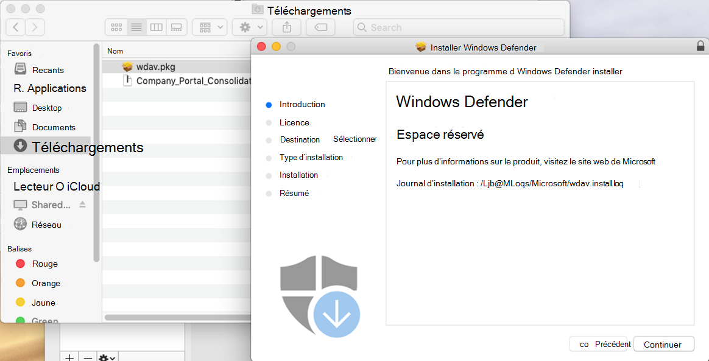
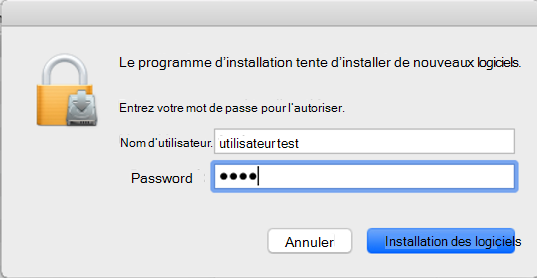
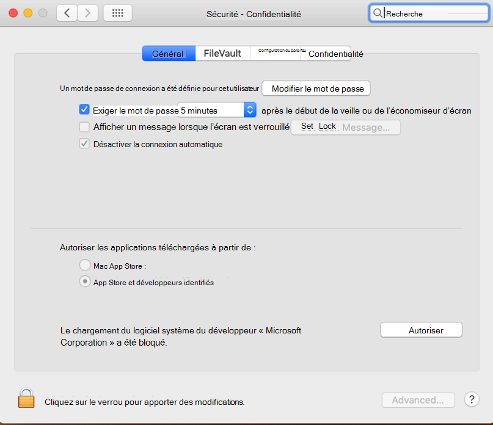

# <a name="manual-deployment-for-microsoft-defender-for-endpoint-for-macos"></a><span data-ttu-id="2f9b2-104">Déploiement manuel de Microsoft Defender pour point de terminaison pour macOS</span><span class="sxs-lookup"><span data-stu-id="2f9b2-104">Manual deployment for Microsoft Defender for Endpoint for macOS</span></span>

[!INCLUDE [Microsoft 365 Defender rebranding](../../includes/microsoft-defender.md)]

<span data-ttu-id="2f9b2-105">**S’applique à :**</span><span class="sxs-lookup"><span data-stu-id="2f9b2-105">**Applies to:**</span></span>
- [<span data-ttu-id="2f9b2-106">Microsoft Defender pour point de terminaison</span><span class="sxs-lookup"><span data-stu-id="2f9b2-106">Microsoft Defender for Endpoint</span></span>](https://go.microsoft.com/fwlink/p/?linkid=2154037)
- [<span data-ttu-id="2f9b2-107">Microsoft 365 Defender</span><span class="sxs-lookup"><span data-stu-id="2f9b2-107">Microsoft 365 Defender</span></span>](https://go.microsoft.com/fwlink/?linkid=2118804)

> <span data-ttu-id="2f9b2-108">Vous souhaitez faire l’expérience de Defender pour point de terminaison ?</span><span class="sxs-lookup"><span data-stu-id="2f9b2-108">Want to experience Defender for Endpoint?</span></span> [<span data-ttu-id="2f9b2-109">Inscrivez-vous à un essai gratuit.</span><span class="sxs-lookup"><span data-stu-id="2f9b2-109">Sign up for a free trial.</span></span>](https://www.microsoft.com/microsoft-365/windows/microsoft-defender-atp?ocid=docs-wdatp-investigateip-abovefoldlink)

<span data-ttu-id="2f9b2-110">Cette rubrique décrit comment déployer Microsoft Defender pour endpoint pour macOS manuellement.</span><span class="sxs-lookup"><span data-stu-id="2f9b2-110">This topic describes how to deploy Microsoft Defender for Endpoint for macOS manually.</span></span> <span data-ttu-id="2f9b2-111">Un déploiement réussi nécessite la réalisation de toutes les étapes suivantes :</span><span class="sxs-lookup"><span data-stu-id="2f9b2-111">A successful deployment requires the completion of all of the following steps:</span></span>
- [<span data-ttu-id="2f9b2-112">Télécharger les packages d’installation et d’intégration</span><span class="sxs-lookup"><span data-stu-id="2f9b2-112">Download installation and onboarding packages</span></span>](#download-installation-and-onboarding-packages)
- [<span data-ttu-id="2f9b2-113">Installation d’applications (macOS 10.15 et versions antérieures)</span><span class="sxs-lookup"><span data-stu-id="2f9b2-113">Application installation (macOS 10.15 and older versions)</span></span>](#application-installation-macos-1015-and-older-versions)
- [<span data-ttu-id="2f9b2-114">Installation d’applications (macOS 11 et versions plus récentes)</span><span class="sxs-lookup"><span data-stu-id="2f9b2-114">Application installation (macOS 11 and newer versions)</span></span>](#application-installation-macos-11-and-newer-versions)
- [<span data-ttu-id="2f9b2-115">Configuration du client</span><span class="sxs-lookup"><span data-stu-id="2f9b2-115">Client configuration</span></span>](#client-configuration)

## <a name="prerequisites-and-system-requirements"></a><span data-ttu-id="2f9b2-116">Conditions préalables et système requis</span><span class="sxs-lookup"><span data-stu-id="2f9b2-116">Prerequisites and system requirements</span></span>

<span data-ttu-id="2f9b2-117">Avant de commencer, consultez la page principale de Microsoft Defender pour point de terminaison [pour macOS](microsoft-defender-endpoint-mac.md) pour obtenir une description des conditions préalables et de la requise pour la version logicielle actuelle.</span><span class="sxs-lookup"><span data-stu-id="2f9b2-117">Before you get started, see [the main Microsoft Defender for Endpoint for macOS page](microsoft-defender-endpoint-mac.md) for a description of prerequisites and system requirements for the current software version.</span></span>

## <a name="download-installation-and-onboarding-packages"></a><span data-ttu-id="2f9b2-118">Télécharger les packages d’installation et d’intégration</span><span class="sxs-lookup"><span data-stu-id="2f9b2-118">Download installation and onboarding packages</span></span>

<span data-ttu-id="2f9b2-119">Téléchargez les packages d’installation et d’intégration à partir du Centre de sécurité Microsoft Defender :</span><span class="sxs-lookup"><span data-stu-id="2f9b2-119">Download the installation and onboarding packages from Microsoft Defender Security Center:</span></span>

1. <span data-ttu-id="2f9b2-120">Dans le Centre de sécurité Microsoft Defender, go to **Settings > Device Management > Onboarding**.</span><span class="sxs-lookup"><span data-stu-id="2f9b2-120">In Microsoft Defender Security Center, go to **Settings > Device Management > Onboarding**.</span></span>
2. <span data-ttu-id="2f9b2-121">Dans la section 1 de la page, définissez le système d’exploitation sur **macOS** et la méthode de déploiement sur **le script local.**</span><span class="sxs-lookup"><span data-stu-id="2f9b2-121">In Section 1 of the page, set operating system to **macOS** and Deployment method to **Local script**.</span></span>
3. <span data-ttu-id="2f9b2-122">Dans la section 2 de la page, sélectionnez **Télécharger le package d’installation.**</span><span class="sxs-lookup"><span data-stu-id="2f9b2-122">In Section 2 of the page, select **Download installation package**.</span></span> <span data-ttu-id="2f9b2-123">Enregistrez-le sous wdav.pkg dans un répertoire local.</span><span class="sxs-lookup"><span data-stu-id="2f9b2-123">Save it as wdav.pkg to a local directory.</span></span>
4. <span data-ttu-id="2f9b2-124">Dans la section 2 de la page, **sélectionnez Télécharger le package d’intégration.**</span><span class="sxs-lookup"><span data-stu-id="2f9b2-124">In Section 2 of the page, select **Download onboarding package**.</span></span> <span data-ttu-id="2f9b2-125">Enregistrez-le WindowsDefenderATPOnboardingPackage.zip dans le même répertoire.</span><span class="sxs-lookup"><span data-stu-id="2f9b2-125">Save it as WindowsDefenderATPOnboardingPackage.zip to the same directory.</span></span>

    

5. <span data-ttu-id="2f9b2-127">À partir d’une invite de commandes, vérifiez que vous avez les deux fichiers.</span><span class="sxs-lookup"><span data-stu-id="2f9b2-127">From a command prompt, verify that you have the two files.</span></span>
    
## <a name="application-installation-macos-1015-and-older-versions"></a><span data-ttu-id="2f9b2-128">Installation d’applications (macOS 10.15 et versions antérieures)</span><span class="sxs-lookup"><span data-stu-id="2f9b2-128">Application installation (macOS 10.15 and older versions)</span></span>

<span data-ttu-id="2f9b2-129">Pour effectuer ce processus, vous devez avoir des privilèges d’administrateur sur l’appareil.</span><span class="sxs-lookup"><span data-stu-id="2f9b2-129">To complete this process, you must have admin privileges on the device.</span></span>

1. <span data-ttu-id="2f9b2-130">Accédez au wdav.pkg téléchargé dans Finder et ouvrez-le.</span><span class="sxs-lookup"><span data-stu-id="2f9b2-130">Navigate to the downloaded wdav.pkg in Finder and open it.</span></span>

    

2. <span data-ttu-id="2f9b2-132">Sélectionnez **Continuer,** acceptez les termes du contrat de licence, puis entrez le mot de passe lorsque vous y invitez.</span><span class="sxs-lookup"><span data-stu-id="2f9b2-132">Select **Continue**, agree with the License terms, and enter the password when prompted.</span></span>

    

   > [!IMPORTANT]
   > <span data-ttu-id="2f9b2-134">Vous serez invité à autoriser l’installation d’un pilote microsoft (« Extension système bloquée » ou « L’installation est en attente » ou les deux.</span><span class="sxs-lookup"><span data-stu-id="2f9b2-134">You will be prompted to allow a driver from Microsoft to be installed (either "System Extension Blocked" or "Installation is on hold" or both.</span></span> <span data-ttu-id="2f9b2-135">Le pilote doit être autorisé à être installé.</span><span class="sxs-lookup"><span data-stu-id="2f9b2-135">The driver must be allowed to be installed.</span></span>

   

3. <span data-ttu-id="2f9b2-137">Sélectionnez **Ouvrir les préférences de sécurité** ou Ouvrir les préférences système > sécurité & **confidentialité.**</span><span class="sxs-lookup"><span data-stu-id="2f9b2-137">Select **Open Security Preferences** or **Open System Preferences > Security & Privacy**.</span></span> <span data-ttu-id="2f9b2-138">Sélectionnez **Autoriser**:</span><span class="sxs-lookup"><span data-stu-id="2f9b2-138">Select **Allow**:</span></span>

    

   <span data-ttu-id="2f9b2-140">L’installation se poursuit.</span><span class="sxs-lookup"><span data-stu-id="2f9b2-140">The installation proceeds.</span></span>

   > [!CAUTION]
   > <span data-ttu-id="2f9b2-141">Si vous ne sélectionnez pas **Autoriser,** l’installation se poursuit au bout de 5 minutes.</span><span class="sxs-lookup"><span data-stu-id="2f9b2-141">If you don't select **Allow**, the installation will proceed after 5 minutes.</span></span> <span data-ttu-id="2f9b2-142">Microsoft Defender pour le point de terminaison sera chargé, mais certaines fonctionnalités, telles que la protection en temps réel, seront désactivées.</span><span class="sxs-lookup"><span data-stu-id="2f9b2-142">Microsoft Defender for Endpoint will be loaded, but some features, such as real-time protection, will be disabled.</span></span> <span data-ttu-id="2f9b2-143">Pour [plus d’informations](mac-support-kext.md) sur la résolution de ce problème, voir Résoudre les problèmes d’extension du noyau.</span><span class="sxs-lookup"><span data-stu-id="2f9b2-143">See [Troubleshoot kernel extension issues](mac-support-kext.md) for information on how to resolve this.</span></span>

> [!NOTE]
> <span data-ttu-id="2f9b2-144">MacOS peut demander à redémarrer l’appareil lors de la première installation de Microsoft Defender pour Endpoint.</span><span class="sxs-lookup"><span data-stu-id="2f9b2-144">macOS may request to reboot the device upon the first installation of Microsoft Defender for Endpoint.</span></span> <span data-ttu-id="2f9b2-145">La protection en temps réel n’est pas disponible tant que l’appareil n’est pas redémarrage.</span><span class="sxs-lookup"><span data-stu-id="2f9b2-145">Real-time protection will not be available until the device is rebooted.</span></span>

## <a name="application-installation-macos-11-and-newer-versions"></a><span data-ttu-id="2f9b2-146">Installation d’applications (macOS 11 et versions plus récentes)</span><span class="sxs-lookup"><span data-stu-id="2f9b2-146">Application installation (macOS 11 and newer versions)</span></span>

<span data-ttu-id="2f9b2-147">Pour effectuer ce processus, vous devez avoir des privilèges d’administrateur sur l’appareil.</span><span class="sxs-lookup"><span data-stu-id="2f9b2-147">To complete this process, you must have admin privileges on the device.</span></span>

1. <span data-ttu-id="2f9b2-148">Accédez au wdav.pkg téléchargé dans Finder et ouvrez-le.</span><span class="sxs-lookup"><span data-stu-id="2f9b2-148">Navigate to the downloaded wdav.pkg in Finder and open it.</span></span>

    

2. <span data-ttu-id="2f9b2-150">Sélectionnez **Continuer,** acceptez les termes du contrat de licence, puis entrez le mot de passe lorsque vous y invitez.</span><span class="sxs-lookup"><span data-stu-id="2f9b2-150">Select **Continue**, agree with the License terms, and enter the password when prompted.</span></span>

3. <span data-ttu-id="2f9b2-151">À la fin du processus d’installation, vous serez promu pour approuver les extensions système utilisées par le produit.</span><span class="sxs-lookup"><span data-stu-id="2f9b2-151">At the end of the installation process, you'll be promoted to approve the system extensions used by the product.</span></span> <span data-ttu-id="2f9b2-152">Sélectionnez **Ouvrir les préférences de sécurité.**</span><span class="sxs-lookup"><span data-stu-id="2f9b2-152">Select **Open Security Preferences**.</span></span>

    

4. <span data-ttu-id="2f9b2-154">Dans la **fenêtre Sécurité & confidentialité,** sélectionnez **Autoriser.**</span><span class="sxs-lookup"><span data-stu-id="2f9b2-154">From the **Security & Privacy** window, select **Allow**.</span></span>

    

5. <span data-ttu-id="2f9b2-156">Répétez les étapes 3 & 4 pour toutes les extensions système distribuées avec Microsoft Defender pour Endpoint pour Mac.</span><span class="sxs-lookup"><span data-stu-id="2f9b2-156">Repeat steps 3 & 4 for all system extensions distributed with Microsoft Defender for Endpoint for Mac.</span></span>

6. <span data-ttu-id="2f9b2-157">Dans le cadre des fonctionnalités de détection et de réponse des points de terminaison, Microsoft Defender pour Endpoint pour Mac inspecte le trafic de socket et signale ces informations au portail centre de sécurité Microsoft Defender.</span><span class="sxs-lookup"><span data-stu-id="2f9b2-157">As part of the Endpoint Detection and Response capabilities, Microsoft Defender for Endpoint for Mac inspects socket traffic and reports this information to the Microsoft Defender Security Center portal.</span></span> <span data-ttu-id="2f9b2-158">Lorsque vous avez été invité à accorder à Microsoft Defender pour les autorisations de point de terminaison pour filtrer le trafic réseau, sélectionnez **Autoriser**.</span><span class="sxs-lookup"><span data-stu-id="2f9b2-158">When prompted to grant Microsoft Defender for Endpoint permissions to filter network traffic, select **Allow**.</span></span>

    

7. <span data-ttu-id="2f9b2-160">Ouvrez La sécurité **des** préférences système & confidentialité et accédez à l’onglet Confidentialité. Accordez l’autorisation d’accès disque total à Microsoft Defender  >   **ATP** et Microsoft **Defender ATP Endpoint Security Extension**.  </span><span class="sxs-lookup"><span data-stu-id="2f9b2-160">Open **System Preferences** > **Security & Privacy** and navigate to the **Privacy** tab. Grant **Full Disk Access** permission to **Microsoft Defender ATP** and **Microsoft Defender ATP Endpoint Security Extension**.</span></span>

    

## <a name="client-configuration"></a><span data-ttu-id="2f9b2-162">Configuration du client</span><span class="sxs-lookup"><span data-stu-id="2f9b2-162">Client configuration</span></span>

1. <span data-ttu-id="2f9b2-163">Copiez wdav.pkg et MicrosoftDefenderATPOnboardingMacOs.py sur l’appareil où vous déployez Microsoft Defender pour endpoint pour macOS.</span><span class="sxs-lookup"><span data-stu-id="2f9b2-163">Copy wdav.pkg and MicrosoftDefenderATPOnboardingMacOs.py to the device where you deploy Microsoft Defender for Endpoint for macOS.</span></span>

    <span data-ttu-id="2f9b2-164">L’appareil client n’est pas associé à orgId.</span><span class="sxs-lookup"><span data-stu-id="2f9b2-164">The client device isn't associated with orgId.</span></span> <span data-ttu-id="2f9b2-165">Notez que *l’attribut orgId* est vide.</span><span class="sxs-lookup"><span data-stu-id="2f9b2-165">Note that the *orgId* attribute is blank.</span></span>

    ```bash
    mdatp health --field org_id
    ```

2. <span data-ttu-id="2f9b2-166">Exécutez le script Python pour installer le fichier de configuration :</span><span class="sxs-lookup"><span data-stu-id="2f9b2-166">Run the Python script to install the configuration file:</span></span>

    ```bash
    /usr/bin/python MicrosoftDefenderATPOnboardingMacOs.py
    ```

3. <span data-ttu-id="2f9b2-167">Vérifiez que l’appareil est désormais associé à votre organisation et signale un *orgId valide*:</span><span class="sxs-lookup"><span data-stu-id="2f9b2-167">Verify that the device is now associated with your organization and reports a valid *orgId*:</span></span>

    ```bash
    mdatp health --field org_id
    ```

<span data-ttu-id="2f9b2-168">Après l’installation, vous verrez l’icône Microsoft Defender dans la barre d’état macOS dans le coin supérieur droit.</span><span class="sxs-lookup"><span data-stu-id="2f9b2-168">After installation, you'll see the Microsoft Defender icon in the macOS status bar in the top-right corner.</span></span>

   
   

## <a name="how-to-allow-full-disk-access"></a><span data-ttu-id="2f9b2-170">Comment autoriser l’accès disque total</span><span class="sxs-lookup"><span data-stu-id="2f9b2-170">How to Allow Full Disk Access</span></span>

> [!CAUTION]
> <span data-ttu-id="2f9b2-171">macOS 10.15 (Contrôle) contient de nouvelles améliorations en matière de sécurité et de confidentialité.</span><span class="sxs-lookup"><span data-stu-id="2f9b2-171">macOS 10.15 (Catalina) contains new security and privacy enhancements.</span></span> <span data-ttu-id="2f9b2-172">À partir de cette version, par défaut, les applications ne peuvent pas accéder à certains emplacements sur le disque (par exemple, Documents, Téléchargements, Bureau, etc.) sans consentement explicite.</span><span class="sxs-lookup"><span data-stu-id="2f9b2-172">Beginning with this version, by default, applications are not able to access certain locations on disk (such as Documents, Downloads, Desktop, etc.) without explicit consent.</span></span> <span data-ttu-id="2f9b2-173">En l’absence de ce consentement, Microsoft Defender pour le point de terminaison n’est pas en mesure de protéger entièrement votre appareil.</span><span class="sxs-lookup"><span data-stu-id="2f9b2-173">In the absence of this consent, Microsoft Defender for Endpoint is not able to fully protect your device.</span></span>

<span data-ttu-id="2f9b2-174">Pour accorder le consentement, ouvrez Préférences système -> sécurité & confidentialité -> confidentialité -> accès disque total.</span><span class="sxs-lookup"><span data-stu-id="2f9b2-174">To grant consent, open System Preferences -> Security & Privacy -> Privacy -> Full Disk Access.</span></span> <span data-ttu-id="2f9b2-175">Cliquez sur l’icône de verrouillage pour apporter des modifications (en bas de la boîte de dialogue).</span><span class="sxs-lookup"><span data-stu-id="2f9b2-175">Click the lock icon to make changes (bottom of the dialog box).</span></span> <span data-ttu-id="2f9b2-176">Sélectionnez Microsoft Defender pour le point de terminaison.</span><span class="sxs-lookup"><span data-stu-id="2f9b2-176">Select Microsoft Defender for Endpoint.</span></span>

## <a name="logging-installation-issues"></a><span data-ttu-id="2f9b2-177">Journalisation des problèmes d’installation</span><span class="sxs-lookup"><span data-stu-id="2f9b2-177">Logging installation issues</span></span>

<span data-ttu-id="2f9b2-178">Pour [plus d’informations](mac-resources.md#logging-installation-issues) sur la recherche du journal généré automatiquement par le programme d’installation en cas d’erreur, voir problèmes d’installation de journalisation.</span><span class="sxs-lookup"><span data-stu-id="2f9b2-178">See [Logging installation issues](mac-resources.md#logging-installation-issues) for more information on how to find the automatically generated log that is created by the installer when an error occurs.</span></span>

## <a name="uninstallation"></a><span data-ttu-id="2f9b2-179">Désinstallation</span><span class="sxs-lookup"><span data-stu-id="2f9b2-179">Uninstallation</span></span>

<span data-ttu-id="2f9b2-180">Voir [Désinstallation](mac-resources.md#uninstalling) pour plus d’informations sur la suppression de Microsoft Defender pour endpoint pour macOS des appareils clients.</span><span class="sxs-lookup"><span data-stu-id="2f9b2-180">See [Uninstalling](mac-resources.md#uninstalling) for details on how to remove Microsoft Defender for Endpoint for macOS from client devices.</span></span>
