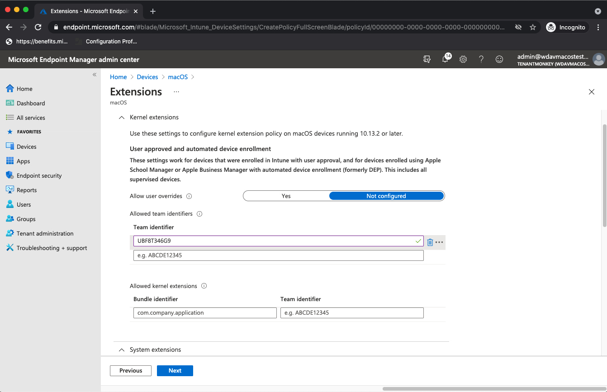
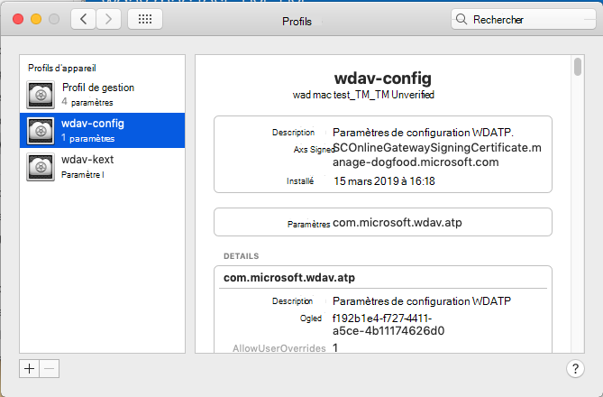

# <a name="intune-based-deployment-for-microsoft-defender-for-endpoint-on-macos"></a>Déploiement basé sur Intune pour Microsoft Defender pour Endpoint sur macOS

[!INCLUDE [Microsoft 365 Defender rebranding](../../includes/microsoft-defender.md)]

**S’applique à :**

- [Microsoft Defender pour point de terminaison macOS](microsoft-defender-endpoint-mac.md)

Cette rubrique décrit comment déployer Microsoft Defender pour endpoint sur macOS via Intune. Un déploiement réussi nécessite la réalisation de toutes les étapes suivantes :

1. [Télécharger le package d’intégration](#download-the-onboarding-package)
1. [Configuration de l’appareil client](#client-device-setup)
1. [Approuver les extensions système](#approve-system-extensions)
1. [Créer des profils de configuration système](#create-system-configuration-profiles)
1. [Publier l'application](#publish-application)

## <a name="prerequisites-and-system-requirements"></a>Conditions préalables et système requis

Avant de commencer, consultez la page principale de Microsoft Defender pour point de terminaison sur [macOS](microsoft-defender-endpoint-mac.md) pour obtenir une description des conditions préalables et de la requise pour la version logicielle actuelle.

## <a name="overview"></a>Vue d'ensemble

Le tableau suivant récapitule les étapes à suivre pour déployer et gérer Microsoft Defender pour endpoint sur Mac, via Intune. Des étapes plus détaillées sont disponibles ci-dessous.

| Étape | Exemples de noms de fichiers | BundleIdentifier |
|-|-|-|
| [Télécharger le package d’intégration](#download-the-onboarding-package) | WindowsDefenderATPOnboarding__MDATP_wdav.atp.xml | com.microsoft.wdav.atp |
| [Approuver l’extension système pour Microsoft Defender pour le point de terminaison](#approve-system-extensions) | MDATP_SysExt.xml | S/O |
| [Approuver l’extension du noyau pour Microsoft Defender pour le point de terminaison](#download-the-onboarding-package) | MDATP_KExt.xml | S/O |
| [Accorder un accès disque complet à Microsoft Defender pour le point de terminaison](#full-disk-access) | MDATP_tcc_Catalina_or_newer.xml | com.microsoft.wdav.tcc |
| [Stratégie d’extension réseau](#network-filter) | MDATP_NetExt.xml | S/O |
| [Configurer la mise à jour automatique Microsoft (AutoUpdate)](mac-updates.md#intune) | MDATP_Microsoft_AutoUpdate.xml | com.microsoft.autoupdate2 |
| [Paramètres de configuration de Microsoft Defender for Endpoint](mac-preferences.md#intune-profile-1)<br/><br/> **Remarque :** Si vous envisagez d’exécuter un antivirus tiers pour macOS, définissez sur `passiveMode` `true` . | MDATP_WDAV_and_exclusion_settings_Preferences.xml | com.microsoft.wdav |
| [Configurer Microsoft Defender pour les notifications de point de terminaison et de mise à jour automatique MS (MAU)](mac-updates.md) | MDATP_MDAV_Tray_and_AutoUpdate2.mobileconfig | com.microsoft.autoupdate2 ou com.microsoft.wdav.tray |


## <a name="download-the-onboarding-package"></a>Télécharger le package d’intégration

Téléchargez les packages d’intégration à partir Centre de sécurité Microsoft Defender :

1. In Centre de sécurité Microsoft Defender, go to **Paramètres**  >  **Device Management**  >  **Onboarding**.

2. Définissez le système d’exploitation sur **macOS** et la méthode de déploiement sur Gestion des périphériques **mobiles/Microsoft Intune**.

    

3. Sélectionnez **Télécharger le package d’intégration.** Enregistrez-le _WindowsDefenderATPOnboardingPackage.zip_ dans le même répertoire.

4. Extrayez le contenu du fichier .zip :

    ```bash
    unzip WindowsDefenderATPOnboardingPackage.zip
    ```
    ```Output
    Archive:  WindowsDefenderATPOnboardingPackage.zip
    warning:  WindowsDefenderATPOnboardingPackage.zip appears to use backslashes as path separators
      inflating: intune/kext.xml
      inflating: intune/WindowsDefenderATPOnboarding.xml
      inflating: jamf/WindowsDefenderATPOnboarding.plist
    ```

## <a name="create-system-configuration-profiles"></a>Créer des profils de configuration système

L’étape suivante consiste à créer des profils de configuration système dont Microsoft Defender pour le point de terminaison a besoin.
Dans le centre [Microsoft Endpoint Manager' administration,](https://endpoint.microsoft.com/)ouvrez les **profils**  >  **de configuration des appareils.**

### <a name="onboarding-blob"></a>Blob d’intégration

Ce profil contient des informations de licence pour Microsoft Defender pour le point de terminaison, sans qu’il signale qu’il n’est pas titulaire d’une licence.

1. Sélectionnez **Créer un profil** sous **Profils de configuration.**
1. Select **Platform** = **macOS**, **Profile type** = **Templates**. **Nom du modèle** = **Personnalisé**. Cliquez sur **Créer**.

    > [!div class="mx-imgBorder"]
    > 

1. Choisissez un nom pour le profil, par exemple, « Intégration de Defender ou de point de terminaison pour macOS ». Cliquez sur **Suivant**.

    > [!div class="mx-imgBorder"]
    > 

1. Choisissez un nom pour le nom du profil de configuration, par exemple« Defender pour l’intégration de point de terminaison pour macOS ».
1. Sélectionnez intune/WindowsDefenderATPOnboarding.xml que vous avez extrait du package d’intégration ci-dessus en tant que fichier de profil de configuration.

    > [!div class="mx-imgBorder"]
    > 

1. Cliquez sur **Suivant**.
1. Affectez des appareils sous **l’onglet** Affectation. Cliquez sur **Suivant**.

    > [!div class="mx-imgBorder"]
    > 

1. Révision et **création.**
1. Ouvrez **les**  >  **profils de configuration des** appareils, vous pouvez y voir votre profil créé.

    > [!div class="mx-imgBorder"]
    > 

### <a name="approve-system-extensions"></a>Approuver les extensions système

Ce profil est nécessaire pour macOS 10.15 (Îlelier) ou une nouvelle génération. Il sera ignoré sur les anciens macOS.

1. Sélectionnez **Créer un profil** sous **Profils de configuration.**
1. Select **Platform** = **macOS**, **Profile type** = **Templates**. **Nom du modèle** = **Extensions**. Cliquez sur **Créer**.
1. Dans **l’onglet Basics,** nommez ce nouveau profil.
1. Dans **l’onglet Paramètres de configuration,** développez Extensions système et ajoutez les **entrées** suivantes dans la section **Extensions système autorisées** :

    Identificateur d’ensemble         | Identificateur d’équipe
    --------------------------|----------------
    com.microsoft.wdav.epsext | UBF8T346G9
    com.microsoft.wdav.netext | UBF8T346G9

    > [!div class="mx-imgBorder"]
    > 

1. Dans **l’onglet Affectations,** affectez ce profil à tous les **utilisateurs & tous les appareils.**
1. Examinez et créez ce profil de configuration.

### <a name="kernel-extensions"></a>Extensions de noyau

Ce profil est nécessaire pour macOS 10.15 (Genre) ou une ancienne. Il sera ignoré sur les nouveaux macOS.

> [!CAUTION]
> Les appareils Apple Silicon (M1) ne supportent pas KEXT. L’installation d’un profil de configuration constitué de stratégies KEXT échoue sur ces appareils.

1. Sélectionnez **Créer un profil** sous **Profils de configuration.**
1. Select **Platform** = **macOS**, **Profile type** = **Templates**. **Nom du modèle** = **Extensions**. Cliquez sur **Créer**.
1. Dans **l’onglet Basics,** nommez ce nouveau profil.
1. Dans **l’onglet Paramètres de configuration,** développez **Extensions de noyau.**
1. Définissez **l’identificateur** d’équipe **sur UBF8T346G9** et cliquez sur **Suivant**.

    > [!div class="mx-imgBorder"]
    > 

1. Dans **l’onglet Affectations,** affectez ce profil à tous les **utilisateurs & tous les appareils.**
1. Examinez et créez ce profil de configuration.

### <a name="full-disk-access"></a>Accès disque total

   > [!CAUTION]
   > macOS 10.15 (Contrôle) contient de nouvelles améliorations en matière de sécurité et de confidentialité. À partir de cette version, par défaut, les applications ne peuvent pas accéder à certains emplacements sur le disque (par exemple, Documents, Téléchargements, Bureau, etc.) sans consentement explicite. En l’absence de ce consentement, Microsoft Defender pour le point de terminaison n’est pas en mesure de protéger entièrement votre appareil.
   >
   > Ce profil de configuration accorde un accès disque total à Microsoft Defender pour le point de terminaison. Si vous avez précédemment configuré Microsoft Defender pour endpoint via Intune, nous vous recommandons de mettre à jour le déploiement avec ce profil de configuration.

Téléchargez [**fulldisk.mobileconfig à**](https://raw.githubusercontent.com/microsoft/mdatp-xplat/master/macos/mobileconfig/profiles/fulldisk.mobileconfig) partir de [notre GitHub.](https://github.com/microsoft/mdatp-xplat/tree/master/macos/mobileconfig/profiles)

Suivez les instructions d’intégration du [blob](#onboarding-blob) ci-dessus, en utilisant « Defender for Endpoint Full Disk Access » comme nom de profil et **téléchargé fulldisk.mobileconfig** comme nom de profil de configuration.

### <a name="network-filter"></a>Filtre réseau

Dans le cadre des fonctionnalités de détection et de réponse des points de terminaison, Microsoft Defender for Endpoint sur macOS inspecte le trafic de socket et signale ces informations au portail Centre de sécurité Microsoft Defender. La stratégie suivante permet à l’extension réseau d’effectuer cette fonctionnalité.

Téléchargez [**netfilter.mobileconfig à**](https://raw.githubusercontent.com/microsoft/mdatp-xplat/master/macos/mobileconfig/profiles/netfilter.mobileconfig) partir de [notre GitHub.](https://github.com/microsoft/mdatp-xplat/tree/master/macos/mobileconfig/profiles)

Suivez les instructions d’intégration de [blob](#onboarding-blob) ci-dessus, en utilisant « Defender for Endpoint Network Filter » comme nom de profil et le fichier **netfilter.mobileconfig** téléchargé en tant que nom de profil de configuration.

### <a name="notifications"></a>Notifications

Ce profil permet à Microsoft Defender pour point de terminaison sur macOS et Microsoft Auto Update d’afficher des notifications dans l’interface utilisateur sur macOS 10.15 (Fonctionnalité) ou version plus nouvelle.

Téléchargez [**notif.mobileconfig à partir**](https://raw.githubusercontent.com/microsoft/mdatp-xplat/master/macos/mobileconfig/profiles/notif.mobileconfig) [de notre GitHub.](https://github.com/microsoft/mdatp-xplat/tree/master/macos/mobileconfig/profiles)

Suivez les instructions d’intégration de [blob](#onboarding-blob) ci-dessus, en utilisant « Defender pour les notifications de point de terminaison » comme nom de profil et téléchargé **notif.mobileconfig** comme nom de profil de configuration.

### <a name="view-status"></a>Afficher l’état

Une fois que les modifications Intune sont propagées aux appareils inscrits, vous pouvez les voir répertoriées sous État de  >  **l’appareil de surveillance**:

> [!div class="mx-imgBorder"]
> 

## <a name="publish-application"></a>Publier l'application

Cette étape permet de déployer Microsoft Defender pour le point de terminaison sur les ordinateurs inscrits.

1. Dans le centre [Microsoft Endpoint Manager' administration,](https://endpoint.microsoft.com/)ouvrez **Applications.**

    > [!div class="mx-imgBorder"]
    > 

1. Sélectionnez Par plateforme > macOS > Ajouter.
1. Choose **App type** = **macOS,** click **Select**.

    > [!div class="mx-imgBorder"]
    > 

1. Conservez les valeurs par défaut, cliquez sur **Suivant**.

    > [!div class="mx-imgBorder"]
    > 

1. Ajouter des affectations, cliquez sur **Suivant**.

    > [!div class="mx-imgBorder"]
    > 

1. Révision et **création.**
1. Vous pouvez visiter **Apps** By  >  **platform**  >  **macOS** pour le voir dans la liste de toutes les applications.

    > [!div class="mx-imgBorder"]
    > 

(Vous trouverez des informations détaillées sur la [page Intune](/mem/intune/apps/apps-advanced-threat-protection-macos)pour le déploiement de Defender.)

   > [!CAUTION]
   > Vous devez créer tous les profils de configuration requis et les pousser vers tous les ordinateurs, comme expliqué ci-dessus.

## <a name="client-device-setup"></a>Configuration de l’appareil client

Vous n’avez pas besoin d’une mise en service spéciale pour un appareil Mac au-delà [d’une installation Portail d’entreprise standard.](/intune-user-help/enroll-your-device-in-intune-macos-cp)

1. Confirmez la gestion des appareils.

    > [!div class="mx-imgBorder"]
    > 

    Sélectionnez **Ouvrir les préférences système,** recherchez **Profil** de gestion dans la liste, puis sélectionnez **Approuver...**. Votre profil de gestion s’affiche comme **vérifié**:

    

2. Sélectionnez **Continuer** et terminez l’inscription.

   Vous pouvez maintenant inscrire davantage d’appareils. Vous pouvez également les inscrire ultérieurement, une fois que vous avez terminé l’approvisionnement de la configuration système et des packages d’application.

3. Dans Intune, ouvrez **Gérer**  >  **tous les**  >  **appareils.** Ici, vous pouvez voir votre appareil parmi ceux répertoriés :

   > [!div class="mx-imgBorder"]
   > 

## <a name="verify-client-device-state"></a>Vérifier l’état de l’appareil client

1. Une fois les profils de configuration déployés sur vos appareils, ouvrez les **profils** de préférences  >  **système** sur votre appareil Mac.

    > [!div class="mx-imgBorder"]
    > 

    

2. Vérifiez que les profils de configuration suivants sont présents et installés. Le **profil de** gestion doit être le profil système Intune. _Wdav-config_ et _wdav-kext_ sont des profils de configuration système qui ont été ajoutés dans Intune :

    

3. Vous devez également voir l’icône Microsoft Defender pour point de terminaison dans le coin supérieur droit :

    > [!div class="mx-imgBorder"]
    > 

## <a name="troubleshooting"></a>Résolution des problèmes

Problème : aucune licence trouvée.

Solution : suivez les étapes ci-dessus pour créer un profil d’appareil à l’aide WindowsDefenderATPOnboarding.xml.

## <a name="logging-installation-issues"></a>Journalisation des problèmes d’installation

Pour plus d’informations sur la recherche du journal généré automatiquement par le programme d’installation en cas d’erreur, voir [Problèmes d’installation de journalisation.](mac-resources.md#logging-installation-issues)

## <a name="uninstallation"></a>Désinstallation

Voir [Désinstallation](mac-resources.md#uninstalling) pour plus d’informations sur la suppression de Microsoft Defender pour Endpoint sur macOS des appareils clients.
