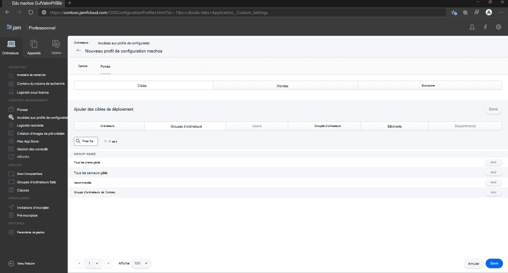
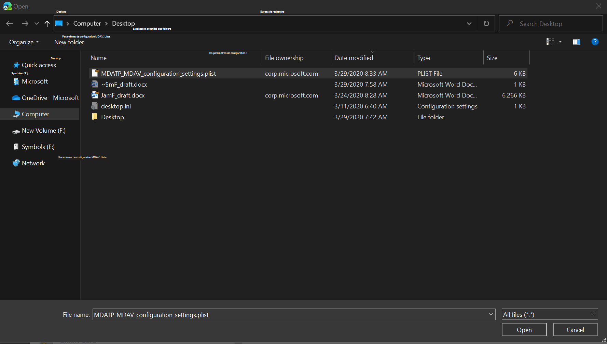
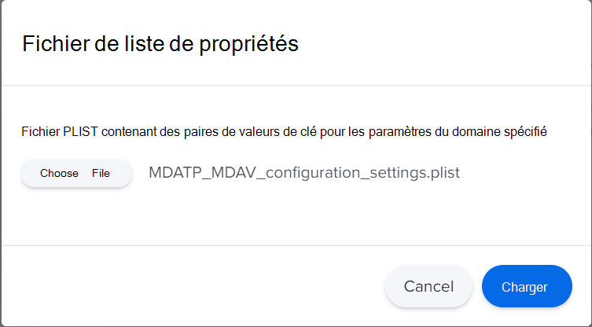
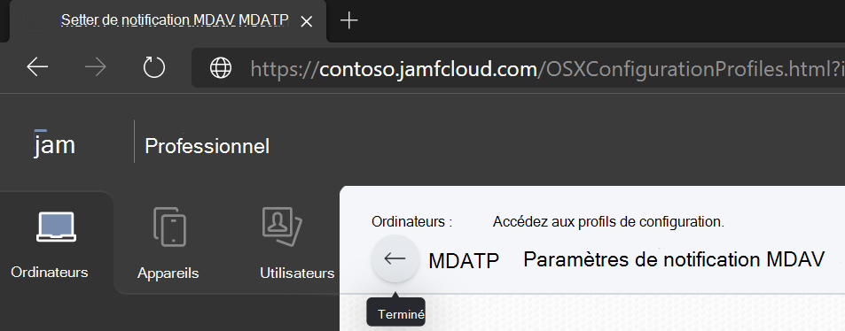
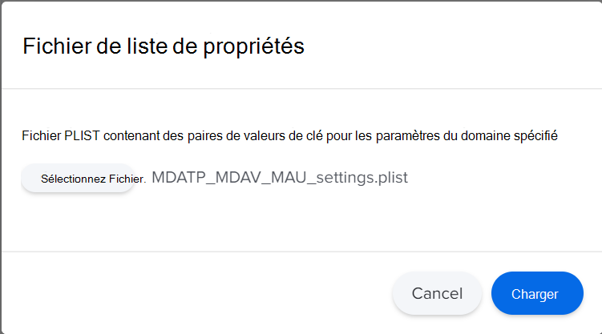
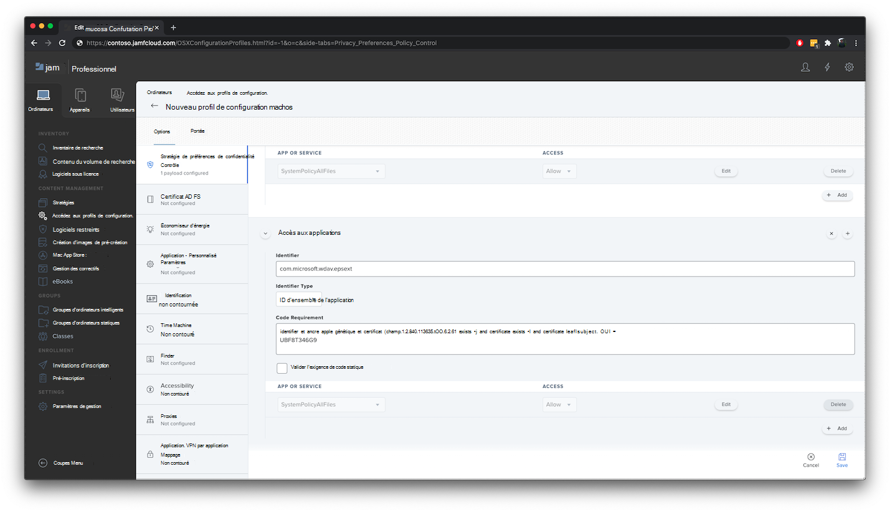
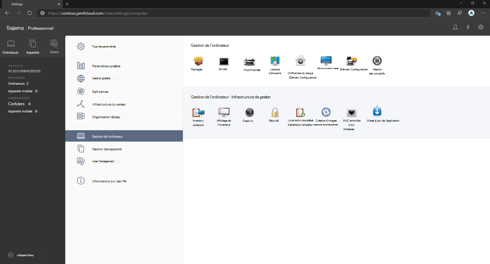
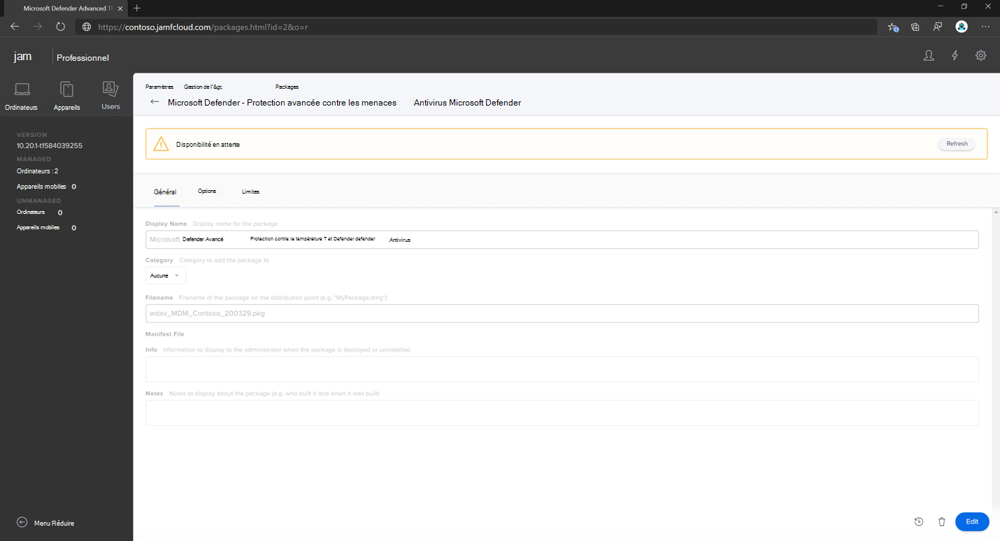
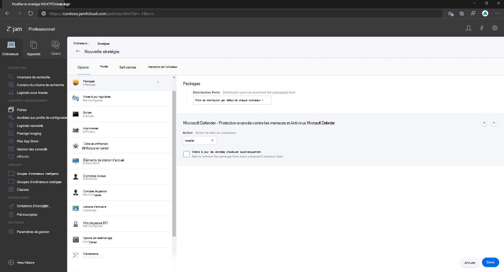

# <a name="set-up-the-microsoft-defender-for-endpoint-on-macos-policies-in-jamf-pro"></a><span data-ttu-id="d87c1-104">Configurer microsoft Defender pour le point de terminaison sur les stratégies macOS dans Jamf Pro</span><span class="sxs-lookup"><span data-stu-id="d87c1-104">Set up the Microsoft Defender for Endpoint on macOS policies in Jamf Pro</span></span>

[!INCLUDE [Microsoft 365 Defender rebranding](../../includes/microsoft-defender.md)]


<span data-ttu-id="d87c1-105">**S’applique à :**</span><span class="sxs-lookup"><span data-stu-id="d87c1-105">**Applies to:**</span></span>

- [<span data-ttu-id="d87c1-106">Defender pour point de terminaison sur Mac</span><span class="sxs-lookup"><span data-stu-id="d87c1-106">Defender for Endpoint on Mac</span></span>](microsoft-defender-endpoint-mac.md)

<span data-ttu-id="d87c1-107">Cette page vous guide à travers les étapes à suivre pour configurer des stratégies macOS dans Jamf Pro.</span><span class="sxs-lookup"><span data-stu-id="d87c1-107">This page will guide you through the steps you need to take to set up macOS policies in Jamf Pro.</span></span>

<span data-ttu-id="d87c1-108">Vous devez suivre les étapes suivantes :</span><span class="sxs-lookup"><span data-stu-id="d87c1-108">You'll need to take the following steps:</span></span>

1. [<span data-ttu-id="d87c1-109">Obtenir le package d'intégration De Microsoft Defender pour point de terminaison</span><span class="sxs-lookup"><span data-stu-id="d87c1-109">Get the Microsoft Defender for Endpoint onboarding package</span></span>](#step-1-get-the-microsoft-defender-for-endpoint-onboarding-package)

2. [<span data-ttu-id="d87c1-110">Créer un profil de configuration dans Jamf Pro à l'aide du package d'intégration</span><span class="sxs-lookup"><span data-stu-id="d87c1-110">Create a configuration profile in Jamf Pro using the onboarding package</span></span>](#step-2-create-a-configuration-profile-in-jamf-pro-using-the-onboarding-package)

3. [<span data-ttu-id="d87c1-111">Configurer les paramètres de Microsoft Defender pour les points de terminaison</span><span class="sxs-lookup"><span data-stu-id="d87c1-111">Configure Microsoft Defender for Endpoint settings</span></span>](#step-3-configure-microsoft-defender-for-endpoint-settings)

4. [<span data-ttu-id="d87c1-112">Configurer microsoft Defender pour les paramètres de notification de point de terminaison</span><span class="sxs-lookup"><span data-stu-id="d87c1-112">Configure Microsoft Defender for Endpoint notification settings</span></span>](#step-4-configure-notifications-settings)

5. [<span data-ttu-id="d87c1-113">Configurer la mise à jour automatique Microsoft (AutoUpdate)</span><span class="sxs-lookup"><span data-stu-id="d87c1-113">Configure Microsoft AutoUpdate (MAU)</span></span>](#step-5-configure-microsoft-autoupdate-mau)

6. [<span data-ttu-id="d87c1-114">Accorder un accès disque complet à Microsoft Defender pour le point de terminaison</span><span class="sxs-lookup"><span data-stu-id="d87c1-114">Grant full disk access to Microsoft Defender for Endpoint</span></span>](#step-6-grant-full-disk-access-to-microsoft-defender-for-endpoint)

7. [<span data-ttu-id="d87c1-115">Approuver l'extension de noyau pour Microsoft Defender pour le point de terminaison</span><span class="sxs-lookup"><span data-stu-id="d87c1-115">Approve Kernel extension for Microsoft Defender for Endpoint</span></span>](#step-7-approve-kernel-extension-for-microsoft-defender-for-endpoint)

8. [<span data-ttu-id="d87c1-116">Approuver les extensions système pour Microsoft Defender pour le point de terminaison</span><span class="sxs-lookup"><span data-stu-id="d87c1-116">Approve System extensions for Microsoft Defender for Endpoint</span></span>](#step-8-approve-system-extensions-for-microsoft-defender-for-endpoint)

9. [<span data-ttu-id="d87c1-117">Configurer l'extension réseau</span><span class="sxs-lookup"><span data-stu-id="d87c1-117">Configure Network Extension</span></span>](#step-9-configure-network-extension)

10. [<span data-ttu-id="d87c1-118">Planifier des analyses avec Microsoft Defender pour endpoint sur macOS</span><span class="sxs-lookup"><span data-stu-id="d87c1-118">Schedule scans with Microsoft Defender for Endpoint on macOS</span></span>](https://docs.microsoft.com/windows/security/threat-protection/microsoft-defender-atp/mac-schedule-scan-atp)

11. [<span data-ttu-id="d87c1-119">Déployer Microsoft Defender pour le point de terminaison sur macOS</span><span class="sxs-lookup"><span data-stu-id="d87c1-119">Deploy Microsoft Defender for Endpoint on macOS</span></span>](#step-11-deploy-microsoft-defender-for-endpoint-on-macos)


## <a name="step-1-get-the-microsoft-defender-for-endpoint-onboarding-package"></a><span data-ttu-id="d87c1-120">Étape 1 : Obtenir le package d'intégration De Microsoft Defender pour point de terminaison</span><span class="sxs-lookup"><span data-stu-id="d87c1-120">Step 1: Get the Microsoft Defender for Endpoint onboarding package</span></span>

1. <span data-ttu-id="d87c1-121">Dans [le Centre de sécurité Microsoft Defender,](https://securitycenter.microsoft.com )accédez à **Paramètres >'intégration.**</span><span class="sxs-lookup"><span data-stu-id="d87c1-121">In [Microsoft Defender Security Center](https://securitycenter.microsoft.com ), navigate to **Settings > Onboarding**.</span></span> 

2. <span data-ttu-id="d87c1-122">Sélectionnez macOS comme système d'exploitation et Gestion des périphériques mobiles /Microsoft Intune comme méthode de déploiement.</span><span class="sxs-lookup"><span data-stu-id="d87c1-122">Select macOS as the operating system and Mobile Device Management / Microsoft Intune as the deployment method.</span></span>

    

3. <span data-ttu-id="d87c1-124">Sélectionnez **Télécharger le package d'intégration** (WindowsDefenderATPOnboardingPackage.zip).</span><span class="sxs-lookup"><span data-stu-id="d87c1-124">Select **Download onboarding package** (WindowsDefenderATPOnboardingPackage.zip).</span></span>

4. <span data-ttu-id="d87c1-125">Extraire `WindowsDefenderATPOnboardingPackage.zip` .</span><span class="sxs-lookup"><span data-stu-id="d87c1-125">Extract `WindowsDefenderATPOnboardingPackage.zip`.</span></span>

5. <span data-ttu-id="d87c1-126">Copiez le fichier à votre emplacement préféré.</span><span class="sxs-lookup"><span data-stu-id="d87c1-126">Copy the file to your preferred location.</span></span> <span data-ttu-id="d87c1-127">Par exemple : `C:\Users\JaneDoe_or_JohnDoe.contoso\Downloads\WindowsDefenderATPOnboardingPackage_macOS_MDM_contoso\jamf\WindowsDefenderATPOnboarding.plist`.</span><span class="sxs-lookup"><span data-stu-id="d87c1-127">For example,  `C:\Users\JaneDoe_or_JohnDoe.contoso\Downloads\WindowsDefenderATPOnboardingPackage_macOS_MDM_contoso\jamf\WindowsDefenderATPOnboarding.plist`.</span></span>


## <a name="step-2-create-a-configuration-profile-in-jamf-pro-using-the-onboarding-package"></a><span data-ttu-id="d87c1-128">Étape 2 : Créer un profil de configuration dans Jamf Pro à l'aide du package d'intégration</span><span class="sxs-lookup"><span data-stu-id="d87c1-128">Step 2: Create a configuration profile in Jamf Pro using the onboarding package</span></span>

1. <span data-ttu-id="d87c1-129">Recherchez le `WindowsDefenderATPOnboarding.plist` fichier dans la section précédente.</span><span class="sxs-lookup"><span data-stu-id="d87c1-129">Locate the file `WindowsDefenderATPOnboarding.plist` from the previous section.</span></span>

   

 
2. <span data-ttu-id="d87c1-131">Dans le tableau de bord Jamf Pro, sélectionnez **Nouveau**.</span><span class="sxs-lookup"><span data-stu-id="d87c1-131">In the Jamf Pro dashboard, select **New**.</span></span>

    

3. <span data-ttu-id="d87c1-133">Entrez les détails suivants :</span><span class="sxs-lookup"><span data-stu-id="d87c1-133">Enter the following details:</span></span>

   <span data-ttu-id="d87c1-134">**Général**</span><span class="sxs-lookup"><span data-stu-id="d87c1-134">**General**</span></span>
   - <span data-ttu-id="d87c1-135">Nom : intégration MDATP pour macOS</span><span class="sxs-lookup"><span data-stu-id="d87c1-135">Name: MDATP onboarding for macOS</span></span>
   - <span data-ttu-id="d87c1-136">Description : intégration EDR MDATP pour macOS</span><span class="sxs-lookup"><span data-stu-id="d87c1-136">Description: MDATP EDR onboarding for macOS</span></span>
   - <span data-ttu-id="d87c1-137">Catégorie : Aucun</span><span class="sxs-lookup"><span data-stu-id="d87c1-137">Category: None</span></span>
   - <span data-ttu-id="d87c1-138">Méthode de distribution : installer automatiquement</span><span class="sxs-lookup"><span data-stu-id="d87c1-138">Distribution Method: Install Automatically</span></span>
   - <span data-ttu-id="d87c1-139">Niveau : niveau ordinateur</span><span class="sxs-lookup"><span data-stu-id="d87c1-139">Level: Computer Level</span></span>

4. <span data-ttu-id="d87c1-140">Dans **Application & paramètres personnalisés, sélectionnez** **Configurer.**</span><span class="sxs-lookup"><span data-stu-id="d87c1-140">In **Application & Custom Settings** select **Configure**.</span></span>

    

5. <span data-ttu-id="d87c1-142">Sélectionnez **Télécharger un fichier (fichier PLIST),** puis dans Domaine de **préférence,** entrez `com.microsoft.wdav.atp` :</span><span class="sxs-lookup"><span data-stu-id="d87c1-142">Select **Upload File (PLIST file)** then in **Preference Domain** enter: `com.microsoft.wdav.atp`.</span></span> 

    

    

7. <span data-ttu-id="d87c1-145">Sélectionnez **Ouvrir** et sélectionnez le fichier d'intégration.</span><span class="sxs-lookup"><span data-stu-id="d87c1-145">Select **Open** and select the onboarding file.</span></span>

    

8. <span data-ttu-id="d87c1-147">Sélectionnez **Télécharger.**</span><span class="sxs-lookup"><span data-stu-id="d87c1-147">Select **Upload**.</span></span> 

    


9. <span data-ttu-id="d87c1-149">Sélectionnez **l'onglet** Étendue.</span><span class="sxs-lookup"><span data-stu-id="d87c1-149">Select the **Scope** tab.</span></span>

    

10. <span data-ttu-id="d87c1-151">Sélectionnez les ordinateurs cibles.</span><span class="sxs-lookup"><span data-stu-id="d87c1-151">Select the target computers.</span></span>

    

     

11. <span data-ttu-id="d87c1-154">Sélectionnez **Enregistrer**.</span><span class="sxs-lookup"><span data-stu-id="d87c1-154">Select **Save**.</span></span>

    

    

12. <span data-ttu-id="d87c1-157">Sélectionnez **Terminé**.</span><span class="sxs-lookup"><span data-stu-id="d87c1-157">Select **Done**.</span></span>

    

    

## <a name="step-3-configure-microsoft-defender-for-endpoint-settings"></a><span data-ttu-id="d87c1-160">Étape 3 : Configurer Microsoft Defender pour les paramètres de point de terminaison</span><span class="sxs-lookup"><span data-stu-id="d87c1-160">Step 3: Configure Microsoft Defender for Endpoint settings</span></span>

1.  <span data-ttu-id="d87c1-161">Utilisez les paramètres de configuration microsoft Defender pour les points de terminaison suivants :</span><span class="sxs-lookup"><span data-stu-id="d87c1-161">Use the following Microsoft Defender for Endpoint configuration settings:</span></span>

    - <span data-ttu-id="d87c1-162">enableRealTimeProtection</span><span class="sxs-lookup"><span data-stu-id="d87c1-162">enableRealTimeProtection</span></span>
    - <span data-ttu-id="d87c1-163">passiveMode</span><span class="sxs-lookup"><span data-stu-id="d87c1-163">passiveMode</span></span>
    
    >[!NOTE]
    ><span data-ttu-id="d87c1-164">Non désactivé par défaut, si vous envisagez d'exécuter un antivirus tiers pour macOS, définissez-le sur `true` .</span><span class="sxs-lookup"><span data-stu-id="d87c1-164">Not turned on by default, if you are planning to run a third-party AV for macOS, set it to `true`.</span></span>

    - <span data-ttu-id="d87c1-165">exclusions</span><span class="sxs-lookup"><span data-stu-id="d87c1-165">exclusions</span></span>
    - <span data-ttu-id="d87c1-166">excludedPath</span><span class="sxs-lookup"><span data-stu-id="d87c1-166">excludedPath</span></span>
    - <span data-ttu-id="d87c1-167">excludedFileExtension</span><span class="sxs-lookup"><span data-stu-id="d87c1-167">excludedFileExtension</span></span>
    - <span data-ttu-id="d87c1-168">excludedFileName</span><span class="sxs-lookup"><span data-stu-id="d87c1-168">excludedFileName</span></span>
    - <span data-ttu-id="d87c1-169">exclusionsMergePolicy</span><span class="sxs-lookup"><span data-stu-id="d87c1-169">exclusionsMergePolicy</span></span>
    - <span data-ttu-id="d87c1-170">allowedThreats</span><span class="sxs-lookup"><span data-stu-id="d87c1-170">allowedThreats</span></span>
    
    >[!NOTE]
    ><span data-ttu-id="d87c1-171">EICAR est sur l'exemple, si vous êtes en train de passer par une preuve de concept, supprimez-le en particulier si vous testez EICAR.</span><span class="sxs-lookup"><span data-stu-id="d87c1-171">EICAR is on the sample, if you are going through a proof-of-concept, remove it especially if you are testing EICAR.</span></span>
        
    - <span data-ttu-id="d87c1-172">disallowedThreatActions</span><span class="sxs-lookup"><span data-stu-id="d87c1-172">disallowedThreatActions</span></span>
    - <span data-ttu-id="d87c1-173">potentially_unwanted_application</span><span class="sxs-lookup"><span data-stu-id="d87c1-173">potentially_unwanted_application</span></span>
    - <span data-ttu-id="d87c1-174">archive_bomb</span><span class="sxs-lookup"><span data-stu-id="d87c1-174">archive_bomb</span></span>
    - <span data-ttu-id="d87c1-175">cloudService</span><span class="sxs-lookup"><span data-stu-id="d87c1-175">cloudService</span></span>
    - <span data-ttu-id="d87c1-176">automaticSampleSubmission</span><span class="sxs-lookup"><span data-stu-id="d87c1-176">automaticSampleSubmission</span></span>
    - <span data-ttu-id="d87c1-177">étiquettes</span><span class="sxs-lookup"><span data-stu-id="d87c1-177">tags</span></span>
    - <span data-ttu-id="d87c1-178">hideStatusMenuIcon</span><span class="sxs-lookup"><span data-stu-id="d87c1-178">hideStatusMenuIcon</span></span>
    
     <span data-ttu-id="d87c1-179">Pour plus d'informations, [voir Liste des propriétés pour le profil de configuration Jamf.](mac-preferences.md#property-list-for-jamf-configuration-profile)</span><span class="sxs-lookup"><span data-stu-id="d87c1-179">For information, see [Property list for Jamf configuration profile](mac-preferences.md#property-list-for-jamf-configuration-profile).</span></span>

     ```XML
     <?xml version="1.0" encoding="UTF-8"?>
     <!DOCTYPE plist PUBLIC "-//Apple//DTD PLIST 1.0//EN" "http://www.apple.com/DTDs/PropertyList-1.0.dtd">
     <plist version="1.0">
     <dict>
         <key>antivirusEngine</key>
         <dict>
             <key>enableRealTimeProtection</key>
             <true/>
             <key>passiveMode</key>
             <false/>
             <key>exclusions</key>
             <array>
                 <dict>
                     <key>$type</key>
                     <string>excludedPath</string>
                     <key>isDirectory</key>
                     <false/>
                     <key>path</key>
                     <string>/var/log/system.log</string>
                 </dict>
                 <dict>
                     <key>$type</key>
                     <string>excludedPath</string>
                     <key>isDirectory</key>
                     <true/>
                     <key>path</key>
                     <string>/home</string>
                 </dict>
                 <dict>
                     <key>$type</key>
                     <string>excludedFileExtension</string>
                     <key>extension</key>
                     <string>pdf</string>
                 </dict>
                 <dict>
                     <key>$type</key>
                     <string>excludedFileName</string>
                     <key>name</key>
                     <string>cat</string>
                 </dict>
             </array>
             <key>exclusionsMergePolicy</key>
             <string>merge</string>
             <key>allowedThreats</key>
             <array>
                 <string>EICAR-Test-File (not a virus)</string>
             </array>
             <key>disallowedThreatActions</key>
             <array>
                 <string>allow</string>
                 <string>restore</string>
             </array>
             <key>threatTypeSettings</key>
             <array>
                 <dict>
                     <key>key</key>
                     <string>potentially_unwanted_application</string>
                     <key>value</key>
                     <string>block</string>
                 </dict>
                 <dict>
                     <key>key</key>
                     <string>archive_bomb</string>
                     <key>value</key>
                     <string>audit</string>
                 </dict>
             </array>
             <key>threatTypeSettingsMergePolicy</key>
             <string>merge</string>
         </dict>
         <key>cloudService</key>
         <dict>
             <key>enabled</key>
             <true/>
             <key>diagnosticLevel</key>
             <string>optional</string>
             <key>automaticSampleSubmission</key>
             <true/>
         </dict>
         <key>edr</key>
         <dict>
             <key>tags</key>
             <array>
                 <dict>
                     <key>key</key>
                     <string>GROUP</string>
                     <key>value</key>
                     <string>ExampleTag</string>
                 </dict>
             </array>
         </dict>
         <key>userInterface</key>
         <dict>
             <key>hideStatusMenuIcon</key>
             <false/>
         </dict>
     </dict>
     </plist>
     ```

2. <span data-ttu-id="d87c1-180">Enregistrez le fichier sous `MDATP_MDAV_configuration_settings.plist` .</span><span class="sxs-lookup"><span data-stu-id="d87c1-180">Save the file as `MDATP_MDAV_configuration_settings.plist`.</span></span>


3.  <span data-ttu-id="d87c1-181">Dans le tableau de bord Jamf Pro, sélectionnez **Général**.</span><span class="sxs-lookup"><span data-stu-id="d87c1-181">In the Jamf Pro dashboard, select **General**.</span></span>

    

4. <span data-ttu-id="d87c1-183">Entrez les détails suivants :</span><span class="sxs-lookup"><span data-stu-id="d87c1-183">Enter the following details:</span></span>

    <span data-ttu-id="d87c1-184">**Général**</span><span class="sxs-lookup"><span data-stu-id="d87c1-184">**General**</span></span>
    
    - <span data-ttu-id="d87c1-185">Nom : paramètres de configuration MDAV MDATP</span><span class="sxs-lookup"><span data-stu-id="d87c1-185">Name: MDATP MDAV configuration settings</span></span>
    - <span data-ttu-id="d87c1-186">Description :\<blank\></span><span class="sxs-lookup"><span data-stu-id="d87c1-186">Description:\<blank\></span></span>
    - <span data-ttu-id="d87c1-187">Catégorie : Aucun (par défaut)</span><span class="sxs-lookup"><span data-stu-id="d87c1-187">Category: None (default)</span></span>
    - <span data-ttu-id="d87c1-188">Méthode de distribution : installer automatiquement (par défaut)</span><span class="sxs-lookup"><span data-stu-id="d87c1-188">Distribution Method: Install Automatically(default)</span></span>
    - <span data-ttu-id="d87c1-189">Niveau : Niveau ordinateur (par défaut)</span><span class="sxs-lookup"><span data-stu-id="d87c1-189">Level: Computer Level(default)</span></span>

    

5. <span data-ttu-id="d87c1-191">Dans **Application & paramètres personnalisés, sélectionnez** **Configurer.**</span><span class="sxs-lookup"><span data-stu-id="d87c1-191">In **Application & Custom Settings** select **Configure**.</span></span>

    

6. <span data-ttu-id="d87c1-193">Sélectionnez **Télécharger un fichier (fichier PLIST).**</span><span class="sxs-lookup"><span data-stu-id="d87c1-193">Select **Upload File (PLIST file)**.</span></span>

    

7. <span data-ttu-id="d87c1-195">In **Preferences Domain**, enter `com.microsoft.wdav` , then select Upload  **PLIST File**.</span><span class="sxs-lookup"><span data-stu-id="d87c1-195">In **Preferences Domain**, enter `com.microsoft.wdav`, then select  **Upload PLIST File**.</span></span>

    

8. <span data-ttu-id="d87c1-197">Sélectionnez **Choisir un fichier.**</span><span class="sxs-lookup"><span data-stu-id="d87c1-197">Select **Choose File**.</span></span>

    

9. <span data-ttu-id="d87c1-199">Sélectionnez **le MDATP_MDAV_configuration_settings.plist,** puis sélectionnez **Ouvrir.**</span><span class="sxs-lookup"><span data-stu-id="d87c1-199">Select the **MDATP_MDAV_configuration_settings.plist**, then select **Open**.</span></span>

    

10. <span data-ttu-id="d87c1-201">Sélectionnez **Télécharger.**</span><span class="sxs-lookup"><span data-stu-id="d87c1-201">Select **Upload**.</span></span>

    

    

    >[!NOTE]
    ><span data-ttu-id="d87c1-204">Si vous téléchargez le fichier Intune, vous obtenez l'erreur suivante :</span><span class="sxs-lookup"><span data-stu-id="d87c1-204">If you happen to upload the Intune file, you'll get the following error:</span></span><br>
    ><span data-ttu-id="d87c1-205"></span><span class="sxs-lookup"><span data-stu-id="d87c1-205"></span></span>


11. <span data-ttu-id="d87c1-206">Sélectionnez **Enregistrer**.</span><span class="sxs-lookup"><span data-stu-id="d87c1-206">Select **Save**.</span></span> 

    

12. <span data-ttu-id="d87c1-208">Le fichier est téléchargé.</span><span class="sxs-lookup"><span data-stu-id="d87c1-208">The file is uploaded.</span></span>

    

    

13. <span data-ttu-id="d87c1-211">Sélectionnez **l'onglet** Étendue.</span><span class="sxs-lookup"><span data-stu-id="d87c1-211">Select the **Scope** tab.</span></span>

    

14. <span data-ttu-id="d87c1-213">Sélectionnez **Le groupe d'ordinateurs de Contoso.**</span><span class="sxs-lookup"><span data-stu-id="d87c1-213">Select **Contoso's Machine Group**.</span></span> 

15. <span data-ttu-id="d87c1-214">Sélectionnez **Ajouter,** puis **Enregistrer.**</span><span class="sxs-lookup"><span data-stu-id="d87c1-214">Select **Add**, then select **Save**.</span></span>

    

    

16. <span data-ttu-id="d87c1-217">Sélectionnez **Terminé**.</span><span class="sxs-lookup"><span data-stu-id="d87c1-217">Select **Done**.</span></span> <span data-ttu-id="d87c1-218">Vous verrez le nouveau profil **de configuration.**</span><span class="sxs-lookup"><span data-stu-id="d87c1-218">You'll see the new **Configuration profile**.</span></span>

    


## <a name="step-4-configure-notifications-settings"></a><span data-ttu-id="d87c1-220">Étape 4 : Configurer les paramètres de notifications</span><span class="sxs-lookup"><span data-stu-id="d87c1-220">Step 4: Configure notifications settings</span></span>

<span data-ttu-id="d87c1-221">Ces étapes s'appliquent à macOS 10.15 (Genreline) ou aux appareils plus nouveaux.</span><span class="sxs-lookup"><span data-stu-id="d87c1-221">These steps are applicable of macOS 10.15 (Catalina) or newer.</span></span>

1. <span data-ttu-id="d87c1-222">Dans le tableau de bord Jamf Pro, sélectionnez **Ordinateurs,** puis **Profils de configuration.**</span><span class="sxs-lookup"><span data-stu-id="d87c1-222">In the Jamf Pro dashboard, select **Computers**, then **Configuration Profiles**.</span></span>

2. <span data-ttu-id="d87c1-223">Cliquez **sur** Nouveau, puis entrez les détails suivants pour **options**:</span><span class="sxs-lookup"><span data-stu-id="d87c1-223">Click **New**, and enter the following details for **Options**:</span></span>
    
    - <span data-ttu-id="d87c1-224">Onglet **Général**:</span><span class="sxs-lookup"><span data-stu-id="d87c1-224">Tab **General**:</span></span> 
        - <span data-ttu-id="d87c1-225">**Name**: Paramètres de notification MDAV MDATP</span><span class="sxs-lookup"><span data-stu-id="d87c1-225">**Name**: MDATP MDAV Notification settings</span></span>
        - <span data-ttu-id="d87c1-226">**Description**: macOS 10.15 (Contrôle) ou une nouveauté</span><span class="sxs-lookup"><span data-stu-id="d87c1-226">**Description**: macOS 10.15 (Catalina) or newer</span></span>
        - <span data-ttu-id="d87c1-227">**Catégorie**: Aucun *(par défaut)*</span><span class="sxs-lookup"><span data-stu-id="d87c1-227">**Category**: None *(default)*</span></span>
        - <span data-ttu-id="d87c1-228">**Méthode de distribution**: installer automatiquement *(par défaut)*</span><span class="sxs-lookup"><span data-stu-id="d87c1-228">**Distribution Method**: Install Automatically *(default)*</span></span>
        - <span data-ttu-id="d87c1-229">**Niveau**: niveau ordinateur *(par défaut)*</span><span class="sxs-lookup"><span data-stu-id="d87c1-229">**Level**: Computer Level *(default)*</span></span>

        

    - <span data-ttu-id="d87c1-231">Tab **Notifications,** click **Add**, and enter the following values:</span><span class="sxs-lookup"><span data-stu-id="d87c1-231">Tab **Notifications**, click **Add**, and enter the following values:</span></span>
        - <span data-ttu-id="d87c1-232">**ID d'offre groupée**: `com.microsoft.wdav.tray`</span><span class="sxs-lookup"><span data-stu-id="d87c1-232">**Bundle ID**: `com.microsoft.wdav.tray`</span></span>
        - <span data-ttu-id="d87c1-233">**Alertes critiques**: cliquez sur **Désactiver**</span><span class="sxs-lookup"><span data-stu-id="d87c1-233">**Critical Alerts**: Click **Disable**</span></span>
        - <span data-ttu-id="d87c1-234">**Notifications :** cliquez sur **Activer**</span><span class="sxs-lookup"><span data-stu-id="d87c1-234">**Notifications**: Click **Enable**</span></span>
        - <span data-ttu-id="d87c1-235">**Type d'alerte bannière**: sélectionner **Inclure** **et temporaire** *(par défaut)*</span><span class="sxs-lookup"><span data-stu-id="d87c1-235">**Banner alert type**: Select **Include** and **Temporary** *(default)*</span></span>
        - <span data-ttu-id="d87c1-236">**Notifications sur l'écran de verrouillage**: cliquez sur **Masquer**</span><span class="sxs-lookup"><span data-stu-id="d87c1-236">**Notifications on lock screen**: Click **Hide**</span></span>
        - <span data-ttu-id="d87c1-237">**Notifications dans le Centre de notifications**: cliquez sur **Afficher**</span><span class="sxs-lookup"><span data-stu-id="d87c1-237">**Notifications in Notification Center**: Click **Display**</span></span>
        - <span data-ttu-id="d87c1-238">**Icône d'application de badge**: cliquez sur **Afficher**</span><span class="sxs-lookup"><span data-stu-id="d87c1-238">**Badge app icon**: Click **Display**</span></span>

        

    - <span data-ttu-id="d87c1-240">Tab **Notifications**, click **Add** one more time, scroll down to **New Notifications Settings**</span><span class="sxs-lookup"><span data-stu-id="d87c1-240">Tab **Notifications**, click **Add** one more time, scroll down to **New Notifications Settings**</span></span>
        - <span data-ttu-id="d87c1-241">**ID d'offre groupée**: `com.microsoft.autoupdate2`</span><span class="sxs-lookup"><span data-stu-id="d87c1-241">**Bundle ID**: `com.microsoft.autoupdate2`</span></span>
        - <span data-ttu-id="d87c1-242">Configurer le reste des paramètres sur les mêmes valeurs que ci-dessus</span><span class="sxs-lookup"><span data-stu-id="d87c1-242">Configure the rest of the settings to the same values as above</span></span>

        

        <span data-ttu-id="d87c1-244">Notez que vous avez maintenant deux « tables » avec des configurations de notification, une pour l'ID d'offre groupée : **com.microsoft.wdav.tray** et une autre pour l'ID d'offre groupée : **com.microsoft.autoupdate2**.</span><span class="sxs-lookup"><span data-stu-id="d87c1-244">Note that now you have two 'tables' with notification configurations, one for **Bundle ID: com.microsoft.wdav.tray**, and another for **Bundle ID: com.microsoft.autoupdate2**.</span></span> <span data-ttu-id="d87c1-245">Bien que vous pouvez configurer les paramètres d'alerte en fonction de vos  besoins,  les ID d'offre groupée doivent être exactement les mêmes que ceux décrits précédemment, et le commutateur Inclure doit être en cours pour les **notifications.**</span><span class="sxs-lookup"><span data-stu-id="d87c1-245">While you can configure alert settings per your requirements, Bundle IDs must be exactly the same as described before, and **Include** switch must be **On** for **Notifications**.</span></span>

3. <span data-ttu-id="d87c1-246">Sélectionnez **l'onglet** Étendue, puis **sélectionnez Ajouter.**</span><span class="sxs-lookup"><span data-stu-id="d87c1-246">Select the **Scope** tab, then select **Add**.</span></span>

    

4. <span data-ttu-id="d87c1-248">Sélectionnez **Le groupe d'ordinateurs de Contoso.**</span><span class="sxs-lookup"><span data-stu-id="d87c1-248">Select **Contoso's Machine Group**.</span></span> 

5. <span data-ttu-id="d87c1-249">Sélectionnez **Ajouter,** puis **Enregistrer.**</span><span class="sxs-lookup"><span data-stu-id="d87c1-249">Select **Add**, then select **Save**.</span></span>
    
    
    
    

6. <span data-ttu-id="d87c1-252">Sélectionnez **Terminé**.</span><span class="sxs-lookup"><span data-stu-id="d87c1-252">Select **Done**.</span></span> <span data-ttu-id="d87c1-253">Vous verrez le nouveau profil **de configuration.**</span><span class="sxs-lookup"><span data-stu-id="d87c1-253">You'll see the new **Configuration profile**.</span></span>
    <span data-ttu-id="d87c1-254"></span><span class="sxs-lookup"><span data-stu-id="d87c1-254"></span></span>

## <a name="step-5-configure-microsoft-autoupdate-mau"></a><span data-ttu-id="d87c1-255">Étape 5 : Configurer la mise à jour automatique Microsoft (AutoUpdate)</span><span class="sxs-lookup"><span data-stu-id="d87c1-255">Step 5: Configure Microsoft AutoUpdate (MAU)</span></span>

1. <span data-ttu-id="d87c1-256">Utilisez les paramètres de configuration microsoft Defender pour les points de terminaison suivants :</span><span class="sxs-lookup"><span data-stu-id="d87c1-256">Use the following Microsoft Defender for Endpoint configuration settings:</span></span>

      ```XML
   <?xml version="1.0" encoding="UTF-8"?>
   <!DOCTYPE plist PUBLIC "-//Apple//DTD PLIST 1.0//EN" "http://www.apple.com/DTDs/PropertyList-1.0.dtd">
   <plist version="1.0">
   <dict>
    <key>ChannelName</key>
    <string>Current</string>
    <key>HowToCheck</key>
    <string>AutomaticDownload</string>
    <key>EnableCheckForUpdatesButton</key>
    <true/>
    <key>DisableInsiderCheckbox</key>
    <false/>
    <key>SendAllTelemetryEnabled</key>
    <true/>
   </dict>
   </plist>
   ```

2. <span data-ttu-id="d87c1-257">Enregistrez-le sous `MDATP_MDAV_MAU_settings.plist` .</span><span class="sxs-lookup"><span data-stu-id="d87c1-257">Save it as `MDATP_MDAV_MAU_settings.plist`.</span></span>

3. <span data-ttu-id="d87c1-258">Dans le tableau de bord Jamf Pro, sélectionnez **Général**.</span><span class="sxs-lookup"><span data-stu-id="d87c1-258">In the Jamf Pro dashboard, select **General**.</span></span> 

    

4. <span data-ttu-id="d87c1-260">Entrez les détails suivants :</span><span class="sxs-lookup"><span data-stu-id="d87c1-260">Enter the following details:</span></span>

    <span data-ttu-id="d87c1-261">**Général**</span><span class="sxs-lookup"><span data-stu-id="d87c1-261">**General**</span></span> 
    
    - <span data-ttu-id="d87c1-262">Name: MDATP MDAV MAU settings</span><span class="sxs-lookup"><span data-stu-id="d87c1-262">Name: MDATP MDAV MAU settings</span></span>
    - <span data-ttu-id="d87c1-263">Description : Paramètres de mise à jour automatique Microsoft pour MDATP pour macOS</span><span class="sxs-lookup"><span data-stu-id="d87c1-263">Description: Microsoft AutoUpdate settings for MDATP for macOS</span></span>
    - <span data-ttu-id="d87c1-264">Catégorie : Aucun (par défaut)</span><span class="sxs-lookup"><span data-stu-id="d87c1-264">Category: None (default)</span></span>
    - <span data-ttu-id="d87c1-265">Méthode de distribution : installer automatiquement (par défaut)</span><span class="sxs-lookup"><span data-stu-id="d87c1-265">Distribution Method: Install Automatically(default)</span></span>
    - <span data-ttu-id="d87c1-266">Niveau : Niveau ordinateur (par défaut)</span><span class="sxs-lookup"><span data-stu-id="d87c1-266">Level: Computer Level(default)</span></span>

5. <span data-ttu-id="d87c1-267">In **Application & Custom Settings** select **Configure**.</span><span class="sxs-lookup"><span data-stu-id="d87c1-267">In **Application & Custom Settings** select **Configure**.</span></span>

    

6. <span data-ttu-id="d87c1-269">Sélectionnez **Télécharger un fichier (fichier PLIST).**</span><span class="sxs-lookup"><span data-stu-id="d87c1-269">Select **Upload File (PLIST file)**.</span></span>

      

7. <span data-ttu-id="d87c1-271">In **Preference Domain** enter: , then select Upload `com.microsoft.autoupdate2` **PLIST File**.</span><span class="sxs-lookup"><span data-stu-id="d87c1-271">In **Preference Domain** enter: `com.microsoft.autoupdate2`, then select **Upload PLIST File**.</span></span>

    

8. <span data-ttu-id="d87c1-273">Sélectionnez **Choisir un fichier.**</span><span class="sxs-lookup"><span data-stu-id="d87c1-273">Select **Choose File**.</span></span>

    

9. <span data-ttu-id="d87c1-275">Sélectionnez **MDATP_MDAV_MAU_settings.plist.**</span><span class="sxs-lookup"><span data-stu-id="d87c1-275">Select **MDATP_MDAV_MAU_settings.plist**.</span></span>

    

10. <span data-ttu-id="d87c1-277">Sélectionnez **Télécharger.**</span><span class="sxs-lookup"><span data-stu-id="d87c1-277">Select **Upload**.</span></span>
    <span data-ttu-id="d87c1-278"></span><span class="sxs-lookup"><span data-stu-id="d87c1-278"></span></span>

    

11. <span data-ttu-id="d87c1-280">Sélectionnez **Enregistrer**.</span><span class="sxs-lookup"><span data-stu-id="d87c1-280">Select **Save**.</span></span>

    

12. <span data-ttu-id="d87c1-282">Sélectionnez **l'onglet** Étendue.</span><span class="sxs-lookup"><span data-stu-id="d87c1-282">Select the **Scope** tab.</span></span>
   
     

13. <span data-ttu-id="d87c1-284">Sélectionnez **Ajouter**.</span><span class="sxs-lookup"><span data-stu-id="d87c1-284">Select **Add**.</span></span>
    
    

    

    

14. <span data-ttu-id="d87c1-288">Sélectionnez **Terminé**.</span><span class="sxs-lookup"><span data-stu-id="d87c1-288">Select **Done**.</span></span>
    
    

## <a name="step-6-grant-full-disk-access-to-microsoft-defender-for-endpoint"></a><span data-ttu-id="d87c1-290">Étape 6 : Accorder un accès disque total à Microsoft Defender pour le point de terminaison</span><span class="sxs-lookup"><span data-stu-id="d87c1-290">Step 6: Grant full disk access to Microsoft Defender for Endpoint</span></span>

1. <span data-ttu-id="d87c1-291">Dans le tableau de bord Jamf Pro, sélectionnez **Profils de configuration.**</span><span class="sxs-lookup"><span data-stu-id="d87c1-291">In the Jamf Pro dashboard, select **Configuration Profiles**.</span></span>

    

2. <span data-ttu-id="d87c1-293">Sélectionnez **+ Nouveau**.</span><span class="sxs-lookup"><span data-stu-id="d87c1-293">Select **+ New**.</span></span> 

3. <span data-ttu-id="d87c1-294">Entrez les détails suivants :</span><span class="sxs-lookup"><span data-stu-id="d87c1-294">Enter the following details:</span></span>

    <span data-ttu-id="d87c1-295">**Général**</span><span class="sxs-lookup"><span data-stu-id="d87c1-295">**General**</span></span> 
    - <span data-ttu-id="d87c1-296">Nom : MDATP MDAV : accorder un accès disque total à l'EDR et à l'antivirus</span><span class="sxs-lookup"><span data-stu-id="d87c1-296">Name: MDATP MDAV - grant Full Disk Access to EDR and AV</span></span>
    - <span data-ttu-id="d87c1-297">Description : sur macOS Ou une nouveauté, le nouveau contrôle de stratégie des préférences de confidentialité</span><span class="sxs-lookup"><span data-stu-id="d87c1-297">Description: On macOS Catalina or newer, the new Privacy Preferences Policy Control</span></span>
    - <span data-ttu-id="d87c1-298">Catégorie : Aucun</span><span class="sxs-lookup"><span data-stu-id="d87c1-298">Category: None</span></span>
    - <span data-ttu-id="d87c1-299">Méthode de distribution : installer automatiquement</span><span class="sxs-lookup"><span data-stu-id="d87c1-299">Distribution method: Install Automatically</span></span>
    - <span data-ttu-id="d87c1-300">Niveau : niveau ordinateur</span><span class="sxs-lookup"><span data-stu-id="d87c1-300">Level: Computer level</span></span>


    

4. <span data-ttu-id="d87c1-302">In **Configure Privacy Preferences Policy Control** select **Configure**.</span><span class="sxs-lookup"><span data-stu-id="d87c1-302">In **Configure Privacy Preferences Policy Control** select **Configure**.</span></span>

    

5. <span data-ttu-id="d87c1-304">Dans **Le contrôle de stratégie des préférences de confidentialité,** entrez les détails suivants :</span><span class="sxs-lookup"><span data-stu-id="d87c1-304">In **Privacy Preferences Policy Control**, enter the following details:</span></span>

    - <span data-ttu-id="d87c1-305">Identificateur : `com.microsoft.wdav`</span><span class="sxs-lookup"><span data-stu-id="d87c1-305">Identifier: `com.microsoft.wdav`</span></span>
    - <span data-ttu-id="d87c1-306">Type d'identificateur : ID d'offre groupée</span><span class="sxs-lookup"><span data-stu-id="d87c1-306">Identifier Type: Bundle ID</span></span>
    - <span data-ttu-id="d87c1-307">Conditions requises pour le code : `identifier "com.microsoft.wdav" and anchor apple generic and certificate 1[field.1.2.840.113635.100.6.2.6] /* exists */ and certificate leaf[field.1.2.840.113635.100.6.1.13] /* exists */ and certificate leaf[subject.OU] = UBF8T346G9`</span><span class="sxs-lookup"><span data-stu-id="d87c1-307">Code Requirement: `identifier "com.microsoft.wdav" and anchor apple generic and certificate 1[field.1.2.840.113635.100.6.2.6] /* exists */ and certificate leaf[field.1.2.840.113635.100.6.1.13] /* exists */ and certificate leaf[subject.OU] = UBF8T346G9`</span></span>


    

6. <span data-ttu-id="d87c1-309">Sélectionnez **+ Ajouter**.</span><span class="sxs-lookup"><span data-stu-id="d87c1-309">Select **+ Add**.</span></span>

    

    - <span data-ttu-id="d87c1-311">Sous Application ou service : définir sur **SystemPolicyAllFiles**</span><span class="sxs-lookup"><span data-stu-id="d87c1-311">Under App or service: Set to **SystemPolicyAllFiles**</span></span>

    - <span data-ttu-id="d87c1-312">Sous « accès » : définir sur **Autoriser**</span><span class="sxs-lookup"><span data-stu-id="d87c1-312">Under "access": Set to **Allow**</span></span>

7. <span data-ttu-id="d87c1-313">Sélectionnez **Enregistrer** (et non celui en bas à droite).</span><span class="sxs-lookup"><span data-stu-id="d87c1-313">Select **Save** (not the one at the bottom right).</span></span>

    

8. <span data-ttu-id="d87c1-315">Cliquez sur le `+` signe en de côté **d'App Access** pour ajouter une nouvelle entrée.</span><span class="sxs-lookup"><span data-stu-id="d87c1-315">Click the `+` sign next to **App Access** to add a new entry.</span></span>

    

9. <span data-ttu-id="d87c1-317">Entrez les détails suivants :</span><span class="sxs-lookup"><span data-stu-id="d87c1-317">Enter the following details:</span></span>

    - <span data-ttu-id="d87c1-318">Identificateur : `com.microsoft.wdav.epsext`</span><span class="sxs-lookup"><span data-stu-id="d87c1-318">Identifier: `com.microsoft.wdav.epsext`</span></span>
    - <span data-ttu-id="d87c1-319">Type d'identificateur : ID d'offre groupée</span><span class="sxs-lookup"><span data-stu-id="d87c1-319">Identifier Type: Bundle ID</span></span>
    - <span data-ttu-id="d87c1-320">Conditions requises pour le code : `identifier "com.microsoft.wdav.epsext" and anchor apple generic and certificate 1[field.1.2.840.113635.100.6.2.6] /* exists */ and certificate leaf[field.1.2.840.113635.100.6.1.13] /* exists */ and certificate leaf[subject.OU] = UBF8T346G9`</span><span class="sxs-lookup"><span data-stu-id="d87c1-320">Code Requirement: `identifier "com.microsoft.wdav.epsext" and anchor apple generic and certificate 1[field.1.2.840.113635.100.6.2.6] /* exists */ and certificate leaf[field.1.2.840.113635.100.6.1.13] /* exists */ and certificate leaf[subject.OU] = UBF8T346G9`</span></span>

10. <span data-ttu-id="d87c1-321">Sélectionnez **+ Ajouter**.</span><span class="sxs-lookup"><span data-stu-id="d87c1-321">Select **+ Add**.</span></span>

    

    - <span data-ttu-id="d87c1-323">Sous Application ou service : définir sur **SystemPolicyAllFiles**</span><span class="sxs-lookup"><span data-stu-id="d87c1-323">Under App or service: Set to **SystemPolicyAllFiles**</span></span>

    - <span data-ttu-id="d87c1-324">Sous « accès » : définir sur **Autoriser**</span><span class="sxs-lookup"><span data-stu-id="d87c1-324">Under "access": Set to **Allow**</span></span>

11. <span data-ttu-id="d87c1-325">Sélectionnez **Enregistrer** (et non celui en bas à droite).</span><span class="sxs-lookup"><span data-stu-id="d87c1-325">Select **Save** (not the one at the bottom right).</span></span>

    

12. <span data-ttu-id="d87c1-327">Sélectionnez **l'onglet** Étendue.</span><span class="sxs-lookup"><span data-stu-id="d87c1-327">Select the **Scope** tab.</span></span>

    

13. <span data-ttu-id="d87c1-329">Sélectionnez **+ Ajouter**.</span><span class="sxs-lookup"><span data-stu-id="d87c1-329">Select **+ Add**.</span></span>

    

14. <span data-ttu-id="d87c1-331">Sélectionnez **Groupes d'ordinateurs** > **sous Nom** de groupe > sélectionnez Groupe MachineGroup de **Contoso.**</span><span class="sxs-lookup"><span data-stu-id="d87c1-331">Select **Computer Groups** > under **Group Name** > select **Contoso's MachineGroup**.</span></span> 

    

15. <span data-ttu-id="d87c1-333">Sélectionnez **Ajouter**.</span><span class="sxs-lookup"><span data-stu-id="d87c1-333">Select **Add**.</span></span> 

16. <span data-ttu-id="d87c1-334">Sélectionnez **Enregistrer**.</span><span class="sxs-lookup"><span data-stu-id="d87c1-334">Select **Save**.</span></span> 
    
17. <span data-ttu-id="d87c1-335">Sélectionnez **Terminé**.</span><span class="sxs-lookup"><span data-stu-id="d87c1-335">Select **Done**.</span></span>
    
    
    
    

<span data-ttu-id="d87c1-338">Vous pouvez également télécharger [fulldisk.mobileconfig](https://github.com/microsoft/mdatp-xplat/blob/master/macos/mobileconfig/profiles/fulldisk.mobileconfig) et le télécharger dans les profils de configuration JAMF comme décrit dans [Deploying Custom Configuration Profiles using Jamf Pro| Méthode 2 : Télécharger un profil de configuration sur Jamf Pro](https://www.jamf.com/jamf-nation/articles/648/deploying-custom-configuration-profiles-using-jamf-pro).</span><span class="sxs-lookup"><span data-stu-id="d87c1-338">Alternatively, you can download [fulldisk.mobileconfig](https://github.com/microsoft/mdatp-xplat/blob/master/macos/mobileconfig/profiles/fulldisk.mobileconfig) and upload it to JAMF Configuration Profiles as described in [Deploying Custom Configuration Profiles using Jamf Pro|Method 2: Upload a Configuration Profile to Jamf Pro](https://www.jamf.com/jamf-nation/articles/648/deploying-custom-configuration-profiles-using-jamf-pro).</span></span>

## <a name="step-7-approve-kernel-extension-for-microsoft-defender-for-endpoint"></a><span data-ttu-id="d87c1-339">Étape 7 : Approuver l'extension de noyau pour Microsoft Defender pour le point de terminaison</span><span class="sxs-lookup"><span data-stu-id="d87c1-339">Step 7: Approve Kernel extension for Microsoft Defender for Endpoint</span></span>

> [!CAUTION]
> <span data-ttu-id="d87c1-340">Les appareils Apple Silicon (M1) ne supportent pas KEXT.</span><span class="sxs-lookup"><span data-stu-id="d87c1-340">Apple Silicon (M1) devices do not support KEXT.</span></span> <span data-ttu-id="d87c1-341">L'installation d'un profil de configuration constitué de stratégies KEXT échoue sur ces appareils.</span><span class="sxs-lookup"><span data-stu-id="d87c1-341">Installation of a configuration profile consisting KEXT policies will fail on these devices.</span></span>

1. <span data-ttu-id="d87c1-342">Dans les **profils de configuration,** **sélectionnez + Nouveau**.</span><span class="sxs-lookup"><span data-stu-id="d87c1-342">In the **Configuration Profiles**, select **+ New**.</span></span>

    

2. <span data-ttu-id="d87c1-344">Entrez les détails suivants :</span><span class="sxs-lookup"><span data-stu-id="d87c1-344">Enter the following details:</span></span>

    <span data-ttu-id="d87c1-345">**Général**</span><span class="sxs-lookup"><span data-stu-id="d87c1-345">**General**</span></span> 
    
    - <span data-ttu-id="d87c1-346">Name: MDATP MDAV Kernel Extension</span><span class="sxs-lookup"><span data-stu-id="d87c1-346">Name: MDATP MDAV Kernel Extension</span></span>
    - <span data-ttu-id="d87c1-347">Description : extension de noyau MDATP (kext)</span><span class="sxs-lookup"><span data-stu-id="d87c1-347">Description: MDATP kernel extension (kext)</span></span>
    - <span data-ttu-id="d87c1-348">Catégorie : Aucun</span><span class="sxs-lookup"><span data-stu-id="d87c1-348">Category: None</span></span>
    - <span data-ttu-id="d87c1-349">Méthode de distribution : installer automatiquement</span><span class="sxs-lookup"><span data-stu-id="d87c1-349">Distribution Method: Install Automatically</span></span>
    - <span data-ttu-id="d87c1-350">Niveau : niveau ordinateur</span><span class="sxs-lookup"><span data-stu-id="d87c1-350">Level: Computer Level</span></span>

    

3. <span data-ttu-id="d87c1-352">In **Configure Approved Kernel Extensions** select **Configure**.</span><span class="sxs-lookup"><span data-stu-id="d87c1-352">In **Configure Approved Kernel Extensions** select **Configure**.</span></span>

    

   
4. <span data-ttu-id="d87c1-354">Dans **Extensions de noyau approuvées,** entrez les détails suivants :</span><span class="sxs-lookup"><span data-stu-id="d87c1-354">In **Approved Kernel Extensions** Enter the following details:</span></span>

    - <span data-ttu-id="d87c1-355">Nom complet : Microsoft Corp.</span><span class="sxs-lookup"><span data-stu-id="d87c1-355">Display Name: Microsoft Corp.</span></span>
    - <span data-ttu-id="d87c1-356">ID d'équipe : UBF8T346G9</span><span class="sxs-lookup"><span data-stu-id="d87c1-356">Team ID: UBF8T346G9</span></span>

    

5. <span data-ttu-id="d87c1-358">Sélectionnez **l'onglet** Étendue.</span><span class="sxs-lookup"><span data-stu-id="d87c1-358">Select the **Scope** tab.</span></span>

    

6. <span data-ttu-id="d87c1-360">Sélectionnez **+ Ajouter**.</span><span class="sxs-lookup"><span data-stu-id="d87c1-360">Select **+ Add**.</span></span>

7. <span data-ttu-id="d87c1-361">Sélectionnez **Groupes d'ordinateurs** > **sous Nom** du > sélectionnez Groupe ordinateur de **Contoso.**</span><span class="sxs-lookup"><span data-stu-id="d87c1-361">Select **Computer Groups** > under **Group Name** > select **Contoso's Machine Group**.</span></span>

8. <span data-ttu-id="d87c1-362">Sélectionnez **+ Ajouter**.</span><span class="sxs-lookup"><span data-stu-id="d87c1-362">Select **+ Add**.</span></span>

    

9. <span data-ttu-id="d87c1-364">Sélectionnez **Enregistrer**.</span><span class="sxs-lookup"><span data-stu-id="d87c1-364">Select **Save**.</span></span>

    

10. <span data-ttu-id="d87c1-366">Sélectionnez **Terminé**.</span><span class="sxs-lookup"><span data-stu-id="d87c1-366">Select **Done**.</span></span>

    

<span data-ttu-id="d87c1-368">Vous pouvez également télécharger [kext.mobileconfig](https://github.com/microsoft/mdatp-xplat/blob/master/macos/mobileconfig/profiles/kext.mobileconfig) et le télécharger dans les profils de configuration JAMF comme décrit dans [Deploying Custom Configuration Profiles using Jamf Pro| Méthode 2 : Télécharger un profil de configuration sur Jamf Pro](https://www.jamf.com/jamf-nation/articles/648/deploying-custom-configuration-profiles-using-jamf-pro).</span><span class="sxs-lookup"><span data-stu-id="d87c1-368">Alternatively, you can download [kext.mobileconfig](https://github.com/microsoft/mdatp-xplat/blob/master/macos/mobileconfig/profiles/kext.mobileconfig) and upload it to JAMF Configuration Profiles as described in [Deploying Custom Configuration Profiles using Jamf Pro|Method 2: Upload a Configuration Profile to Jamf Pro](https://www.jamf.com/jamf-nation/articles/648/deploying-custom-configuration-profiles-using-jamf-pro).</span></span>

## <a name="step-8-approve-system-extensions-for-microsoft-defender-for-endpoint"></a><span data-ttu-id="d87c1-369">Étape 8 : Approuver les extensions système pour Microsoft Defender pour le point de terminaison</span><span class="sxs-lookup"><span data-stu-id="d87c1-369">Step 8: Approve System extensions for Microsoft Defender for Endpoint</span></span>

1. <span data-ttu-id="d87c1-370">Dans les **profils de configuration,** **sélectionnez + Nouveau**.</span><span class="sxs-lookup"><span data-stu-id="d87c1-370">In the **Configuration Profiles**, select **+ New**.</span></span>

    

2. <span data-ttu-id="d87c1-372">Entrez les détails suivants :</span><span class="sxs-lookup"><span data-stu-id="d87c1-372">Enter the following details:</span></span>

    <span data-ttu-id="d87c1-373">**Général**</span><span class="sxs-lookup"><span data-stu-id="d87c1-373">**General**</span></span>
    
    - <span data-ttu-id="d87c1-374">Name: MDATP MDAV System Extensions</span><span class="sxs-lookup"><span data-stu-id="d87c1-374">Name: MDATP MDAV System Extensions</span></span>
    - <span data-ttu-id="d87c1-375">Description : extensions système MDATP</span><span class="sxs-lookup"><span data-stu-id="d87c1-375">Description: MDATP system extensions</span></span>
    - <span data-ttu-id="d87c1-376">Catégorie : Aucun</span><span class="sxs-lookup"><span data-stu-id="d87c1-376">Category: None</span></span>
    - <span data-ttu-id="d87c1-377">Méthode de distribution : installer automatiquement</span><span class="sxs-lookup"><span data-stu-id="d87c1-377">Distribution Method: Install Automatically</span></span>
    - <span data-ttu-id="d87c1-378">Niveau : niveau ordinateur</span><span class="sxs-lookup"><span data-stu-id="d87c1-378">Level: Computer Level</span></span>

    

3. <span data-ttu-id="d87c1-380">Dans **les extensions système,** **sélectionnez Configurer.**</span><span class="sxs-lookup"><span data-stu-id="d87c1-380">In **System Extensions** select **Configure**.</span></span>

   

4. <span data-ttu-id="d87c1-382">Dans **les extensions système,** entrez les détails suivants :</span><span class="sxs-lookup"><span data-stu-id="d87c1-382">In **System Extensions** enter the following details:</span></span>

   - <span data-ttu-id="d87c1-383">Nom complet : Microsoft Corp. System Extensions</span><span class="sxs-lookup"><span data-stu-id="d87c1-383">Display Name: Microsoft Corp. System Extensions</span></span>
   - <span data-ttu-id="d87c1-384">Types d'extension système : extensions système autorisées</span><span class="sxs-lookup"><span data-stu-id="d87c1-384">System Extension Types: Allowed System Extensions</span></span>
   - <span data-ttu-id="d87c1-385">Identificateur d'équipe : UBF8T346G9</span><span class="sxs-lookup"><span data-stu-id="d87c1-385">Team Identifier: UBF8T346G9</span></span>
   - <span data-ttu-id="d87c1-386">Extensions système autorisées :</span><span class="sxs-lookup"><span data-stu-id="d87c1-386">Allowed System Extensions:</span></span>
     - <span data-ttu-id="d87c1-387">**com.microsoft.wdav.epsext**</span><span class="sxs-lookup"><span data-stu-id="d87c1-387">**com.microsoft.wdav.epsext**</span></span>
     - <span data-ttu-id="d87c1-388">**com.microsoft.wdav.netext**</span><span class="sxs-lookup"><span data-stu-id="d87c1-388">**com.microsoft.wdav.netext**</span></span>

    

5. <span data-ttu-id="d87c1-390">Sélectionnez **l'onglet** Étendue.</span><span class="sxs-lookup"><span data-stu-id="d87c1-390">Select the **Scope** tab.</span></span>

    

6. <span data-ttu-id="d87c1-392">Sélectionnez **+ Ajouter**.</span><span class="sxs-lookup"><span data-stu-id="d87c1-392">Select **+ Add**.</span></span>

7. <span data-ttu-id="d87c1-393">Sélectionnez **Groupes d'ordinateurs** > **sous Nom** du > sélectionnez Groupe ordinateur de **Contoso.**</span><span class="sxs-lookup"><span data-stu-id="d87c1-393">Select **Computer Groups** > under **Group Name** > select **Contoso's Machine Group**.</span></span>

8. <span data-ttu-id="d87c1-394">Sélectionnez **+ Ajouter**.</span><span class="sxs-lookup"><span data-stu-id="d87c1-394">Select **+ Add**.</span></span>

   

9. <span data-ttu-id="d87c1-396">Sélectionnez **Enregistrer**.</span><span class="sxs-lookup"><span data-stu-id="d87c1-396">Select **Save**.</span></span>

   

10. <span data-ttu-id="d87c1-398">Sélectionnez **Terminé**.</span><span class="sxs-lookup"><span data-stu-id="d87c1-398">Select **Done**.</span></span>

    

## <a name="step-9-configure-network-extension"></a><span data-ttu-id="d87c1-400">Étape 9 : Configurer l'extension réseau</span><span class="sxs-lookup"><span data-stu-id="d87c1-400">Step 9: Configure Network Extension</span></span>

<span data-ttu-id="d87c1-401">Dans le cadre des fonctionnalités de détection et de réponse des points de terminaison, Microsoft Defender for Endpoint sur macOS inspecte le trafic de socket et signale ces informations au portail centre de sécurité Microsoft Defender.</span><span class="sxs-lookup"><span data-stu-id="d87c1-401">As part of the Endpoint Detection and Response capabilities, Microsoft Defender for Endpoint on macOS inspects socket traffic and reports this information to the Microsoft Defender Security Center portal.</span></span> <span data-ttu-id="d87c1-402">La stratégie suivante permet à l'extension réseau d'effectuer cette fonctionnalité.</span><span class="sxs-lookup"><span data-stu-id="d87c1-402">The following policy allows the network extension to perform this functionality.</span></span>

<span data-ttu-id="d87c1-403">Ces étapes s'appliquent à macOS 10.15 (Genreline) ou aux appareils plus nouveaux.</span><span class="sxs-lookup"><span data-stu-id="d87c1-403">These steps are applicable of macOS 10.15 (Catalina) or newer.</span></span>

1. <span data-ttu-id="d87c1-404">Dans le tableau de bord Jamf Pro, sélectionnez **Ordinateurs,** puis **Profils de configuration.**</span><span class="sxs-lookup"><span data-stu-id="d87c1-404">In the Jamf Pro dashboard, select **Computers**, then **Configuration Profiles**.</span></span>

2. <span data-ttu-id="d87c1-405">Cliquez **sur** Nouveau, puis entrez les détails suivants pour **options**:</span><span class="sxs-lookup"><span data-stu-id="d87c1-405">Click **New**, and enter the following details for **Options**:</span></span>

    - <span data-ttu-id="d87c1-406">Onglet **Général**:</span><span class="sxs-lookup"><span data-stu-id="d87c1-406">Tab **General**:</span></span> 
        - <span data-ttu-id="d87c1-407">**Nom**: Extension réseau Microsoft Defender ATP</span><span class="sxs-lookup"><span data-stu-id="d87c1-407">**Name**: Microsoft Defender ATP Network Extension</span></span>
        - <span data-ttu-id="d87c1-408">**Description**: macOS 10.15 (Contrôle) ou une nouveauté</span><span class="sxs-lookup"><span data-stu-id="d87c1-408">**Description**: macOS 10.15 (Catalina) or newer</span></span>
        - <span data-ttu-id="d87c1-409">**Catégorie**: Aucun *(par défaut)*</span><span class="sxs-lookup"><span data-stu-id="d87c1-409">**Category**: None *(default)*</span></span>
        - <span data-ttu-id="d87c1-410">**Méthode de distribution**: installer automatiquement *(par défaut)*</span><span class="sxs-lookup"><span data-stu-id="d87c1-410">**Distribution Method**: Install Automatically *(default)*</span></span>
        - <span data-ttu-id="d87c1-411">**Niveau**: niveau ordinateur *(par défaut)*</span><span class="sxs-lookup"><span data-stu-id="d87c1-411">**Level**: Computer Level *(default)*</span></span>

    - <span data-ttu-id="d87c1-412">Filtre **de contenu d'onglet**:</span><span class="sxs-lookup"><span data-stu-id="d87c1-412">Tab **Content Filter**:</span></span>
        - <span data-ttu-id="d87c1-413">**Nom du** filtre : filtre de contenu Microsoft Defender ATP</span><span class="sxs-lookup"><span data-stu-id="d87c1-413">**Filter Name**: Microsoft Defender ATP Content Filter</span></span>
        - <span data-ttu-id="d87c1-414">**Identificateur**: `com.microsoft.wdav`</span><span class="sxs-lookup"><span data-stu-id="d87c1-414">**Identifier**: `com.microsoft.wdav`</span></span>
        - <span data-ttu-id="d87c1-415">Laisser **l'adresse du service,** **l'organisation,** **le nom d'utilisateur,** le mot de **passe,** **le certificat** vide (**Inclure** *n'est pas* sélectionné)</span><span class="sxs-lookup"><span data-stu-id="d87c1-415">Leave **Service Address**, **Organization**, **User Name**, **Password**, **Certificate** blank (**Include** is *not* selected)</span></span>
        - <span data-ttu-id="d87c1-416">**Filter Order**: Inspector</span><span class="sxs-lookup"><span data-stu-id="d87c1-416">**Filter Order**: Inspector</span></span>
        - <span data-ttu-id="d87c1-417">**Filtre de socket**: `com.microsoft.wdav.netext`</span><span class="sxs-lookup"><span data-stu-id="d87c1-417">**Socket Filter**: `com.microsoft.wdav.netext`</span></span>
        - <span data-ttu-id="d87c1-418">**Exigence désignée par le filtre de socket**: `identifier "com.microsoft.wdav.netext" and anchor apple generic and certificate 1[field.1.2.840.113635.100.6.2.6] /* exists */ and certificate leaf[field.1.2.840.113635.100.6.1.13] /* exists */ and certificate leaf[subject.OU] = UBF8T346G9`</span><span class="sxs-lookup"><span data-stu-id="d87c1-418">**Socket Filter Designated Requirement**: `identifier "com.microsoft.wdav.netext" and anchor apple generic and certificate 1[field.1.2.840.113635.100.6.2.6] /* exists */ and certificate leaf[field.1.2.840.113635.100.6.1.13] /* exists */ and certificate leaf[subject.OU] = UBF8T346G9`</span></span>
        - <span data-ttu-id="d87c1-419">Laisser **les champs Filtre réseau** vides **(Inclure** *n'est pas* sélectionné)</span><span class="sxs-lookup"><span data-stu-id="d87c1-419">Leave **Network Filter** fields blank (**Include** is *not* selected)</span></span>

        <span data-ttu-id="d87c1-420">Notez que **l'identificateur,** le filtre de **socket** et le **filtre de socket désignent** les valeurs exactes requises comme spécifié ci-dessus.</span><span class="sxs-lookup"><span data-stu-id="d87c1-420">Note that **Identifier**, **Socket Filter** and **Socket Filter Designated Requirement** exact values as specified above.</span></span>

        

3. <span data-ttu-id="d87c1-422">Sélectionnez **l'onglet** Étendue.</span><span class="sxs-lookup"><span data-stu-id="d87c1-422">Select the **Scope** tab.</span></span>

   

4. <span data-ttu-id="d87c1-424">Sélectionnez **+ Ajouter**.</span><span class="sxs-lookup"><span data-stu-id="d87c1-424">Select **+ Add**.</span></span>

5. <span data-ttu-id="d87c1-425">Sélectionnez **Groupes d'ordinateurs** > **sous Nom** du > sélectionnez Groupe ordinateur de **Contoso.**</span><span class="sxs-lookup"><span data-stu-id="d87c1-425">Select **Computer Groups** > under **Group Name** > select **Contoso's Machine Group**.</span></span>

6. <span data-ttu-id="d87c1-426">Sélectionnez **+ Ajouter**.</span><span class="sxs-lookup"><span data-stu-id="d87c1-426">Select **+ Add**.</span></span>

    

7. <span data-ttu-id="d87c1-428">Sélectionnez **Enregistrer**.</span><span class="sxs-lookup"><span data-stu-id="d87c1-428">Select **Save**.</span></span>

    

8. <span data-ttu-id="d87c1-430">Sélectionnez **Terminé**.</span><span class="sxs-lookup"><span data-stu-id="d87c1-430">Select **Done**.</span></span>

    

<span data-ttu-id="d87c1-432">Vous pouvez également télécharger [netfilter.mobileconfig](https://github.com/microsoft/mdatp-xplat/blob/master/macos/mobileconfig/profiles/netfilter.mobileconfig) et le télécharger dans les profils de configuration JAMF comme décrit dans [Deploying Custom Configuration Profiles using Jamf Pro| Méthode 2 : Télécharger un profil de configuration sur Jamf Pro](https://www.jamf.com/jamf-nation/articles/648/deploying-custom-configuration-profiles-using-jamf-pro).</span><span class="sxs-lookup"><span data-stu-id="d87c1-432">Alternatively, you can download [netfilter.mobileconfig](https://github.com/microsoft/mdatp-xplat/blob/master/macos/mobileconfig/profiles/netfilter.mobileconfig) and upload it to JAMF Configuration Profiles as described in [Deploying Custom Configuration Profiles using Jamf Pro|Method 2: Upload a Configuration Profile to Jamf Pro](https://www.jamf.com/jamf-nation/articles/648/deploying-custom-configuration-profiles-using-jamf-pro).</span></span>


## <a name="step-10-schedule-scans-with-microsoft-defender-for-endpoint-on-macos"></a><span data-ttu-id="d87c1-433">Étape 10 : Planifier des analyses avec Microsoft Defender pour Endpoint sur macOS</span><span class="sxs-lookup"><span data-stu-id="d87c1-433">Step 10: Schedule scans with Microsoft Defender for Endpoint on macOS</span></span>
<span data-ttu-id="d87c1-434">Suivez les instructions des [analyses de planification avec Microsoft Defender for Endpoint sur macOS.](https://docs.microsoft.com/windows/security/threat-protection/microsoft-defender-atp/mac-schedule-scan-atp)</span><span class="sxs-lookup"><span data-stu-id="d87c1-434">Follow the instructions on [Schedule scans with Microsoft Defender for Endpoint on macOS](https://docs.microsoft.com/windows/security/threat-protection/microsoft-defender-atp/mac-schedule-scan-atp).</span></span>


## <a name="step-11-deploy-microsoft-defender-for-endpoint-on-macos"></a><span data-ttu-id="d87c1-435">Étape 11 : Déployer Microsoft Defender pour endpoint sur macOS</span><span class="sxs-lookup"><span data-stu-id="d87c1-435">Step 11: Deploy Microsoft Defender for Endpoint on macOS</span></span>

1. <span data-ttu-id="d87c1-436">Accédez à l'endroit où vous avez enregistré `wdav.pkg` .</span><span class="sxs-lookup"><span data-stu-id="d87c1-436">Navigate to where you saved `wdav.pkg`.</span></span>

    

2. <span data-ttu-id="d87c1-438">Renommons-le `wdav_MDM_Contoso_200329.pkg` .</span><span class="sxs-lookup"><span data-stu-id="d87c1-438">Rename it to `wdav_MDM_Contoso_200329.pkg`.</span></span>

    

3. <span data-ttu-id="d87c1-440">Ouvrez le tableau de bord Jamf Pro.</span><span class="sxs-lookup"><span data-stu-id="d87c1-440">Open the Jamf Pro dashboard.</span></span>

    

4. <span data-ttu-id="d87c1-442">Sélectionnez votre ordinateur et cliquez sur l'icône d'engrenage en haut, puis **sélectionnez Gestion de l'ordinateur.**</span><span class="sxs-lookup"><span data-stu-id="d87c1-442">Select your computer and click the gear icon at the top, then select **Computer Management**.</span></span>

    

5. <span data-ttu-id="d87c1-444">Dans **les packages,** **sélectionnez + Nouveau**.</span><span class="sxs-lookup"><span data-stu-id="d87c1-444">In **Packages**, select **+ New**.</span></span> 
    <span data-ttu-id="d87c1-445"></span><span class="sxs-lookup"><span data-stu-id="d87c1-445"></span></span>

6. <span data-ttu-id="d87c1-446">Dans **le nouveau package,** entrez les détails suivants :</span><span class="sxs-lookup"><span data-stu-id="d87c1-446">In **New Package** Enter the following details:</span></span>

    <span data-ttu-id="d87c1-447">**Onglet Général**</span><span class="sxs-lookup"><span data-stu-id="d87c1-447">**General tab**</span></span>
    - <span data-ttu-id="d87c1-448">Nom complet : laissez-le vide pour le moment.</span><span class="sxs-lookup"><span data-stu-id="d87c1-448">Display Name: Leave it blank for now.</span></span> <span data-ttu-id="d87c1-449">Parce qu'il sera réinitialisé lorsque vous choisirez votre pkg.</span><span class="sxs-lookup"><span data-stu-id="d87c1-449">Because it will be reset when you choose your pkg.</span></span>
    - <span data-ttu-id="d87c1-450">Catégorie : Aucun (par défaut)</span><span class="sxs-lookup"><span data-stu-id="d87c1-450">Category: None (default)</span></span>
    - <span data-ttu-id="d87c1-451">Filename: Choose File</span><span class="sxs-lookup"><span data-stu-id="d87c1-451">Filename: Choose File</span></span>

    

    <span data-ttu-id="d87c1-453">Ouvrez le fichier et pointer vers `wdav.pkg` ou `wdav_MDM_Contoso_200329.pkg` .</span><span class="sxs-lookup"><span data-stu-id="d87c1-453">Open the file and point it to `wdav.pkg` or `wdav_MDM_Contoso_200329.pkg`.</span></span>
    
    

7. <span data-ttu-id="d87c1-455">Sélectionnez **Ouvrir**.</span><span class="sxs-lookup"><span data-stu-id="d87c1-455">Select **Open**.</span></span> <span data-ttu-id="d87c1-456">Définissez **le nom complet sur** Microsoft Defender - Protection avancée contre les **menaces et Antivirus Microsoft Defender.**</span><span class="sxs-lookup"><span data-stu-id="d87c1-456">Set the **Display Name** to **Microsoft Defender Advanced Threat Protection and Microsoft Defender Antivirus**.</span></span>

    <span data-ttu-id="d87c1-457">**Le fichier manifeste n'est** pas requis.</span><span class="sxs-lookup"><span data-stu-id="d87c1-457">**Manifest File** is not required.</span></span> <span data-ttu-id="d87c1-458">Microsoft Defender - Protection avancée contre les menaces fonctionne sans fichier manifeste.</span><span class="sxs-lookup"><span data-stu-id="d87c1-458">Microsoft Defender Advanced Threat Protection works without Manifest File.</span></span>
    
    <span data-ttu-id="d87c1-459">**Onglet Options**</span><span class="sxs-lookup"><span data-stu-id="d87c1-459">**Options tab**</span></span><br> <span data-ttu-id="d87c1-460">Conservez les valeurs par défaut.</span><span class="sxs-lookup"><span data-stu-id="d87c1-460">Keep default values.</span></span>

    <span data-ttu-id="d87c1-461">**Onglet Limitations**</span><span class="sxs-lookup"><span data-stu-id="d87c1-461">**Limitations tab**</span></span><br> <span data-ttu-id="d87c1-462">Conservez les valeurs par défaut.</span><span class="sxs-lookup"><span data-stu-id="d87c1-462">Keep default values.</span></span>
    
     
   
8. <span data-ttu-id="d87c1-464">Sélectionnez **Enregistrer**.</span><span class="sxs-lookup"><span data-stu-id="d87c1-464">Select **Save**.</span></span> <span data-ttu-id="d87c1-465">Le package est téléchargé vers Jamf Pro.</span><span class="sxs-lookup"><span data-stu-id="d87c1-465">The package is uploaded to Jamf Pro.</span></span> 

   

   <span data-ttu-id="d87c1-467">Le déploiement du package peut prendre quelques minutes.</span><span class="sxs-lookup"><span data-stu-id="d87c1-467">It can take a few minutes for the package to be available for deployment.</span></span>
   
   

9. <span data-ttu-id="d87c1-469">Accédez à la page **Stratégies.**</span><span class="sxs-lookup"><span data-stu-id="d87c1-469">Navigate to the **Policies** page.</span></span>

    

10. <span data-ttu-id="d87c1-471">Sélectionnez **+ Nouveau** pour créer une stratégie.</span><span class="sxs-lookup"><span data-stu-id="d87c1-471">Select **+ New** to create a new policy.</span></span>

    


11. <span data-ttu-id="d87c1-473">En **général,** entrez les détails suivants :</span><span class="sxs-lookup"><span data-stu-id="d87c1-473">In **General** Enter the following details:</span></span>

    - <span data-ttu-id="d87c1-474">Nom complet : MDATP Onboarding Contoso 200329 v100.86.92 ou ultérieur</span><span class="sxs-lookup"><span data-stu-id="d87c1-474">Display name: MDATP Onboarding Contoso 200329 v100.86.92 or later</span></span>

    

12. <span data-ttu-id="d87c1-476">Sélectionnez **l'enregistrement périodique.**</span><span class="sxs-lookup"><span data-stu-id="d87c1-476">Select **Recurring Check-in**.</span></span> 
    
    

  
13. <span data-ttu-id="d87c1-478">Sélectionnez **Enregistrer**.</span><span class="sxs-lookup"><span data-stu-id="d87c1-478">Select **Save**.</span></span> 
 
14. <span data-ttu-id="d87c1-479">Sélectionnez **packages > configurer**.</span><span class="sxs-lookup"><span data-stu-id="d87c1-479">Select **Packages > Configure**.</span></span>
 
    

15. <span data-ttu-id="d87c1-481">Sélectionnez **le bouton** Ajouter en haut de Microsoft Defender - Protection avancée contre les **menaces et antivirus Microsoft Defender.**</span><span class="sxs-lookup"><span data-stu-id="d87c1-481">Select the **Add** button next to **Microsoft Defender Advanced Threat Protection and Microsoft Defender Antivirus**.</span></span>

    

16. <span data-ttu-id="d87c1-483">Sélectionnez **Enregistrer**.</span><span class="sxs-lookup"><span data-stu-id="d87c1-483">Select **Save**.</span></span>

    

17. <span data-ttu-id="d87c1-485">Sélectionnez **l'onglet** Étendue.</span><span class="sxs-lookup"><span data-stu-id="d87c1-485">Select the **Scope** tab.</span></span>  

    

18. <span data-ttu-id="d87c1-487">Sélectionnez les ordinateurs cibles.</span><span class="sxs-lookup"><span data-stu-id="d87c1-487">Select the target computers.</span></span>

    

    <span data-ttu-id="d87c1-489">**Scope**</span><span class="sxs-lookup"><span data-stu-id="d87c1-489">**Scope**</span></span>
    
    <span data-ttu-id="d87c1-490">Sélectionnez **Ajouter**.</span><span class="sxs-lookup"><span data-stu-id="d87c1-490">Select **Add**.</span></span>
    
    

    

    <span data-ttu-id="d87c1-493">**Libre-service**</span><span class="sxs-lookup"><span data-stu-id="d87c1-493">**Self-Service**</span></span>
    
    

19. <span data-ttu-id="d87c1-495">Sélectionnez **Terminé**.</span><span class="sxs-lookup"><span data-stu-id="d87c1-495">Select **Done**.</span></span> 

    

    


