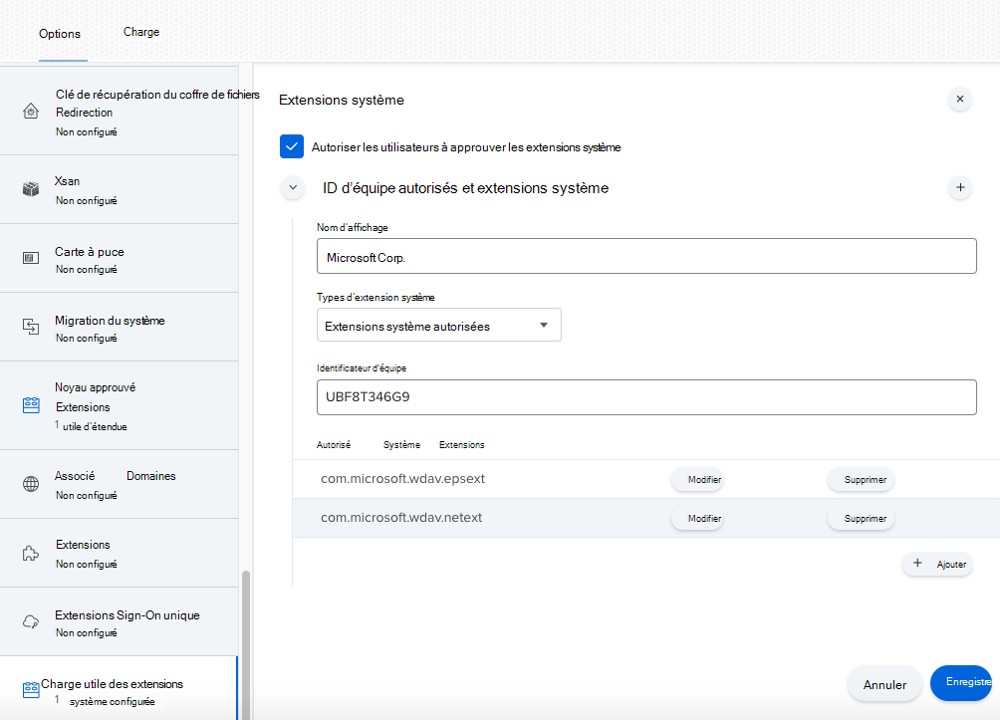
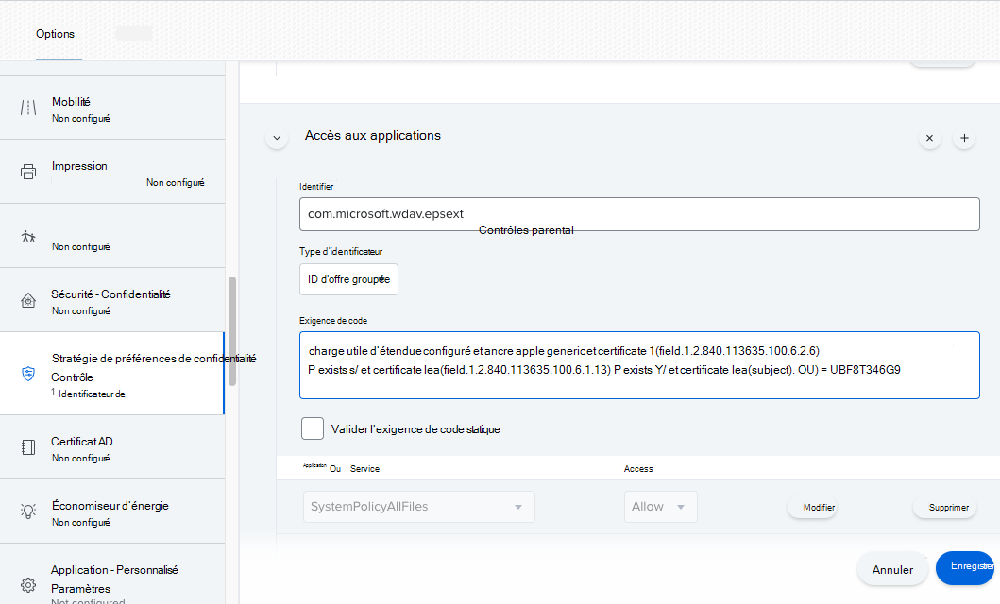
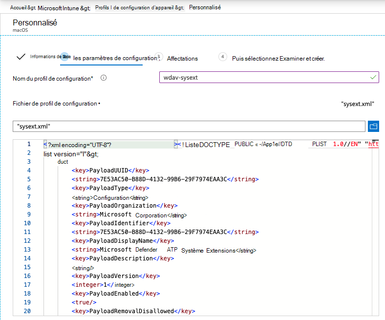

# <a name="new-configuration-profiles-for-macos-catalina-and-newer-versions-of-macos"></a><span data-ttu-id="3ecb1-104">Nouveaux profils de configuration pour macOS Et les versions plus récentes de macOS</span><span class="sxs-lookup"><span data-stu-id="3ecb1-104">New configuration profiles for macOS Catalina and newer versions of macOS</span></span>

[!INCLUDE [Microsoft 365 Defender rebranding](../../includes/microsoft-defender.md)]

<span data-ttu-id="3ecb1-105">**S’applique à :**</span><span class="sxs-lookup"><span data-stu-id="3ecb1-105">**Applies to:**</span></span>
- [<span data-ttu-id="3ecb1-106">Microsoft Defender pour point de terminaison</span><span class="sxs-lookup"><span data-stu-id="3ecb1-106">Microsoft Defender for Endpoint</span></span>](https://go.microsoft.com/fwlink/p/?linkid=2154037)
- [<span data-ttu-id="3ecb1-107">Microsoft 365 Defender</span><span class="sxs-lookup"><span data-stu-id="3ecb1-107">Microsoft 365 Defender</span></span>](https://go.microsoft.com/fwlink/?linkid=2118804)

> <span data-ttu-id="3ecb1-108">Vous souhaitez découvrir Microsoft Defender pour le point de terminaison ?</span><span class="sxs-lookup"><span data-stu-id="3ecb1-108">Want to experience Microsoft Defender for Endpoint?</span></span> [<span data-ttu-id="3ecb1-109">Inscrivez-vous à un essai gratuit.</span><span class="sxs-lookup"><span data-stu-id="3ecb1-109">Sign up for a free trial.</span></span>](https://www.microsoft.com/microsoft-365/windows/microsoft-defender-atp?ocid=docs-wdatp-exposedapis-abovefoldlink)

<span data-ttu-id="3ecb1-110">En adéquation avec l'évolution de macOS, nous préparons une mise à jour Microsoft Defender pour Endpoint sur macOS qui tire parti des extensions système au lieu des extensions de noyau.</span><span class="sxs-lookup"><span data-stu-id="3ecb1-110">In alignment with macOS evolution, we are preparing a Microsoft Defender for Endpoint on macOS update that leverages system extensions instead of kernel extensions.</span></span> <span data-ttu-id="3ecb1-111">Cette mise à jour s'applique uniquement à macOS Fonctionnalité (10.15.4) et aux versions plus récentes de macOS.</span><span class="sxs-lookup"><span data-stu-id="3ecb1-111">This update will only be applicable to macOS Catalina (10.15.4) and newer versions of macOS.</span></span>

<span data-ttu-id="3ecb1-112">Si vous avez déployé Microsoft Defender pour Endpoint sur macOS dans un environnement géré (via JAMF, Intune ou une autre solution MDM), vous devez déployer de nouveaux profils de configuration.</span><span class="sxs-lookup"><span data-stu-id="3ecb1-112">If you have deployed Microsoft Defender for Endpoint on macOS in a managed environment (through JAMF, Intune, or another MDM solution), you must deploy new configuration profiles.</span></span> <span data-ttu-id="3ecb1-113">Si vous n'exécutez pas ces étapes, les utilisateurs auront accès à des invites d'approbation pour exécuter ces nouveaux composants.</span><span class="sxs-lookup"><span data-stu-id="3ecb1-113">Failure to do these steps will result in users getting approval prompts to run these new components.</span></span>

## <a name="jamf"></a><span data-ttu-id="3ecb1-114">JAMF</span><span class="sxs-lookup"><span data-stu-id="3ecb1-114">JAMF</span></span>

### <a name="system-extensions-policy"></a><span data-ttu-id="3ecb1-115">Stratégie d'extensions système</span><span class="sxs-lookup"><span data-stu-id="3ecb1-115">System Extensions Policy</span></span>

<span data-ttu-id="3ecb1-116">Pour approuver les extensions système, créez la charge utile suivante :</span><span class="sxs-lookup"><span data-stu-id="3ecb1-116">To approve the system extensions, create the following payload:</span></span>

1. <span data-ttu-id="3ecb1-117">In **Computers > Configuration Profiles** select Options > System **Extensions**.</span><span class="sxs-lookup"><span data-stu-id="3ecb1-117">In **Computers > Configuration Profiles** select **Options > System Extensions**.</span></span>
2. <span data-ttu-id="3ecb1-118">Sélectionnez **Extensions système autorisées dans** la liste de listes listes des **types** d'extensions système.</span><span class="sxs-lookup"><span data-stu-id="3ecb1-118">Select **Allowed System Extensions** from the **System Extension Types** drop-down list.</span></span>
3. <span data-ttu-id="3ecb1-119">Utilisez **UBF8T346G9** pour l'ID d'équipe.</span><span class="sxs-lookup"><span data-stu-id="3ecb1-119">Use **UBF8T346G9** for Team Id.</span></span>
4. <span data-ttu-id="3ecb1-120">Ajoutez les identificateurs d'ensemble suivants à la **liste Extensions système autorisées** :</span><span class="sxs-lookup"><span data-stu-id="3ecb1-120">Add the following bundle identifiers to the **Allowed System Extensions** list:</span></span>

    - <span data-ttu-id="3ecb1-121">**com.microsoft.wdav.epsext**</span><span class="sxs-lookup"><span data-stu-id="3ecb1-121">**com.microsoft.wdav.epsext**</span></span>
    - <span data-ttu-id="3ecb1-122">**com.microsoft.wdav.netext**</span><span class="sxs-lookup"><span data-stu-id="3ecb1-122">**com.microsoft.wdav.netext**</span></span>

    

### <a name="privacy-preferences-policy-control"></a><span data-ttu-id="3ecb1-124">Contrôle de stratégie des préférences de confidentialité</span><span class="sxs-lookup"><span data-stu-id="3ecb1-124">Privacy Preferences Policy Control</span></span>

<span data-ttu-id="3ecb1-125">Ajoutez la charge utile JAMF suivante pour accorder un accès disque total à l'extension de sécurité du point de terminaison Microsoft Defender pour endpoint.</span><span class="sxs-lookup"><span data-stu-id="3ecb1-125">Add the following JAMF payload to grant Full Disk Access to the Microsoft Defender for Endpoint Endpoint Security Extension.</span></span> <span data-ttu-id="3ecb1-126">Cette stratégie est une condition préalable pour l'exécution de l'extension sur votre appareil.</span><span class="sxs-lookup"><span data-stu-id="3ecb1-126">This policy is a pre-requisite for running the extension on your device.</span></span>

1. <span data-ttu-id="3ecb1-127">Select **Options**  >  **Privacy Preferences Policy Control**.</span><span class="sxs-lookup"><span data-stu-id="3ecb1-127">Select **Options** > **Privacy Preferences Policy Control**.</span></span>
2. <span data-ttu-id="3ecb1-128">À `com.microsoft.wdav.epsext` utiliser comme **identificateur** et `Bundle ID` comme type **d'offre groupée.**</span><span class="sxs-lookup"><span data-stu-id="3ecb1-128">Use `com.microsoft.wdav.epsext` as the **Identifier** and `Bundle ID` as **Bundle type**.</span></span>
3. <span data-ttu-id="3ecb1-129">Définir l'exigence de code sur `identifier "com.microsoft.wdav.epsext" and anchor apple generic and certificate 1[field.1.2.840.113635.100.6.2.6] /* exists */ and certificate leaf[field.1.2.840.113635.100.6.1.13] /* exists */ and certificate leaf[subject.OU] = UBF8T346G9`</span><span class="sxs-lookup"><span data-stu-id="3ecb1-129">Set Code Requirement to `identifier "com.microsoft.wdav.epsext" and anchor apple generic and certificate 1[field.1.2.840.113635.100.6.2.6] /* exists */ and certificate leaf[field.1.2.840.113635.100.6.1.13] /* exists */ and certificate leaf[subject.OU] = UBF8T346G9`</span></span>
4. <span data-ttu-id="3ecb1-130">Définissez **l'application ou le service** **sur SystemPolicyAllFiles et** l'accès à **Autoriser**.</span><span class="sxs-lookup"><span data-stu-id="3ecb1-130">Set **App or service** to **SystemPolicyAllFiles** and access to **Allow**.</span></span>

    

### <a name="network-extension-policy"></a><span data-ttu-id="3ecb1-132">Stratégie d'extension réseau</span><span class="sxs-lookup"><span data-stu-id="3ecb1-132">Network Extension Policy</span></span>

<span data-ttu-id="3ecb1-133">Dans le cadre des fonctionnalités de détection et de réponse des points de terminaison, Microsoft Defender for Endpoint sur macOS inspecte le trafic de socket et signale ces informations au portail centre de sécurité Microsoft Defender.</span><span class="sxs-lookup"><span data-stu-id="3ecb1-133">As part of the Endpoint Detection and Response capabilities, Microsoft Defender for Endpoint on macOS inspects socket traffic and reports this information to the Microsoft Defender Security Center portal.</span></span> <span data-ttu-id="3ecb1-134">La stratégie suivante permet à l'extension réseau d'effectuer cette fonctionnalité.</span><span class="sxs-lookup"><span data-stu-id="3ecb1-134">The following policy allows the network extension to perform this functionality.</span></span>

>[!NOTE]
><span data-ttu-id="3ecb1-135">JAMF ne prend pas en charge les stratégies de filtrage de contenu, ce qui est une condition préalable à l'activation des extensions réseau installées par Microsoft Defender pour Endpoint sur macOS sur l'appareil.</span><span class="sxs-lookup"><span data-stu-id="3ecb1-135">JAMF doesn’t have built-in support for content filtering policies, which are a pre-requisite for enabling the network extensions that Microsoft Defender for Endpoint on macOS installs on the device.</span></span> <span data-ttu-id="3ecb1-136">De plus, JAMF modifie parfois le contenu des stratégies déployées.</span><span class="sxs-lookup"><span data-stu-id="3ecb1-136">Furthermore, JAMF sometimes changes the content of the policies being deployed.</span></span>
><span data-ttu-id="3ecb1-137">En tant que tel, les étapes suivantes fournissent une solution de contournement qui implique la signature du profil de configuration.</span><span class="sxs-lookup"><span data-stu-id="3ecb1-137">As such, the following steps provide a workaround that involve signing the configuration profile.</span></span>

1. <span data-ttu-id="3ecb1-138">Enregistrez le contenu suivant sur votre appareil à `com.microsoft.network-extension.mobileconfig` l'aide d'un éditeur de texte :</span><span class="sxs-lookup"><span data-stu-id="3ecb1-138">Save the following content to your device as `com.microsoft.network-extension.mobileconfig` using a text editor:</span></span>

    ```xml
    <?xml version="1.0" encoding="UTF-8"?><!DOCTYPE plist PUBLIC "-//Apple//DTD PLIST 1.0//EN" "http://www.apple.com/DTDs/PropertyList-1.0.dtd">
    <plist version="1">
        <dict>
            <key>PayloadUUID</key>
            <string>DA2CC794-488B-4AFF-89F7-6686A7E7B8AB</string>
            <key>PayloadType</key>
            <string>Configuration</string>
            <key>PayloadOrganization</key>
            <string>Microsoft Corporation</string>
            <key>PayloadIdentifier</key>
            <string>DA2CC794-488B-4AFF-89F7-6686A7E7B8AB</string>
            <key>PayloadDisplayName</key>
            <string>Microsoft Defender ATP Network Extension</string>
            <key>PayloadDescription</key>
            <string/>
            <key>PayloadVersion</key>
            <integer>1</integer>
            <key>PayloadEnabled</key>
            <true/>
            <key>PayloadRemovalDisallowed</key>
            <true/>
            <key>PayloadScope</key>
            <string>System</string>
            <key>PayloadContent</key>
            <array>
                <dict>
                    <key>PayloadUUID</key>
                    <string>2BA070D9-2233-4827-AFC1-1F44C8C8E527</string>
                    <key>PayloadType</key>
                    <string>com.apple.webcontent-filter</string>
                    <key>PayloadOrganization</key>
                    <string>Microsoft Corporation</string>
                    <key>PayloadIdentifier</key>
                    <string>CEBF7A71-D9A1-48BD-8CCF-BD9D18EC155A</string>
                    <key>PayloadDisplayName</key>
                    <string>Approved Network Extension</string>
                    <key>PayloadDescription</key>
                    <string/>
                    <key>PayloadVersion</key>
                    <integer>1</integer>
                    <key>PayloadEnabled</key>
                    <true/>
                    <key>FilterType</key>
                    <string>Plugin</string>
                    <key>UserDefinedName</key>
                    <string>Microsoft Defender ATP Network Extension</string>
                    <key>PluginBundleID</key>
                    <string>com.microsoft.wdav</string>
                    <key>FilterSockets</key>
                    <true/>
                    <key>FilterDataProviderBundleIdentifier</key>
                    <string>com.microsoft.wdav.netext</string>
                    <key>FilterDataProviderDesignatedRequirement</key>
                    <string>identifier "com.microsoft.wdav.netext" and anchor apple generic and certificate 1[field.1.2.840.113635.100.6.2.6] /* exists */ and certificate leaf[field.1.2.840.113635.100.6.1.13] /* exists */ and certificate leaf[subject.OU] = UBF8T346G9</string>
                </dict>
            </array>
        </dict>
    </plist>
    ```

2. <span data-ttu-id="3ecb1-139">Vérifiez que le fichier ci-dessus a été copié correctement en exécutant `plutil` l'utilitaire dans le Terminal :</span><span class="sxs-lookup"><span data-stu-id="3ecb1-139">Verify that the above file was copied correctly by running the `plutil` utility in the Terminal:</span></span>

    ```bash
    $ plutil -lint <PathToFile>/com.microsoft.network-extension.mobileconfig
    ```

    <span data-ttu-id="3ecb1-140">Par exemple, si le fichier a été stocké dans documents :</span><span class="sxs-lookup"><span data-stu-id="3ecb1-140">For example, if the file was stored in Documents:</span></span>

    ```bash
    $ plutil -lint ~/Documents/com.microsoft.network-extension.mobileconfig
    ```
    
    <span data-ttu-id="3ecb1-141">Vérifiez que la commande est en `OK` sortie.</span><span class="sxs-lookup"><span data-stu-id="3ecb1-141">Verify that the command outputs `OK`.</span></span>
        
    ```bash
    <PathToFile>/com.microsoft.network-extension.mobileconfig: OK
    ```
    
3. <span data-ttu-id="3ecb1-142">Suivez les instructions de cette [page](https://www.jamf.com/jamf-nation/articles/649/creating-a-signing-certificate-using-jamf-pro-s-built-in-certificate-authority) pour créer un certificat de signature à l'aide de l'autorité de certification intégrée de JAMF.</span><span class="sxs-lookup"><span data-stu-id="3ecb1-142">Follow the instructions on [this page](https://www.jamf.com/jamf-nation/articles/649/creating-a-signing-certificate-using-jamf-pro-s-built-in-certificate-authority) to create a signing certificate using JAMF’s built-in certificate authority.</span></span>

4. <span data-ttu-id="3ecb1-143">Une fois le certificat créé et installé sur votre appareil, exécutez la commande suivante à partir du Terminal pour signer le fichier :</span><span class="sxs-lookup"><span data-stu-id="3ecb1-143">After the certificate is created and installed to your device, run the following command from the Terminal to sign the file:</span></span>

    ```bash
    $ security cms -S -N "<CertificateName>" -i <PathToFile>/com.microsoft.network-extension.mobileconfig -o <PathToSignedFile>/com.microsoft.network-extension.signed.mobileconfig
    ```
    
    <span data-ttu-id="3ecb1-144">Par exemple, si le nom du certificat est **SigningCertificate** et que le fichier signé va être stocké dans documents :</span><span class="sxs-lookup"><span data-stu-id="3ecb1-144">For example, if the certificate name is **SigningCertificate** and the signed file is going to be stored in Documents:</span></span>
    
    ```bash
    $ security cms -S -N "SigningCertificate" -i ~/Documents/com.microsoft.network-extension.mobileconfig -o ~/Documents/com.microsoft.network-extension.signed.mobileconfig
    ```
    
5. <span data-ttu-id="3ecb1-145">À partir du portail JAMF, accédez à **Profils de configuration** et cliquez sur le **bouton** Télécharger.</span><span class="sxs-lookup"><span data-stu-id="3ecb1-145">From the JAMF portal, navigate to **Configuration Profiles** and click the **Upload** button.</span></span> <span data-ttu-id="3ecb1-146">Sélectionnez `com.microsoft.network-extension.signed.mobileconfig` le fichier lorsque vous y avez été invité.</span><span class="sxs-lookup"><span data-stu-id="3ecb1-146">Select `com.microsoft.network-extension.signed.mobileconfig` when prompted for the file.</span></span>

## <a name="intune"></a><span data-ttu-id="3ecb1-147">Intune</span><span class="sxs-lookup"><span data-stu-id="3ecb1-147">Intune</span></span>

### <a name="system-extensions-policy"></a><span data-ttu-id="3ecb1-148">Stratégie d'extensions système</span><span class="sxs-lookup"><span data-stu-id="3ecb1-148">System Extensions Policy</span></span>

<span data-ttu-id="3ecb1-149">Pour approuver les extensions système :</span><span class="sxs-lookup"><span data-stu-id="3ecb1-149">To approve the system extensions:</span></span>

1. <span data-ttu-id="3ecb1-150">Dans Intune, ouvrez **Gérer la** configuration  >  **de l'appareil.**</span><span class="sxs-lookup"><span data-stu-id="3ecb1-150">In Intune, open **Manage** > **Device configuration**.</span></span> <span data-ttu-id="3ecb1-151">Sélectionnez **Gérer**  >  **les profils**  >  **créer un profil.**</span><span class="sxs-lookup"><span data-stu-id="3ecb1-151">Select **Manage** > **Profiles** > **Create Profile**.</span></span>
2. <span data-ttu-id="3ecb1-152">Choisissez un nom pour le profil.</span><span class="sxs-lookup"><span data-stu-id="3ecb1-152">Choose a name for the profile.</span></span> <span data-ttu-id="3ecb1-153">Change **Platform=macOS** to **Profile type=Extensions**.</span><span class="sxs-lookup"><span data-stu-id="3ecb1-153">Change **Platform=macOS** to **Profile type=Extensions**.</span></span> <span data-ttu-id="3ecb1-154">Sélectionnez **Créer**.</span><span class="sxs-lookup"><span data-stu-id="3ecb1-154">Select **Create**.</span></span>
3. <span data-ttu-id="3ecb1-155">Dans `Basics` l'onglet, nommez ce nouveau profil.</span><span class="sxs-lookup"><span data-stu-id="3ecb1-155">In the `Basics` tab, give a name to this new profile.</span></span>
4. <span data-ttu-id="3ecb1-156">Dans `Configuration settings` l'onglet, ajoutez les entrées suivantes dans la `Allowed system extensions` section :</span><span class="sxs-lookup"><span data-stu-id="3ecb1-156">In the `Configuration settings` tab, add the following entries in the `Allowed system extensions` section:</span></span>

    <span data-ttu-id="3ecb1-157">Identificateur d'ensemble</span><span class="sxs-lookup"><span data-stu-id="3ecb1-157">Bundle identifier</span></span>         | <span data-ttu-id="3ecb1-158">Identificateur d'équipe</span><span class="sxs-lookup"><span data-stu-id="3ecb1-158">Team identifier</span></span>
    --------------------------|----------------
    <span data-ttu-id="3ecb1-159">com.microsoft.wdav.epsext</span><span class="sxs-lookup"><span data-stu-id="3ecb1-159">com.microsoft.wdav.epsext</span></span> | <span data-ttu-id="3ecb1-160">UBF8T346G9</span><span class="sxs-lookup"><span data-stu-id="3ecb1-160">UBF8T346G9</span></span>
    <span data-ttu-id="3ecb1-161">com.microsoft.wdav.netext</span><span class="sxs-lookup"><span data-stu-id="3ecb1-161">com.microsoft.wdav.netext</span></span> | <span data-ttu-id="3ecb1-162">UBF8T346G9</span><span class="sxs-lookup"><span data-stu-id="3ecb1-162">UBF8T346G9</span></span>

    

5. <span data-ttu-id="3ecb1-164">Dans `Assignments` l'onglet, affectez ce profil à tous les **utilisateurs & tous les appareils.**</span><span class="sxs-lookup"><span data-stu-id="3ecb1-164">In the `Assignments` tab, assign this profile to **All Users & All devices**.</span></span>
6. <span data-ttu-id="3ecb1-165">Examinez et créez ce profil de configuration.</span><span class="sxs-lookup"><span data-stu-id="3ecb1-165">Review and create this configuration profile.</span></span>

### <a name="create-and-deploy-the-custom-configuration-profile"></a><span data-ttu-id="3ecb1-166">Créer et déployer le profil de configuration personnalisé</span><span class="sxs-lookup"><span data-stu-id="3ecb1-166">Create and deploy the Custom Configuration Profile</span></span>

<span data-ttu-id="3ecb1-167">Le profil de configuration suivant active l'extension réseau et accorde un accès disque total à l'extension système de sécurité des points de terminaison.</span><span class="sxs-lookup"><span data-stu-id="3ecb1-167">The following configuration profile enables the network extension and grants Full Disk Access to the Endpoint Security system extension.</span></span> 

<span data-ttu-id="3ecb1-168">Enregistrez le contenu suivant dans un fichier nommé **sysext.xml**:</span><span class="sxs-lookup"><span data-stu-id="3ecb1-168">Save the following content to a file named **sysext.xml**:</span></span>

```xml
<?xml version="1.0" encoding="UTF-8"?><!DOCTYPE plist PUBLIC "-//Apple//DTD PLIST 1.0//EN" "http://www.apple.com/DTDs/PropertyList-1.0.dtd">
<plist version="1">
    <dict>
        <key>PayloadUUID</key>
        <string>7E53AC50-B88D-4132-99B6-29F7974EAA3C</string>
        <key>PayloadType</key>
        <string>Configuration</string>
        <key>PayloadOrganization</key>
        <string>Microsoft Corporation</string>
        <key>PayloadIdentifier</key>
        <string>7E53AC50-B88D-4132-99B6-29F7974EAA3C</string>
        <key>PayloadDisplayName</key>
        <string>Microsoft Defender ATP System Extensions</string>
        <key>PayloadDescription</key>
        <string/>
        <key>PayloadVersion</key>
        <integer>1</integer>
        <key>PayloadEnabled</key>
        <true/>
        <key>PayloadRemovalDisallowed</key>
        <true/>
        <key>PayloadScope</key>
        <string>System</string>
        <key>PayloadContent</key>
        <array>
            <dict>
                <key>PayloadUUID</key>
                <string>2BA070D9-2233-4827-AFC1-1F44C8C8E527</string>
                <key>PayloadType</key>
                <string>com.apple.webcontent-filter</string>
                <key>PayloadOrganization</key>
                <string>Microsoft Corporation</string>
                <key>PayloadIdentifier</key>
                <string>CEBF7A71-D9A1-48BD-8CCF-BD9D18EC155A</string>
                <key>PayloadDisplayName</key>
                <string>Approved Network Extension</string>
                <key>PayloadDescription</key>
                <string/>
                <key>PayloadVersion</key>
                <integer>1</integer>
                <key>PayloadEnabled</key>
                <true/>
                <key>FilterType</key>
                <string>Plugin</string>
                <key>UserDefinedName</key>
                <string>Microsoft Defender ATP Network Extension</string>
                <key>PluginBundleID</key>
                <string>com.microsoft.wdav</string>
                <key>FilterSockets</key>
                <true/>
                <key>FilterDataProviderBundleIdentifier</key>
                <string>com.microsoft.wdav.netext</string>
                <key>FilterDataProviderDesignatedRequirement</key>
                <string>identifier &quot;com.microsoft.wdav.netext&quot; and anchor apple generic and certificate 1[field.1.2.840.113635.100.6.2.6] /* exists */ and certificate leaf[field.1.2.840.113635.100.6.1.13] /* exists */ and certificate leaf[subject.OU] = UBF8T346G9</string>
            </dict>
            <dict>
                <key>PayloadUUID</key>
                <string>56105E89-C7C8-4A95-AEE6-E11B8BEA0366</string>
                <key>PayloadType</key>
                <string>com.apple.TCC.configuration-profile-policy</string>
                <key>PayloadOrganization</key>
                <string>Microsoft Corporation</string>
                <key>PayloadIdentifier</key>
                <string>56105E89-C7C8-4A95-AEE6-E11B8BEA0366</string>
                <key>PayloadDisplayName</key>
                <string>Privacy Preferences Policy Control</string>
                <key>PayloadDescription</key>
                <string/>
                <key>PayloadVersion</key>
                <integer>1</integer>
                <key>PayloadEnabled</key>
                <true/>
                <key>Services</key>
                <dict>
                    <key>SystemPolicyAllFiles</key>
                    <array>
                        <dict>
                            <key>Identifier</key>
                            <string>com.microsoft.wdav.epsext</string>
                            <key>CodeRequirement</key>
                            <string>identifier "com.microsoft.wdav.epsext" and anchor apple generic and certificate 1[field.1.2.840.113635.100.6.2.6] /* exists */ and certificate leaf[field.1.2.840.113635.100.6.1.13] /* exists */ and certificate leaf[subject.OU] = UBF8T346G9</string>
                            <key>IdentifierType</key>
                            <string>bundleID</string>
                            <key>StaticCode</key>
                            <integer>0</integer>
                            <key>Allowed</key>
                            <integer>1</integer>
                        </dict>
                    </array>
                </dict>
            </dict>
        </array>
    </dict>
</plist>
```

<span data-ttu-id="3ecb1-169">Vérifiez que le fichier ci-dessus a été correctement copié.</span><span class="sxs-lookup"><span data-stu-id="3ecb1-169">Verify that the above file was copied correctly.</span></span> <span data-ttu-id="3ecb1-170">À partir du Terminal, exécutez la commande suivante et vérifiez qu'elle est sortie `OK` :</span><span class="sxs-lookup"><span data-stu-id="3ecb1-170">From the Terminal, run the following command and verify that it outputs `OK`:</span></span>

```bash
$ plutil -lint sysext.xml
sysext.xml: OK
```

<span data-ttu-id="3ecb1-171">Pour déployer ce profil de configuration personnalisé :</span><span class="sxs-lookup"><span data-stu-id="3ecb1-171">To deploy this custom configuration profile:</span></span>

1.  <span data-ttu-id="3ecb1-172">Dans Intune, ouvrez **Gérer la** configuration  >  **de l'appareil.**</span><span class="sxs-lookup"><span data-stu-id="3ecb1-172">In Intune, open **Manage** > **Device configuration**.</span></span> <span data-ttu-id="3ecb1-173">Sélectionnez **Gérer**  >  **les profils**  >  **Créer un profil.**</span><span class="sxs-lookup"><span data-stu-id="3ecb1-173">Select **Manage** > **Profiles** > **Create profile**.</span></span>
2. <span data-ttu-id="3ecb1-174">Choisissez un nom pour le profil.</span><span class="sxs-lookup"><span data-stu-id="3ecb1-174">Choose a name for the profile.</span></span> <span data-ttu-id="3ecb1-175">Change **Platform=macOS** and **Profile type=Custom**.</span><span class="sxs-lookup"><span data-stu-id="3ecb1-175">Change **Platform=macOS** and **Profile type=Custom**.</span></span> <span data-ttu-id="3ecb1-176">Sélectionnez **Configurer**.</span><span class="sxs-lookup"><span data-stu-id="3ecb1-176">Select **Configure**.</span></span>
3.  <span data-ttu-id="3ecb1-177">Ouvrez le profil de configuration et **téléchargezsysext.xml**.</span><span class="sxs-lookup"><span data-stu-id="3ecb1-177">Open the configuration profile and upload **sysext.xml**.</span></span> <span data-ttu-id="3ecb1-178">Ce fichier a été créé à l'étape précédente.</span><span class="sxs-lookup"><span data-stu-id="3ecb1-178">This file was created in the preceding step.</span></span>
4.  <span data-ttu-id="3ecb1-179">Sélectionnez **OK**.</span><span class="sxs-lookup"><span data-stu-id="3ecb1-179">Select **OK**.</span></span>

    

5. <span data-ttu-id="3ecb1-181">Dans `Assignments` l'onglet, affectez ce profil à tous les **utilisateurs & tous les appareils.**</span><span class="sxs-lookup"><span data-stu-id="3ecb1-181">In the `Assignments` tab, assign this profile to **All Users & All devices**.</span></span>
6. <span data-ttu-id="3ecb1-182">Examinez et créez ce profil de configuration.</span><span class="sxs-lookup"><span data-stu-id="3ecb1-182">Review and create this configuration profile.</span></span>
