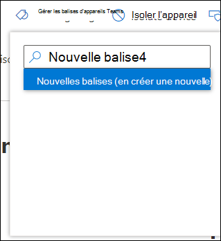
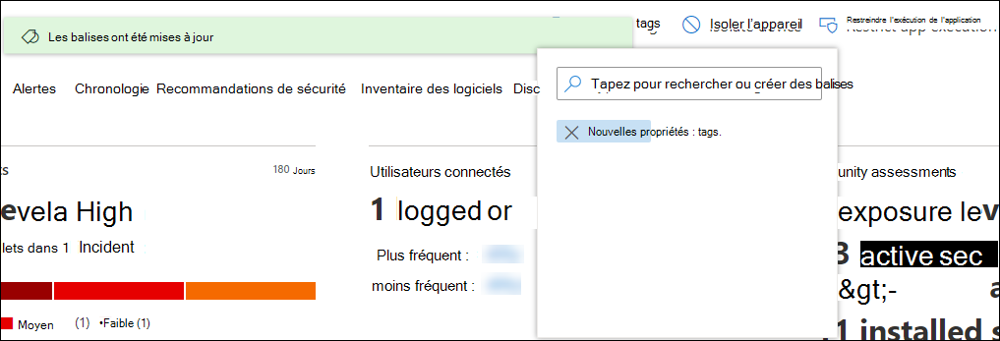

# Créer et gérer des balises d’appareilsCreate and manage device tags

[!INCLUDE [Microsoft 365 Defender rebranding](../../includes/microsoft-defender.md)]

**S’applique à :****Applies to:**
- [Microsoft Defender pour point de terminaisonMicrosoft Defender for Endpoint](https://go.microsoft.com/fwlink/p/?linkid=2154037)
- [Microsoft 365 DefenderMicrosoft 365 Defender](https://go.microsoft.com/fwlink/?linkid=2118804)

> Vous souhaitez découvrir Microsoft Defender pour le point de terminaison ?Want to experience Microsoft Defender for Endpoint? [Inscrivez-vous à un essai gratuit.Sign up for a free trial.](https://www.microsoft.com/microsoft-365/windows/microsoft-defender-atp?ocid=docs-wdatp-exposedapis-abovefoldlink)

Ajoutez des balises sur les appareils pour créer une affiliation de groupe logique.Add tags on devices to create a logical group affiliation. Les balises d’appareil prennent en charge le mappage approprié du réseau, ce qui vous permet d’attacher différentes balises pour capturer le contexte et d’activer la création de liste dynamique dans le cadre d’un incident.Device tags support proper mapping of the network, enabling you to attach different tags to capture context and to enable dynamic list creation as part of an incident. Les balises peuvent être  utilisées comme filtre dans l’affichage Liste des appareils ou pour grouper des appareils.Tags can be used as a filter in **Devices list** view, or to group devices. Pour plus d’informations sur le regroupement d’appareils, voir [Créer et gérer des groupes d’appareils.](machine-groups.md)For more information on device grouping, see [Create and manage device groups](machine-groups.md).

Vous pouvez ajouter des balises sur les appareils en utilisant les méthodes suivantes :You can add tags on devices using the following ways:

- Utilisation du portailUsing the portal
- Définition d’une valeur de clé de RegistreSetting a registry key value

> [!NOTE]
> Il peut y avoir une certaine latence entre le moment où une balise est ajoutée à un appareil et sa disponibilité dans la liste des appareils et la page de l’appareil.There may be some latency between the time a tag is added to a device and its availability in the devices list and device page.  

Pour ajouter des balises d’appareil à l’aide de l’API, consultez [Ajouter ou supprimer des balises d’appareil API](add-or-remove-machine-tags.md).To add device tags using API, see [Add or remove device tags API](add-or-remove-machine-tags.md).

## Ajouter et gérer des balises d’appareil à l’aide du portailAdd and manage device tags using the portal

1. Sélectionnez l’appareil sur lequel vous souhaitez gérer les balises.Select the device that you want to manage tags on. Vous pouvez sélectionner ou rechercher un appareil à partir de l’une des vues suivantes :You can select or search for a device from any of the following views:

   - **Tableau de bord Opérations de sécurité** : sélectionnez le nom de l’appareil dans la section Principaux appareils avec alertes actives.**Security operations dashboard** - Select the device name from the Top devices with active alerts section.
   - **File d’attente des alertes** : sélectionnez le nom de l’appareil en regard de l’icône de l’appareil dans la file d’attente des alertes.**Alerts queue** - Select the device name beside the device icon from the alerts queue.
   - **Liste des appareils** : sélectionnez le nom de l’appareil dans la liste des appareils.**Devices list** - Select the device name from the list of devices.
   - **Zone de recherche** : sélectionnez Appareil dans le menu déroulant et entrez le nom de l’appareil.**Search box** - Select Device from the drop-down menu and enter the device name.

     Vous pouvez également accéder à la page d’alerte via les Affichages de fichier et d’adresse IP.You can also get to the alert page through the file and IP views.

2. Sélectionnez **Gérer les balises** dans la ligne des actions de réponse.Select **Manage Tags** from the row of Response actions.

    

3. Tapez pour rechercher ou créer des balisesType to find or create tags

    

Les balises sont ajoutées à l’affichage de l’appareil et sont également reflétées dans l’affichage Liste **des** appareils.Tags are added to the device view and will also be reflected on the **Devices list** view. Vous pouvez ensuite utiliser le filtre **Balises** pour voir la liste des appareils appropriés.You can then use the **Tags** filter to see the relevant list of devices.

>[!NOTE]
> Le filtrage peut ne pas fonctionner sur les noms de balises qui contiennent des parenthèses.Filtering might not work on tag names that contain parenthesis. 
> Lorsque vous créez une balise, une liste de balises existantes s’affiche.When you create a new tag, a list of existing tags are displayed. La liste affiche uniquement les balises créées via le portail.The list only shows tags created through the portal. Les balises existantes créées à partir d’appareils clients ne seront pas affichées.Existing tags created from client devices will not be displayed.

Vous pouvez également supprimer des balises de cet affichage.You can also delete tags from this view.

## Ajouter des balises d’appareil en définition d’une valeur de clé de RegistreAdd device tags by setting a registry key value

>[!NOTE]
> Applicable uniquement sur les appareils suivants :Applicable only on the following devices:
>- Windows 10, version 1709 ou ultérieureWindows 10, version 1709 or later
>- Windows Serveur, version 1803 ou ultérieureWindows Server, version 1803 or later
>- Windows Server 2016Windows Server 2016
>- Windows Server 2012 R2Windows Server 2012 R2
>- Windows Server 2008 R2 SP1Windows Server 2008 R2 SP1
>- Windows 8.1Windows 8.1
>- Windows 7 SP1Windows 7 SP1

> [!NOTE] 
> Le nombre maximal de caractères qui peuvent être définies dans une balise est de 200.The maximum number of characters that can be set in a tag is 200.

Les appareils avec des balises similaires peuvent être pratiques lorsque vous devez appliquer une action contextuelle sur une liste spécifique d’appareils.Devices with similar tags can be handy when you need to apply contextual action on a specific list of devices.

Utilisez l’entrée de clé de Registre suivante pour ajouter une balise sur un appareil :Use the following registry key entry to add a tag on a device:

- Clé de Registre : `HKEY_LOCAL_MACHINE\SOFTWARE\Policies\Microsoft\Windows Advanced Threat Protection\DeviceTagging\`Registry key: `HKEY_LOCAL_MACHINE\SOFTWARE\Policies\Microsoft\Windows Advanced Threat Protection\DeviceTagging\`
- Valeur de clé de Registre (REG_SZ) : `Group`Registry key value (REG_SZ): `Group`
- Données de clé de Registre : `Name of the tag you want to set`Registry key data: `Name of the tag you want to set`

>[!NOTE]
>La balise d’appareil fait partie du rapport d’informations sur l’appareil qui est généré une fois par jour.The device tag is part of the device information report that's generated once a day. Vous pouvez également choisir de redémarrer le point de terminaison qui transférerait un nouveau rapport d’informations sur l’appareil.As an alternative, you may choose to restart the endpoint that would transfer a new device information report.
> 
> Si vous devez supprimer une balise ajoutée à l’aide de la clé de Registre ci-dessus, supprimez le contenu des données de clé de Registre au lieu de supprimer la clé « Group ».If you need to remove a tag that was added using the above Registry key, clear the contents of the Registry key data instead of removing the 'Group' key.
