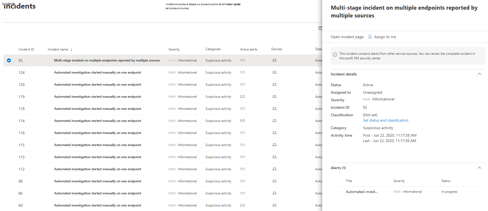
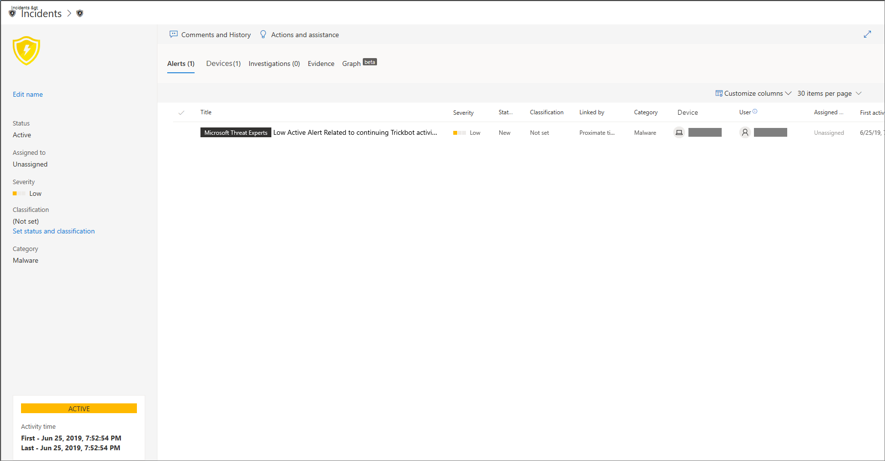

# Gérer Microsoft Defender pour les incidents de point de terminaisonManage Microsoft Defender for Endpoint incidents

[!INCLUDE [Microsoft 365 Defender rebranding](../../includes/microsoft-defender.md)]

**S’applique à :****Applies to:**
- [Microsoft Defender pour point de terminaisonMicrosoft Defender for Endpoint](https://go.microsoft.com/fwlink/p/?linkid=2154037)
- [Microsoft 365 DefenderMicrosoft 365 Defender](https://go.microsoft.com/fwlink/?linkid=2118804)

> Vous souhaitez découvrir Microsoft Defender pour le point de terminaison ?Want to experience Microsoft Defender for Endpoint? [Inscrivez-vous à un essai gratuit.Sign up for a free trial.](https://www.microsoft.com/microsoft-365/windows/microsoft-defender-atp?ocid=docs-wdatp-exposedapis-abovefoldlink)

La gestion des incidents est une partie importante de chaque opération de cybersécurité.Managing incidents is an important part of every cybersecurity operation. Vous pouvez gérer les incidents en sélectionnant un incident dans la file **d’attente Incidents** ou dans le volet de **gestion Incidents.**You can manage incidents by selecting an incident from the **Incidents queue** or the **Incidents management pane**. 

La sélection d’un incident dans la  file **d’attente Incidents** ouvre le volet Gestion des incidents dans lequel vous pouvez ouvrir la page incident pour plus d’informations.Selecting an incident from the **Incidents queue** brings up the **Incident management pane** where you can open the incident page for details.

Vous pouvez affecter des incidents à vous-même, modifier l’état et la classification, les renommer ou commenter pour suivre leur progression.You can assign incidents to yourself, change the status and classification, rename, or comment on them to keep track of their progress.

> [!TIP]
> Pour une visibilité supplémentaire en un coup d’œil, les noms des incidents sont générés automatiquement en fonction des attributs d’alerte tels que le nombre de points de terminaison affectés, les utilisateurs affectés, les sources de détection ou les catégories.For additional visibility at a glance, incident names are automatically generated based on alert attributes such as the number of endpoints affected, users affected, detection sources or categories. Cela vous permet de comprendre rapidement l’étendue de l’incident.This allows you to quickly understand the scope of the incident.
>
> Par exemple : incident en plusieurs étapes sur plusieurs points de *terminaison signalés par plusieurs sources.*For example: *Multi-stage incident on multiple endpoints reported by multiple sources.*
>
> Les incidents qui existaient avant le déploiement de la dénomination automatique des incidents conserveront leurs noms.Incidents that existed prior the rollout of automatic incident naming will retain their names.
>

## Attribuer des incidentsAssign incidents
Si aucun incident n’a encore  été affecté, vous pouvez sélectionner Affecter à moi pour vous attribuer l’incident.If an incident has not been assigned yet, you can select **Assign to me** to assign the incident to yourself. Cette action suppose l’appropriation non seulement de l’incident, mais aussi de toutes les alertes associées.Doing so assumes ownership of not just the incident, but also all the alerts associated with it.

## Définir l’état et la classificationSet status and classification
### État de l’incidentIncident status
Vous pouvez classer les incidents (comme **actifs** ou **résolus**) en modifiant leur état au fur et à mesure de l’avancement de votre enquête.You can categorize incidents (as **Active**, or **Resolved**) by changing their status as your investigation progresses. Cela vous permet d’organiser et de gérer la manière dont votre équipe peut réagir aux incidents.This helps you organize and manage how your team can respond to incidents.

Par exemple, votre analyste SoC peut examiner les incidents **actifs** urgents de la journée et décider de les affecter à lui-même pour examen.For example, your SoC analyst can review the urgent **Active** incidents for the day, and decide to assign them to himself for investigation.

Sinon, votre analyste SoC peut  définir l’incident comme résolu si l’incident a été corrigé.Alternatively, your SoC analyst might set the incident as **Resolved** if the incident has been remediated. 

### ClassificationClassification
Vous pouvez choisir de ne pas définir de classification ou décider de spécifier si un incident est vrai ou faux.You can choose not to set a classification, or decide to specify whether an incident is true or false. Cette opération permet à l’équipe de voir les modèles et d’en apprendre davantage.Doing so helps the team see patterns and learn from them.

### Ajouter des commentairesAdd comments
Vous pouvez ajouter des commentaires et afficher les événements historiques relatifs à un incident afin de voir les modifications précédentes apportées à ce dernier.You can add comments and view historical events about an incident to see previous changes made to it.

Chaque fois qu’une modification ou un commentaire est apporté à une alerte, cet élément est enregistré dans la section Commentaires et historique.Whenever a change or comment is made to an alert, it is recorded in the Comments and history section.

Les commentaires ajoutés apparaissent instantanément dans le volet.Added comments instantly appear on the pane.

## Voir aussiRelated topics
- [File d’attente des incidentsIncidents queue](https://docs.microsoft.com/microsoft-365/security/defender-endpoint/view-incidents-queue)
- [Afficher et organiser la file d’attente IncidentsView and organize the Incidents queue](view-incidents-queue.md)
- [Enquêter sur des incidentsInvestigate incidents](investigate-incidents.md)
