# Intégration à l'aide de Microsoft Endpoint Configuration ManagerOnboarding using Microsoft Endpoint Configuration Manager

[!INCLUDE [Microsoft 365 Defender rebranding](../../includes/microsoft-defender.md)]

**S’applique à :****Applies to:**
- [Microsoft Defender pour point de terminaisonMicrosoft Defender for Endpoint](https://go.microsoft.com/fwlink/p/?linkid=2154037)
- [Microsoft 365 DefenderMicrosoft 365 Defender](https://go.microsoft.com/fwlink/?linkid=2118804)

> Vous souhaitez découvrir Microsoft Defender pour le point de terminaison ?Want to experience Microsoft Defender for Endpoint? [Inscrivez-vous à un essai gratuit.Sign up for a free trial.](https://www.microsoft.com/microsoft-365/windows/microsoft-defender-atp?ocid=docs-wdatp-exposedapis-abovefoldlink)

Cet article fait partie du guide de déploiement et agit comme un exemple de méthode d'intégration.This article is part of the Deployment guide and acts as an example onboarding method. 

Dans la [rubrique Planification,](deployment-strategy.md) plusieurs méthodes ont été fournies pour intégrer des appareils au service.In the [Planning](deployment-strategy.md) topic, there were several methods provided to onboard devices to the service. Cette rubrique traite de l'architecture de cogestion.This topic covers the co-management architecture. 

 *Diagramme des architectures d'environnement*
*Diagram of environment architectures*

Bien que Defender pour point de terminaison prend en charge l'intégration de différents points de terminaison et outils, cet article ne les traite pas.While Defender for Endpoint supports onboarding of various endpoints and tools, this article does not cover them. Pour plus d'informations sur l'intégration générale à l'aide d'autres outils et méthodes de déploiement pris en charge, voir [vue d'ensemble de l'intégration.](onboarding.md)For information on general onboarding using other supported deployment tools and methods, see [Onboarding overview](onboarding.md).

Cette rubrique guide les utilisateurs dans :This topic guides users in:
- Étape 1 : intégration d'appareils Windows au serviceStep 1: Onboarding Windows devices to the service 
- Étape 2 : Configuration de Defender pour les fonctionnalités de point de terminaisonStep 2: Configuring Defender for Endpoint capabilities

Ces instructions d'intégration vous guident tout au long des étapes de base suivantes que vous devez suivre lors de l'utilisation de Microsoft Endpoint Configuration Manager :This onboarding guidance will walk you through the following basic steps that you need to take when using Microsoft Endpoint Configuration Manager:
- **Création d'une collection dans Microsoft Endpoint Configuration Manager****Creating a collection in Microsoft Endpoint Configuration Manager**
- **Configuration des fonctionnalités de Microsoft Defender pour les points de terminaison à l'aide de Microsoft Endpoint Configuration Manager****Configuring Microsoft Defender for Endpoint capabilities using Microsoft Endpoint Configuration Manager**

>[!NOTE]
>Seuls les appareils Windows sont couverts dans cet exemple de déploiement.Only Windows devices are covered in this example deployment. 

## Étape 1 : Intégrer des appareils Windows à l'aide de Microsoft Endpoint Configuration ManagerStep 1: Onboard Windows devices using Microsoft Endpoint Configuration Manager

### Création de collectionCollection creation
Pour intégrer des appareils Windows 10 avec Microsoft Endpoint Configuration Manager, le déploiement peut cibler une collection existante ou une nouvelle collection peut être créée pour les tests.To onboard Windows 10 devices with Microsoft Endpoint Configuration Manager, the deployment can target an existing collection or a new collection can be created for testing. 

L'intégration à l'aide d'outils tels que la stratégie de groupe ou la méthode manuelle n'installe aucun agent sur le système.Onboarding using tools such as Group policy or manual method does not install any agent on the system. 

Dans la console Microsoft Endpoint Configuration Manager, le processus d'intégration est configuré dans le cadre des paramètres de conformité au sein de la console.Within the Microsoft Endpoint Configuration Manager console the onboarding process will be configured as part of the compliance settings within the console.

Tout système qui reçoit cette configuration requise conserve cette configuration tant que le client Configuration Manager continue de recevoir cette stratégie à partir du point de gestion.Any system that receives this required configuration will maintain that configuration for as long as the Configuration Manager client continues to receive this policy from the management point. 

Suivez les étapes ci-dessous pour intégrer des points de terminaison à l'aide de Microsoft Endpoint Configuration Manager.Follow the steps below to onboard endpoints using Microsoft Endpoint Configuration Manager.

1. Dans la console Microsoft Endpoint Configuration Manager, accédez à **Assets and Compliance \> Overview Device \> Collections**.In Microsoft Endpoint Configuration Manager console, navigate to **Assets and Compliance \> Overview \> Device Collections**.            

    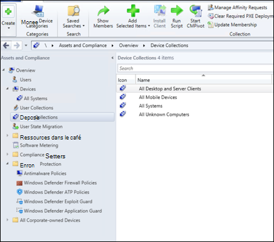

2. Cliquez avec le bouton **droit sur La collection d'appareils,** puis **sélectionnez Créer une collection d'appareils.**Right Click **Device Collection** and select **Create Device Collection**.

    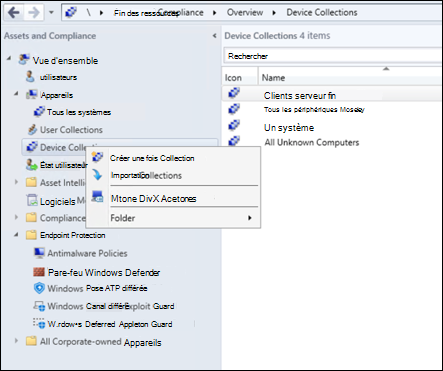

3. Fournissez un **nom** et **limitez la collection,** puis sélectionnez **Suivant**.Provide a **Name** and **Limiting Collection**, then select **Next**.

    

4. Sélectionnez **Ajouter une règle** et choisissez Règle de **requête.**Select **Add Rule** and choose **Query Rule**.

    

5.  Cliquez **sur Suivant** dans **l'Assistant Adhésion directe** et cliquez sur Modifier **l'instruction de requête.**Click **Next** on the **Direct Membership Wizard** and click on **Edit Query Statement**.

     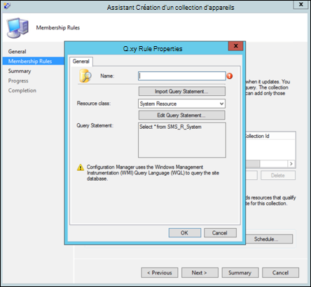

6. Sélectionnez **Critères,** puis sélectionnez l'icône étoile.Select **Criteria** and then choose the star icon.

     

7. Conservez le type de critère comme valeur **simple,**  choisissez où en tant que système d'exploitation - numéro de **build**, opérateur supérieur ou égal à et valeur **14393** et cliquez sur **OK**.Keep criterion type as **simple value**, choose where as **Operating System - build number**, operator as **is greater than or equal to** and value **14393** and click on **OK**.

    

8. Sélectionnez **Suivant** et **Fermez.**Select **Next** and **Close**.

    

9. Sélectionnez **Suivant**.Select **Next**.

    

Après avoir effectué cette tâche, vous avez maintenant une collection d'appareils avec tous les points de terminaison Windows 10 dans l'environnement.After completing this task, you now have a device collection with all the Windows 10 endpoints in the environment. 

## Étape 2 : Configurer Microsoft Defender pour les fonctionnalités de point de terminaisonStep 2: Configure Microsoft Defender for Endpoint capabilities 
Cette section vous guide dans la configuration des fonctionnalités suivantes à l'aide de Microsoft Endpoint Configuration Manager sur les appareils Windows :This section guides you in configuring the following capabilities using Microsoft Endpoint Configuration Manager on Windows devices:

- [**Détection et réponse du point de terminaison****Endpoint detection and response**](#endpoint-detection-and-response)
- [**Protection de nouvelle génération****Next-generation protection**](#next-generation-protection)
- [**Réduction de la surface d’attaque****Attack surface reduction**](#attack-surface-reduction)

### Détection et réponse du point de terminaisonEndpoint detection and response
#### Windows 10Windows 10
À partir du Centre de sécurité Microsoft Defender, il est possible de télécharger la stratégie « .onboarding » qui peut être utilisée pour créer la stratégie dans System Center Configuration Manager et déployer cette stratégie sur les appareils Windows 10.From within the Microsoft Defender Security Center it is possible to download the '.onboarding' policy that can be used to create the policy in System Center Configuration Manager and deploy that policy to Windows 10 devices.

1. À partir d'un portail centre de sécurité Microsoft Defender, [sélectionnez Paramètres, puis Intégration.](https://securitycenter.windows.com/preferences2/onboarding)From a Microsoft Defender Security Center Portal, select [Settings and then Onboarding](https://securitycenter.windows.com/preferences2/onboarding).

2. Sous Méthode de déploiement, sélectionnez la version prise en charge **de Microsoft Endpoint Configuration Manager.**Under Deployment method select the supported version of **Microsoft Endpoint Configuration Manager**.

    

3. Sélectionnez **le package de téléchargement.**Select **Download package**.

    

4. Enregistrez le package dans un emplacement accessible.Save the package to an accessible location.
5. Dans Microsoft Endpoint Configuration Manager, accédez à : **Assets and Compliance > Overview > Endpoint Protection > Microsoft Defender ATP Policies**.In  Microsoft Endpoint Configuration Manager, navigate to: **Assets and Compliance > Overview > Endpoint Protection > Microsoft Defender ATP Policies**.

6. Cliquez avec le bouton **droit sur Stratégies Microsoft Defender ATP** et **sélectionnez Créer une stratégie Microsoft Defender ATP.**Right-click **Microsoft Defender ATP Policies** and select **Create Microsoft Defender ATP Policy**.

    

7. Entrez le nom et la description, vérifiez **que l'intégration** est sélectionnée, puis sélectionnez **Suivant**.Enter the name and description, verify **Onboarding** is selected, then select **Next**.

    

8. Cliquez sur **Parcourir**.Click **Browse**.

9. Accédez à l'emplacement du fichier téléchargé à l'étape 4 ci-dessus.Navigate to the location of the downloaded file from step 4 above.

10. Cliquez sur **Suivant**.Click **Next**.
11. Configurez l'agent avec les exemples appropriés (**Aucun** ou **Tous les types de fichiers).**Configure the Agent with the appropriate samples (**None** or **All file types**).

    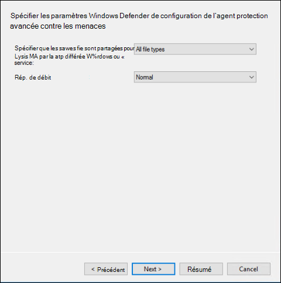

12. Sélectionnez la télémétrie appropriée **(Normale** ou **Accélérée),** puis cliquez sur **Suivant**.Select the appropriate telemetry (**Normal** or **Expedited**) then click **Next**.

    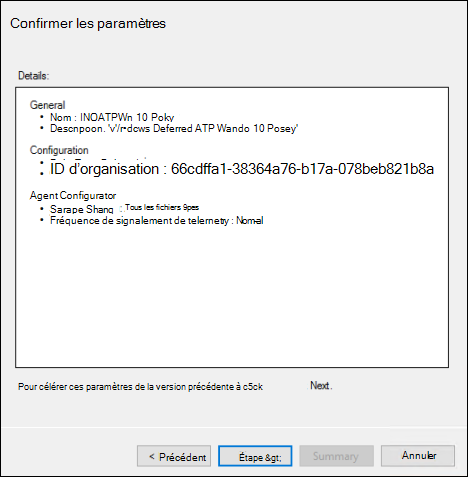

14. Vérifiez la configuration, puis cliquez sur **Suivant.**Verify the configuration, then click **Next**.

     

15. Cliquez **sur Fermer** une fois l'Assistant terminé.Click **Close** when the Wizard completes.

16.  Dans la console Microsoft Endpoint Configuration Manager, cliquez avec le bouton droit sur la stratégie Defender for Endpoint que vous avez créée et sélectionnez **Déployer.**In the Microsoft Endpoint Configuration Manager console, right-click the Defender for Endpoint policy you just created and select **Deploy**.

     

17. Dans le panneau droit, sélectionnez la collection créée précédemment et cliquez sur **OK.**On the right panel, select the previously created collection and click **OK**.

    

#### Versions précédentes de Windows Client (Windows 7 et Windows 8.1)Previous versions of Windows Client (Windows 7 and Windows 8.1)
Suivez les étapes ci-dessous pour identifier l'ID d'espace de travail Defender pour le point de terminaison et la clé d'espace de travail, qui seront requis pour l'intégration des versions précédentes de Windows.Follow the steps below to identify the Defender for Endpoint Workspace ID and Workspace Key, that will be required for the onboarding of previous versions of Windows.

1. À partir d'un portail centre de sécurité Microsoft Defender, **sélectionnez Paramètres >'intégration.**From a Microsoft Defender Security Center Portal, select **Settings > Onboarding**.

2. Sous le système **d'exploitation, choisissez Windows 7 SP1 et 8.1**.Under operating system choose **Windows 7 SP1 and 8.1**.

3. Copiez **l'ID d'espace de travail** et la clé **d'espace de** travail, puis enregistrez-les.Copy the **Workspace ID** and **Workspace Key** and save them. Ils seront utilisés plus tard dans le processus.They will be used later in the process.

    

4. Installez l'agent de surveillance Microsoft (MMA).Install the Microsoft Monitoring Agent (MMA).  
    MMA est actuellement pris en charge (depuis janvier 2019) sur les systèmes d'exploitation Windows suivants :MMA is currently (as of January 2019) supported on the following Windows Operating Systems:

    -   SSO serveur : Windows Server 2008 SP1 ou plus nouveauServer SKUs: Windows Server 2008 SP1 or Newer

    -   SSO client : Windows 7 SP1 et ultérieurClient SKUs: Windows 7 SP1 and later

    L'agent MMA doit être installé sur les appareils Windows.The MMA agent will need to be installed on Windows devices. Pour installer l'agent, certains systèmes doivent télécharger la mise à jour pour l'expérience client et la [télémétrie](https://support.microsoft.com/help/3080149/update-for-customer-experience-and-diagnostic-telemetry) de diagnostic afin de collecter les données avec MMA.To install the agent, some systems will need to download the [Update for customer experience and diagnostic telemetry](https://support.microsoft.com/help/3080149/update-for-customer-experience-and-diagnostic-telemetry) in order to collect the data with MMA. Ces versions système incluent, sans s'y limiter, les éléments suivants :These system versions include but may not be limited to:

    -   Windows 8.1Windows 8.1

    -   Windows 7Windows 7

    -   Windows Server 2016Windows Server 2016

    -   Windows Server 2012 R2Windows Server 2012 R2

    -   Windows Server 2008 R2Windows Server 2008 R2

    Plus précisément, pour Windows 7 SP1, les correctifs suivants doivent être installés :Specifically, for Windows 7 SP1, the following patches must be installed:

    -   Installer [KB4074598](https://support.microsoft.com/help/4074598/windows-7-update-kb4074598)Install [KB4074598](https://support.microsoft.com/help/4074598/windows-7-update-kb4074598)

    -   Installez la [.NET Framework 4.5](https://www.microsoft.com/download/details.aspx?id=30653) (ou **ultérieure)** ou 
         [la KB3154518](https://support.microsoft.com/help/3154518/support-for-tls-system-default-versions-included-in-the-net-framework).Install either [.NET Framework 4.5](https://www.microsoft.com/download/details.aspx?id=30653) (or later) **or**
        [KB3154518](https://support.microsoft.com/help/3154518/support-for-tls-system-default-versions-included-in-the-net-framework).
        N'installez pas les deux sur le même système.Do not install both on the same system.

5. Si vous utilisez un proxy pour vous connecter à Internet, consultez la section Configurer les paramètres du proxy.If you're using a proxy to connect to the Internet see the Configure proxy settings section.

Une fois terminé, vous devriez voir les points de terminaison intégrés dans le portail dans un délai d'une heure.Once completed, you should see onboarded endpoints in the portal within an hour.

### Protection de nouvelle générationNext generation protection 
L’antivirus Microsoft Defender est une solution de protection contre les programmes malveillants intégrée qui offre une protection nouvelle génération pour les ordinateurs de bureau, les ordinateurs portables et les serveurs.Microsoft Defender Antivirus is a built-in antimalware solution that provides next generation protection for desktops, portable computers, and servers.

1. Dans la console Microsoft Endpoint Configuration Manager, accédez à **Assets and Compliance \> Overview \> Endpoint Protection \> Antimalware Polices** et choisissez Créer une stratégie **anti-programme malveillant.**In the Microsoft Endpoint Configuration Manager console, navigate to **Assets and Compliance \> Overview \> Endpoint Protection \> Antimalware Polices** and choose **Create Antimalware Policy**.

    

2. Select **Scheduled scans**, **Scan settings**, **Default actions**, **Real-time protection**, Exclusion **settings**, **Advanced**, **Threat overrides**, Cloud Protection **Service** and Security **intelligence updates** and choose **OK**.Select **Scheduled scans**, **Scan settings**, **Default actions**, **Real-time protection**, **Exclusion settings**, **Advanced**, **Threat overrides**, **Cloud Protection Service** and **Security intelligence   updates** and choose **OK**.

    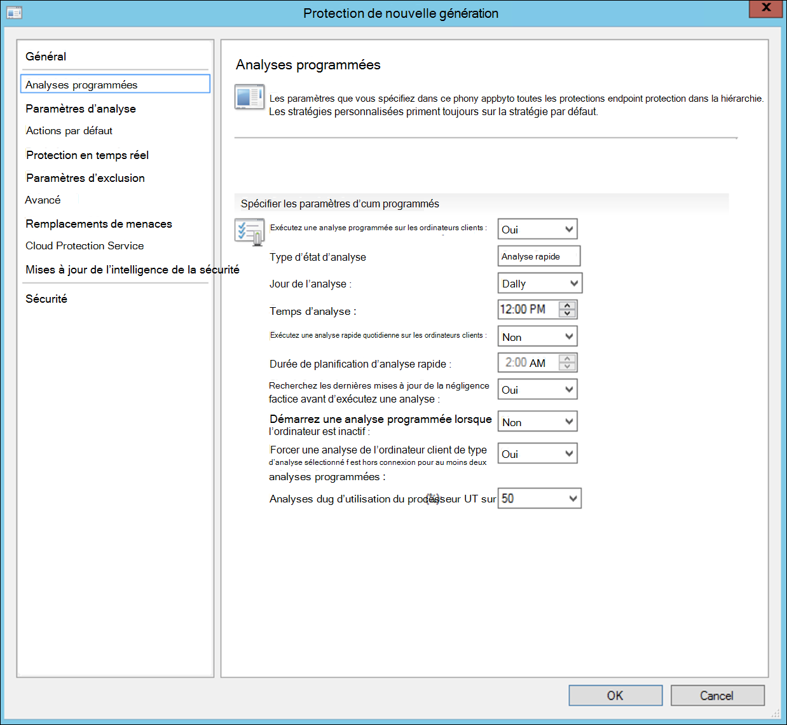

    Dans certains secteurs d'activité ou certains clients d'entreprise, certains peuvent avoir des besoins spécifiques sur la configuration de l'antivirus.In certain industries or some select enterprise customers might have specific needs on how Antivirus is configured.

  
    [Analyse rapide par rapport à l'analyse complète et à l'analyse personnaliséeQuick scan versus full scan and custom scan](https://docs.microsoft.com/windows/security/threat-protection/microsoft-defender-antivirus/scheduled-catch-up-scans-microsoft-defender-antivirus#quick-scan-versus-full-scan-and-custom-scan)

    Pour plus d'informations, voir [Infrastructure de configuration de sécurité Windows](https://docs.microsoft.com/windows/security/threat-protection/windows-security-configuration-framework/windows-security-configuration-framework)For more details, see [Windows Security configuration framework](https://docs.microsoft.com/windows/security/threat-protection/windows-security-configuration-framework/windows-security-configuration-framework)
  
    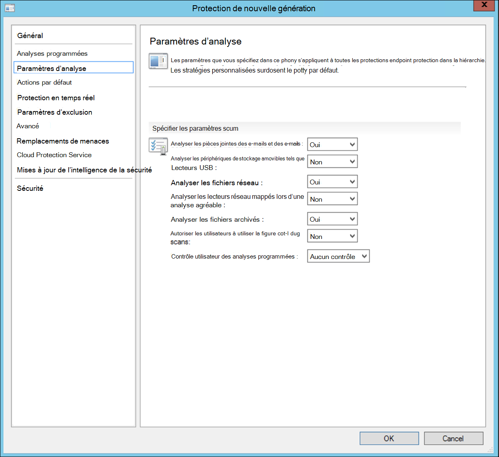

    

    

    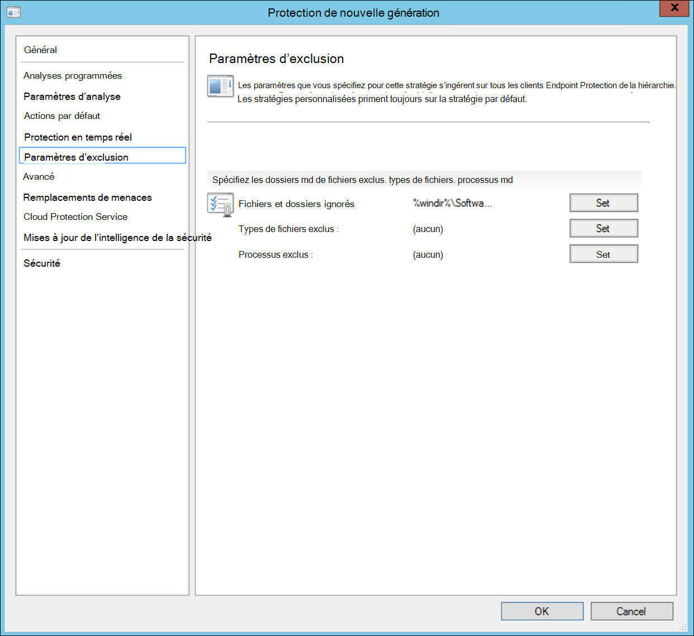

    

    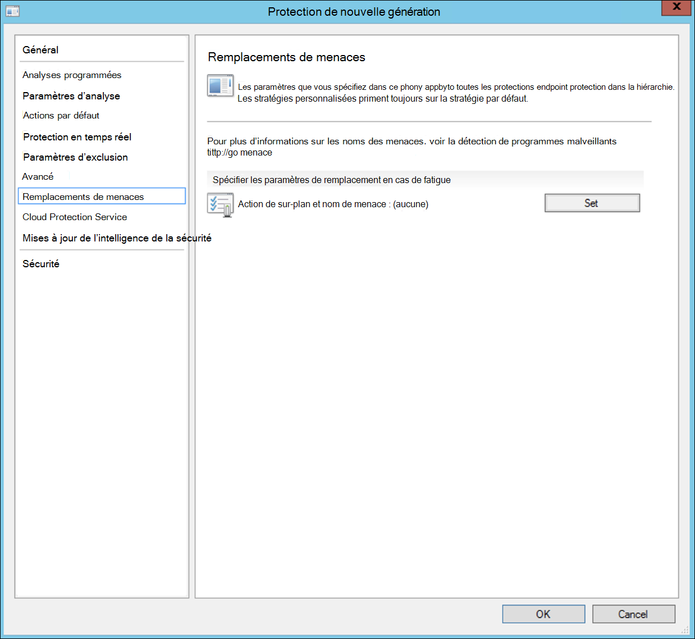

    

    

3. Cliquez avec le bouton droit sur la stratégie de logiciel anti-programme malveillant nouvellement créée et sélectionnez **Déployer.**Right-click on the newly created antimalware policy and select **Deploy**.

    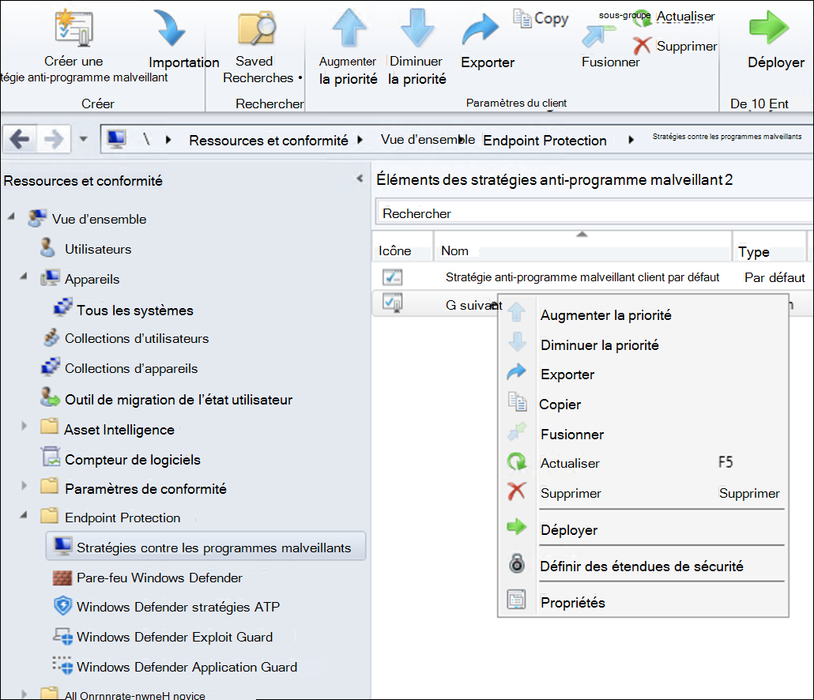

4. Ciblez la nouvelle stratégie anti-programme malveillant sur votre collection Windows 10, puis cliquez sur **OK.**Target the new antimalware policy to your Windows 10 collection and click **OK**.

     

Après avoir terminé cette tâche, vous avez configuré correctement Windows Defender Antivirus.After completing this task, you now have successfully configured Windows Defender Antivirus.

### Réduction de la surface d'attaqueAttack surface reduction
Le pilier de réduction de la surface d'attaque de Defender pour le point de terminaison inclut l'ensemble de fonctionnalités disponible sous Exploit Guard.The attack surface reduction pillar of Defender for Endpoint includes the feature set that is available under Exploit Guard. Règles de réduction de la surface d'attaque (ASR), Accès contrôlé aux dossiers, Protection du réseau et Exploit Protection.Attack surface reduction (ASR) rules, Controlled Folder Access, Network Protection and Exploit Protection. 

Toutes ces fonctionnalités fournissent un mode audit et un mode bloc.All these features provide an audit mode and a block mode. En mode audit, il n'y a pas d'impact sur l'utilisateur final.In audit mode there is no end-user impact. Il s'agit uniquement de collecter des données de télémétrie supplémentaires et de les rendre disponibles dans le Centre de sécurité Microsoft Defender.All it does is collect additional telemetry and make it available in the Microsoft Defender Security Center. L'objectif d'un déploiement est de déplacer pas à pas les contrôles de sécurité en mode blocage.The goal with a deployment is to step-by-step move security controls into block mode.

Pour définir des règles de récupération de l'accès en mode Audit :To set ASR rules in Audit mode:

1. Dans la console Microsoft Endpoint Configuration Manager, accédez à **Assets and Compliance \> Overview \> Endpoint Protection \> Windows Defender Exploit Guard** et choisissez Créer une stratégie Exploit **Guard.**In the Microsoft Endpoint Configuration Manager console, navigate to **Assets and Compliance \> Overview \> Endpoint Protection \> Windows Defender Exploit Guard** and choose **Create Exploit Guard Policy**.

   

2.  Sélectionnez **Réduction de la surface d'attaque.**Select **Attack Surface Reduction**.
   

3. Définissez les règles sur **Audit** et cliquez sur **Suivant.**Set rules to **Audit** and click **Next**.

    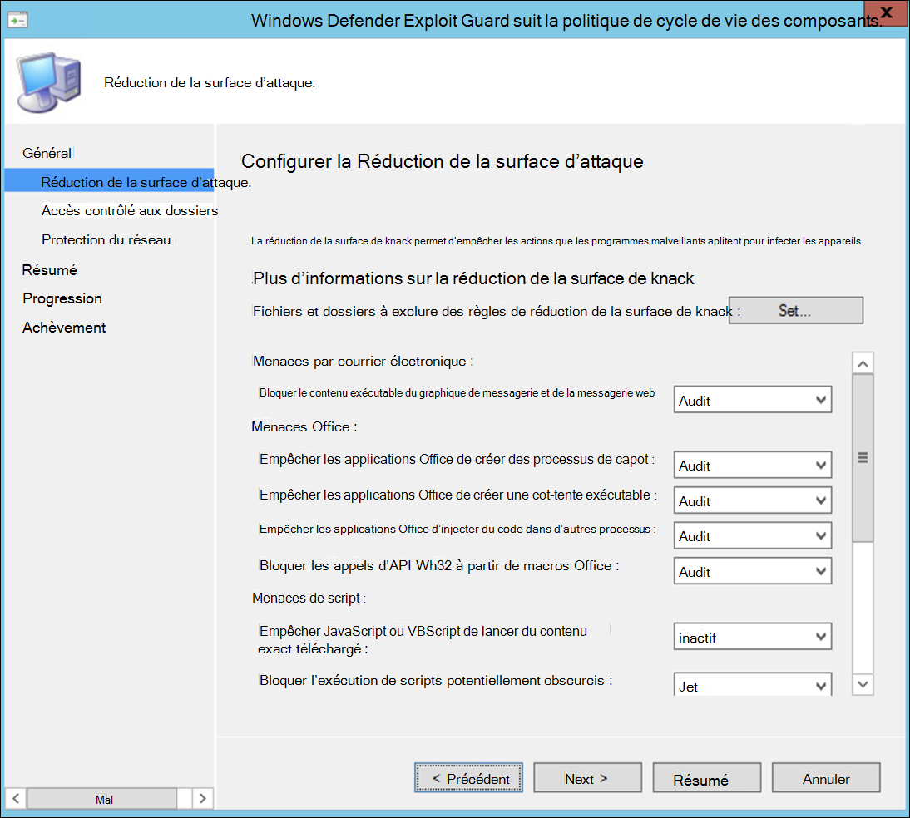

4. Confirmez la nouvelle stratégie Exploit Guard en cliquant sur **Suivant**.Confirm the new Exploit Guard policy by clicking on **Next**.

    

    
5. Une fois la stratégie créée, cliquez sur **Fermer.**Once the policy is created click **Close**.

    

    
   

6.  Cliquez avec le bouton droit sur la stratégie nouvellement créée et choisissez **Déployer.**Right-click on the newly created policy and choose **Deploy**.
    
    

7. Ciblez la stratégie sur la collection Windows 10 nouvellement créée et cliquez sur **OK.**Target the policy to the newly created Windows 10 collection and click **OK**.

    

Après avoir effectué cette tâche, vous avez correctement configuré les règles de la asr en mode audit.After completing this task, you now have successfully configured ASR rules in audit mode.  
  
Vous trouverez ci-dessous des étapes supplémentaires pour vérifier si les règles de réponse aux erreurs sont correctement appliquées aux points de terminaison.Below are additional steps to verify whether ASR rules are correctly applied to endpoints. (Cela peut prendre quelques minutes)(This may take few minutes)

1. À partir d'un navigateur web, accédez à <https://securitycenter.windows.com> .From a web browser, navigate to <https://securitycenter.windows.com>.

2.  Sélectionnez **Gestion de la configuration** dans le menu gauche.Select **Configuration management** from left side menu.

3. Cliquez **sur Aller à la gestion de la surface d'attaque** dans le panneau De gestion de la surface d'attaque.Click **Go to attack surface management** in the Attack surface management panel. 
    
    

4. Cliquez sur **l'onglet Configuration** dans les rapports de règles de réduction de la surface d'attaque.Click **Configuration** tab in Attack surface reduction rules reports. Il présente la vue d'ensemble de la configuration des règles de la asr et l'état des règles de la asr sur chaque appareil.It shows ASR rules configuration overview and ASR rules status on each devices.

    

5. Cliquez sur chaque appareil pour obtenir les détails de configuration des règles asr.Click each device shows configuration details of ASR rules.

    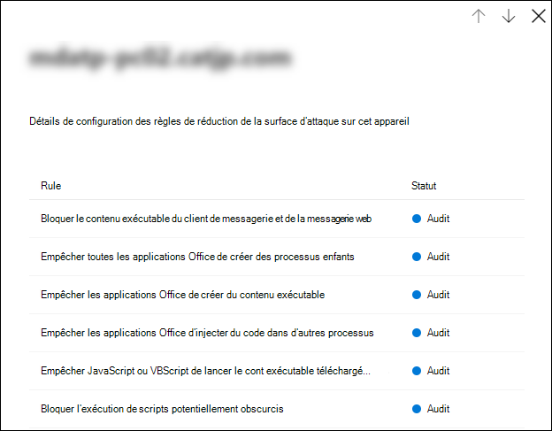

Pour [plus d'informations, voir Optimiser](https://docs.microsoft.com/microsoft-365/security/defender-endpoint/configure-machines-asr)   le déploiement et les détections de règles asr.See [Optimize ASR rule deployment and detections](https://docs.microsoft.com/microsoft-365/security/defender-endpoint/configure-machines-asr)   for more details.  

#### Définissez des règles de protection réseau en mode audit :Set Network Protection rules in Audit mode:
1. Dans la console Microsoft Endpoint Configuration Manager, accédez à **Assets and Compliance \> Overview \> Endpoint Protection \> Windows Defender Exploit Guard** et choisissez Créer une stratégie Exploit **Guard.**In the Microsoft Endpoint Configuration Manager console, navigate to **Assets and  Compliance \> Overview \> Endpoint Protection \> Windows Defender Exploit Guard** and choose **Create Exploit Guard Policy**.

    

2. Sélectionnez **Protection du réseau.**Select **Network protection**.

3. Définissez le paramètre sur **Audit et** cliquez sur **Suivant.**Set the setting to **Audit** and click **Next**. 

    

4. Confirmez la nouvelle stratégie Exploit Guard en cliquant sur **Suivant.**Confirm the new Exploit Guard Policy by clicking **Next**.
    
    

5. Une fois la stratégie créée, cliquez sur **Fermer.**Once the policy is created click on **Close**.

    

6. Cliquez avec le bouton droit sur la stratégie nouvellement créée et choisissez **Déployer.**Right-click on the newly created policy and choose **Deploy**.

    

7. Sélectionnez la stratégie pour la collection Windows 10 nouvellement créée et choisissez **OK.**Select the policy to the newly created Windows 10 collection and choose **OK**.

    

Après avoir effectué cette tâche, vous avez configuré correctement la Protection du réseau en mode audit.After completing this task, you now have successfully configured Network Protection in audit mode.

#### Pour définir des règles d'accès contrôlé aux dossiers en mode Audit :To set Controlled Folder Access rules in Audit mode:

1. Dans la console Microsoft Endpoint Configuration Manager, accédez à **Assets and Compliance \> Overview \> Endpoint Protection \> Windows Defender Exploit Guard** et choisissez Créer une stratégie Exploit **Guard.**In the Microsoft Endpoint Configuration Manager console, navigate to **Assets and Compliance \> Overview \> Endpoint Protection \> Windows Defender Exploit Guard** and choose **Create Exploit Guard Policy**.

    

2. Sélectionnez **Accès contrôlé aux dossiers.**Select **Controlled folder access**.
    
3. Définissez la configuration sur **Audit et** cliquez sur **Suivant.**Set the configuration to **Audit** and click **Next**.

    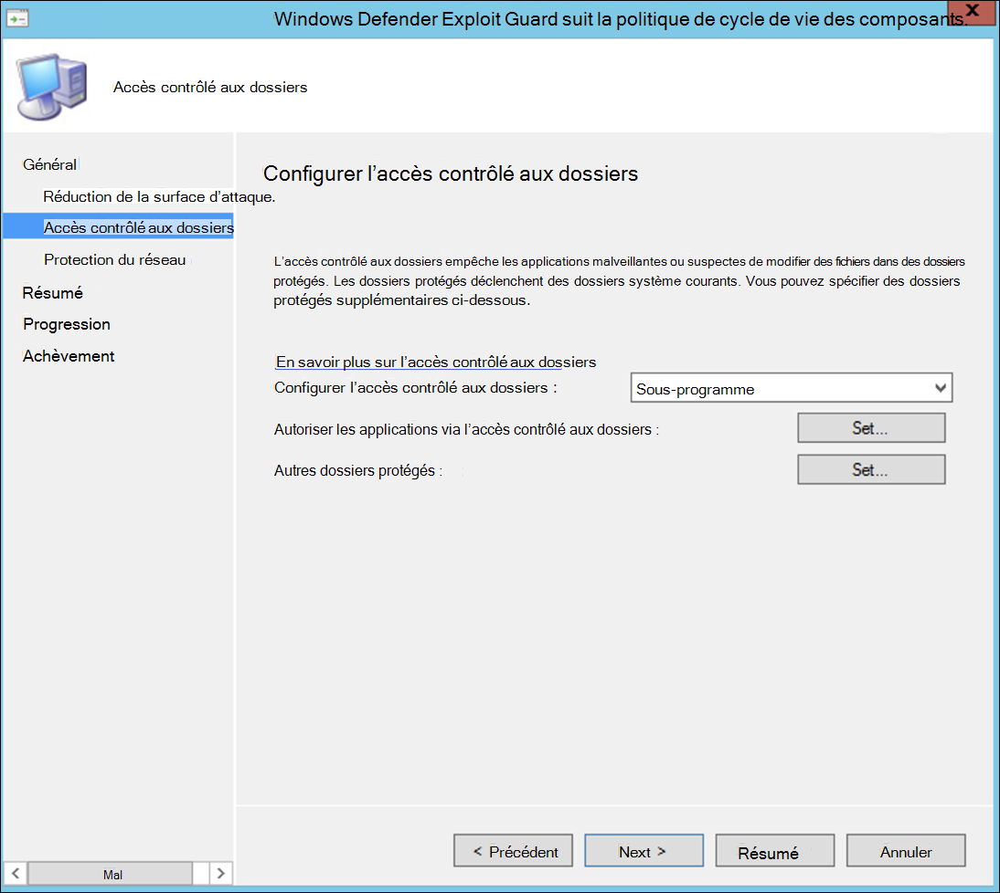    
    
4. Confirmez la nouvelle stratégie Exploit Guard en cliquant sur **Suivant**.Confirm the new Exploit Guard Policy by clicking on **Next**.

    

5. Une fois la stratégie créée, cliquez sur **Fermer.**Once the policy is created click on **Close**.

    

6. Cliquez avec le bouton droit sur la stratégie nouvellement créée et choisissez **Déployer.**Right-click on the newly created policy and choose **Deploy**.

    

7.  Ciblez la stratégie sur la collection Windows 10 nouvellement créée et cliquez sur **OK.**Target the policy to the newly created Windows 10 collection and click **OK**.

    

Vous avez maintenant configuré l'accès contrôlé aux dossiers en mode audit.You have now successfully configured Controlled folder access in audit mode.

## Rubrique connexeRelated topic
- [Intégration à l'aide de Microsoft Endpoint ManagerOnboarding using Microsoft Endpoint Manager](onboarding-endpoint-manager.md)
