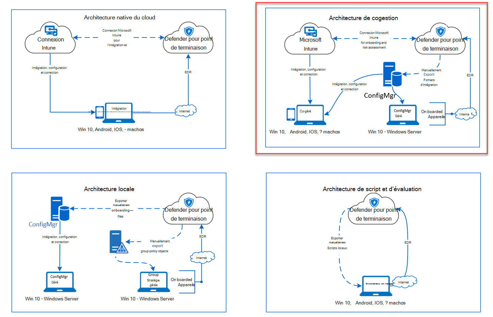
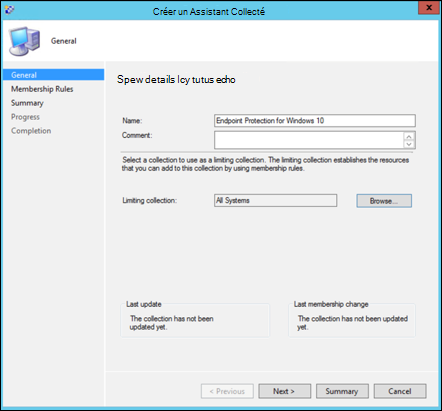
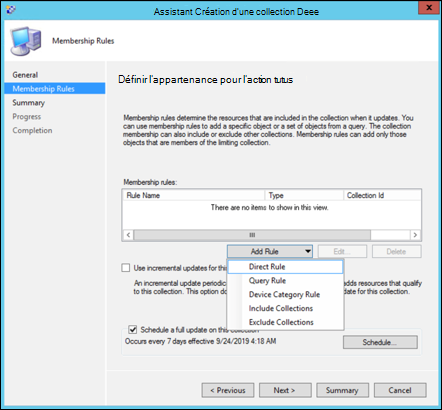
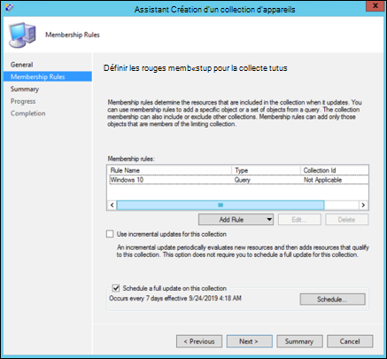
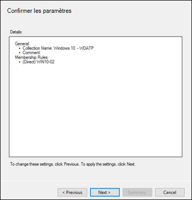
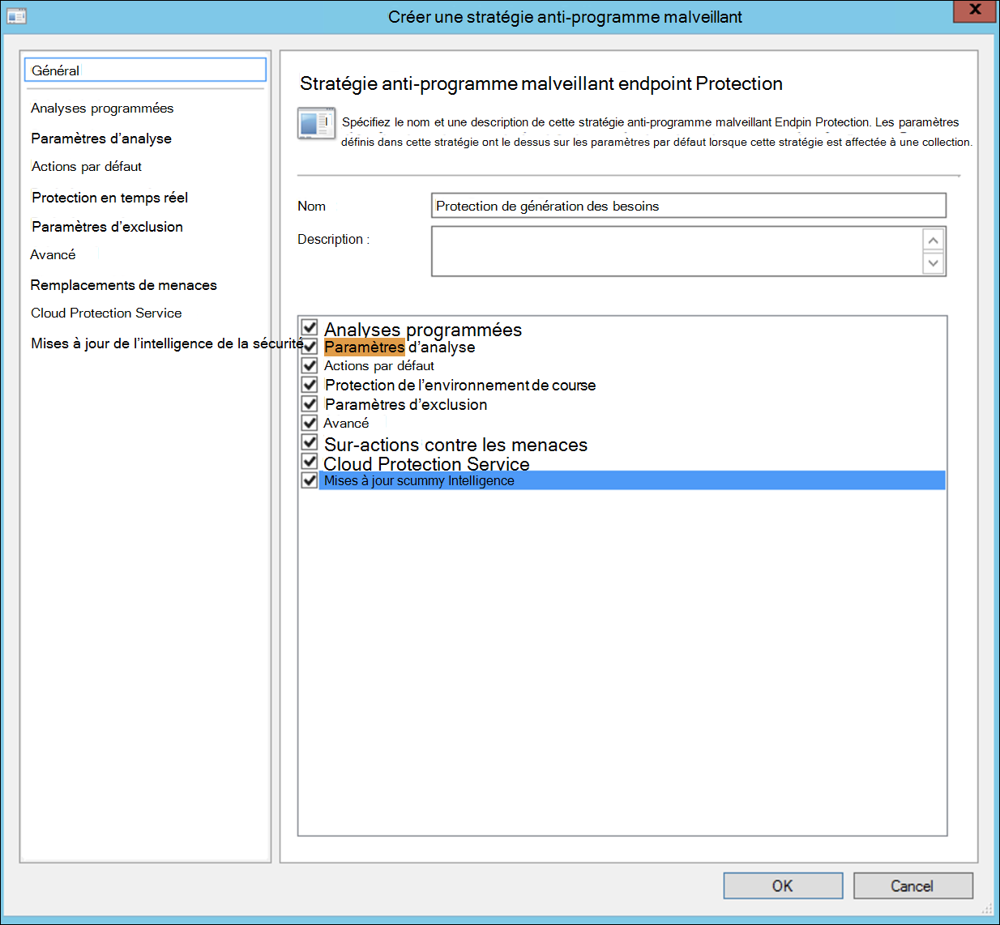
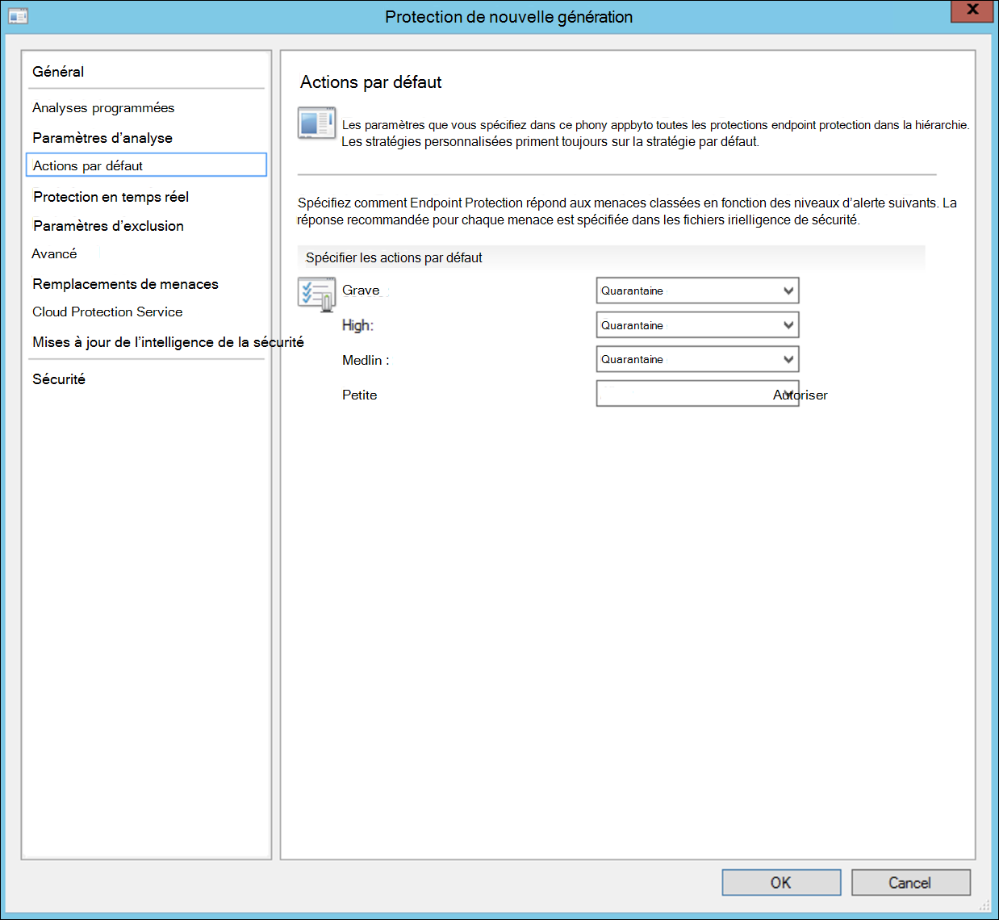
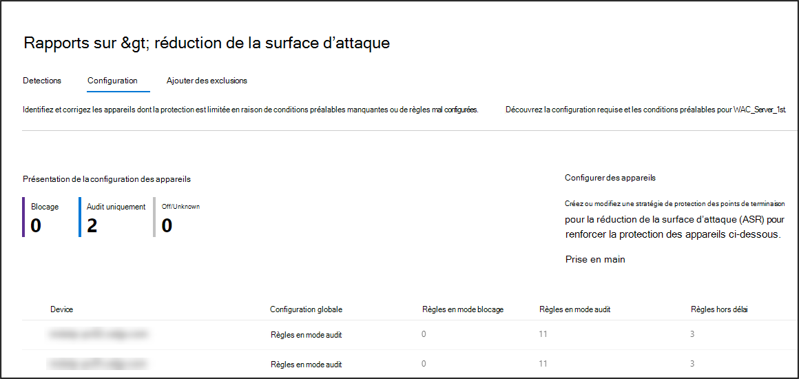
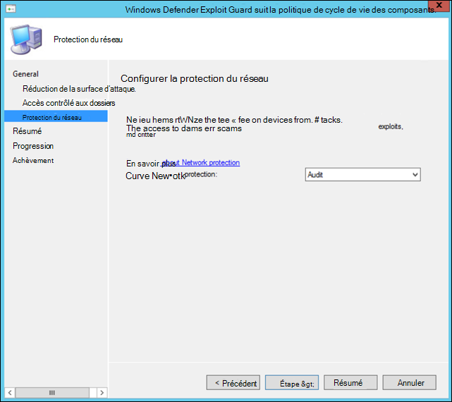

# Intégration à l'aide de Microsoft Endpoint Configuration Manager

[!INCLUDE [Microsoft 365 Defender rebranding](../../includes/microsoft-defender.md)]

**S’applique à :**
- [Microsoft Defender pour point de terminaison](https://go.microsoft.com/fwlink/p/?linkid=2154037)
- [Microsoft 365 Defender](https://go.microsoft.com/fwlink/?linkid=2118804)

> Vous souhaitez découvrir Microsoft Defender pour le point de terminaison ? [Inscrivez-vous à un essai gratuit.](https://www.microsoft.com/microsoft-365/windows/microsoft-defender-atp?ocid=docs-wdatp-exposedapis-abovefoldlink)

Cet article fait partie du guide de déploiement et agit comme un exemple de méthode d’intégration. 

Dans la [rubrique Planification,](deployment-strategy.md) plusieurs méthodes ont été fournies pour intégrer des appareils au service. Cette rubrique traite de l’architecture de cogestion. 

 *Diagramme des architectures d’environnement*

Bien que Defender pour point de terminaison prend en charge l’intégration de différents points de terminaison et outils, cet article ne les traite pas. Pour plus d’informations sur l’intégration générale à l’aide d’autres outils et méthodes de déploiement pris en charge, voir [vue d’ensemble de l’intégration.](onboarding.md)

Cette rubrique guide les utilisateurs dans :
- Étape 1 : intégration de Windows appareils au service 
- Étape 2 : Configuration de Defender pour les fonctionnalités de point de terminaison

Ces instructions d’intégration vous guident tout au long des étapes de base suivantes que vous devez suivre lors de l’utilisation Microsoft Endpoint Configuration Manager :
- **Création d’une collection dans Microsoft Endpoint Configuration Manager**
- **Configuration des fonctionnalités de Microsoft Defender pour les points de terminaison à l’aide Microsoft Endpoint Configuration Manager**

>[!NOTE]
>Seuls Windows appareils sont couverts dans cet exemple de déploiement. 

## Étape 1 : Intégrer des appareils Windows l’aide Microsoft Endpoint Configuration Manager

### Création de collection
Pour intégrer Windows 10 appareils avec Microsoft Endpoint Configuration Manager, le déploiement peut cibler une collection existante ou une nouvelle collection peut être créée pour les tests. 

L’intégration à l’aide d’outils tels que la stratégie de groupe ou la méthode manuelle n’installe aucun agent sur le système. 

Dans la console Microsoft Endpoint Configuration Manager, le processus d’intégration est configuré dans le cadre des paramètres de conformité au sein de la console.

Tout système qui reçoit cette configuration requise conserve cette configuration tant que le client Configuration Manager continue de recevoir cette stratégie à partir du point de gestion. 

Suivez les étapes ci-dessous pour intégrer des points de terminaison à l’aide Microsoft Endpoint Configuration Manager.

1. Dans Microsoft Endpoint Configuration Manager console, accédez à **Assets and Compliance \> Overview Device \> Collections**.            

    

2. Cliquez avec le bouton **droit sur La collection d’appareils,** puis **sélectionnez Créer une collection d’appareils.**

    

3. Fournissez un **nom** et **limitez la collection,** puis sélectionnez **Suivant**.

    

4. Sélectionnez **Ajouter une règle** et choisissez Règle de **requête.**

    

5.  Cliquez **sur Suivant** dans **l’Assistant Adhésion directe** et cliquez sur Modifier **l’instruction de requête.**

     

6. Sélectionnez **Critères,** puis sélectionnez l’icône étoile.

     

7. Conservez le type de critère comme valeur **simple,**  choisissez où en tant que système d’exploitation - numéro de **build**, opérateur supérieur ou égal à et valeur **14393** et cliquez sur **OK**.

    

8. Sélectionnez **Suivant** et **Fermez.**

    

9. Sélectionnez **Suivant**.

    

Après avoir effectué cette tâche, vous avez maintenant une collection d’appareils avec tous les Windows 10 de terminaison dans l’environnement. 

## Étape 2 : Configurer Microsoft Defender pour les fonctionnalités de point de terminaison 
Cette section vous guide dans la configuration des fonctionnalités suivantes à l’aide Microsoft Endpoint Configuration Manager sur Windows appareils :

- [**Détection et réponse du point de terminaison**](#endpoint-detection-and-response)
- [**Protection de nouvelle génération**](#next-generation-protection)
- [**Réduction de la surface d’attaque**](#attack-surface-reduction)

### Détection et réponse du point de terminaison
#### Windows 10
À partir de la Centre de sécurité Microsoft Defender il est possible de télécharger la stratégie « .onboarding » qui peut être utilisée pour créer la stratégie dans System Center Configuration Manager et déployer cette stratégie sur Windows 10 appareils.

1. À partir d Centre de sécurité Microsoft Defender portail, [sélectionnez Paramètres puis Intégration.](https://securitycenter.windows.com/preferences2/onboarding)

2. Sous Méthode de déploiement, sélectionnez la version prise **en charge de Microsoft Endpoint Configuration Manager**.

    

3. Sélectionnez **le package de téléchargement.**

    

4. Enregistrez le package dans un emplacement accessible.
5. Dans Microsoft Endpoint Configuration Manager, accédez à : **Assets and Compliance > Overview > Endpoint Protection > Microsoft Defender ATP Policies**.

6. Cliquez avec le bouton **droit Microsoft Defender ATP stratégies et** **sélectionnez Créer Microsoft Defender ATP stratégie.**

    

7. Entrez le nom et la description, vérifiez **que l’intégration** est sélectionnée, puis sélectionnez **Suivant**.

    

8. Cliquez sur **Parcourir**.

9. Accédez à l’emplacement du fichier téléchargé à l’étape 4 ci-dessus.

10. Cliquez sur **Suivant**.
11. Configurez l’agent avec les exemples appropriés (**Aucun** ou **Tous les types de fichiers).**

    

12. Sélectionnez la télémétrie appropriée **(Normale** ou **Accélérée),** puis cliquez sur **Suivant**.

    

14. Vérifiez la configuration, puis cliquez sur **Suivant.**

     

15. Cliquez **sur Fermer** une fois l’Assistant terminé.

16.  Dans la console Microsoft Endpoint Configuration Manager, cliquez avec le bouton droit sur la stratégie Defender for Endpoint que vous avez créée et sélectionnez **Déployer.**

     

17. Dans le panneau droit, sélectionnez la collection créée précédemment et cliquez sur **OK.**

    

#### Versions précédentes de Windows Client (Windows 7 et Windows 8.1)
Suivez les étapes ci-dessous pour identifier l’ID d’espace de travail Defender pour le point de terminaison et la clé d’espace de travail, qui seront requis pour l’intégration des versions précédentes de Windows.

1. Dans un portail Centre de sécurité Microsoft Defender, sélectionnez **Paramètres >'intégration.**

2. Sous le système **d’exploitation, Windows 7 SP1 et 8.1**.

3. Copiez **l’ID d’espace de travail** et la clé **d’espace de** travail, puis enregistrez-les. Ils seront utilisés plus tard dans le processus.

    

4. Installez le Microsoft Monitoring Agent (MMA).  
    MMA est actuellement pris en charge (depuis janvier 2019) sur les systèmes d’Windows suivants :

    -   SSO serveur : Windows Server 2008 SP1 ou plus nouveau

    -   SSK client : Windows 7 SP1 et ultérieures

    L’agent MMA doit être installé sur Windows appareils mobiles. Pour installer l’agent, certains systèmes doivent télécharger la mise à jour pour l’expérience client et la [télémétrie](https://support.microsoft.com/help/3080149/update-for-customer-experience-and-diagnostic-telemetry) de diagnostic afin de collecter les données avec MMA. Ces versions système incluent, sans s’y limiter, les éléments suivants :

    -   Windows 8.1

    -   Windows 7

    -   Windows Server 2016

    -   Windows Server 2012 R2

    -   Windows Server 2008 R2

    Plus précisément, pour Windows 7 SP1, les correctifs suivants doivent être installés :

    -   Installer [KB4074598](https://support.microsoft.com/help/4074598/windows-7-update-kb4074598)

    -   Installez la [.NET Framework 4.5](https://www.microsoft.com/download/details.aspx?id=30653) (ou **ultérieure)** ou 
         [la KB3154518](https://support.microsoft.com/help/3154518/support-for-tls-system-default-versions-included-in-the-net-framework).
        N’installez pas les deux sur le même système.

5. Si vous utilisez un proxy pour vous connecter à Internet, consultez la section Configurer les paramètres du proxy.

Une fois terminé, vous devriez voir les points de terminaison intégrés dans le portail dans un délai d’une heure.

### Protection de nouvelle génération 
L’antivirus Microsoft Defender est une solution de protection contre les programmes malveillants intégrée qui offre une protection nouvelle génération pour les ordinateurs de bureau, les ordinateurs portables et les serveurs.

1. Dans la console Microsoft Endpoint Configuration Manager, accédez à **Assets and Compliance \> Overview Endpoint Protection \> \> Antimalware Polices** et choisissez Créer une stratégie **anti-programme malveillant.**

    

2. Select **Scheduled scans**, **Scan settings**, **Default actions**, **Real-time protection**, Exclusion **settings**, **Advanced**, **Threat overrides**, Cloud Protection **Service** and Security **intelligence updates** and choose **OK**.

    

    Dans certains secteurs d’activité ou certains clients d’entreprise, certains peuvent avoir des besoins spécifiques sur la configuration de l’antivirus.

  
    [Analyse rapide par rapport à l’analyse complète et à l’analyse personnalisée](/windows/security/threat-protection/microsoft-defender-antivirus/scheduled-catch-up-scans-microsoft-defender-antivirus#quick-scan-versus-full-scan-and-custom-scan)

    Pour plus d’informations, voir [Sécurité Windows’infrastructure de configuration](/windows/security/threat-protection/windows-security-configuration-framework/windows-security-configuration-framework)
  
    

    

    

    

    

    

    

    

3. Cliquez avec le bouton droit sur la stratégie anti-programme malveillant nouvellement créée et sélectionnez **Déployer.**

    

4. Ciblez la nouvelle stratégie anti-programme malveillant sur Windows 10 collection de programmes malveillants, puis cliquez sur **OK.**

     

Après avoir terminé cette tâche, vous avez configuré Antivirus Windows Defender.

### Réduction de la surface d'attaque
Le pilier de réduction de la surface d’attaque de Defender pour le point de terminaison inclut l’ensemble de fonctionnalités disponible sous Exploit Guard. Règles de réduction de la surface d’attaque (ASR), Accès contrôlé aux dossiers, Protection du réseau et Exploit Protection. 

Toutes ces fonctionnalités fournissent un mode audit et un mode bloc. En mode audit, il n’y a pas d’impact sur l’utilisateur final. Tout ce qu’il fait, c’est collecter des données de télémétrie supplémentaires et les rendre disponibles dans le Centre de sécurité Microsoft Defender. L’objectif d’un déploiement est de déplacer pas à pas les contrôles de sécurité en mode blocage.

Pour définir des règles de récupération de l’accès en mode Audit :

1. Dans la console Microsoft Endpoint Configuration Manager, accédez à La vue d’ensemble des ressources et de la **conformité Endpoint Protection Windows Defender Exploit \> \> \> Guard** et choisissez Créer une stratégie **Exploit Guard.**

   

2.  Sélectionnez **Réduction de la surface d’attaque.**
   

3. Définissez les règles sur **Audit** et cliquez sur **Suivant.**

    

4. Confirmez la nouvelle stratégie Exploit Guard en cliquant sur **Suivant**.

    

    
5. Une fois la stratégie créée, cliquez sur **Fermer.**

    

    
   

6.  Cliquez avec le bouton droit sur la stratégie nouvellement créée et choisissez **Déployer.**
    
    

7. Ciblez la stratégie sur la collection de Windows 10 nouvellement créée, puis cliquez sur **OK.**

    

Après avoir effectué cette tâche, vous avez correctement configuré les règles de la asr en mode audit.  
  
Vous trouverez ci-dessous des étapes supplémentaires pour vérifier si les règles de réponse aux erreurs sont correctement appliquées aux points de terminaison. (Cela peut prendre quelques minutes)

1. À partir d’un navigateur web, accédez à <https://securitycenter.windows.com> .

2.  Sélectionnez **Gestion de la configuration** dans le menu gauche.

3. Cliquez **sur Aller à la gestion de la surface d’attaque** dans le panneau De gestion de la surface d’attaque. 
    
    

4. Cliquez sur **l’onglet Configuration** dans les rapports de règles de réduction de la surface d’attaque. Il présente la vue d’ensemble de la configuration des règles de la asr et l’état des règles de la asr sur chaque appareil.

    

5. Cliquez sur chaque appareil pour obtenir les détails de configuration des règles de la asr.

    

Pour [plus d’informations, voir Optimiser](/microsoft-365/security/defender-endpoint/configure-machines-asr)   le déploiement et les détections de règles asr.  

#### Définissez des règles de protection réseau en mode audit :
1. Dans la console Microsoft Endpoint Configuration Manager, accédez à La vue d’ensemble des ressources et de la **conformité Endpoint Protection Windows Defender Exploit \> \> \> Guard** et choisissez Créer une stratégie **Exploit Guard.**

    

2. Sélectionnez **Protection du réseau.**

3. Définissez le paramètre sur **Audit et** cliquez sur **Suivant.** 

    

4. Confirmez la nouvelle stratégie Exploit Guard en cliquant sur **Suivant.**
    
    

5. Une fois la stratégie créée, cliquez sur **Fermer.**

    

6. Cliquez avec le bouton droit sur la stratégie nouvellement créée et choisissez **Déployer.**

    

7. Sélectionnez la stratégie pour la collection de Windows 10 nouvellement créée et choisissez **OK.**

    

Après avoir effectué cette tâche, vous avez configuré correctement la Protection du réseau en mode audit.

#### Pour définir des règles d’accès contrôlé aux dossiers en mode Audit :

1. Dans la console Microsoft Endpoint Configuration Manager, accédez à La vue d’ensemble des ressources et de la **conformité Endpoint Protection Windows Defender Exploit \> \> \> Guard** et choisissez Créer une stratégie **Exploit Guard.**

    

2. Sélectionnez **Accès contrôlé aux dossiers.**
    
3. Définissez la configuration sur **Audit et** cliquez sur **Suivant.**

        
    
4. Confirmez la nouvelle stratégie Exploit Guard en cliquant sur **Suivant**.

    

5. Une fois la stratégie créée, cliquez sur **Fermer.**

    

6. Cliquez avec le bouton droit sur la stratégie nouvellement créée et choisissez **Déployer.**

    

7.  Ciblez la stratégie sur la collection de Windows 10 nouvellement créée, puis cliquez sur **OK.**

    

Vous avez maintenant configuré l’accès contrôlé aux dossiers en mode audit.

## Rubrique connexe
- [Intégration à l'aide de Microsoft Endpoint Manager](onboarding-endpoint-manager.md)
