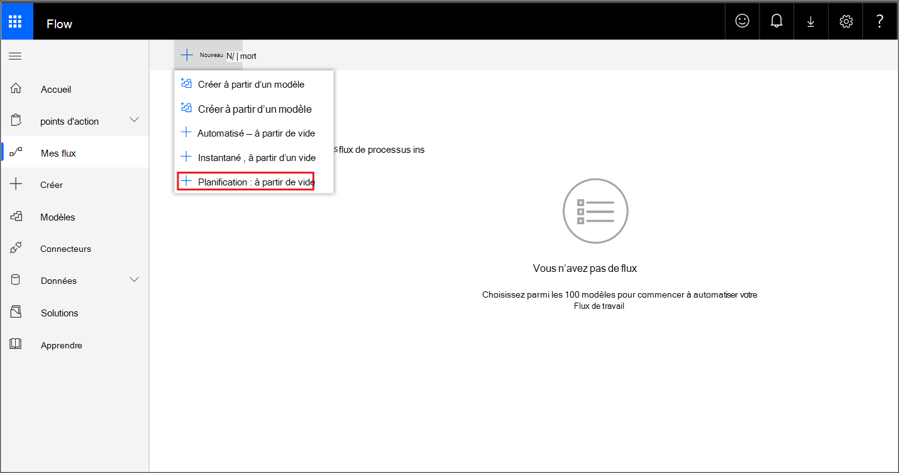
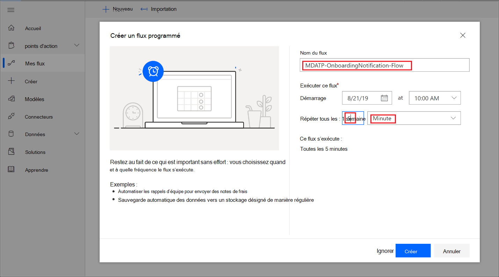
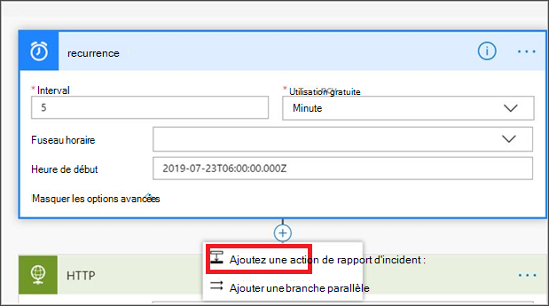
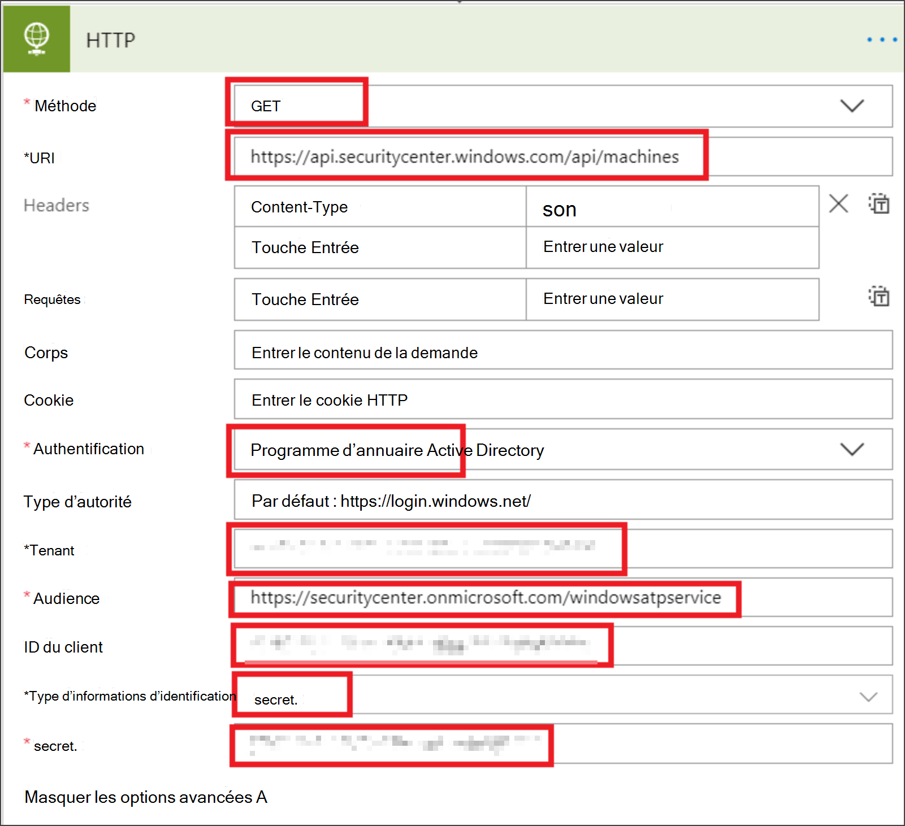
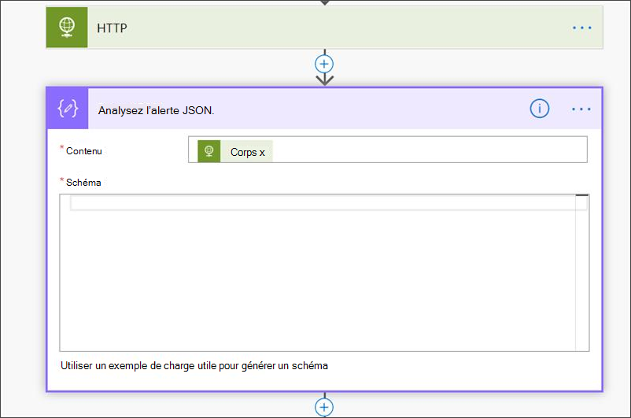
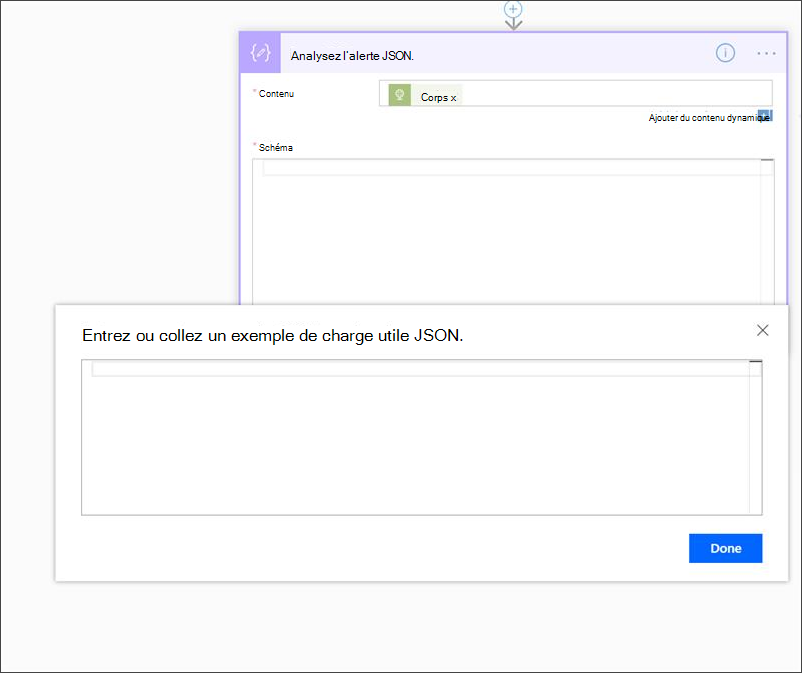
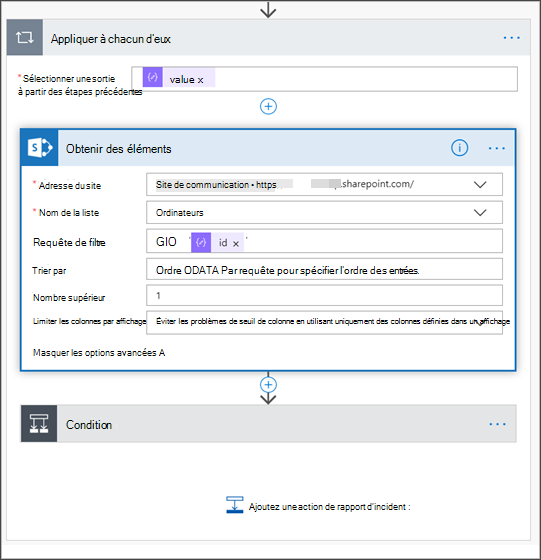
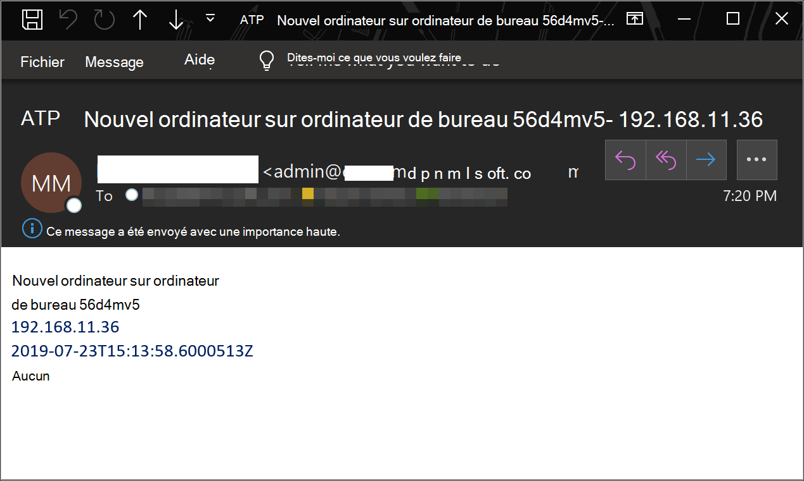

# <a name="create-a-notification-rule-when-a-local-onboarding-or-offboarding-script-is-used"></a><span data-ttu-id="382ff-104">Créer une règle de notification lorsqu’un script d’intégration ou de mise hors-carte local est utilisé</span><span class="sxs-lookup"><span data-stu-id="382ff-104">Create a notification rule when a local onboarding or offboarding script is used</span></span>

[!INCLUDE [Microsoft 365 Defender rebranding](../../includes/microsoft-defender.md)]


<span data-ttu-id="382ff-105">**S’applique à :**</span><span class="sxs-lookup"><span data-stu-id="382ff-105">**Applies to:**</span></span>
- [<span data-ttu-id="382ff-106">Microsoft Defender pour point de terminaison</span><span class="sxs-lookup"><span data-stu-id="382ff-106">Microsoft Defender for Endpoint</span></span>](https://go.microsoft.com/fwlink/p/?linkid=2154037)
- [<span data-ttu-id="382ff-107">Microsoft 365 Defender</span><span class="sxs-lookup"><span data-stu-id="382ff-107">Microsoft 365 Defender</span></span>](https://go.microsoft.com/fwlink/?linkid=2118804)


> <span data-ttu-id="382ff-108">Vous souhaitez découvrir Microsoft Defender pour le point de terminaison ?</span><span class="sxs-lookup"><span data-stu-id="382ff-108">Want to experience Microsoft Defender for Endpoint?</span></span> [<span data-ttu-id="382ff-109">Inscrivez-vous à un essai gratuit.</span><span class="sxs-lookup"><span data-stu-id="382ff-109">Sign up for a free trial.</span></span>](https://www.microsoft.com/microsoft-365/windows/microsoft-defender-atp?ocid=docs-wdatp-exposedapis-abovefoldlink)

[!include[Microsoft Defender for Endpoint API URIs for US Government](../../includes/microsoft-defender-api-usgov.md)]

[!include[Improve request performance](../../includes/improve-request-performance.md)]


<span data-ttu-id="382ff-110">Créez une règle de notification afin que, lorsqu’un script d’intégration ou de déclassage local soit utilisé, vous soyez averti.</span><span class="sxs-lookup"><span data-stu-id="382ff-110">Create a notification rule so that when a local onboarding or offboarding script is used, you'll be notified.</span></span> 

## <a name="before-you-begin"></a><span data-ttu-id="382ff-111">Avant de commencer</span><span class="sxs-lookup"><span data-stu-id="382ff-111">Before you begin</span></span>
<span data-ttu-id="382ff-112">Vous devez avoir accès à :</span><span class="sxs-lookup"><span data-stu-id="382ff-112">You'll need to have access to:</span></span>
 - <span data-ttu-id="382ff-113">Microsoft Flow (Flow plan 1 au minimum).</span><span class="sxs-lookup"><span data-stu-id="382ff-113">Microsoft Flow (Flow Plan 1 at a minimum).</span></span> <span data-ttu-id="382ff-114">Pour plus d’informations, [voir Flow page de tarification.](https://flow.microsoft.com/pricing/)</span><span class="sxs-lookup"><span data-stu-id="382ff-114">For more information, see [Flow pricing page](https://flow.microsoft.com/pricing/).</span></span>
 - <span data-ttu-id="382ff-115">Liste ou bibliothèque azure SharePoint ou bibliothèque/SQL DB</span><span class="sxs-lookup"><span data-stu-id="382ff-115">Azure Table or SharePoint List or Library / SQL DB</span></span>

## <a name="create-the-notification-flow"></a><span data-ttu-id="382ff-116">Créer le flux de notification</span><span class="sxs-lookup"><span data-stu-id="382ff-116">Create the notification flow</span></span>

1. <span data-ttu-id="382ff-117">Dans [flow.microsoft.com](https://flow.microsoft.com/).</span><span class="sxs-lookup"><span data-stu-id="382ff-117">In [flow.microsoft.com](https://flow.microsoft.com/).</span></span>

2. <span data-ttu-id="382ff-118">Accédez **à Mes flux > Nouveau > programmé - à partir d’un espace vide.**</span><span class="sxs-lookup"><span data-stu-id="382ff-118">Navigate to **My flows > New > Scheduled - from blank**.</span></span> 

    


3. <span data-ttu-id="382ff-120">Créez un flux programmé.</span><span class="sxs-lookup"><span data-stu-id="382ff-120">Build a scheduled flow.</span></span>
   1. <span data-ttu-id="382ff-121">Entrez un nom de flux.</span><span class="sxs-lookup"><span data-stu-id="382ff-121">Enter a flow name.</span></span>
   2. <span data-ttu-id="382ff-122">Spécifiez le début et l’heure.</span><span class="sxs-lookup"><span data-stu-id="382ff-122">Specify the start and time.</span></span>
   3. <span data-ttu-id="382ff-123">Spécifiez la fréquence.</span><span class="sxs-lookup"><span data-stu-id="382ff-123">Specify the frequency.</span></span> <span data-ttu-id="382ff-124">Par exemple, toutes les 5 minutes.</span><span class="sxs-lookup"><span data-stu-id="382ff-124">For example, every 5 minutes.</span></span>

    

4. <span data-ttu-id="382ff-126">Sélectionnez le bouton + pour ajouter une nouvelle action.</span><span class="sxs-lookup"><span data-stu-id="382ff-126">Select the + button to add a new action.</span></span> <span data-ttu-id="382ff-127">La nouvelle action sera une demande HTTP à l’API du centre de sécurité Defender for Endpoint.</span><span class="sxs-lookup"><span data-stu-id="382ff-127">The new action will be an HTTP request to the Defender for Endpoint security center device(s) API.</span></span> <span data-ttu-id="382ff-128">Vous pouvez également le remplacer par le « connecteur WDATP » prédéfait (action : « Ordinateurs - Obtenir la liste des ordinateurs »).</span><span class="sxs-lookup"><span data-stu-id="382ff-128">You can also replace it with the out-of-the-box "WDATP Connector" (action: "Machines - Get list of machines").</span></span> 

    


5. <span data-ttu-id="382ff-130">Entrez les champs HTTP suivants :</span><span class="sxs-lookup"><span data-stu-id="382ff-130">Enter the following HTTP fields:</span></span>

   - <span data-ttu-id="382ff-131">Méthode : « GET » comme valeur pour obtenir la liste des appareils.</span><span class="sxs-lookup"><span data-stu-id="382ff-131">Method: "GET" as a value to get the list of devices.</span></span>
   - <span data-ttu-id="382ff-132">URI : Entrez `https://api.securitycenter.microsoft.com/api/machines` .</span><span class="sxs-lookup"><span data-stu-id="382ff-132">URI: Enter `https://api.securitycenter.microsoft.com/api/machines`.</span></span>
   - <span data-ttu-id="382ff-133">Authentification : sélectionnez « Active Directory OAuth ».</span><span class="sxs-lookup"><span data-stu-id="382ff-133">Authentication: Select "Active Directory OAuth".</span></span>
   - <span data-ttu-id="382ff-134">Client : connectez-vous et accédez à Azure Active Directory > inscriptions d’application et obtenez la valeur https://portal.azure.com de l’ID de client. </span><span class="sxs-lookup"><span data-stu-id="382ff-134">Tenant: Sign-in to https://portal.azure.com and navigate to **Azure Active Directory > App Registrations** and get the Tenant ID value.</span></span>
   - <span data-ttu-id="382ff-135">Public : `https://securitycenter.onmicrosoft.com/windowsatpservice\`</span><span class="sxs-lookup"><span data-stu-id="382ff-135">Audience: `https://securitycenter.onmicrosoft.com/windowsatpservice\`</span></span>
   - <span data-ttu-id="382ff-136">ID client : connectez-vous et accédez à Azure Active Directory >'inscription de l’application et obtenez la valeur https://portal.azure.com de l’ID client. </span><span class="sxs-lookup"><span data-stu-id="382ff-136">Client ID: Sign-in to https://portal.azure.com and navigate to **Azure Active Directory > App Registrations** and  get the Client ID value.</span></span>
   - <span data-ttu-id="382ff-137">Type d’informations d’identification : sélectionnez « Secret ».</span><span class="sxs-lookup"><span data-stu-id="382ff-137">Credential Type: Select "Secret".</span></span>
   - <span data-ttu-id="382ff-138">Secret : connectez-vous et accédez à https://portal.azure.com **Azure Active Directory > inscriptions d’application** et obtenez la valeur de l’ID de client.</span><span class="sxs-lookup"><span data-stu-id="382ff-138">Secret: Sign-in to https://portal.azure.com and navigate to **Azure Active Directory > App Registrations** and get the Tenant ID value.</span></span>

    


6. <span data-ttu-id="382ff-140">Ajoutez une nouvelle étape en sélectionnant Ajouter une **nouvelle action,** puis recherchez opérations de **données** et sélectionnez Analyse **JSON**.</span><span class="sxs-lookup"><span data-stu-id="382ff-140">Add a new step by selecting **Add new action** then search for **Data Operations** and select **Parse JSON**.</span></span>

    

7. <span data-ttu-id="382ff-142">Ajouter le corps dans **le champ** Contenu.</span><span class="sxs-lookup"><span data-stu-id="382ff-142">Add Body in the **Content** field.</span></span>

    

8. <span data-ttu-id="382ff-144">Sélectionnez **l’exemple de charge utile Utiliser pour générer un lien de** schéma.</span><span class="sxs-lookup"><span data-stu-id="382ff-144">Select the **Use sample payload to generate schema** link.</span></span>

    

9. <span data-ttu-id="382ff-146">Copiez et collez l’extrait de code JSON suivant :</span><span class="sxs-lookup"><span data-stu-id="382ff-146">Copy and paste the following JSON snippet:</span></span>

    ```
    {
        "type": "object",
        "properties": {
            "@@odata.context": {
                "type": "string"
            },
            "value": {
                "type": "array",
                "items": {
                    "type": "object",
                    "properties": {
                        "id": {
                            "type": "string"
                        },
                        "computerDnsName": {
                            "type": "string"
                        },
                        "firstSeen": {
                            "type": "string"
                        },
                        "lastSeen": {
                            "type": "string"
                        },
                        "osPlatform": {
                            "type": "string"
                        },
                        "osVersion": {},
                        "lastIpAddress": {
                            "type": "string"
                        },
                        "lastExternalIpAddress": {
                            "type": "string"
                        },
                        "agentVersion": {
                            "type": "string"
                        },
                        "osBuild": {
                            "type": "integer"
                        },
                        "healthStatus": {
                            "type": "string"
                        },
                        "riskScore": {
                            "type": "string"
                        },
                        "exposureScore": {
                            "type": "string"
                        },
                        "aadDeviceId": {},
                        "machineTags": {
                            "type": "array"
                        }
                    },
                    "required": [
                        "id",
                        "computerDnsName",
                        "firstSeen",
                        "lastSeen",
                        "osPlatform",
                        "osVersion",
                        "lastIpAddress",
                        "lastExternalIpAddress",
                        "agentVersion",
                        "osBuild",
                        "healthStatus",
                        "rbacGroupId",
                        "rbacGroupName",
                        "riskScore",
                        "exposureScore",
                        "aadDeviceId",
                        "machineTags"
                    ]
                }
            }
        }
    }

    ```

10.  <span data-ttu-id="382ff-147">Extrayez les valeurs de l’appel JSON et vérifiez si le ou les appareils intégrés sont / sont déjà inscrits dans la liste SharePoint par exemple :</span><span class="sxs-lookup"><span data-stu-id="382ff-147">Extract the values from the JSON call and check if the onboarded device(s) is / are already registered at the SharePoint list as an example:</span></span>
- <span data-ttu-id="382ff-148">Si oui, aucune notification ne sera déclenchée</span><span class="sxs-lookup"><span data-stu-id="382ff-148">If yes, no notification will be triggered</span></span>
- <span data-ttu-id="382ff-149">Si non, enregistre le ou les nouveaux appareils intégrés dans la liste SharePoint et une notification est envoyée à l’administrateur de Defender for Endpoint</span><span class="sxs-lookup"><span data-stu-id="382ff-149">If no, will register the new onboarded device(s) in the SharePoint list and a notification will be sent to the Defender for Endpoint admin</span></span>

    

    

11. <span data-ttu-id="382ff-152">Under **Condition**, add the following expression: « length(body('Get_items')?[' value']) » et définissez la condition sur 0.</span><span class="sxs-lookup"><span data-stu-id="382ff-152">Under **Condition**, add the following expression: "length(body('Get_items')?['value'])" and set the condition to equal to 0.</span></span>

    <span data-ttu-id="382ff-153"></span><span class="sxs-lookup"><span data-stu-id="382ff-153"></span></span>  
    <span data-ttu-id="382ff-154"> 
     </span><span class="sxs-lookup"><span data-stu-id="382ff-154"> 
    </span></span>  
<span data-ttu-id="382ff-155"></span><span class="sxs-lookup"><span data-stu-id="382ff-155"></span></span>

## <a name="alert-notification"></a><span data-ttu-id="382ff-156">Notification d’alerte</span><span class="sxs-lookup"><span data-stu-id="382ff-156">Alert notification</span></span>
<span data-ttu-id="382ff-157">L’image suivante est un exemple de notification par courrier électronique.</span><span class="sxs-lookup"><span data-stu-id="382ff-157">The following image is an example of an email notification.</span></span>




## <a name="tips"></a><span data-ttu-id="382ff-159">Conseils</span><span class="sxs-lookup"><span data-stu-id="382ff-159">Tips</span></span>

- <span data-ttu-id="382ff-160">Vous pouvez filtrer ici à l’aide de lastSeen uniquement :</span><span class="sxs-lookup"><span data-stu-id="382ff-160">You can filter here using lastSeen only:</span></span>
    - <span data-ttu-id="382ff-161">Toutes les 60 min :</span><span class="sxs-lookup"><span data-stu-id="382ff-161">Every 60 min:</span></span>
      - <span data-ttu-id="382ff-162">Prenez tous les appareils vus pour la dernière fois au cours des 7 derniers jours.</span><span class="sxs-lookup"><span data-stu-id="382ff-162">Take all devices last seen in the past 7 days.</span></span> 

- <span data-ttu-id="382ff-163">Pour chaque appareil :</span><span class="sxs-lookup"><span data-stu-id="382ff-163">For each device:</span></span> 
    - <span data-ttu-id="382ff-164">Si la dernière propriété vue se trouve sur l’intervalle d’une heure de [-7 jours, -7days + 60 minutes] -> alerte pour la possibilité d’interruption de l’utilisation.</span><span class="sxs-lookup"><span data-stu-id="382ff-164">If last seen property is on the one hour interval of [-7 days, -7days + 60 minutes ] -> Alert for offboarding possibility.</span></span>
    - <span data-ttu-id="382ff-165">Si le premier aperçu a lieu au cours de l’heure >'alerte d’intégration.</span><span class="sxs-lookup"><span data-stu-id="382ff-165">If first seen is on the past hour -> Alert for onboarding.</span></span>

<span data-ttu-id="382ff-166">Dans cette solution, vous n’aurez pas d’alertes en double : il existe des locataires qui ont de nombreux appareils.</span><span class="sxs-lookup"><span data-stu-id="382ff-166">In this solution you will not have duplicate alerts: There are tenants that have numerous devices.</span></span> <span data-ttu-id="382ff-167">L’obtention de tous ces appareils peut être très coûteuse et nécessiter une pagination.</span><span class="sxs-lookup"><span data-stu-id="382ff-167">Getting all those devices might be very expensive and might require paging.</span></span>

<span data-ttu-id="382ff-168">Vous pouvez le fractionner en deux requêtes :</span><span class="sxs-lookup"><span data-stu-id="382ff-168">You can split it to two queries:</span></span> 
1.  <span data-ttu-id="382ff-169">Pour laboarding, prenez uniquement cet intervalle à l’aide de la $filter OData et notifiez uniquement si les conditions sont remplies.</span><span class="sxs-lookup"><span data-stu-id="382ff-169">For offboarding take only this interval using the OData $filter and only notify if the conditions are met.</span></span>
2.  <span data-ttu-id="382ff-170">Prenez tous les appareils vus pour la dernière fois au cours de l’heure passée et vérifiez leur première propriété vue (si la première propriété vue se trouve au cours de l’heure passée, la dernière vue doit également être là).</span><span class="sxs-lookup"><span data-stu-id="382ff-170">Take all devices last seen in the past hour and check first seen property for them (if the first seen property is on the past hour, the last seen must be there too).</span></span> 

