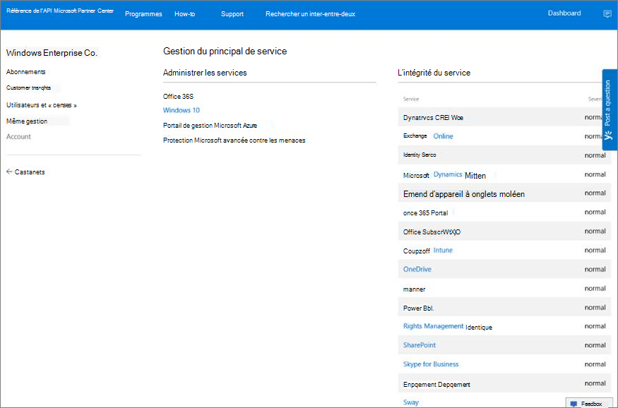
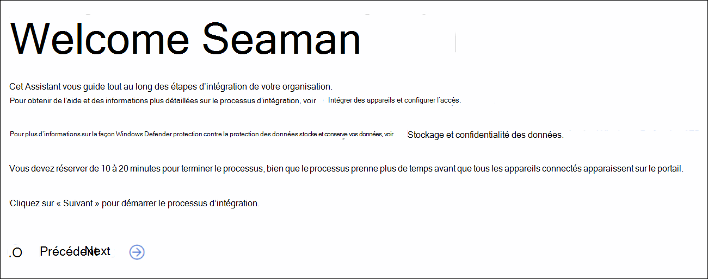
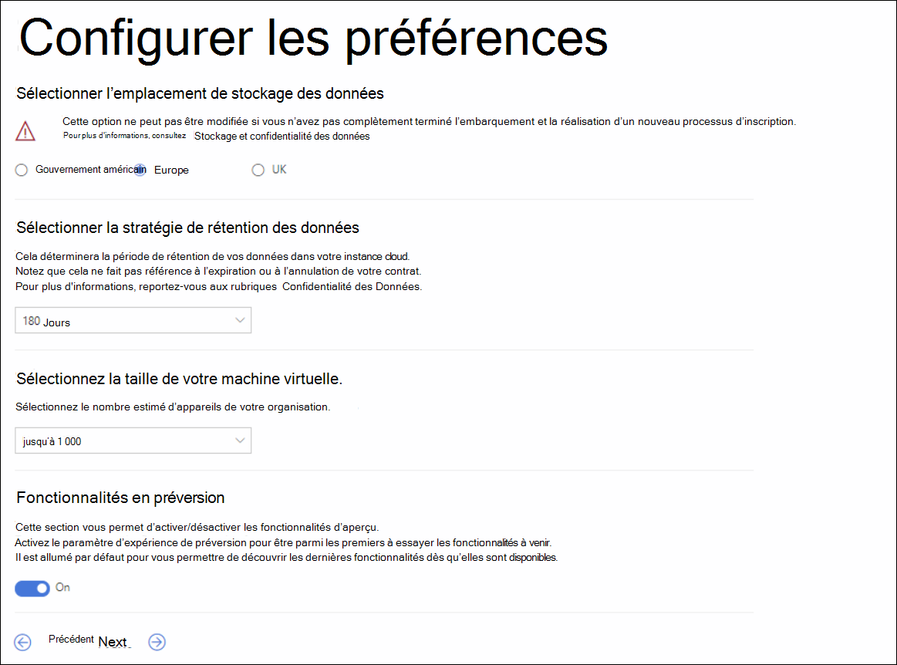
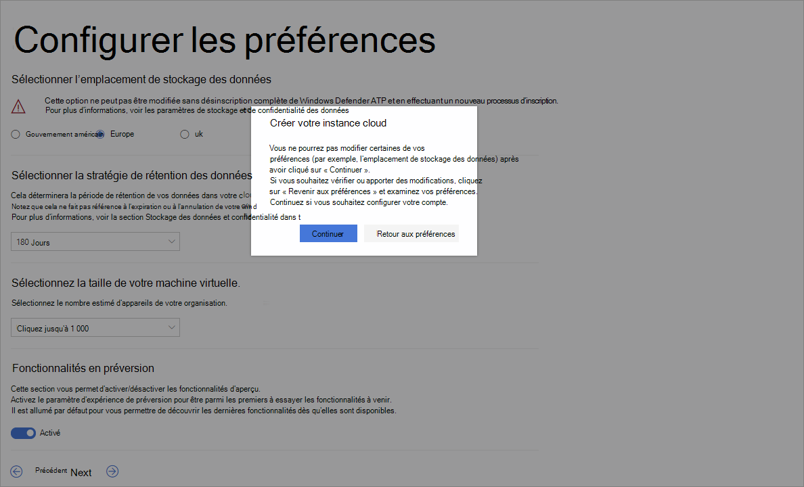

# <a name="set-up-microsoft-defender-for-endpoint-deployment"></a><span data-ttu-id="10c04-104">Configurer Microsoft Defender pour le déploiement de point de terminaison</span><span class="sxs-lookup"><span data-stu-id="10c04-104">Set up Microsoft Defender for Endpoint deployment</span></span>

[!INCLUDE [Microsoft 365 Defender rebranding](../../includes/microsoft-defender.md)]


<span data-ttu-id="10c04-105">**S’applique à :**</span><span class="sxs-lookup"><span data-stu-id="10c04-105">**Applies to:**</span></span>
- [<span data-ttu-id="10c04-106">Microsoft Defender pour point de terminaison</span><span class="sxs-lookup"><span data-stu-id="10c04-106">Microsoft Defender for Endpoint</span></span>](https://go.microsoft.com/fwlink/p/?linkid=2146631)
- [<span data-ttu-id="10c04-107">Microsoft 365 Defender</span><span class="sxs-lookup"><span data-stu-id="10c04-107">Microsoft 365 Defender</span></span>](https://go.microsoft.com/fwlink/?linkid=2118804)

> <span data-ttu-id="10c04-108">Vous souhaitez découvrir Microsoft Defender pour le point de terminaison ?</span><span class="sxs-lookup"><span data-stu-id="10c04-108">Want to experience Microsoft Defender for Endpoint?</span></span> [<span data-ttu-id="10c04-109">Inscrivez-vous à un essai gratuit.</span><span class="sxs-lookup"><span data-stu-id="10c04-109">Sign up for a free trial.</span></span>](https://www.microsoft.com/microsoft-365/windows/microsoft-defender-atp?ocid=docs-wdatp-exposedapis-abovefoldlink)

<span data-ttu-id="10c04-110">Le déploiement de Defender pour endpoint est un processus en trois phases :</span><span class="sxs-lookup"><span data-stu-id="10c04-110">Deploying Defender for Endpoint is a three-phase process:</span></span>

| <span data-ttu-id="10c04-111">[](prepare-deployment.md)</span><span class="sxs-lookup"><span data-stu-id="10c04-111">[](prepare-deployment.md)</span></span><br>[<span data-ttu-id="10c04-112">Phase 1 : Préparer</span><span class="sxs-lookup"><span data-stu-id="10c04-112">Phase 1: Prepare</span></span>](prepare-deployment.md) | <br><span data-ttu-id="10c04-114">Phase 2 : Installation</span><span class="sxs-lookup"><span data-stu-id="10c04-114">Phase 2: Setup</span></span> | <span data-ttu-id="10c04-115">[](onboarding.md)</span><span class="sxs-lookup"><span data-stu-id="10c04-115">[](onboarding.md)</span></span><br>[<span data-ttu-id="10c04-116">Phase 3 : Intégration</span><span class="sxs-lookup"><span data-stu-id="10c04-116">Phase 3: Onboard</span></span>](onboarding.md) |
| ----- | ----- | ----- |
| | <span data-ttu-id="10c04-117">*Vous êtes là !*</span><span class="sxs-lookup"><span data-stu-id="10c04-117">*You are here!*</span></span>||

<span data-ttu-id="10c04-118">Vous êtes actuellement en phase de mise en place.</span><span class="sxs-lookup"><span data-stu-id="10c04-118">You are currently in the set-up phase.</span></span>

<span data-ttu-id="10c04-119">Dans ce scénario de déploiement, vous serez guidé dans les étapes suivantes :</span><span class="sxs-lookup"><span data-stu-id="10c04-119">In this deployment scenario, you'll be guided through the steps on:</span></span>
- <span data-ttu-id="10c04-120">Validation des licences</span><span class="sxs-lookup"><span data-stu-id="10c04-120">Licensing validation</span></span>
- <span data-ttu-id="10c04-121">Configuration du client</span><span class="sxs-lookup"><span data-stu-id="10c04-121">Tenant configuration</span></span>
- <span data-ttu-id="10c04-122">Configuration réseau</span><span class="sxs-lookup"><span data-stu-id="10c04-122">Network configuration</span></span>


>[!NOTE]
><span data-ttu-id="10c04-123">Pour vous guider tout au long d’un déploiement classique, ce scénario couvre uniquement l’utilisation de Microsoft Endpoint Configuration Manager.</span><span class="sxs-lookup"><span data-stu-id="10c04-123">For the purpose of guiding you through a typical deployment, this scenario will only cover the use of Microsoft Endpoint Configuration Manager.</span></span> <span data-ttu-id="10c04-124">Defender pour le point de terminaison prend en charge l’utilisation d’autres outils d’intégration, mais ne couvre pas ces scénarios dans le guide de déploiement.</span><span class="sxs-lookup"><span data-stu-id="10c04-124">Defender for Endpoint supports the use of other onboarding tools but will not cover those scenarios in the deployment guide.</span></span> <span data-ttu-id="10c04-125">Pour plus d’informations, [voir Onboard devices to Microsoft Defender for Endpoint](onboard-configure.md).</span><span class="sxs-lookup"><span data-stu-id="10c04-125">For more information, see [Onboard devices to Microsoft Defender for Endpoint](onboard-configure.md).</span></span>

## <a name="check-license-state"></a><span data-ttu-id="10c04-126">Vérifier l’état de la licence</span><span class="sxs-lookup"><span data-stu-id="10c04-126">Check license state</span></span>

<span data-ttu-id="10c04-127">La vérification de l’état de la licence et si elle a été correctement mise en service peut être effectuée via le Centre d’administration ou via le portail **Microsoft Azure.**</span><span class="sxs-lookup"><span data-stu-id="10c04-127">Checking for the license state and whether it got properly provisioned, can be done through the admin center or through the **Microsoft Azure portal**.</span></span>

1. <span data-ttu-id="10c04-128">Pour afficher vos licences, accédez au portail **Microsoft Azure** et accédez à la section licence du portail [Microsoft Azure.](https://portal.azure.com/#blade/Microsoft_AAD_IAM/LicensesMenuBlade/Products)</span><span class="sxs-lookup"><span data-stu-id="10c04-128">To view your licenses, go to the **Microsoft Azure portal** and navigate to the [Microsoft Azure portal license section](https://portal.azure.com/#blade/Microsoft_AAD_IAM/LicensesMenuBlade/Products).</span></span>

   

1. <span data-ttu-id="10c04-130">Vous pouvez également accéder aux abonnements de facturation dans le Centre  >  **d’administration.**</span><span class="sxs-lookup"><span data-stu-id="10c04-130">Alternately, in the admin center, navigate to **Billing** > **Subscriptions**.</span></span>

    <span data-ttu-id="10c04-131">Sur l’écran, vous verrez toutes les licences provisionées et leur état **actuel.**</span><span class="sxs-lookup"><span data-stu-id="10c04-131">On the screen, you will see all the provisioned licenses and their current **Status**.</span></span>

    


## <a name="cloud-service-provider-validation"></a><span data-ttu-id="10c04-133">Validation du fournisseur de services Cloud</span><span class="sxs-lookup"><span data-stu-id="10c04-133">Cloud Service Provider validation</span></span>

<span data-ttu-id="10c04-134">Pour accéder aux licences qui sont provisionn es pour votre entreprise et vérifier l’état des licences, accédez au Centre d’administration.</span><span class="sxs-lookup"><span data-stu-id="10c04-134">To gain access into which licenses are provisioned to your company, and to check the state of the licenses, go to the admin center.</span></span>

1. <span data-ttu-id="10c04-135">À partir du **portail partenaire,** **sélectionnez Administrer les services > Office 365.**</span><span class="sxs-lookup"><span data-stu-id="10c04-135">From the **Partner portal**, select **Administer services > Office 365**.</span></span>

2. <span data-ttu-id="10c04-136">En cliquant sur le **lien du portail** partenaire, l’option **Administrateur** de la part de s’ouvre et vous donne accès au Centre d’administration du client.</span><span class="sxs-lookup"><span data-stu-id="10c04-136">Clicking on the **Partner portal** link will open the **Admin on behalf** option and will give you access to the customer admin center.</span></span>

   


## <a name="tenant-configuration"></a><span data-ttu-id="10c04-138">Configuration du client</span><span class="sxs-lookup"><span data-stu-id="10c04-138">Tenant Configuration</span></span>

<span data-ttu-id="10c04-139">Lorsque vous accédez au Centre de sécurité Microsoft Defender pour la première fois, un Assistant vous guidera tout au long des étapes initiales.</span><span class="sxs-lookup"><span data-stu-id="10c04-139">When accessing Microsoft Defender Security Center for the first time, a wizard that will guide you through some initial steps.</span></span> <span data-ttu-id="10c04-140">À la fin de l’Assistant Installation, une instance cloud dédiée de Defender for Endpoint sera créée.</span><span class="sxs-lookup"><span data-stu-id="10c04-140">At the end of the setup wizard, there will be a dedicated cloud instance of Defender for Endpoint created.</span></span> <span data-ttu-id="10c04-141">La méthode la plus simple consiste à effectuer ces étapes à partir d’un appareil client Windows 10.</span><span class="sxs-lookup"><span data-stu-id="10c04-141">The easiest method is to perform these steps from a Windows 10 client device.</span></span>

1. <span data-ttu-id="10c04-142">À partir d’un navigateur web, accédez à <https://securitycenter.windows.com> .</span><span class="sxs-lookup"><span data-stu-id="10c04-142">From a web browser, navigate to <https://securitycenter.windows.com>.</span></span>

    

2. <span data-ttu-id="10c04-144">Si vous êtes titulaire d’une licence TRIAL, allez sur le lien ( <https://signup.microsoft.com/Signup?OfferId=6033e4b5-c320-4008-a936-909c2825d83c&dl=WIN_DEF_ATP&pc=xxxxxxx-xxxxxx-xxx-x> )</span><span class="sxs-lookup"><span data-stu-id="10c04-144">If going through a TRIAL license, go to the link (<https://signup.microsoft.com/Signup?OfferId=6033e4b5-c320-4008-a936-909c2825d83c&dl=WIN_DEF_ATP&pc=xxxxxxx-xxxxxx-xxx-x>)</span></span>

    <span data-ttu-id="10c04-145">Une fois l’étape d’autorisation terminée, **l’écran d’accueil** s’affiche.</span><span class="sxs-lookup"><span data-stu-id="10c04-145">Once the authorization step is completed, the **Welcome** screen will be displayed.</span></span>
3. <span data-ttu-id="10c04-146">Suivre les étapes d’autorisation.</span><span class="sxs-lookup"><span data-stu-id="10c04-146">Go through the authorization steps.</span></span>

    

4. <span data-ttu-id="10c04-148">Configurer les préférences.</span><span class="sxs-lookup"><span data-stu-id="10c04-148">Set up preferences.</span></span>

   <span data-ttu-id="10c04-149">**Emplacement de stockage des** données : il est important de le configurer correctement.</span><span class="sxs-lookup"><span data-stu-id="10c04-149">**Data storage location** - It's important to set this up correctly.</span></span> <span data-ttu-id="10c04-150">Déterminez où le client souhaite être hébergé principalement : États-Unis, Ue ou Royaume-Uni.</span><span class="sxs-lookup"><span data-stu-id="10c04-150">Determine where the customer wants to be primarily hosted: US, EU, or UK.</span></span> <span data-ttu-id="10c04-151">Vous ne pouvez pas modifier l’emplacement après cette mise en place et Microsoft ne transférera pas les données à partir de la géolocalisation spécifiée.</span><span class="sxs-lookup"><span data-stu-id="10c04-151">You cannot change the location after this set up and Microsoft will not transfer the data from the specified geolocation.</span></span> 

    <span data-ttu-id="10c04-152">**Rétention des données** : la valeur par défaut est de six mois.</span><span class="sxs-lookup"><span data-stu-id="10c04-152">**Data retention** - The default is six months.</span></span>

    <span data-ttu-id="10c04-153">**Activer les fonctionnalités d’aperçu** : la valeur par défaut est activée et peut être modifiée ultérieurement.</span><span class="sxs-lookup"><span data-stu-id="10c04-153">**Enable preview features** - The default is on, can be changed later.</span></span>

    

5. <span data-ttu-id="10c04-155">Sélectionnez **Suivant**.</span><span class="sxs-lookup"><span data-stu-id="10c04-155">Select **Next**.</span></span>

     

6. <span data-ttu-id="10c04-157">Sélectionnez **Continuer**.</span><span class="sxs-lookup"><span data-stu-id="10c04-157">Select **Continue**.</span></span>


## <a name="network-configuration"></a><span data-ttu-id="10c04-158">Configuration réseau</span><span class="sxs-lookup"><span data-stu-id="10c04-158">Network configuration</span></span>
<span data-ttu-id="10c04-159">Si l’organisation n’exige pas que les points de terminaison utilisent un proxy pour accéder à Internet, ignorez cette section.</span><span class="sxs-lookup"><span data-stu-id="10c04-159">If the organization does not require the endpoints to use a Proxy to access the Internet, skip this section.</span></span>

<span data-ttu-id="10c04-160">Le capteur Microsoft Defender pour point de terminaison requiert Microsoft Windows HTTP (WinHTTP) pour signaler les données du capteur et communiquer avec le service Microsoft Defender pour point de terminaison.</span><span class="sxs-lookup"><span data-stu-id="10c04-160">The Microsoft Defender for Endpoint sensor requires Microsoft Windows HTTP (WinHTTP) to report sensor data and communicate with the Microsoft Defender for Endpoint service.</span></span> <span data-ttu-id="10c04-161">Le capteur Microsoft Defender for Endpoint incorporé s’exécute dans le contexte système à l’aide du compte LocalSystem.</span><span class="sxs-lookup"><span data-stu-id="10c04-161">The embedded Microsoft Defender for Endpoint sensor runs in the system context using the LocalSystem account.</span></span> <span data-ttu-id="10c04-162">Le capteur utilise les services Microsoft Windows HTTP Services (WinHTTP) pour activer la communication avec le service Cloud Microsoft Defender pour point de terminaison.</span><span class="sxs-lookup"><span data-stu-id="10c04-162">The sensor uses Microsoft Windows HTTP Services (WinHTTP) to enable communication with the Microsoft Defender for Endpoint cloud service.</span></span> <span data-ttu-id="10c04-163">Le paramètre de configuration WinHTTP est indépendant des paramètres de proxy de navigation Internet De Windows Internet (WinINet) et peut uniquement découvrir un serveur proxy à l’aide des méthodes de découverte suivantes :</span><span class="sxs-lookup"><span data-stu-id="10c04-163">The WinHTTP configuration setting is independent of the Windows Internet (WinINet) internet browsing proxy settings and can only discover a proxy server by using the following discovery methods:</span></span>

<span data-ttu-id="10c04-164">**Méthodes de découverte automatique :**</span><span class="sxs-lookup"><span data-stu-id="10c04-164">**Autodiscovery methods:**</span></span>

-   <span data-ttu-id="10c04-165">Proxy transparent</span><span class="sxs-lookup"><span data-stu-id="10c04-165">Transparent proxy</span></span>

-   <span data-ttu-id="10c04-166">WPAD (Web Proxy Autodiscovery Protocol)</span><span class="sxs-lookup"><span data-stu-id="10c04-166">Web Proxy Autodiscovery Protocol (WPAD)</span></span>

<span data-ttu-id="10c04-167">Si un proxy transparent ou un WPAD a été implémenté dans la topologie réseau, il n’est pas nécessaire de définir des paramètres de configuration spéciaux.</span><span class="sxs-lookup"><span data-stu-id="10c04-167">If a Transparent proxy or WPAD has been implemented in the network topology, there is no need for special configuration settings.</span></span> <span data-ttu-id="10c04-168">Pour plus d’informations sur les exclusions d’URL de point de terminaison Microsoft Defender dans le proxy, consultez la section Annexe de ce document pour obtenir la liste des URL permises ou des documents [Microsoft.](https://docs.microsoft.com/windows/security/threat-protection/windows-defender-atp/configure-proxy-internet-windows-defender-advanced-threat-protection#enable-access-to-windows-defender-atp-service-urls-in-the-proxy-server)</span><span class="sxs-lookup"><span data-stu-id="10c04-168">For more information on Microsoft Defender for Endpoint URL exclusions in the proxy, see the Appendix section in this document for the URLs allow list or on [Microsoft Docs](https://docs.microsoft.com/windows/security/threat-protection/windows-defender-atp/configure-proxy-internet-windows-defender-advanced-threat-protection#enable-access-to-windows-defender-atp-service-urls-in-the-proxy-server).</span></span>

> [!NOTE]
> <span data-ttu-id="10c04-169">Pour obtenir la liste détaillée des URL qui doivent être autorisées, consultez [cet article.](https://docs.microsoft.com/windows/security/threat-protection/microsoft-defender-antivirus/configure-network-connections-microsoft-defender-antivirus)</span><span class="sxs-lookup"><span data-stu-id="10c04-169">For a detailed list of URLs that need to be allowed, please see [this article](https://docs.microsoft.com/windows/security/threat-protection/microsoft-defender-antivirus/configure-network-connections-microsoft-defender-antivirus).</span></span>

<span data-ttu-id="10c04-170">**Configuration manuelle du proxy statique :**</span><span class="sxs-lookup"><span data-stu-id="10c04-170">**Manual static proxy configuration:**</span></span>

-   <span data-ttu-id="10c04-171">Configuration basée sur le Registre</span><span class="sxs-lookup"><span data-stu-id="10c04-171">Registry-based configuration</span></span>

-   <span data-ttu-id="10c04-172">WinHTTP configuré à l’aide de la commande netsh</span><span class="sxs-lookup"><span data-stu-id="10c04-172">WinHTTP configured using netsh command</span></span> <br> <span data-ttu-id="10c04-173">Convient uniquement aux ordinateurs de bureau dans une topologie stable (par exemple : un bureau dans un réseau d’entreprise derrière le même proxy)</span><span class="sxs-lookup"><span data-stu-id="10c04-173">Suitable only for desktops in a stable topology (for example: a desktop in a corporate network behind the same proxy)</span></span>

### <a name="configure-the-proxy-server-manually-using-a-registry-based-static-proxy"></a><span data-ttu-id="10c04-174">Configurer le serveur proxy manuellement en utilisant un proxy statique basé sur le registre</span><span class="sxs-lookup"><span data-stu-id="10c04-174">Configure the proxy server manually using a registry-based static proxy</span></span>

<span data-ttu-id="10c04-175">Configurez un proxy statique basé sur le Registre pour autoriser uniquement le capteur Microsoft Defender for Endpoint à signaler les données de diagnostic et à communiquer avec Microsoft Defender pour les services Endpoint si un ordinateur n’est pas autorisé à se connecter à Internet.</span><span class="sxs-lookup"><span data-stu-id="10c04-175">Configure a registry-based static proxy to allow only Microsoft Defender for Endpoint sensor to report diagnostic data and communicate with Microsoft Defender for Endpoint services if a computer is not permitted to connect to the Internet.</span></span> <span data-ttu-id="10c04-176">Le proxy statique est configurable via une stratégie de groupe.</span><span class="sxs-lookup"><span data-stu-id="10c04-176">The static proxy is configurable through Group Policy (GP).</span></span> <span data-ttu-id="10c04-177">La stratégie de groupe se trouve sous :</span><span class="sxs-lookup"><span data-stu-id="10c04-177">The group policy can be found under:</span></span>

 - <span data-ttu-id="10c04-178">Modèles d’administration - Collecte de données et builds d’aperçu des \> composants Windows \> \> Configure Authenticated Proxy usage for the Connected User Experience and Telemetry Service</span><span class="sxs-lookup"><span data-stu-id="10c04-178">Administrative Templates \> Windows Components \> Data Collection and Preview Builds \> Configure Authenticated Proxy usage for the Connected User Experience and Telemetry Service</span></span>
     - <span data-ttu-id="10c04-179">Définissez-le **sur Activé et** sélectionnez Désactiver **l’utilisation du proxy authentifié**</span><span class="sxs-lookup"><span data-stu-id="10c04-179">Set it to **Enabled** and select **Disable Authenticated Proxy usage**</span></span>

1. <span data-ttu-id="10c04-180">Ouvrez la console de gestion Stratégie de groupe.</span><span class="sxs-lookup"><span data-stu-id="10c04-180">Open the Group Policy Management Console.</span></span>
2. <span data-ttu-id="10c04-181">Créez une stratégie ou modifiez une stratégie existante en fonction des pratiques organisationnelles.</span><span class="sxs-lookup"><span data-stu-id="10c04-181">Create a policy or edit an existing policy based off the organizational practices.</span></span>
3. <span data-ttu-id="10c04-182">Modifiez la stratégie de groupe et accédez à Modèles d’administration Collecte de données des composants Windows et Builds d’aperçu Configurer l’utilisation du proxy authentifié pour le service Expérience des **\> utilisateurs connectés et \> \> télémétrie.**</span><span class="sxs-lookup"><span data-stu-id="10c04-182">Edit the Group Policy and navigate to **Administrative Templates \> Windows Components \> Data Collection and Preview Builds \> Configure Authenticated Proxy usage for the Connected User Experience and Telemetry Service**.</span></span> 
    <span data-ttu-id="10c04-183"></span><span class="sxs-lookup"><span data-stu-id="10c04-183"></span></span>

4. <span data-ttu-id="10c04-184">Sélectionnez **Activé**.</span><span class="sxs-lookup"><span data-stu-id="10c04-184">Select **Enabled**.</span></span>
5. <span data-ttu-id="10c04-185">Sélectionnez **Désactiver l’utilisation du proxy authentifié.**</span><span class="sxs-lookup"><span data-stu-id="10c04-185">Select **Disable Authenticated Proxy usage**.</span></span>
   
6. <span data-ttu-id="10c04-186">Accédez **à Administrative Templates Windows \> Components Data Collection and Preview \> Builds \> Configure connected user experiences and telemetry**.</span><span class="sxs-lookup"><span data-stu-id="10c04-186">Navigate to **Administrative Templates \> Windows Components \> Data Collection and Preview Builds \> Configure connected user experiences and telemetry**.</span></span>
    <span data-ttu-id="10c04-187"></span><span class="sxs-lookup"><span data-stu-id="10c04-187"></span></span>
7. <span data-ttu-id="10c04-188">Sélectionnez **Activé**.</span><span class="sxs-lookup"><span data-stu-id="10c04-188">Select **Enabled**.</span></span>
8. <span data-ttu-id="10c04-189">Entrez le **nom du serveur proxy.**</span><span class="sxs-lookup"><span data-stu-id="10c04-189">Enter the **Proxy Server Name**.</span></span>

<span data-ttu-id="10c04-190">La stratégie définit deux valeurs de registre `TelemetryProxyServer` comme REG_SZ et `DisableEnterpriseAuthProxy` comme REG_DWORD sous la clé de registre `HKLM\Software\Policies\Microsoft\Windows\DataCollection`.</span><span class="sxs-lookup"><span data-stu-id="10c04-190">The policy sets two registry values `TelemetryProxyServer` as REG_SZ and `DisableEnterpriseAuthProxy` as REG_DWORD under the registry key `HKLM\Software\Policies\Microsoft\Windows\DataCollection`.</span></span>

<span data-ttu-id="10c04-191">La valeur de Registre `TelemetryProxyServer` prend le format de chaîne suivant :</span><span class="sxs-lookup"><span data-stu-id="10c04-191">The registry value `TelemetryProxyServer` takes the following string format:</span></span>

```text
<server name or ip>:<port>
```

<span data-ttu-id="10c04-192">Par exemple, 10.0.0.6:8080</span><span class="sxs-lookup"><span data-stu-id="10c04-192">For example: 10.0.0.6:8080</span></span>

<span data-ttu-id="10c04-193">Cette valeur de registre `DisableEnterpriseAuthProxy` doit être égale à 1.</span><span class="sxs-lookup"><span data-stu-id="10c04-193">The registry value `DisableEnterpriseAuthProxy` should be set to 1.</span></span>

###  <a name="configure-the-proxy-server-manually-using-netsh-command"></a><span data-ttu-id="10c04-194">Configurer le serveur proxy manuellement à l’aide de la commande netsh</span><span class="sxs-lookup"><span data-stu-id="10c04-194">Configure the proxy server manually using netsh command</span></span>

<span data-ttu-id="10c04-195">Utiliser netsh pour configurer un proxy statique à l’échelle du système.</span><span class="sxs-lookup"><span data-stu-id="10c04-195">Use netsh to configure a system-wide static proxy.</span></span>

> [!NOTE]
> - <span data-ttu-id="10c04-196">Cela affectera toutes les applications, y compris les services Windows qui utilisent WinHTTP avec un proxy par défaut.</span><span class="sxs-lookup"><span data-stu-id="10c04-196">This will affect all applications including Windows services which use WinHTTP with default proxy.</span></span></br>
> - <span data-ttu-id="10c04-197">Les ordinateurs portables qui changent de topologie (par exemple, de bureau à domicile) ne fonctionnent pas correctement avec netsh.</span><span class="sxs-lookup"><span data-stu-id="10c04-197">Laptops that are changing topology (for example: from office to home) will malfunction with netsh.</span></span> <span data-ttu-id="10c04-198">Utiliser la configuration statique du proxy basée sur le registre.</span><span class="sxs-lookup"><span data-stu-id="10c04-198">Use the registry-based static proxy configuration.</span></span>

1. <span data-ttu-id="10c04-199">Ouvrez une ligne de commande avec élévation de élévation de niveau :</span><span class="sxs-lookup"><span data-stu-id="10c04-199">Open an elevated command line:</span></span>

    1. <span data-ttu-id="10c04-200">Accéder à **Démarrer** et taper **cmd**.</span><span class="sxs-lookup"><span data-stu-id="10c04-200">Go to **Start** and type **cmd**.</span></span>

    1. <span data-ttu-id="10c04-201">Cliquez avec le bouton droit sur **Invite de commandes** et sélectionnez **Exécuter en tant qu'administrateur**.</span><span class="sxs-lookup"><span data-stu-id="10c04-201">Right-click **Command prompt** and select **Run as administrator**.</span></span>

2. <span data-ttu-id="10c04-202">Entrez la commande suivante et appuyez sur **Entrée** :</span><span class="sxs-lookup"><span data-stu-id="10c04-202">Enter the following command and press **Enter**:</span></span>

   ```PowerShell
   netsh winhttp set proxy <proxy>:<port>
   ```

   <span data-ttu-id="10c04-203">Par exemple : netsh winhttp initialiser proxy 10.0.0.6:8080</span><span class="sxs-lookup"><span data-stu-id="10c04-203">For example: netsh winhttp set proxy 10.0.0.6:8080</span></span>


###  <a name="proxy-configuration-for-down-level-devices"></a><span data-ttu-id="10c04-204">Configuration du proxy pour les appareils de bas niveau</span><span class="sxs-lookup"><span data-stu-id="10c04-204">Proxy Configuration for down-level devices</span></span>

<span data-ttu-id="10c04-205">Down-Level incluent les stations de travail Windows 7 SP1 et Windows 8.1, ainsi que Windows Server 2008 R2, Windows Server 2012, Windows Server 2012 R2 et les versions de Windows Server 2016 antérieures à Windows Server CB 1803.</span><span class="sxs-lookup"><span data-stu-id="10c04-205">Down-Level devices include Windows 7 SP1 and Windows 8.1 workstations as well as Windows Server 2008 R2, Windows Server 2012, Windows Server 2012 R2, and versions of Windows Server 2016 prior to Windows Server CB 1803.</span></span> <span data-ttu-id="10c04-206">Le proxy de ces systèmes d’exploitation est configuré dans le cadre de l’Agent de gestion Microsoft pour gérer les communications entre le point de terminaison et Azure.</span><span class="sxs-lookup"><span data-stu-id="10c04-206">These operating systems will have the proxy configured as part of the Microsoft Management Agent to handle communication from the endpoint to Azure.</span></span> <span data-ttu-id="10c04-207">Reportez-vous au Guide de déploiement rapide de l’agent de gestion Microsoft pour plus d’informations sur la configuration d’un proxy sur ces appareils.</span><span class="sxs-lookup"><span data-stu-id="10c04-207">Refer to the Microsoft Management Agent Fast Deployment Guide for information on how a proxy is configured on these devices.</span></span>

### <a name="proxy-service-urls"></a><span data-ttu-id="10c04-208">URL de service proxy</span><span class="sxs-lookup"><span data-stu-id="10c04-208">Proxy Service URLs</span></span>
<span data-ttu-id="10c04-209">Les URL qui incluent v20 sont nécessaires uniquement si vous avez windows 10, version 1803 ou ultérieure.</span><span class="sxs-lookup"><span data-stu-id="10c04-209">URLs that include v20 in them are only needed if you have Windows 10, version 1803 or later devices.</span></span> <span data-ttu-id="10c04-210">Par exemple, n’est nécessaire que si l’appareil est sur ```us-v20.events.data.microsoft.com``` Windows 10, version 1803 ou ultérieure.</span><span class="sxs-lookup"><span data-stu-id="10c04-210">For example, ```us-v20.events.data.microsoft.com``` is only needed if the device is on Windows 10, version 1803 or later.</span></span>
 

<span data-ttu-id="10c04-211">Si un proxy ou un pare-feu bloque le trafic anonyme, comme le capteur Microsoft Defender pour point de terminaison se connecte à partir du contexte système, assurez-vous que le trafic anonyme est autorisé dans les URL répertoriées.</span><span class="sxs-lookup"><span data-stu-id="10c04-211">If a proxy or firewall is blocking anonymous traffic, as Microsoft Defender for Endpoint sensor is connecting from system context, make sure anonymous traffic is permitted in the listed URLs.</span></span>

<span data-ttu-id="10c04-212">La feuille de calcul téléchargeable suivante répertorie les services et les URL associées à qui votre réseau doit pouvoir se connecter.</span><span class="sxs-lookup"><span data-stu-id="10c04-212">The following downloadable spreadsheet lists the services and their associated URLs that your network must be able to connect to.</span></span> <span data-ttu-id="10c04-213">Assurez-vous qu’il n’existe aucune règle de pare-feu ou de filtrage  réseau qui refuserait l’accès à ces URL, ou que vous devrez peut-être créer une règle d’autoriser spécifiquement pour eux.</span><span class="sxs-lookup"><span data-stu-id="10c04-213">Ensure that there are no firewall or network filtering rules that would deny access to these URLs, or you may need to create an *allow* rule specifically for them.</span></span>

|<span data-ttu-id="10c04-214">**Liste de feuilles de calcul de domaines**</span><span class="sxs-lookup"><span data-stu-id="10c04-214">**Spreadsheet of domains list**</span></span>|<span data-ttu-id="10c04-215">**Description**</span><span class="sxs-lookup"><span data-stu-id="10c04-215">**Description**</span></span>|
|:-----|:-----|
|<br/>  | <span data-ttu-id="10c04-217">Feuille de calcul d’enregistrements DNS spécifiques pour les emplacements de service, les emplacements géographiques et le système d’exploitation.</span><span class="sxs-lookup"><span data-stu-id="10c04-217">Spreadsheet of specific DNS records for service locations, geographic locations, and OS.</span></span> <br><br>[<span data-ttu-id="10c04-218">Téléchargez la feuille de calcul ici.</span><span class="sxs-lookup"><span data-stu-id="10c04-218">Download the spreadsheet here.</span></span>](https://download.microsoft.com/download/8/a/5/8a51eee5-cd02-431c-9d78-a58b7f77c070/mde-urls.xlsx) 


###  <a name="microsoft-defender-for-endpoint-service-backend-ip-range"></a><span data-ttu-id="10c04-219">Plage d’adresses IP principal du service Microsoft Defender for Endpoint</span><span class="sxs-lookup"><span data-stu-id="10c04-219">Microsoft Defender for Endpoint service backend IP range</span></span>

<span data-ttu-id="10c04-220">Si vous n’utilisez pas les URL répertoriées dans la section précédente, vous pouvez utiliser les informations suivantes.</span><span class="sxs-lookup"><span data-stu-id="10c04-220">If you network devices don't support the URLs listed in the prior section, you can use the following information.</span></span>

<span data-ttu-id="10c04-221">Defender pour le point de terminaison repose sur le cloud Azure, déployé dans les régions suivantes :</span><span class="sxs-lookup"><span data-stu-id="10c04-221">Defender for Endpoint is built on Azure cloud, deployed in the following regions:</span></span>

- \+\<Region Name="uswestcentral">
- \+\<Region Name="useast2">
- \+\<Region Name="useast">
- \+\<Region Name="europenorth">
- \+\<Region Name="europewest">
- \+\<Region Name="uksouth">
- \+\<Region Name="ukwest">

<span data-ttu-id="10c04-222">Vous pouvez trouver la plage d’adresses IP Azure sur [les plages d’adresses IP](https://www.microsoft.com/en-us/download/details.aspx?id=41653)du centre de données Microsoft Azure.</span><span class="sxs-lookup"><span data-stu-id="10c04-222">You can find the Azure IP range on [Microsoft Azure Datacenter IP Ranges](https://www.microsoft.com/en-us/download/details.aspx?id=41653).</span></span>

> [!NOTE]
> <span data-ttu-id="10c04-223">En tant que solution informatique, la plage d’adresses IP peut changer.</span><span class="sxs-lookup"><span data-stu-id="10c04-223">As a cloud-based solution, the IP address range can change.</span></span> <span data-ttu-id="10c04-224">Il est recommandé de passer au paramètre de résolution DNS.</span><span class="sxs-lookup"><span data-stu-id="10c04-224">It's recommended you move to DNS resolving setting.</span></span>

## <a name="next-step"></a><span data-ttu-id="10c04-225">Étape suivante</span><span class="sxs-lookup"><span data-stu-id="10c04-225">Next step</span></span>

<span data-ttu-id="10c04-226"></span><span class="sxs-lookup"><span data-stu-id="10c04-226"></span></span> <br><span data-ttu-id="10c04-227">[Phase 3 : Intégration :](onboarding.md)intégrer des appareils au service afin que le service Microsoft Defender pour point de terminaison puisse obtenir des données de capteur à partir de ces derniers.</span><span class="sxs-lookup"><span data-stu-id="10c04-227">[Phase 3: Onboard](onboarding.md): Onboard devices to the service so that the Microsoft Defender for Endpoint service can get sensor data from them.</span></span> 
