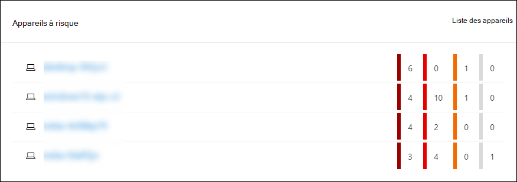
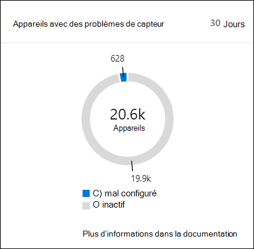
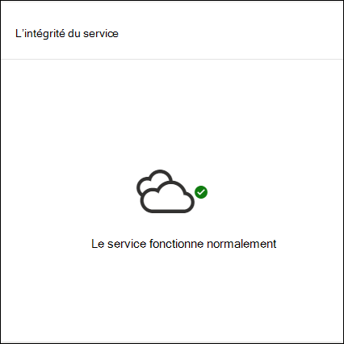
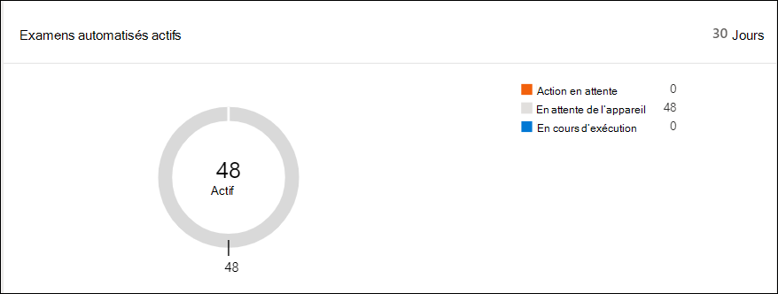

# Centre de sécurité Microsoft Defender Tableau de bord opérations de sécuritéMicrosoft Defender Security Center Security operations dashboard

[!INCLUDE [Microsoft 365 Defender rebranding](../../includes/microsoft-defender.md)]

**S’applique à :****Applies to:**
- [Microsoft Defender pour point de terminaisonMicrosoft Defender for Endpoint](https://go.microsoft.com/fwlink/?linkid=2154037)

>Vous souhaitez découvrir Microsoft Defender pour le point de terminaison ?Want to experience Microsoft Defender for Endpoint? [Inscrivez-vous à un essai gratuit.Sign up for a free trial.](https://www.microsoft.com/microsoft-365/windows/microsoft-defender-atp?ocid=docs-wdatp-secopsdashboard-abovefoldlink) 

Le **tableau de bord Opérations** de sécurité est l’endroit protection évolutive des points de terminaison fonctionnalités de sécurité sont à l’écran.The **Security operations dashboard** is where the endpoint detection and response capabilities are surfaced. Il fournit une vue d’ensemble de l’endroit où les détections ont été détectées et met en évidence les cas où des actions de réponse sont nécessaires.It provides a high level overview of where detections were seen and highlights where response actions are needed. 

Le tableau de bord affiche une capture instantanée des éléments ci-dessous :The dashboard displays a snapshot of:

- Alertes activesActive alerts
- Appareils à risqueDevices at risk
- État du capteurSensor health
- L’intégrité du serviceService health
- Rapports quotidiens sur les appareilsDaily devices reporting
- Examens automatisés actifsActive automated investigations
- Statistiques d’enquêtes automatiséesAutomated investigations statistics
- Utilisateurs à risqueUsers at risk
- Activités suspectesSuspicious activities

Vous pouvez explorer et examiner les alertes et les appareils pour déterminer rapidement si, où et quand des activités suspectes se sont produites dans votre réseau pour vous aider à comprendre le contexte dans lequel elles sont apparues.You can explore and investigate alerts and devices to quickly determine if, where, and when suspicious activities occurred in your network to help you understand the context they appeared in.

À partir du **tableau de bord Opérations** de sécurité, vous verrez des événements agrégés pour faciliter l’identification d’événements ou de comportements significatifs sur un appareil.From the **Security operations dashboard** you will see aggregated events to facilitate the identification of significant events or behaviors on a device. Vous pouvez également descendre dans les événements granulaires et les indicateurs de bas niveau.You can also drill down into granular events and low-level indicators.

Il dispose également de vignettes cliquables qui donnent des indications visuelles sur l’état d’état général de votre organisation.It also has clickable tiles that give visual cues on the overall health state of your organization. Chaque vignette ouvre une vue détaillée de la vue d’ensemble correspondante.Each tile opens a detailed view of the corresponding overview.

## Alertes activesActive alerts
Vous pouvez afficher le nombre global d’alertes actives des 30 derniers jours de votre réseau à partir de la vignette.You can view the overall number of active alerts from the last 30 days in your network from the tile. Les alertes sont regroupées en **nouveautés** **et en cours.**Alerts are grouped into **New** and **In progress**.

Chaque groupe est sous-classé selon les niveaux de gravité d’alerte correspondants.Each group is further sub-categorized into their corresponding alert severity levels. Cliquez sur le nombre d’alertes à l’intérieur de chaque anneau d’alerte pour afficher un affichage trié de la file d’attente de cette catégorie **(nouveau** ou **en cours).**Click the number of alerts inside each alert ring to see a sorted view of that category's queue (**New** or **In progress**).

Pour plus d’informations, voir [la vue d’ensemble des alertes.](alerts-queue.md)For more information see, [Alerts overview](alerts-queue.md).

Chaque ligne inclut une catégorie de gravité d’alerte et une brève description de l’alerte.Each row includes an alert severity category and a short description of the alert. Vous pouvez cliquer sur une alerte pour afficher sa vue détaillée.You can click an alert to see its detailed view. Pour plus d’informations, [consultez La vue d’ensemble](investigate-alerts.md) de Microsoft Defender pour les alertes de point de [terminaison et les alertes.](alerts-queue.md)For more information see,  [Investigate Microsoft Defender for Endpoint alerts](investigate-alerts.md) and [Alerts overview](alerts-queue.md).

## Appareils à risqueDevices at risk
Cette vignette affiche la liste des appareils avec le plus grand nombre d’alertes actives.This tile shows you a list of devices with the highest number of active alerts. Le nombre total d’alertes pour chaque appareil est affiché dans un cercle en regard du nom de l’appareil, puis classé par niveaux de gravité à l’extrémité de la vignette (placez le pointage sur chaque barre de gravité pour voir son étiquette).The total number of alerts for each device is shown in a circle next to the device name, and then further categorized by severity levels at the far end of the tile (hover over each severity bar to see its label).

Cliquez sur le nom de l’appareil pour voir les détails sur cet appareil.Click the name of the device to see details about that device. Pour plus d’informations, consultez la liste Examiner les appareils de la liste [Microsoft Defender pour les appareils de point de terminaison.](investigate-machines.md)For more information see, [Investigate devices in the Microsoft Defender for Endpoint Devices list](investigate-machines.md).

Vous pouvez également cliquer sur **La** liste Appareils en haut de la vignette pour aller directement à la liste **Appareils,** triée par le nombre d’alertes actives.You can also click **Devices list** at the top of the tile to go directly to the **Devices list**, sorted by the number of active alerts. Pour plus d’informations, consultez la liste Examiner les appareils de la liste [Microsoft Defender pour les appareils de point de terminaison.](investigate-machines.md)For more information see, [Investigate devices in the Microsoft Defender for Endpoint Devices list](investigate-machines.md).

## Appareils avec des problèmes de capteurDevices with sensor issues
La **vignette Appareils avec problèmes** de capteur fournit des informations sur la capacité de chaque appareil à fournir des données de capteur au service Microsoft Defender for Endpoint.The **Devices with sensor issues** tile provides information on the individual device’s ability to provide sensor data to the Microsoft Defender for Endpoint service. Il indique le nombre d’appareils qui nécessitent une attention particulière et vous aide à identifier les appareils problématiques.It reports how many devices require attention and helps you identify problematic devices.

Deux indicateurs d’état fournissent des informations sur le nombre d’appareils qui ne sont pas correctement signalés au service :There are two status indicators that provide information on the number of devices that are not reporting properly to the service:
- **Mal configurés** : ces appareils peuvent signaler partiellement des données de capteur au service Microsoft Defender for Endpoint et peuvent avoir des erreurs de configuration qui doivent être corrigées.**Misconfigured** – These devices might partially be reporting sensor data to the Microsoft Defender for Endpoint service and might have configuration errors that need to be corrected.
- **Inactif** : appareils qui ont cessé de signaler au service Microsoft Defender for Endpoint pendant plus de sept jours au cours du mois précédent.**Inactive** - Devices that have stopped reporting to the Microsoft Defender for Endpoint service for more than seven days in the past month.

Lorsque vous cliquez sur l’un des groupes, vous êtes dirigé vers la liste des appareils, filtré en fonction de votre choix.When you click any of the groups, you’ll be directed to devices list, filtered according to your choice. Pour plus d’informations, voir [Vérifier l’état du capteur](check-sensor-status.md) et Examiner les [appareils.](investigate-machines.md)For more information, see [Check sensor state](check-sensor-status.md) and [Investigate devices](investigate-machines.md).

## L’intégrité du serviceService health
La **vignette d’état** du service vous informe si le service est actif ou s’il existe des problèmes.The **Service health** tile informs you if the service is active or if there are issues.

Pour plus d’informations sur l’état du service, voir [Vérifier l’état du service Microsoft Defender pour Endpoint.](service-status.md)For more information on the service health, see [Check the Microsoft Defender for Endpoint service health](service-status.md).

## Rapports quotidiens sur les appareilsDaily devices reporting
La **vignette Rapports quotidiens sur** les appareils affiche un graphique à barres qui représente le nombre d’appareils signalant quotidiennement au cours des 30 derniers jours.The **Daily devices reporting** tile shows a bar graph that represents the number of devices reporting daily in the last 30 days. Pointez sur des barres individuelles sur le graphique pour voir le nombre exact d’appareils signalant des rapports chaque jour.Hover over individual bars on the graph to see the exact number of devices reporting in each day.

## Examens automatisés actifsActive automated investigations
Vous pouvez afficher le nombre global d’enquêtes automatisées des 30 derniers jours de votre réseau à partir de la **vignette Enquêtes automatisées actives.**You can view the overall number of automated investigations from the last 30 days in your network from the **Active automated investigations** tile. Les examens sont regroupés en **action en attente,** **en attente de l’appareil** et en **cours d’exécution.**Investigations are grouped into **Pending action**, **Waiting for device**, and **Running**.

## Statistiques d’enquêtes automatiséesAutomated investigations statistics
Cette vignette affiche les statistiques relatives aux enquêtes automatisées au cours des sept derniers jours.This tile shows statistics related to automated investigations in the last seven days. Il indique le nombre d’enquêtes terminées, le nombre d’enquêtes correctement corrigés, le temps en attente moyen d’un examen à lancer, le temps moyen de correction d’une alerte, le nombre d’alertes examinées et le nombre d’heures d’automatisation enregistrées à partir d’un examen manuel classique.It shows the number of investigations completed, the number of successfully remediated investigations, the average pending time it takes for an investigation to be initiated, the average time it takes to remediate an alert, the number of alerts investigated, and the number of hours of automation saved from a typical manual investigation. 

Vous pouvez cliquer sur **Examens** automatisés, **Examens** corrigés et **Alertes examinées** pour accéder à la page **Enquêtes,** filtrée par catégorie appropriée.You can click on **Automated investigations**, **Remediated investigations**, and **Alerts investigated** to navigate to the **Investigations** page, filtered by the appropriate category. Cela vous permet d’obtenir une répartition détaillée des enquêtes en contexte.This lets you see a detailed breakdown of investigations in context.

## Utilisateurs à risqueUsers at risk
La vignette affiche la liste des comptes d’utilisateurs avec les alertes les plus actives et le nombre d’alertes visibles sur les alertes élevées, moyennes ou faibles.The tile shows you a list of user accounts with the most active alerts and the number of alerts seen on high, medium, or low alerts. 

Cliquez sur le compte d’utilisateur pour voir les détails sur le compte d’utilisateur.Click the user account to see details about the user account. Pour plus d’informations, [voir Examiner un compte d’utilisateur.](investigate-user.md)For more information see [Investigate a user account](investigate-user.md).

>Vous souhaitez découvrir Microsoft Defender pour le point de terminaison ?Want to experience Microsoft Defender for Endpoint? [Inscrivez-vous à un essai gratuit.Sign up for a free trial.](https://www.microsoft.com/microsoft-365/windows/microsoft-defender-atp?ocid=docs-wdatp-secopsdashboard-belowfoldlink)

## Voir aussiRelated topics
- [Comprendre le portail Microsoft Defender pour les points de terminaisonUnderstand the Microsoft Defender for Endpoint portal](use.md)
- [Vue d’ensemble du portailPortal overview](portal-overview.md)
- [Afficher le tableau de bord gestion & des menaces et des vulnérabilitésView the Threat & Vulnerability Management dashboard](tvm-dashboard-insights.md)
- [Afficher le tableau de bord Analyse des menaces et prendre les mesures de prévention recommandéesView the Threat analytics dashboard and take recommended mitigation actions](threat-analytics.md)
