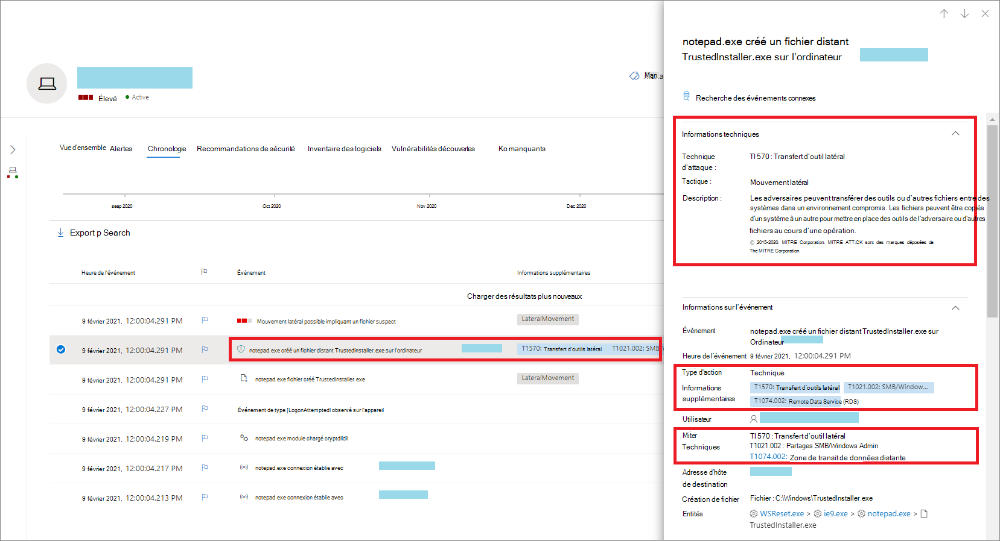
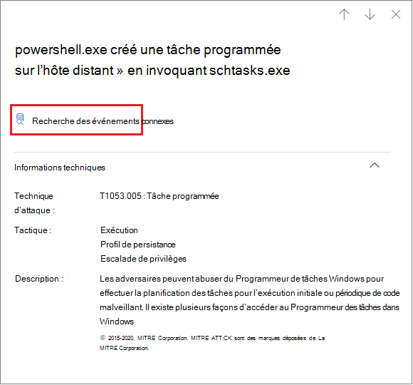

# Techniques dans la chronologie de l’appareilTechniques in the device timeline

**S’applique à :****Applies to:**
- [Microsoft Defender pour point de terminaisonMicrosoft Defender for Endpoint](https://go.microsoft.com/fwlink/p/?linkid=2154037)

Vous pouvez obtenir plus d’informations dans une enquête en analysant les événements qui se sont produit sur un appareil spécifique.You can gain more insight in an investigation by analyzing the events that happened on a specific device. Tout d’abord, sélectionnez l’appareil qui vous intéresse dans la [liste Appareils.](machines-view-overview.md)First, select the device of interest from the [Devices list](machines-view-overview.md). Dans la page Appareil,  vous pouvez sélectionner l’onglet Chronologie pour afficher tous les événements qui se sont produits sur l’appareil.On the device page, you can select the **Timeline** tab to view all the events that occurred on the device.

## Comprendre les techniques dans la chronologieUnderstand techniques in the timeline

>[!IMPORTANT]
>Certaines informations concernent une fonctionnalité de produit pré-publiée en prévisualisation publique qui peut être considérablement modifiée avant sa publication commerciale.Some information relates to a prereleased product feature in public preview which may be substantially modified before it's commercially released. Microsoft n’offre aucune garantie, explicite ou implicite, concernant les informations fournies ici.Microsoft makes no warranties, express or implied, with respect to the information provided here.

Dans Microsoft Defender pour point de terminaison, **les techniques** sont un type de données supplémentaire dans la chronologie des événements.In Microsoft Defender for Endpoint, **Techniques** are an additional data type in the event timeline. Les techniques fournissent plus d’informations sur les activités associées à [MITRE ATT&](https://attack.mitre.org/) techniques ou sous-techniques CK.Techniques provide more insight on activities associated with [MITRE ATT&CK](https://attack.mitre.org/) techniques or sub-techniques. 

Cette fonctionnalité simplifie l’examen en aidant les analystes à comprendre les activités observées sur un appareil.This feature simplifies the investigation experience by helping analysts understand the activities that were observed on a device. Les analystes peuvent ensuite décider d’examiner plus en détail.Analysts can then decide to investigate further.

Pour la prévisualisation publique, les techniques sont disponibles par défaut et affichées avec les événements lorsque la chronologie d’un appareil est affichée.For public preview, Techniques are available by default and shown together with events when a device's timeline is viewed. 

Les techniques sont mises en évidence en gras et apparaissent avec une icône bleue à gauche.Techniques are highlighted in bold text and appear with a blue icon on the left. L’ID MITRE ATT&et le nom de technique CK correspondants apparaissent également en tant que balises sous Informations supplémentaires.The corresponding MITRE ATT&CK ID and technique name also appear as tags under Additional information. 

Les options de recherche et d’exportation sont également disponibles pour les techniques.Search and Export options are also available for Techniques.

## Examiner l’utilisation du volet latéralInvestigate using the side pane

Sélectionnez une technique pour ouvrir son volet latéral correspondant.Select a Technique to open its corresponding side pane. Vous pouvez y voir des informations et des informations supplémentaires, telles que des techniques, des tactiques et des descriptions att&CK associées.Here you can see additional information and insights like related ATT&CK techniques, tactics, and descriptions. 

Sélectionnez la *technique d’attaque* spécifique pour ouvrir la page de technique att&CK associée dans laquelle vous trouverez plus d’informations à ce sujet.Select the specific *Attack technique* to open the related ATT&CK technique page where you can find more information about it.

Vous pouvez copier les détails d’une entité lorsque vous voyez une icône bleue sur la droite.You can copy an entity's details when you see a blue icon on the right. Par exemple, pour copier le sha1 d’un fichier associé, sélectionnez l’icône de page bleue.For instance, to copy a related file's SHA1, select the blue page icon.

Vous pouvez faire de même pour les lignes de commande.You can do the same for command lines.

## Examiner les événements connexesInvestigate related events

Pour utiliser la [recherche avancée pour](advanced-hunting-overview.md) rechercher des événements liés à la technique sélectionnée, sélectionnez Rechercher les **événements connexes.**To use [advanced hunting](advanced-hunting-overview.md) to find events related to the selected Technique, select **Hunt for related events**. Cela conduit à la page de recherche avancée avec une requête pour rechercher les événements liés à la technique.This leads to the advanced hunting page with a query to find events related to the Technique.

>[!NOTE]
>L’interrogation à  l’aide du bouton Recherche d’événements connexes à partir d’un volet latéral Technique affiche tous les événements liés à la technique identifiée, mais n’inclut pas la technique elle-même dans les résultats de la requête.Querying using the **Hunt for related events** button from a Technique side pane displays all the events related to the identified technique but does not include the Technique itself in the query results.

## Personnaliser la chronologie de votre appareilCustomize your device timeline

Dans la partie supérieure droite de la chronologie de l’appareil, vous pouvez choisir une plage de dates pour limiter le nombre d’événements et de techniques dans la chronologie.On the upper right-hand side of the device timeline, you can choose a date range to limit the number of events and techniques in the timeline. 

Vous pouvez personnaliser les colonnes à exposer.You can customize which columns to expose. Vous pouvez également filtrer les événements marqués par type de données ou par groupe d’événements.You can also filter for flagged events by data type or by event group.

### Choisir les colonnes à exposerChoose columns to expose
Vous pouvez choisir les colonnes à exposer dans la chronologie en sélectionnant le bouton Choisir **les colonnes.**You can choose which columns to expose in the timeline by selecting the **Choose columns** button.

À partir de là, vous pouvez sélectionner l’ensemble d’informations à inclure.From there you can select which information set to include.

### Filtre pour afficher les techniques ou les événements uniquementFilter to view techniques or events only

Pour afficher uniquement les événements ou les techniques, sélectionnez **Filtres** dans la chronologie de l’appareil et choisissez votre type de données préféré à afficher.To view only either events or techniques, select **Filters** from the device timeline and choose your preferred Data type to view.

## Voir aussiSee also
- [Afficher et organiser la liste AppareilsView and organize the Devices list](machines-view-overview.md)
- [Indicateurs d’événement de chronologie de l’appareil microsoft Defender pour point de terminaisonMicrosoft Defender for Endpoint device timeline event flags](device-timeline-event-flag.md) 

 
