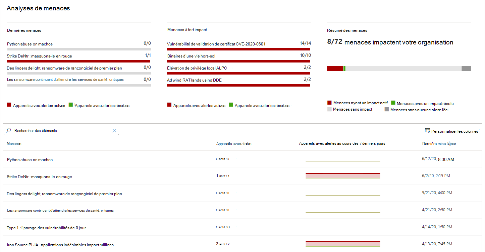
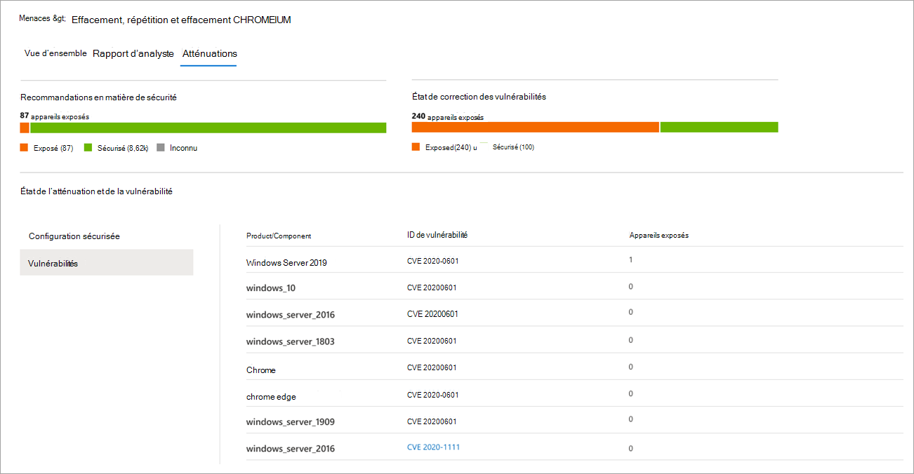

# Suivre les menaces émergentes et y répondre par le biais de l’analyse des menaces

[!INCLUDE [Microsoft 365 Defender rebranding](../../includes/microsoft-defender.md)]

**S’applique à :**
- [Microsoft Defender pour point de terminaison](https://go.microsoft.com/fwlink/?linkid=2154037)
- [Microsoft 365 Defender](https://go.microsoft.com/fwlink/?linkid=2118804)

> Vous souhaitez découvrir Microsoft Defender pour le point de terminaison ? [Inscrivez-vous à un essai gratuit.](https://www.microsoft.com/microsoft-365/windows/microsoft-defender-atp?ocid=docs-wdatp-exposedapis-abovefoldlink)

Avec des adversaires plus sophistiqués et de nouvelles menaces émergentes fréquemment et répandues, il est essentiel de pouvoir rapidement :

- Évaluer l’impact des nouvelles menaces
- Examiner votre résilience par rapport aux menaces ou leur exposition
- Identifier les actions que vous pouvez prendre pour arrêter ou contenir les menaces

L’analyse des menaces est un ensemble de rapports d’experts en matière de sécurité Microsoft couvrant les menaces les plus pertinentes, notamment :

- Acteurs actifs contre les menaces et leurs campagnes
- Techniques d’attaques nouvelles et populaires
- Vulnérabilités critiques
- Surfaces d’attaque courantes
- Programmes malveillants répandus

Chaque rapport fournit une analyse détaillée d’une menace et des instructions complètes sur la façon de se défendre contre cette menace. Il incorpore également les données de votre réseau, ce qui indique si la menace est active et si vous avez des protections applicables en place.

Regardez cette courte vidéo pour en savoir plus sur la façon dont l’analyse des menaces peut vous aider à suivre les dernières menaces et à les arrêter.

> [!VIDEO https://www.microsoft.com/en-us/videoplayer/embed/RE4bw1f]

## Afficher le tableau de bord d’analyse des menaces

Le tableau de bord d’analyse des menaces constitue un excellent point de départ pour obtenir les rapports les plus pertinents pour votre organisation. Il récapitule les menaces dans les sections suivantes :

- **Menaces les** plus récentes : répertorie les derniers rapports sur les menaces publiés, ainsi que le nombre d’appareils avec des alertes actives et résolues.
- **Menaces à fort impact**: répertorie les menaces qui ont eu l’impact le plus élevé sur l’organisation. Cette section classe les menaces selon le nombre d’appareils qui ont des alertes actives.
- **Résumé des menaces**: affiche l’impact global du suivi des menaces en affichant le nombre de menaces avec des alertes actives et résolues.

Sélectionnez une menace dans le tableau de bord pour afficher le rapport de cette menace.

## Afficher un rapport d’analyse des menaces

Chaque rapport d’analyse des menaces fournit des informations en trois sections : **Vue** d’ensemble, rapport **d’analyste** et **atténuations.**

### Vue d’ensemble : comprendre rapidement la menace, évaluer son impact et examiner les défenses

La section **Vue d’ensemble** fournit un aperçu du rapport d’analyste détaillé. Il fournit également des graphiques qui mettent en évidence l’impact de la menace sur votre organisation et votre exposition par le biais d’appareils mal configurés et non configurés.

 _menaces d’un rapport d’analyse des menaces_

#### Évaluer l’impact sur votre organisation
Chaque rapport inclut des graphiques conçus pour fournir des informations sur l’impact organisationnel d’une menace :
- **Appareils avec alertes**: indique le nombre actuel d’appareils distincts qui ont été touchés par la menace. Un appareil est classé comme **actif** s’il existe au  moins  une alerte associée à cette menace et résolu si toutes les alertes associées à la menace sur l’appareil ont été résolues.
- **Les appareils avec des alertes** au fil du temps indiquent le nombre d’appareils distincts avec des alertes **actives** **et** résolues au fil du temps. Le nombre d’alertes résolues indique la rapidité de réponse de votre organisation aux alertes associées à une menace. Dans l’idéal, le graphique doit afficher les alertes résolues dans un délai de quelques jours.

#### Passer en revue la résilience et la posture de sécurité
Chaque rapport inclut des graphiques qui fournissent une vue d’ensemble de la résilience de votre organisation face à une menace donnée :
- **État de la configuration** de la sécurité : indique le nombre d’appareils qui ont appliqué les paramètres de sécurité recommandés pour atténuer la menace. Les appareils sont considérés **comme sécurisés** s’ils ont _appliqué tous_ les paramètres suivis.
- **État de correction des** vulnérabilités : indique le nombre d’appareils qui ont appliqué des mises à jour de sécurité ou des correctifs qui adressent les vulnérabilités exploitées par la menace.

### Rapport d’analyste : obtenir des informations d’expert de la part de chercheurs en sécurité Microsoft
Go to the **Analyst report** section to read through the detailed expert write-up. La plupart des rapports fournissent des descriptions détaillées des chaînes d’attaques, notamment des tactiques et des  techniques mappées à l’infrastructure CK MITRE ATT&, des listes exhaustives de recommandations et de puissants conseils de recherche de menaces.

[En savoir plus sur le rapport d’analyste](threat-analytics-analyst-reports.md)

### Atténuations : examiner la liste des atténuations et l’état de vos appareils
Dans la section **Atténuations,** examinez la liste des recommandations actionnables spécifiques qui peuvent vous aider à renforcer la résilience de votre organisation contre la menace. La liste des mesures de prévention de suivi inclut :

- **Mises à jour de sécurité :** déploiement de mises à jour de sécurité ou de correctifs pour les vulnérabilités
- **Antivirus Microsoft Defender paramètres**
  - Version de l’intelligence de la sécurité
  - Protection fournie par le cloud  
  - Protection des applications potentiellement indésirables (PUA)
  - Protection en temps réel
 
Les informations d’atténuation de cette section intègrent des données de [Gestion des menaces et des vulnérabilités](next-gen-threat-and-vuln-mgt.md), qui fournissent également des informations détaillées d’analyse à partir de différents liens dans le rapport.

 _Atténuations d’un rapport d’analyse des menaces_

## Détails et limitations supplémentaires du rapport
Lorsque vous utilisez les rapports, gardez les informations suivantes à l’esprit : 

- Les données sont limitées en fonction de votre étendue de contrôle d’accès basé sur un rôle (RBAC). Vous verrez l’état des appareils dans les [groupes accessibles.](machine-groups.md)
- Les graphiques reflètent uniquement les atténuations qui sont suivis. Consultez la vue d’ensemble du rapport pour les atténuations supplémentaires qui ne sont pas affichées dans les graphiques.
- Les atténuations ne garantissent pas une résilience complète. Les atténuations fournies reflètent les meilleures actions possibles nécessaires pour améliorer la résilience.
- Les appareils sont comptés comme « indisponibles » s’ils n’ont pas transmis de données au service.
- Les statistiques antivirus sont basées sur Antivirus Microsoft Defender paramètres. Les appareils avec des solutions antivirus tierces peuvent apparaître comme « exposés ».

## Voir aussi
- [Rechercher de manière proactive les menaces avec le recherche avancée](advanced-hunting-overview.md) 
- [Comprendre la section rapport d’analyste](threat-analytics-analyst-reports.md)
- [Évaluer et résoudre les faiblesses et les exposition de sécurité](next-gen-threat-and-vuln-mgt.md)
