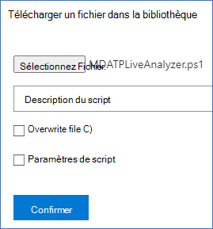

# <a name="collect-support-logs-in-microsoft-defender-for-endpoint-using-live-response"></a>Collecter les journaux de support dans Microsoft Defender pour point de terminaison à l’aide d’une réponse en direct 


**S’applique à :**
- [Microsoft Defender pour point de terminaison](https://go.microsoft.com/fwlink/p/?linkid=2154037)
- [Microsoft 365 Defender](https://go.microsoft.com/fwlink/?linkid=2118804)

> Vous souhaitez faire l’expérience de Defender for Endpoint ? [Inscrivez-vous à un essai gratuit.](https://www.microsoft.com/microsoft-365/windows/microsoft-defender-atp?ocid=docs-wdatp-pullalerts-abovefoldlink) 


Lorsque vous contactez le support technique, vous pouvez être invité à fournir le package de sortie de l’outil Microsoft Defender for Endpoint Client Analyzer.

Cette rubrique fournit des instructions sur la façon d’exécuter l’outil via Live Response.

1. Télécharger le script approprié
    * Journaux de capteur client Microsoft Defender pour point de terminaison uniquement : [LiveAnalyzer.ps1 script](https://aka.ms/MDELiveAnalyzer).
      - Taille approximative du package de résultats : ~100Kb 
    *  Capteur client microsoft Defender pour point de terminaison et journaux antivirus : [LiveAnalyzer+MDAV.ps1 script](https://aka.ms/MDELiveAnalyzerAV).
       - Taille approximative du package de résultats : ~10 Mo 
 
2.  Lancez [une session Live Response](live-response.md#initiate-a-live-response-session-on-a-device) sur l’ordinateur que vous devez examiner.

3.  Sélectionnez **Télécharger le fichier dans la bibliothèque.**

    

4. Sélectionnez **Choisir un fichier.**

    

5. Sélectionnez le fichier téléchargé nommé MDELiveAnalyzer.ps1 puis cliquez sur **Confirmer**


   


6. Pendant la session LiveResponse, utilisez les commandes ci-dessous pour exécuter l’analyseur et collecter le fichier de résultats :

    ```console
    Run MDELiveAnalyzer.ps1
    GetFile "C:\ProgramData\Microsoft\Windows Defender Advanced Threat Protection\Downloads\MDEClientAnalyzerResult.zip" -auto
    ```

    


>[!NOTE]
> - La dernière version d’aperçu de MDEClientAnalyzer peut être téléchargée ici [https://aka.ms/Betamdeanalyzer](https://aka.ms/Betamdeanalyzer) :
> 
> - Le script LiveAnalyzer télécharge le package de dépannage sur l’ordinateur de destination à partir https://mdatpclientanalyzer.blob.core.windows.net de :
> 
>   Si vous ne pouvez pas autoriser l’ordinateur à atteindre l’URL ci-dessus, téléchargez MDEClientAnalyzerPreview.zip fichier vers la bibliothèque avant d’exécutez le script LiveAnalyzer :
>
>   ```console
>   PutFile MDEClientAnalyzerPreview.zip -overwrite
>   Run MDELiveAnalyzer.ps1
>   GetFile "C:\ProgramData\Microsoft\Windows Defender Advanced Threat Protection\Downloads\MDEClientAnalyzerResult.zip" -auto
>   ```
> 
> - Pour plus d’informations sur la collecte de données localement sur un ordinateur au cas où l’ordinateur ne communique pas avec Microsoft Defender pour les services cloud de point de terminaison ou n’apparaît pas dans le portail Microsoft Defender pour endpoint comme prévu, voir Vérifier la connectivité client à Microsoft Defender pour les URL de service de point de [terminaison.](configure-proxy-internet.md#verify-client-connectivity-to-microsoft-defender-atp-service-urls)
