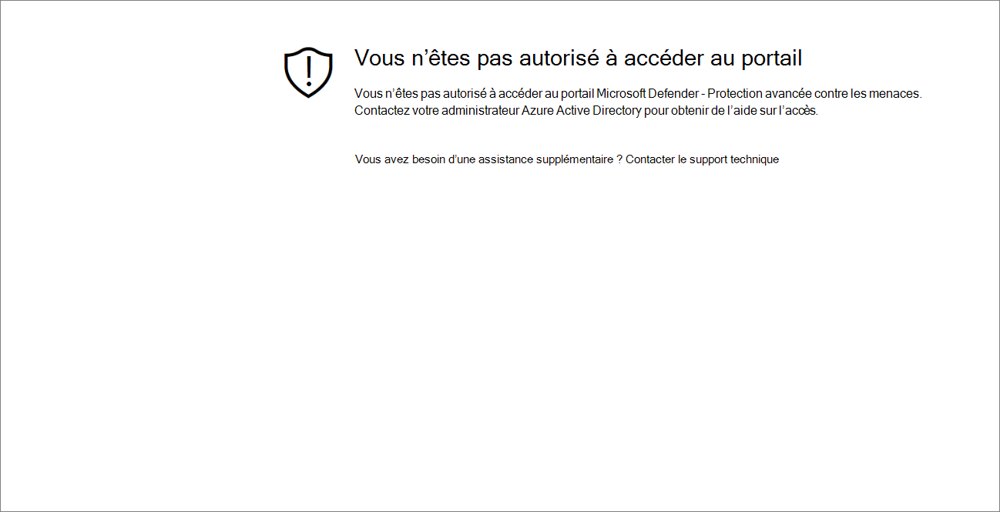

# Résoudre des problèmes d’abonnement et de portail d’accès

[!INCLUDE [Microsoft 365 Defender rebranding](../../includes/microsoft-defender.md)]

**S’applique à :**
- [Microsoft Defender pour point de terminaison](https://go.microsoft.com/fwlink/p/?linkid=2154037)
- [Microsoft 365 Defender](https://go.microsoft.com/fwlink/?linkid=2118804)

>Vous souhaitez découvrir Microsoft Defender pour le point de terminaison ? [Inscrivez-vous à un essai gratuit.](https://www.microsoft.com/microsoft-365/windows/microsoft-defender-atp?ocid=docs-wdatp-troublshootonboarding-abovefoldlink)

Cette page fournit des étapes détaillées pour résoudre les problèmes qui peuvent se produire lors de la configuration de votre service Microsoft Defender for Endpoint.

Si vous recevez un message d’erreur, Centre de sécurité Microsoft Defender fournit une explication détaillée du problème et des liens pertinents sont fournis.

## Aucun abonnement trouvé

Si, lors de l’accès à Centre de sécurité Microsoft Defender vous obtenez un **message** aucun abonnement trouvé, cela signifie que le Azure Active Directory (Azure AD) utilisé pour se connecter à l’utilisateur sur le portail, n’a pas de licence Microsoft Defender pour endpoint.

Raisons potentielles :
- Les licences Windows E5 et Office E5 sont des licences distinctes.
- La licence a été achetée, mais elle n’a pas été mise en service pour cette instance Azure AD.
    - Il peut s’agit d’un problème de mise en service de licence.
    - Il se peut que vous avez mis en service par inadvertance la licence sur une autre Microsoft Azure AD que celle utilisée pour l’authentification dans le service.

Dans les deux cas, vous devez contacter le support Microsoft à l’aide du support [général de Microsoft Defender pour](https://support.microsoft.com/getsupport?wf=0&tenant=ClassicCommercial&oaspworkflow=start_1.0.0.0&locale=en-us&supportregion=en-us&pesid=16055&ccsid=636419533611396913) les points de terminaison ou de la prise en charge des [licences en volume.](https://www.microsoft.com/licensing/servicecenter/Help/Contact.aspx)

## Votre abonnement a expiré

Si, lors de l’Centre de sécurité Microsoft Defender vous obtenez un **message** votre abonnement a expiré, votre abonnement de service en ligne a expiré. L’abonnement Microsoft Defender pour les points de terminaison, comme tout autre abonnement de service en ligne, a une date d’expiration. 

Vous pouvez choisir de renouveler ou de prolonger la licence à tout moment. Lorsque vous accédez au portail après la date d’expiration, un **message** votre abonnement a expiré se présente avec une option pour télécharger le package de la sortie de l’appareil, si vous choisissez de ne pas renouveler la licence.

> [!NOTE]
> Pour des raisons de sécurité, le package utilisé pour la sortie des appareils expirera 30 jours après la date de téléchargement. Les packages deboarding expirés envoyés à un appareil seront rejetés. Lorsque vous téléchargez un package de déclassage, vous êtes informé de la date d’expiration des packages et il est également inclus dans le nom du package.

## Vous n’êtes pas autorisé à accéder au portail

Si vous recevez une demande Vous n’êtes pas autorisé à accéder au **portail,** sachez que Microsoft Defender pour le point de terminaison est un produit de surveillance de la sécurité, d’examen des incidents et de réponse. En tant que tel, l’accès à celui-ci est restreint et contrôlé par l’utilisateur.
Pour plus d’informations, voir [**Attribuer un accès utilisateur au portail.**](/windows/threat-protection/windows-defender-atp/assign-portal-access-windows-defender-advanced-threat-protection)

## Les données ne sont actuellement pas disponibles sur certaines sections du portail
Si le tableau de bord du portail et d’autres sections indiquent un message d’erreur tel que « Les données ne sont actuellement pas disponibles » :

Vous devez autoriser le sous-domaine et tous ses `securitycenter.windows.com` sous-domaine. Par exemple, `*.securitycenter.windows.com`.

## Problèmes de communication du portail
Si vous rencontrez des problèmes d’accès au portail, de données manquantes ou d’accès restreint à certaines parties du portail, vous devez vérifier que les URL suivantes sont autorisées et ouvertes pour la communication.

- `*.blob.core.windows.net`
- `crl.microsoft.com`
- `https://*.microsoftonline-p.com`
- `https://*.securitycenter.windows.com` 
- `https://automatediracs-eus-prd.securitycenter.windows.com`
- `https://login.microsoftonline.com`
- `https://login.windows.net`
- `https://onboardingpackagescusprd.blob.core.windows.net`
- `https://secure.aadcdn.microsoftonline-p.com` 
- `https://securitycenter.windows.com` 
- `https://static2.sharepointonline.com` 

