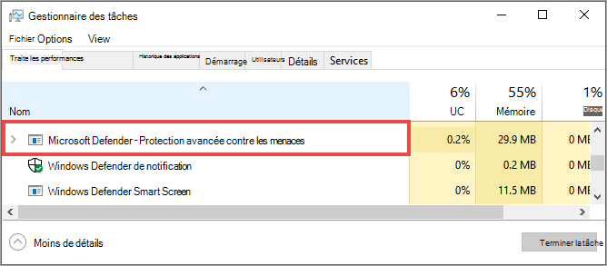
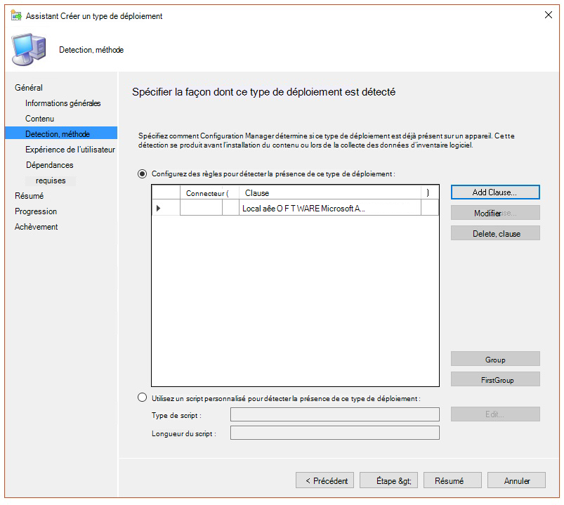
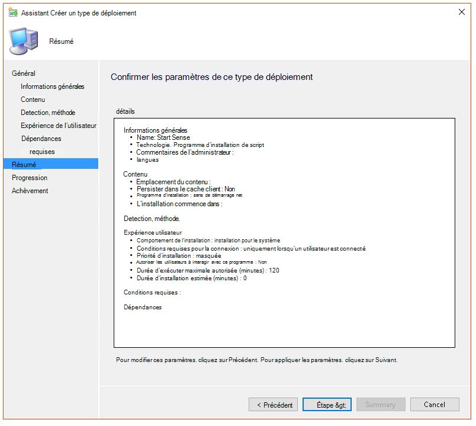
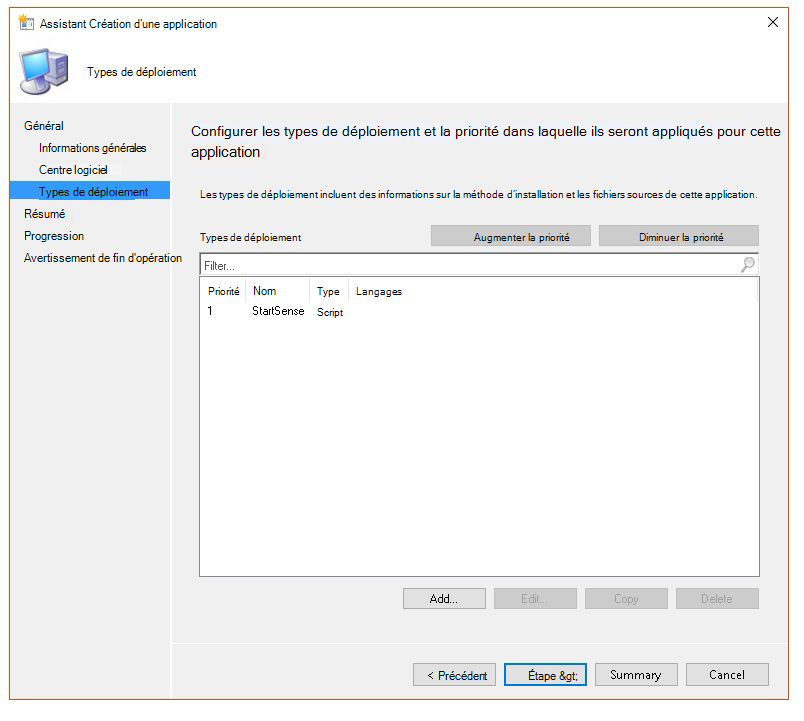
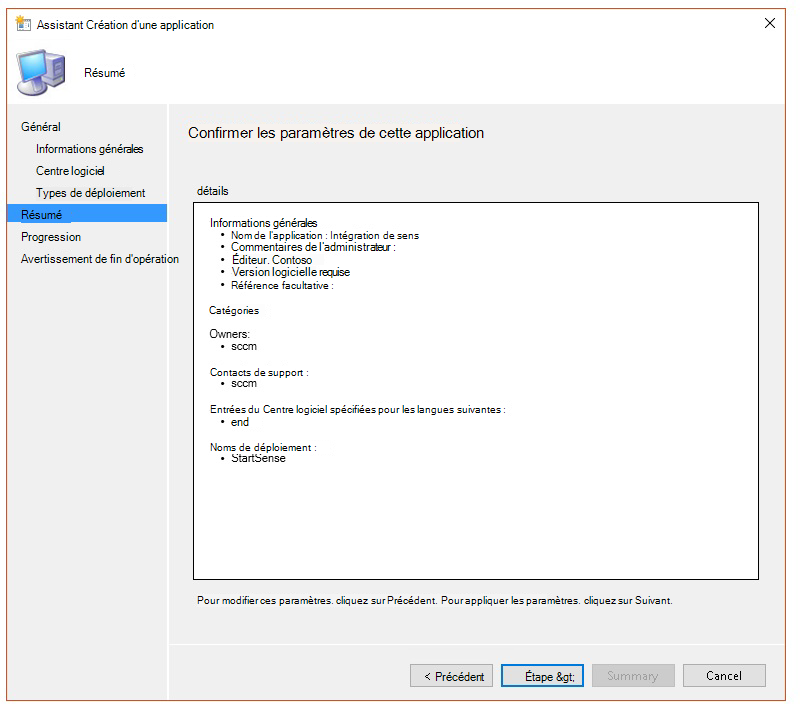
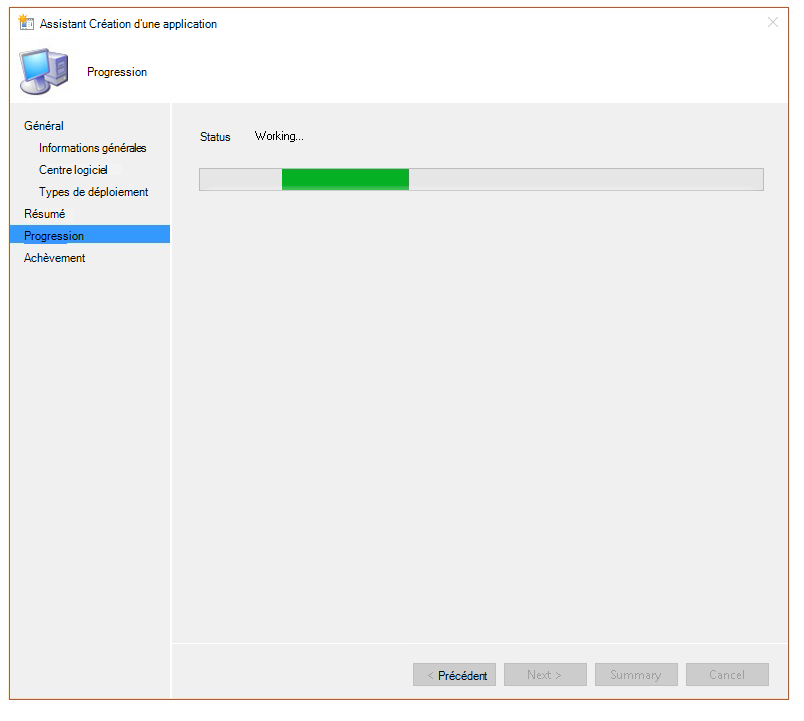
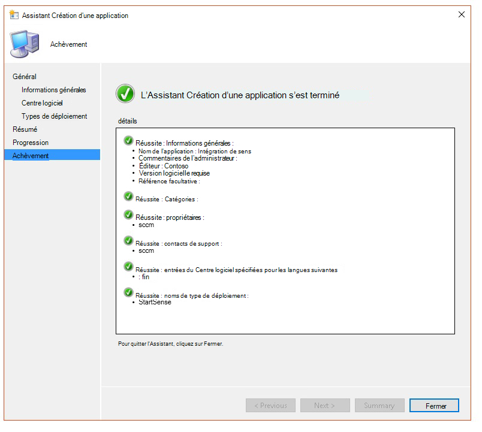
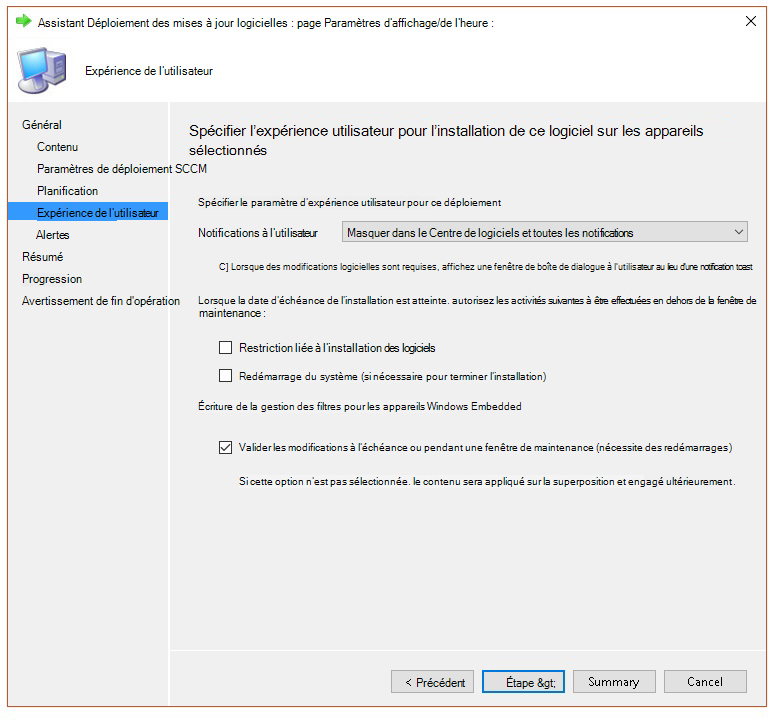
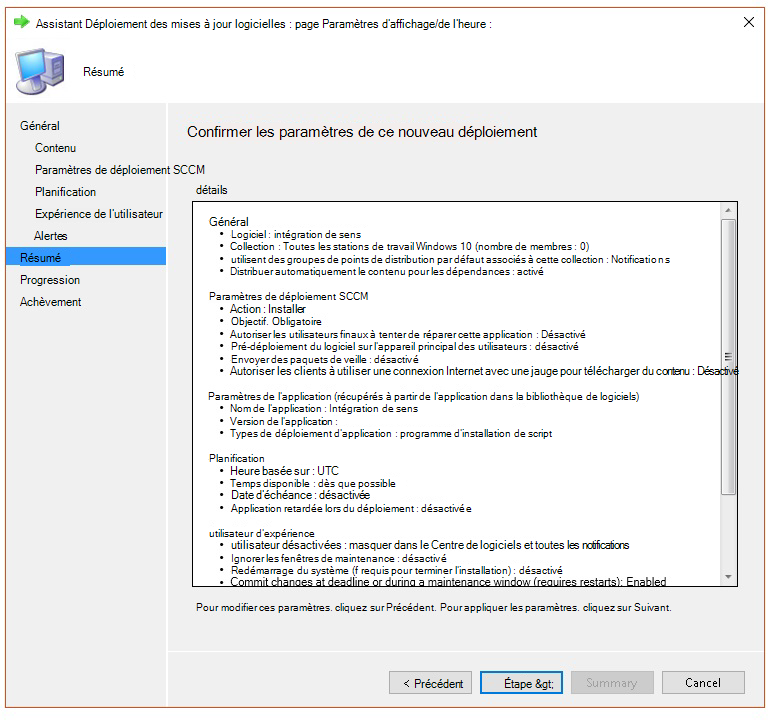

# <a name="troubleshoot-microsoft-defender-for-endpoint-onboarding-issues"></a>Résoudre les problèmes d’intégration de Microsoft Defender pour les points de terminaison

[!INCLUDE [Microsoft 365 Defender rebranding](../../includes/microsoft-defender.md)]


**S’applique à :**

- [Microsoft Defender pour point de terminaison](https://go.microsoft.com/fwlink/?linkid=2154037)
- Windows Server 2012 R2
- Windows Server 2016
- [Microsoft 365 Defender](https://go.microsoft.com/fwlink/?linkid=2118804)

> Vous souhaitez faire l’expérience de Defender pour point de terminaison ? [Inscrivez-vous à un essai gratuit.](https://www.microsoft.com/microsoft-365/windows/microsoft-defender-atp?ocid=docs-wdatp-pullalerts-abovefoldlink) 

Vous devrez peut-être résoudre les problèmes du processus d’intégration de Microsoft Defender for Endpoint si vous rencontrez des problèmes.
Cette page fournit des étapes détaillées pour résoudre les problèmes d’intégration qui peuvent se produire lors du déploiement avec l’un des outils de déploiement et les erreurs courantes qui peuvent se produire sur les appareils.

## <a name="troubleshoot-issues-with-onboarding-tools"></a>Résoudre les problèmes avec les outils d’intégration

Si vous avez terminé le processus d’intégration [](investigate-machines.md) et que vous ne voyez pas les appareils dans la liste Appareils après une heure, cela peut indiquer un problème d’intégration ou de connectivité.

### <a name="troubleshoot-onboarding-when-deploying-with-group-policy"></a>Résoudre les problèmes d’intégration lors du déploiement avec une stratégie de groupe

Le déploiement avec une stratégie de groupe s’exécute en exécutant le script d’intégration sur les appareils. La console de stratégie de groupe n’indique pas si le déploiement a réussi ou non.

Si vous avez terminé le processus d’intégration [](investigate-machines.md) et que vous ne voyez pas les appareils dans la liste Appareils après une heure, vous pouvez vérifier la sortie du script sur les appareils. Pour plus d’informations, voir [Résoudre les problèmes d’intégration lors du déploiement avec un script.](#troubleshoot-onboarding-when-deploying-with-a-script)

Si le script se termine correctement, consultez Résoudre les problèmes d’intégration sur les appareils pour les [erreurs](#troubleshoot-onboarding-issues-on-the-device) supplémentaires qui peuvent se produire.

### <a name="troubleshoot-onboarding-issues-when-deploying-with-microsoft-endpoint-configuration-manager"></a>Résoudre les problèmes d’intégration lors du déploiement avec Microsoft Endpoint Configuration Manager

Lors de l’intégration d’appareils à l’aide des versions suivantes de Configuration Manager :

- Microsoft Endpoint Configuration Manager
- Gestionnaire de configuration System Center 2012
- Gestionnaire de configuration de System Center 2012 R2

Le déploiement avec les versions mentionnées ci-dessus de Configuration Manager s’exécute en exécutant le script d’intégration sur les appareils. Vous pouvez suivre le déploiement dans la console Configuration Manager.

Si le déploiement échoue, vous pouvez vérifier la sortie du script sur les appareils.

Si l’intégration s’est correctement terminée,  mais que les appareils n’apparaissent pas dans la liste Appareils après une heure, consultez Résolution des problèmes d’intégration sur l’appareil pour les [erreurs](#troubleshoot-onboarding-issues-on-the-device) supplémentaires qui peuvent se produire.

### <a name="troubleshoot-onboarding-when-deploying-with-a-script"></a>Résoudre les problèmes d’intégration lors du déploiement avec un script

**Vérifiez le résultat du script sur l’appareil :**

1. Cliquez sur **Démarrer,** **tapez Observateur d’événements,** puis appuyez sur **Entrée.**

2. Go to **Windows Logs**  >  **Application**.

3. Recherchez un événement à partir de la source **d’événement WDATPOnboarding.**

Si le script échoue et que l’événement est une erreur, vous pouvez vérifier l’ID d’événement dans le tableau suivant pour vous aider à résoudre le problème.

> [!NOTE]
> Les ID d’événement suivants sont spécifiques au script d’intégration uniquement.

ID de l'événement | Type d’erreur | Étapes de résolution
:---:|:---|:---
 `5` | Des données de désintboarding ont été trouvées, mais n’ont pas pu être supprimées | Vérifier les autorisations sur le Registre, plus précisément<br> `HKLM\SOFTWARE\Policies\Microsoft\Windows Advanced Threat Protection`.
`10` | Les données d’intégration n’ont pas pu être écrites dans le Registre |  Vérifier les autorisations sur le Registre, plus précisément<br> `HKLM\SOFTWARE\Policies\Microsoft\Windows Advanced Threat Protection`.<br>Vérifiez que le script a été exécuté en tant qu’administrateur.
`15` |  Échec du démarrage du service SENSE |Vérifiez l’état du service `sc query sense` (commande). Assurez-vous qu’il n’est pas dans un état intermédiaire ( '*Pending_Stopped '*, *' Pending_Running*' ) et essayez d’exécuter le script à nouveau (avec des droits d’administrateur). <br> <br> Si l’appareil s’Windows 10, version 1607 et que la commande est en cours d’exécution, `sc query sense` `START_PENDING` redémarrez l’appareil. Si le redémarrage de l’appareil ne permet pas de résoudre le problème, mettre à niveau vers KB4015217 et réessayer l’intégration.
`15` | Échec du démarrage du service SENSE | Si le message de l’erreur est le suivant : erreur système 577 ou erreur 1058 s’est produite, vous devez activer le pilote ELAM Antivirus Microsoft Defender, voir Vérifier que [Antivirus Microsoft Defender](#ensure-that-microsoft-defender-antivirus-is-not-disabled-by-a-policy) n’est pas désactivé par une stratégie pour obtenir des instructions.
`30` |  Le script n’a pas réussi à attendre le démarrage de l’exécution du service | Le service a peut-être mis plus de temps à démarrer ou a rencontré des erreurs lors de la tentative de démarrage. Pour plus d’informations sur les événements et les erreurs liés à SENSE, voir Passer en revue les événements et les erreurs à l’aide de [l’Observateur d’événements.](event-error-codes.md)
`35` |  Le script n’a pas trouvé la valeur de Registre d’état d’intégration nécessaire | Lorsque le service SENSE démarre pour la première fois, il écrit l’état d’intégration à l’emplacement du Registre<br>`HKLM\SOFTWARE\Microsoft\Windows Advanced Threat Protection\Status`.<br> Le script n’a pas réussi à le trouver après plusieurs secondes. Vous pouvez le tester manuellement et vérifier s’il est là. Pour plus d’informations sur les événements et les erreurs liés à SENSE, voir Passer en revue les événements et les erreurs à l’aide de [l’Observateur d’événements.](event-error-codes.md)
`40` | L’état d’intégration du service SENSE n’est pas **définie sur 1** | L’intégration du service SENSE a échoué. Pour plus d’informations sur les événements et les erreurs liés à SENSE, voir Passer en revue les événements et les erreurs à l’aide de [l’Observateur d’événements.](event-error-codes.md)
`65` | Privilèges insuffisants| Exécutez à nouveau le script avec des privilèges d’administrateur.

### <a name="troubleshoot-onboarding-issues-using-microsoft-intune"></a>Résoudre les problèmes d’intégration à l’aide Microsoft Intune

Vous pouvez utiliser Microsoft Intune pour vérifier les codes d’erreur et tenter de résoudre la cause du problème.

Si vous avez configuré des stratégies dans Intune et qu’elles ne sont pas propagées sur les appareils, vous devrez peut-être configurer l’inscription mdM automatique.

Utilisez les tableaux suivants pour comprendre les causes possibles des problèmes lors de l’intégration :

- Microsoft Intune codes d’erreur et OMA-URIs tableau
- Problèmes connus avec la table de non-conformité
- Tableau des journaux des événements de gestion des périphériques mobiles (MDM)

Si aucun des journaux des événements et des étapes de dépannage ne fonctionne, téléchargez le script local à partir de la **section** Gestion des périphériques du portail, puis exécutez-le dans une invite de commandes avec élévation de niveaux.

#### <a name="microsoft-intune-error-codes-and-oma-uris"></a>Microsoft Intune codes d’erreur et OMA-URIs

Code d’erreur hexadentographique | Code d’erreur déc | Description de l’erreur | OMA-URI | Cause possible et étapes de résolution des problèmes
:---:|:---|:---|:---|:---
0x87D1FDE8 | -2016281112 | Échec de la correction | Intégration <br> Offboarding | **Cause possible :** L’intégration ou la déboarding a échoué sur un blob erroné : signature erronée ou champs PreviousOrgIds manquants. <br><br> **Étapes de résolution des problèmes :** <br> Vérifiez les ID d’événement dans les erreurs d’intégration de l’agent d’affichage dans la section journal des [événements de l’appareil.](#view-agent-onboarding-errors-in-the-device-event-log) <br><br> Consultez les journaux des événements MDM dans le tableau suivant ou suivez les instructions dans Diagnostiquer les échecs [de](/windows/client-management/mdm/diagnose-mdm-failures-in-windows-10)la gestion des Windows 10 .
 | | | | Intégration <br> Offboarding <br> SampleSharing | **Cause possible :** La clé de Registre microsoft Defender pour la stratégie de point de terminaison n’existe pas ou le client DM OMA n’est pas autorisé à y écrire. <br><br> **Étapes de résolution des problèmes :** Assurez-vous que la clé de Registre suivante existe : `HKEY_LOCAL_MACHINE\SOFTWARE\Policies\Microsoft\Windows Advanced Threat Protection` <br> <br> S’il n’existe pas, ouvrez une commande avec élévation de élévation de niveaux et ajoutez la touche.
 | | | | SenseIsRunning <br> OnboardingState <br> OrgId |  **Cause possible :** Une tentative de correction par propriété en lecture seule. L’intégration a échoué. <br><br> **Étapes de résolution des problèmes :** Vérifiez les étapes de dépannage dans [Résoudre les problèmes d’intégration sur l’appareil.](#troubleshoot-onboarding-issues-on-the-device) <br><br> Consultez les journaux des événements MDM dans le tableau suivant ou suivez les instructions dans Diagnostiquer les échecs [de](/windows/client-management/mdm/diagnose-mdm-failures-in-windows-10)la gestion des Windows 10 .
 | | | | Tous | **Cause possible :** Essayez de déployer Microsoft Defender pour le point de terminaison sur une plateforme/référence SKU non prise en charge, en particulier SKU holographique. <br><br> Plateformes actuellement prise en charge :<br> Enterprise, Éducation et Professional.<br> Le serveur n’est pas pris en charge.
 0x87D101A9 | -2016345687 |SyncML(425) : la commande demandée a échoué car l’expéditeur ne peut pas avoir les autorisations de contrôle d’accès (ACL) adéquates sur le destinataire. | Tous |  **Cause possible :** Essayez de déployer Microsoft Defender pour le point de terminaison sur une plateforme/référence SKU non prise en charge, en particulier SKU holographique.<br><br> Plateformes actuellement prise en charge :<br>  Enterprise, Éducation et Professional.

#### <a name="known-issues-with-non-compliance"></a>Problèmes connus de non-conformité

Le tableau suivant fournit des informations sur les problèmes de non-conformité et sur la façon de les résoudre.

Cas | Symptômes | Cause possible et étapes de résolution des problèmes
:---:|:---|:---
 `1` | L’appareil est conforme à l’OMA-URI SenseIsRunning. Mais n’est pas conforme par les OMA-OMA-OMA OrgId, Onboarding et OnboardingState. | **Cause possible :** Vérifiez que l’utilisateur a réussi la OOBE après Windows’installation ou de mise à niveau. L’intégration OOBE n’a pas pu être effectuée, mais SENSE est déjà en cours d’exécution.<br><br> **Étapes de résolution des problèmes :** Attendez la fin de la OOBE.
 `2` |  L’appareil est conforme aux OMA-URI OrgId, Onboarding et OnboardingState, mais n’est pas conforme par OMA-URI SenseIsRunning. |  **Cause possible :** Le type de démarrage du service Sense est définie comme « Démarrage différé ». Parfois, le serveur Microsoft Intune signale l’appareil comme non conforme par SenseIsRunning lorsque la session DM se produit au démarrage du système. <br><br> **Étapes de résolution des problèmes :** Le problème doit être résolu automatiquement dans les 24 heures.
 `3` | L’appareil n’est pas conforme | **Étapes de résolution des problèmes :** Assurez-vous que les stratégies d’intégration et de hors-intégration ne sont pas déployées sur le même appareil en même temps.

#### <a name="mobile-device-management-mdm-event-logs"></a>Journaux des événements de gestion des périphériques mobiles (MDM)

Affichez les journaux des événements MDM pour résoudre les problèmes qui peuvent survenir lors de l’intégration :

Nom du journal : Microsoft\Windows\DeviceManagement-EnterpriseDiagnostics-Provider

Nom du canal : Admin

ID | Severity | Description de l’événement | Étapes de résolution des problèmes
:---|:---|:---|:---
1819 | Erreur | Microsoft Defender for Endpoint CSP: Failed to Set Node’s Value. NodeId : (%1), TokenName : (%2), Résultat : (%3). | Téléchargez [la mise à jour cumulative Windows 10, 1607](https://go.microsoft.com/fwlink/?linkid=829760).

## <a name="troubleshoot-onboarding-issues-on-the-device"></a>Résoudre les problèmes d’intégration sur l’appareil

Si les outils de déploiement utilisés n’indiquent pas une erreur dans le processus d’intégration, mais que les appareils n’apparaissent toujours pas dans la liste des appareils dans une heure, consultez les rubriques de vérification suivantes pour vérifier si une erreur s’est produite avec l’agent Microsoft Defender pour Endpoint.

- [Afficher les erreurs d’intégration de l’agent dans le journal des événements de l’appareil](#view-agent-onboarding-errors-in-the-device-event-log)
- [Vérifier que le service de données de diagnostic est activé](#ensure-the-diagnostics-service-is-enabled)
- [S’assurer que le service est prêt à démarrer](#ensure-the-service-is-set-to-start)
- [Vérifier que l’appareil dispose d’une connexion Internet](#ensure-the-device-has-an-internet-connection)
- [S’assurer Antivirus Microsoft Defender n’est pas désactivée par une stratégie](#ensure-that-microsoft-defender-antivirus-is-not-disabled-by-a-policy)

### <a name="view-agent-onboarding-errors-in-the-device-event-log"></a>Afficher les erreurs d’intégration de l’agent dans le journal des événements de l’appareil

1. Cliquez sur **Démarrer,** **tapez Observateur d’événements,** puis appuyez sur **Entrée.**

2. Dans le **volet Observateur d’événements (local),** développez **Journaux** des applications et des services  >  **Microsoft**  >  **Windows**  >  **SENSE**.

   > [!NOTE]
   > SENSE est le nom interne utilisé pour faire référence au capteur comportemental qui alimente Microsoft Defender pour endpoint.

3. Sélectionnez **Opérationnel** pour charger le journal.

4. Dans le **volet Action,** cliquez sur **Filtrer le journal actuel.**

5. Sous **l’onglet Filtre,** sous **Niveau d’événement :** sélectionnez **Critique,** **Avertissement** et **Erreur,** puis cliquez sur **OK.**

   

6. Les événements qui peuvent indiquer des problèmes s’affichent dans le **volet** opérationnel. Vous pouvez essayer de les résoudre en fonction des solutions du tableau suivant :

ID de l'événement | Message | Étapes de résolution
:---:|:---|:---
 `5` | Le service Microsoft Defender pour le point de terminaison n’a pas réussi à se connecter au serveur à la _variable_ | [Assurez-vous que l’appareil dispose d’un accès à Internet.](#ensure-the-device-has-an-internet-connection)
 `6` | Le service Microsoft Defender for Endpoint n’est pas intégré et aucun paramètre d’intégration n’a été trouvé. Code d’échec : _variable_ | [Exécutez à nouveau le script d’intégration.](configure-endpoints-script.md)
 `7` | Le service Microsoft Defender for Endpoint n’a pas réussi à lire les paramètres d’intégration. Code d’échec : _variable_ | [Assurez-vous que l’appareil dispose d’un accès à Internet,](#ensure-the-device-has-an-internet-connection)puis exécutez à nouveau l’intégralité du processus d’intégration.
 `9` | Le service Microsoft Defender for Endpoint n’a pas réussi à modifier son type de démarrage. Code d’échec : variable | Si l’événement s’est produit lors de l’intégration, redémarrez et réessaisez d’exécution du script d’intégration. Pour plus d’informations, voir [Exécuter à nouveau le script d’intégration.](configure-endpoints-script.md) <br><br>Si l’événement s’est produit lors de laboarding, contactez le support technique.
`10` | Le service Microsoft Defender for Endpoint n’a pas réussi à rendre persistantes les informations d’intégration. Code d’échec : variable | Si l’événement s’est produit pendant l’intégration, réessoivez l’exécution du script d’intégration. Pour plus d’informations, voir [Exécuter à nouveau le script d’intégration.](configure-endpoints-script.md) <br><br>Si le problème persiste, contactez le support technique.
`15` | Microsoft Defender pour le point de terminaison ne peut pas démarrer le canal de commande avec l’URL : _variable_ | [Assurez-vous que l’appareil dispose d’un accès à Internet.](#ensure-the-device-has-an-internet-connection)
`17` | Le service Microsoft Defender for Endpoint n’a pas réussi à modifier l’emplacement du service Expériences des utilisateurs connectés et télémétrie. Code d’échec : variable | [Exécutez à nouveau le script d’intégration.](configure-endpoints-script.md) Si le problème persiste, contactez le support technique.
`25` | Le service Microsoft Defender for Endpoint n’a pas réussi à réinitialiser l’état d’état d’état dans le Registre. Code d’échec : _variable_ | Contactez le support technique.
`27` | Échec de l’activement de Microsoft Defender pour le mode Point de terminaison en mode Windows Defender. Échec du processus d’intégration. Code d’échec : variable | Contactez le support technique.
`29` | Échec de la lecture des paramètres deboarding. Type d’erreur : %1, Code d’erreur : %2, Description : %3 | Assurez-vous que l’appareil dispose d’un accès à Internet, puis exécutez à nouveau l’intégralité du processus deboarding.
`30` | Échec de la désactivation du mode $(build.sense.productDisplayName) dans Microsoft Defender pour Endpoint. Code d’échec : %1 | Contactez le support technique.
`32` | Le service $(build.sense.productDisplayName) n’a pas réussi à demander à s’arrêter après le processus de déboardage. Code d’échec : %1 | Vérifiez que le type de démarrage du service est manuel et redémarrez l’appareil.
`55` | Échec de la création dulogger automatique ETW sécurisé. Code d’échec : %1 | Redémarrez l’appareil.
`63` | Mise à jour du type de démarrage du service externe. Nom : %1, type de démarrage réel : %2, type de démarrage attendu : %3, code de sortie : %4 | Identifiez ce qui provoque des modifications dans le type de démarrage du service mentionné. Si le code de sortie n’est pas 0, corrigez manuellement le type de démarrage pour le type de démarrage attendu.
`64` | Démarrage du service externe arrêté. Nom : %1, code de sortie : %2 | Contactez le support technique si l’événement continue à apparaître.
`68` | Le type de démarrage du service est inattendu. Nom du service : %1, type de démarrage réel : %2, type de démarrage attendu : %3 | Identifiez ce qui provoque des modifications dans le type de démarrage. Correction du type de démarrage du service mentionné.
`69` | Le service est arrêté. Nom du service : %1 | Démarrez le service mentionné. Contactez le support technique s’il est persistant.

<br />

Il existe des composants supplémentaires sur l’appareil dont dépend l’agent Microsoft Defender pour Endpoint pour fonctionner correctement. S’il n’existe aucune erreur liée à l’intégration dans le journal des événements de l’agent Microsoft Defender pour Endpoint, procédez comme suit pour vous assurer que les composants supplémentaires sont configurés correctement.

<span id="ensure-the-diagnostics-service-is-enabled" />

### <a name="ensure-the-diagnostic-data-service-is-enabled"></a>Vérifier que le service de données de diagnostic est activé

Si les appareils ne sont pas correctement signalés, vous devrez peut-être vérifier que le service de données de diagnostic Windows 10 est automatiquement mis en service et qu’il est en cours d’exécution sur l’appareil. Le service a peut-être été désactivé par d’autres programmes ou modifications de configuration utilisateur.

Tout d’abord, vous devez vérifier que le service est prêt à démarrer automatiquement au démarrage de Windows, puis vérifier que le service est en cours d’exécution (et le démarrer si ce n’est pas le cas).

### <a name="ensure-the-service-is-set-to-start"></a>S’assurer que le service est prêt à démarrer

**Utilisez la ligne de commande pour vérifier le type** Windows 10 de démarrage du service de données de diagnostic :

1. Ouvrez une invite de ligne de commande avec élévation de niveaux sur l’appareil :

   a. Cliquez **sur Démarrer,** **tapez cmd,** puis appuyez sur **Entrée.**

   b. Cliquez avec le bouton droit sur **Invite de commandes** et sélectionnez **Exécuter en tant qu'administrateur**.

2. Entrez la commande suivante, puis appuyez sur **Entrée**:

   ```text
   sc qc diagtrack
   ```

   Si le service est activé, le résultat doit ressembler à la capture d’écran suivante :

   

   Si ce n’est pas le cas, vous devez définir le `START_TYPE` `AUTO_START` service pour démarrer automatiquement.

**Utilisez la ligne de commande pour configurer Windows 10 service de données de diagnostic pour démarrer automatiquement :**

1. Ouvrez une invite de ligne de commande avec élévation de niveaux sur l’appareil :

   a. Cliquez **sur Démarrer,** **tapez cmd,** puis appuyez sur **Entrée.**

   b. Cliquez avec le bouton droit sur **Invite de commandes** et sélectionnez **Exécuter en tant qu'administrateur**.

2. Entrez la commande suivante, puis appuyez sur **Entrée**:

   ```text
   sc config diagtrack start=auto
   ```

3. Un message de réussite s’affiche. Vérifiez la modification en entrant la commande suivante, puis appuyez sur **Entrée**:

   ```text
   sc qc diagtrack
   ```

4. Démarrez le service.

   a. Dans l’invite de commandes, tapez la commande suivante et appuyez sur **Entrée**:

   ```text
   sc start diagtrack
   ```

### <a name="ensure-the-device-has-an-internet-connection"></a>Vérifier que l’appareil dispose d’une connexion Internet

Le capteur Microsoft Defender pour point de terminaison requiert Microsoft Windows HTTP (WinHTTP) pour signaler les données du capteur et communiquer avec le service Microsoft Defender pour point de terminaison.

WinHTTP est indépendant des paramètres de proxy de navigation Internet et d’autres applications de contexte utilisateur et doit être en mesure de détecter les serveurs proxy disponibles dans votre environnement particulier.

Pour vous assurer que le capteur dispose d’une connectivité de service, suivez les étapes décrites dans la rubrique Vérifier la connectivité du client à Microsoft Defender pour les URL de [service de point de terminaison.](configure-proxy-internet.md#verify-client-connectivity-to-microsoft-defender-for-endpoint-service-urls)

Si la vérification échoue et que votre environnement utilise un proxy pour se connecter à Internet, suivez les étapes décrites dans la rubrique Configurer le proxy et les paramètres de [connectivité Internet.](configure-proxy-internet.md)

### <a name="ensure-that-microsoft-defender-antivirus-is-not-disabled-by-a-policy"></a>S’assurer que Antivirus Microsoft Defender n’est pas désactivé par une stratégie

> [!IMPORTANT]
> L’exemple suivant s’applique uniquement aux appareils qui n’ont pas encore reçu la mise à jour d’août 2020 (version 4.18.2007.8) Antivirus Microsoft Defender. 
>
> La mise à jour garantit que les Antivirus Microsoft Defender ne peuvent pas être désactivés sur les appareils clients via la stratégie système.

**Problème**: le service Microsoft Defender for Endpoint ne démarre pas après l’intégration.

**Symptôme**: l’intégration se termine correctement, mais vous voyez l’erreur 577 ou l’erreur 1058 lors de la tentative de démarrage du service.

**Solution**: si vos appareils exécutent un client de logiciel anti-programme malveillant tiers, l’agent Microsoft Defender pour Endpoint a besoin du pilote ELAM (Logiciel anti-programme malveillant à lancement rapide) pour être activé. Vous devez vous assurer qu’elle n’est pas désactivée par une stratégie système.

- En fonction de l’outil que vous utilisez pour implémenter des stratégies, vous devez vérifier que les stratégies de Windows Defender suivantes sont effacées :

  - DisableAntiSpyware
  - DisableAntiVirus

  Par exemple, dans la stratégie de groupe, il ne doit y avoir aucune entrée telle que les valeurs suivantes :

  - `<Key Path="SOFTWARE\Policies\Microsoft\Windows Defender"><KeyValue Value="0" ValueKind="DWord" Name="DisableAntiSpyware"/></Key>`
  - `<Key Path="SOFTWARE\Policies\Microsoft\Windows Defender"><KeyValue Value="0" ValueKind="DWord" Name="DisableAntiVirus"/></Key>`

> [!IMPORTANT]
> Le paramètre est interrompu et sera ignoré sur tous les appareils clients à partir de la mise à jour d’août `disableAntiSpyware` 2020 (version 4.18.2007.8) vers Antivirus Microsoft Defender.

- Après la suppression de la stratégie, exécutez à nouveau les étapes d’intégration.

- Vous pouvez également vérifier les valeurs de clé de Registre précédentes pour vérifier que la stratégie est désactivée, en ouvrant la clé de `HKEY_LOCAL_MACHINE\SOFTWARE\Policies\Microsoft\Windows Defender` Registre.

    

   > [!NOTE]
   > Tous Windows Defender services (wdboot, wdfilter, wdnisdrv, wdnissvc et windefend) doivent être dans leur état par défaut. La modification du démarrage de ces services n’est pas pris en compte et peut vous obliger à réimager votre système.
   >
   > Exemples de configurations par défaut pour WdBoot et WdFilter :
   > - `<Key Path="SYSTEM\CurrentControlSet\Services\WdBoot"><KeyValue Value="0" ValueKind="DWord" Name="Start"/></Key>`
   > - `<Key Path="SYSTEM\CurrentControlSet\Services\WdFilter"><KeyValue Value="0" ValueKind="DWord" Name="Start"/></Key>`

## <a name="troubleshoot-onboarding-issues-on-a-server"></a>Résoudre les problèmes d’intégration sur un serveur

Si vous rencontrez des problèmes lors de l’intégration d’un serveur, vous devez suivre les étapes de vérification suivantes pour résoudre les problèmes possibles.

- [Vérifier Microsoft Monitoring Agent (MMA) est installé et configuré pour signaler les données du capteur au service](configure-server-endpoints.md)
- [S’assurer que les paramètres de proxy serveur et de connectivité Internet sont configurés correctement](configure-server-endpoints.md)

Vous devrez peut-être également vérifier les choses suivantes :

- Vérifiez qu’un service Microsoft Defender pour points de terminaison est en cours d’exécution dans l’onglet **Processus** dans **le Gestionnaire des tâches.** Par exemple :

    

- Vérifiez le **Gestionnaire d’opérations** des journaux des applications et des services de l’Observateur d’événements pour voir  >    >   s’il existe des erreurs.

- Dans **Services,** vérifiez si le **Microsoft Monitoring Agent** est en cours d’exécution sur le serveur. Par exemple :

    

- Dans **Microsoft Monitoring Agent** Azure Log Analytics (OMS), vérifiez les espaces de travail et vérifiez que l’état est en cours  >  d’exécution.

    

- Vérifiez que les appareils sont reflétés dans la liste **Appareils** du portail.

## <a name="confirming-onboarding-of-newly-built-devices"></a>Confirmation de l’intégration des appareils nouvellement créés

Il peut y avoir des instances lors du déploiement de l’intégration sur un appareil nouvellement créé, mais non terminé.

Les étapes ci-dessous fournissent des conseils pour le scénario suivant :

- Le package d’intégration est déployé sur les appareils nouvellement créés
- Le capteur ne démarre pas car l’expérience OOBE (Out-of-Box Experience) ou la première logon
- L’appareil est désactivé ou redémarré avant que l’utilisateur final effectue une première logon
- Dans ce scénario, le service SENSE ne démarre pas automatiquement même si le package d’intégration a été déployé

> [!NOTE]
> Les étapes suivantes sont pertinentes uniquement lorsque vous utilisez Microsoft Endpoint Configuration Manager. Pour plus d’informations sur l’intégration à l’Microsoft Endpoint Configuration Manager, voir [Microsoft Defender for Endpoint](/mem/configmgr/protect/deploy-use/windows-defender-advanced-threat-protection).

1. Créez une application dans Microsoft Endpoint Configuration Manager.

    

2. Sélectionnez **Spécifier manuellement les informations d’application.**

    

3. Spécifiez des informations sur l’application, puis sélectionnez **Suivant**.

    

4. Spécifiez des informations sur le centre de logiciels, puis sélectionnez **Suivant**.

    

5. Dans **les types de déploiement,** **sélectionnez Ajouter.**

    

6. Sélectionnez **Spécifier manuellement les informations sur le type de déploiement,** puis sélectionnez **Suivant.**

    

7. Spécifiez des informations sur le type de déploiement, puis sélectionnez **Suivant**.

    

8. Dans **le programme**  >  **d’installation de** contenu, spécifiez la commande : `net start sense` .

    

9. Dans **la méthode Détection,** **sélectionnez Configurer des règles pour détecter** la présence de ce type de déploiement, puis **sélectionnez Ajouter une clause**.

    

10. Spécifiez les détails de règle de détection suivants, puis sélectionnez **OK**:

    

11. Dans **la méthode de détection,** **sélectionnez Suivant.**

    

12. Dans **Expérience utilisateur,** spécifiez les informations suivantes, puis sélectionnez **Suivant**:

    

13. Dans **Les conditions requises,** **sélectionnez Suivant**.

    

14. Dans **Dépendances,** sélectionnez **Suivant.**

    

15. En **résumé,** sélectionnez **Suivant.**

    

16. In **Completion**, select **Close**.

    

17. Dans **les types de** déploiement, sélectionnez **Suivant.**

    

18. En **résumé,** sélectionnez **Suivant.**

    

    L’état est ensuite affiché : 

19. In **Completion**, select **Close**.

    

20. Vous pouvez maintenant déployer l’application en cliquant avec le bouton droit sur l’application et en sélectionnant **Déployer.**

    

21. En **général,** **sélectionnez Distribuer automatiquement le contenu pour les dépendances et** **Parcourir.**

    

22. Dans **le contenu,** **sélectionnez Suivant**.

    

23. Dans **les paramètres de déploiement,** sélectionnez **Suivant.**

    

24. Dans **la planification,** **sélectionnez Dès que possible après le temps disponible,** puis sélectionnez **Suivant**.

    

25. Dans **l’expérience utilisateur,** sélectionnez Valider les modifications à l’échéance ou pendant une fenêtre de maintenance (nécessite des redémarrages), puis **sélectionnez Suivant**. 

    

26. Dans **les alertes,** **sélectionnez Suivant.**

    

27. En **résumé,** sélectionnez **Suivant.**

    

    L’état s’affiche ensuite 

28. In **Completion**, select **Close**.

    


## <a name="related-topics"></a>Voir aussi

- [Résoudre des problèmes avec Microsoft Defender pour point de terminaison](troubleshoot-mdatp.md)
- [Intégration des appareils](onboard-configure.md)
- [Configurer les paramètres de proxy du dispositif et de connectivité Internet](configure-proxy-internet.md)
