# <a name="troubleshoot-microsoft-defender-for-endpoint-onboarding-issues"></a><span data-ttu-id="be9d8-104">Résoudre les problèmes d’intégration de Microsoft Defender pour les points de terminaison</span><span class="sxs-lookup"><span data-stu-id="be9d8-104">Troubleshoot Microsoft Defender for Endpoint onboarding issues</span></span>

[!INCLUDE [Microsoft 365 Defender rebranding](../../includes/microsoft-defender.md)]


<span data-ttu-id="be9d8-105">**S’applique à :**</span><span class="sxs-lookup"><span data-stu-id="be9d8-105">**Applies to:**</span></span>

- [<span data-ttu-id="be9d8-106">Microsoft Defender pour point de terminaison</span><span class="sxs-lookup"><span data-stu-id="be9d8-106">Microsoft Defender for Endpoint</span></span>](https://go.microsoft.com/fwlink/?linkid=2154037)
- <span data-ttu-id="be9d8-107">Windows Server 2012 R2</span><span class="sxs-lookup"><span data-stu-id="be9d8-107">Windows Server 2012 R2</span></span>
- <span data-ttu-id="be9d8-108">Windows Server 2016</span><span class="sxs-lookup"><span data-stu-id="be9d8-108">Windows Server 2016</span></span>
- [<span data-ttu-id="be9d8-109">Microsoft 365 Defender</span><span class="sxs-lookup"><span data-stu-id="be9d8-109">Microsoft 365 Defender</span></span>](https://go.microsoft.com/fwlink/?linkid=2118804)

> <span data-ttu-id="be9d8-110">Vous souhaitez faire l’expérience de Defender for Endpoint ?</span><span class="sxs-lookup"><span data-stu-id="be9d8-110">Want to experience Defender for Endpoint?</span></span> [<span data-ttu-id="be9d8-111">Inscrivez-vous à un essai gratuit.</span><span class="sxs-lookup"><span data-stu-id="be9d8-111">Sign up for a free trial.</span></span>](https://www.microsoft.com/microsoft-365/windows/microsoft-defender-atp?ocid=docs-wdatp-pullalerts-abovefoldlink) 

<span data-ttu-id="be9d8-112">Vous devrez peut-être résoudre les problèmes du processus d’intégration de Microsoft Defender for Endpoint si vous rencontrez des problèmes.</span><span class="sxs-lookup"><span data-stu-id="be9d8-112">You might need to troubleshoot the Microsoft Defender for Endpoint onboarding process if you encounter issues.</span></span>
<span data-ttu-id="be9d8-113">Cette page fournit des étapes détaillées pour résoudre les problèmes d’intégration qui peuvent se produire lors du déploiement avec l’un des outils de déploiement et les erreurs courantes qui peuvent se produire sur les appareils.</span><span class="sxs-lookup"><span data-stu-id="be9d8-113">This page provides detailed steps to troubleshoot onboarding issues that might occur when deploying with one of the deployment tools and common errors that might occur on the devices.</span></span>

## <a name="troubleshoot-issues-with-onboarding-tools"></a><span data-ttu-id="be9d8-114">Résoudre les problèmes avec les outils d’intégration</span><span class="sxs-lookup"><span data-stu-id="be9d8-114">Troubleshoot issues with onboarding tools</span></span>

<span data-ttu-id="be9d8-115">Si vous avez terminé le processus d’intégration [](investigate-machines.md) et que vous ne voyez pas les appareils dans la liste Appareils après une heure, cela peut indiquer un problème d’intégration ou de connectivité.</span><span class="sxs-lookup"><span data-stu-id="be9d8-115">If you have completed the onboarding process and don't see devices in the [Devices list](investigate-machines.md) after an hour, it might indicate an onboarding or connectivity problem.</span></span>

### <a name="troubleshoot-onboarding-when-deploying-with-group-policy"></a><span data-ttu-id="be9d8-116">Résoudre les problèmes d’intégration lors du déploiement avec une stratégie de groupe</span><span class="sxs-lookup"><span data-stu-id="be9d8-116">Troubleshoot onboarding when deploying with Group Policy</span></span>

<span data-ttu-id="be9d8-117">Le déploiement avec une stratégie de groupe s’exécute en exécutant le script d’intégration sur les appareils.</span><span class="sxs-lookup"><span data-stu-id="be9d8-117">Deployment with Group Policy is done by running the onboarding script on the devices.</span></span> <span data-ttu-id="be9d8-118">La console de stratégie de groupe n’indique pas si le déploiement a réussi ou non.</span><span class="sxs-lookup"><span data-stu-id="be9d8-118">The Group Policy console does not indicate if the deployment has succeeded or not.</span></span>

<span data-ttu-id="be9d8-119">Si vous avez terminé le processus d’intégration [](investigate-machines.md) et que vous ne voyez pas les appareils dans la liste Appareils après une heure, vous pouvez vérifier la sortie du script sur les appareils.</span><span class="sxs-lookup"><span data-stu-id="be9d8-119">If you have completed the onboarding process and don't see devices in the [Devices list](investigate-machines.md) after an hour, you can check the output of the script on the devices.</span></span> <span data-ttu-id="be9d8-120">Pour plus d’informations, voir [Résoudre les problèmes d’intégration lors du déploiement avec un script.](#troubleshoot-onboarding-when-deploying-with-a-script)</span><span class="sxs-lookup"><span data-stu-id="be9d8-120">For more information, see [Troubleshoot onboarding when deploying with a script](#troubleshoot-onboarding-when-deploying-with-a-script).</span></span>

<span data-ttu-id="be9d8-121">Si le script se termine correctement, consultez Résolution des problèmes d’intégration sur les appareils pour les [erreurs](#troubleshoot-onboarding-issues-on-the-device) supplémentaires qui peuvent se produire.</span><span class="sxs-lookup"><span data-stu-id="be9d8-121">If the script completes successfully, see [Troubleshoot onboarding issues on the devices](#troubleshoot-onboarding-issues-on-the-device) for additional errors that might occur.</span></span>

### <a name="troubleshoot-onboarding-issues-when-deploying-with-microsoft-endpoint-configuration-manager"></a><span data-ttu-id="be9d8-122">Résoudre les problèmes d’intégration lors du déploiement avec Microsoft Endpoint Configuration Manager</span><span class="sxs-lookup"><span data-stu-id="be9d8-122">Troubleshoot onboarding issues when deploying with Microsoft Endpoint Configuration Manager</span></span>

<span data-ttu-id="be9d8-123">Lors de l’intégration d’appareils à l’aide des versions suivantes de Configuration Manager :</span><span class="sxs-lookup"><span data-stu-id="be9d8-123">When onboarding devices using the following versions of Configuration Manager:</span></span>

- <span data-ttu-id="be9d8-124">Microsoft Endpoint Configuration Manager</span><span class="sxs-lookup"><span data-stu-id="be9d8-124">Microsoft Endpoint Configuration Manager</span></span>
- <span data-ttu-id="be9d8-125">Gestionnaire de configuration System Center 2012</span><span class="sxs-lookup"><span data-stu-id="be9d8-125">System Center 2012 Configuration Manager</span></span>
- <span data-ttu-id="be9d8-126">Gestionnaire de configuration de System Center 2012 R2</span><span class="sxs-lookup"><span data-stu-id="be9d8-126">System Center 2012 R2 Configuration Manager</span></span>

<span data-ttu-id="be9d8-127">Le déploiement avec les versions mentionnées ci-dessus de Configuration Manager s’exécute en exécutant le script d’intégration sur les appareils.</span><span class="sxs-lookup"><span data-stu-id="be9d8-127">Deployment with the above-mentioned versions of Configuration Manager is done by running the onboarding script on the devices.</span></span> <span data-ttu-id="be9d8-128">Vous pouvez suivre le déploiement dans la console Configuration Manager.</span><span class="sxs-lookup"><span data-stu-id="be9d8-128">You can track the deployment in the Configuration Manager Console.</span></span>

<span data-ttu-id="be9d8-129">Si le déploiement échoue, vous pouvez vérifier la sortie du script sur les appareils.</span><span class="sxs-lookup"><span data-stu-id="be9d8-129">If the deployment fails, you can check the output of the script on the devices.</span></span>

<span data-ttu-id="be9d8-130">Si l’intégration s’est correctement terminée,  mais que les appareils n’apparaissent pas dans la liste Appareils après une heure, consultez Résolution des problèmes d’intégration sur l’appareil pour les [erreurs](#troubleshoot-onboarding-issues-on-the-device) supplémentaires qui peuvent se produire.</span><span class="sxs-lookup"><span data-stu-id="be9d8-130">If the onboarding completed successfully but the devices are not showing up in the **Devices list** after an hour, see [Troubleshoot onboarding issues on the device](#troubleshoot-onboarding-issues-on-the-device) for additional errors that might occur.</span></span>

### <a name="troubleshoot-onboarding-when-deploying-with-a-script"></a><span data-ttu-id="be9d8-131">Résoudre les problèmes d’intégration lors du déploiement avec un script</span><span class="sxs-lookup"><span data-stu-id="be9d8-131">Troubleshoot onboarding when deploying with a script</span></span>

<span data-ttu-id="be9d8-132">**Vérifiez le résultat du script sur l’appareil :**</span><span class="sxs-lookup"><span data-stu-id="be9d8-132">**Check the result of the script on the device:**</span></span>

1. <span data-ttu-id="be9d8-133">Cliquez sur **Démarrer,** **tapez Observateur d’événements,** puis appuyez sur **Entrée.**</span><span class="sxs-lookup"><span data-stu-id="be9d8-133">Click **Start**, type **Event Viewer**, and press **Enter**.</span></span>

2. <span data-ttu-id="be9d8-134">Go to **Windows Logs**  >  **Application**.</span><span class="sxs-lookup"><span data-stu-id="be9d8-134">Go to **Windows Logs** > **Application**.</span></span>

3. <span data-ttu-id="be9d8-135">Recherchez un événement à partir de la source **d’événement WDATPOnboarding.**</span><span class="sxs-lookup"><span data-stu-id="be9d8-135">Look for an event from **WDATPOnboarding** event source.</span></span>

<span data-ttu-id="be9d8-136">Si le script échoue et que l’événement est une erreur, vous pouvez vérifier l’ID d’événement dans le tableau suivant pour vous aider à résoudre le problème.</span><span class="sxs-lookup"><span data-stu-id="be9d8-136">If the script fails and the event is an error, you can check the event ID in the following table to help you troubleshoot the issue.</span></span>

> [!NOTE]
> <span data-ttu-id="be9d8-137">Les ID d’événement suivants sont spécifiques au script d’intégration uniquement.</span><span class="sxs-lookup"><span data-stu-id="be9d8-137">The following event IDs are specific to the onboarding script only.</span></span>

<span data-ttu-id="be9d8-138">ID de l'événement</span><span class="sxs-lookup"><span data-stu-id="be9d8-138">Event ID</span></span> | <span data-ttu-id="be9d8-139">Type d’erreur</span><span class="sxs-lookup"><span data-stu-id="be9d8-139">Error Type</span></span> | <span data-ttu-id="be9d8-140">Étapes de résolution</span><span class="sxs-lookup"><span data-stu-id="be9d8-140">Resolution steps</span></span>
:---:|:---|:---
 `5` | <span data-ttu-id="be9d8-141">Des données de désintboarding ont été trouvées mais n’ont pas pu être supprimées</span><span class="sxs-lookup"><span data-stu-id="be9d8-141">Offboarding data was found but couldn't be deleted</span></span> | <span data-ttu-id="be9d8-142">Vérifier les autorisations sur le Registre, plus précisément</span><span class="sxs-lookup"><span data-stu-id="be9d8-142">Check the permissions on the registry, specifically</span></span><br> <span data-ttu-id="be9d8-143">`HKLM\SOFTWARE\Policies\Microsoft\Windows Advanced Threat Protection`.</span><span class="sxs-lookup"><span data-stu-id="be9d8-143">`HKLM\SOFTWARE\Policies\Microsoft\Windows Advanced Threat Protection`.</span></span>
`10` | <span data-ttu-id="be9d8-144">Les données d’intégration n’ont pas pu être écrites dans le Registre</span><span class="sxs-lookup"><span data-stu-id="be9d8-144">Onboarding data couldn't be written to registry</span></span> |  <span data-ttu-id="be9d8-145">Vérifier les autorisations sur le Registre, plus précisément</span><span class="sxs-lookup"><span data-stu-id="be9d8-145">Check the permissions on the registry, specifically</span></span><br> <span data-ttu-id="be9d8-146">`HKLM\SOFTWARE\Policies\Microsoft\Windows Advanced Threat Protection`.</span><span class="sxs-lookup"><span data-stu-id="be9d8-146">`HKLM\SOFTWARE\Policies\Microsoft\Windows Advanced Threat Protection`.</span></span><br><span data-ttu-id="be9d8-147">Vérifiez que le script a été exécuté en tant qu’administrateur.</span><span class="sxs-lookup"><span data-stu-id="be9d8-147">Verify that the script has been run as an administrator.</span></span>
`15` |  <span data-ttu-id="be9d8-148">Échec du démarrage du service SENSE</span><span class="sxs-lookup"><span data-stu-id="be9d8-148">Failed to start SENSE service</span></span> |<span data-ttu-id="be9d8-149">Vérifiez l’état du service `sc query sense` (commande).</span><span class="sxs-lookup"><span data-stu-id="be9d8-149">Check the service health (`sc query sense` command).</span></span> <span data-ttu-id="be9d8-150">Assurez-vous qu’il n’est pas dans un état intermédiaire ( «*Pending_Stopped*» , « *Pending_Running*» ) et essayez d’exécuter à nouveau le script (avec des droits d’administrateur).</span><span class="sxs-lookup"><span data-stu-id="be9d8-150">Make sure it's not in an intermediate state (*'Pending_Stopped'*, *'Pending_Running'*) and try to run the script again (with administrator rights).</span></span> <br> <br> <span data-ttu-id="be9d8-151">Si l’appareil exécute Windows 10, version 1607 et exécute la commande, redémarrez `sc query sense` `START_PENDING` l’appareil.</span><span class="sxs-lookup"><span data-stu-id="be9d8-151">If the device is running Windows 10, version 1607 and running the command `sc query sense` returns `START_PENDING`, reboot the device.</span></span> <span data-ttu-id="be9d8-152">Si le redémarrage de l’appareil ne permet pas de résoudre le problème, faites une mise à niveau vers KB4015217 et tentez à nouveau l’intégration.</span><span class="sxs-lookup"><span data-stu-id="be9d8-152">If rebooting the device doesn't address the issue, upgrade to KB4015217 and try onboarding again.</span></span>
`15` | <span data-ttu-id="be9d8-153">Échec du démarrage du service SENSE</span><span class="sxs-lookup"><span data-stu-id="be9d8-153">Failed to start SENSE service</span></span> | <span data-ttu-id="be9d8-154">Si le message de l’erreur est le suivant : erreur système 577 ou erreur 1058 s’est produite, vous devez activer le pilote ELAM de l’Antivirus Microsoft Defender. Pour plus d’instructions, voir s’assurer que [l’Antivirus Microsoft Defender](#ensure-that-microsoft-defender-antivirus-is-not-disabled-by-a-policy) n’est pas désactivé par une stratégie.</span><span class="sxs-lookup"><span data-stu-id="be9d8-154">If the message of the error is: System error 577  or error 1058 has occurred, you need to enable the Microsoft Defender Antivirus ELAM driver, see [Ensure that Microsoft Defender Antivirus is not disabled by a policy](#ensure-that-microsoft-defender-antivirus-is-not-disabled-by-a-policy) for instructions.</span></span>
`30` |  <span data-ttu-id="be9d8-155">Le script n’a pas réussi à attendre le démarrage de l’exécution du service</span><span class="sxs-lookup"><span data-stu-id="be9d8-155">The script failed to wait for the service to start running</span></span> | <span data-ttu-id="be9d8-156">Le service a peut-être mis plus de temps à démarrer ou a rencontré des erreurs lors de la tentative de démarrage.</span><span class="sxs-lookup"><span data-stu-id="be9d8-156">The service could have taken more time to start or has encountered errors while trying to start.</span></span> <span data-ttu-id="be9d8-157">Pour plus d’informations sur les événements et les erreurs liés à SENSE, voir Passer en revue les événements et les erreurs à l’aide de [l’Observateur d’événements.](event-error-codes.md)</span><span class="sxs-lookup"><span data-stu-id="be9d8-157">For more information on events and errors related to SENSE, see [Review events and errors using Event viewer](event-error-codes.md).</span></span>
`35` |  <span data-ttu-id="be9d8-158">Le script n’a pas trouvé la valeur de Registre d’état d’intégration nécessaire</span><span class="sxs-lookup"><span data-stu-id="be9d8-158">The script failed to find needed onboarding status registry value</span></span> | <span data-ttu-id="be9d8-159">Lorsque le service SENSE démarre pour la première fois, il écrit l’état d’intégration à l’emplacement du Registre</span><span class="sxs-lookup"><span data-stu-id="be9d8-159">When the SENSE service starts for the first time, it writes onboarding status to the registry location</span></span><br><span data-ttu-id="be9d8-160">`HKLM\SOFTWARE\Microsoft\Windows Advanced Threat Protection\Status`.</span><span class="sxs-lookup"><span data-stu-id="be9d8-160">`HKLM\SOFTWARE\Microsoft\Windows Advanced Threat Protection\Status`.</span></span><br> <span data-ttu-id="be9d8-161">Le script n’a pas réussi à le trouver après plusieurs secondes.</span><span class="sxs-lookup"><span data-stu-id="be9d8-161">The script failed to find it after several seconds.</span></span> <span data-ttu-id="be9d8-162">Vous pouvez le tester manuellement et vérifier s’il est là.</span><span class="sxs-lookup"><span data-stu-id="be9d8-162">You can manually test it and check if it's there.</span></span> <span data-ttu-id="be9d8-163">Pour plus d’informations sur les événements et les erreurs liés à SENSE, voir Passer en revue les événements et les erreurs à l’aide de [l’Observateur d’événements.](event-error-codes.md)</span><span class="sxs-lookup"><span data-stu-id="be9d8-163">For more information on events and errors related to SENSE, see [Review events and errors using Event viewer](event-error-codes.md).</span></span>
`40` | <span data-ttu-id="be9d8-164">L’état d’intégration du service SENSE n’est pas **définie sur 1**</span><span class="sxs-lookup"><span data-stu-id="be9d8-164">SENSE service onboarding status is not set to **1**</span></span> | <span data-ttu-id="be9d8-165">L’intégration du service SENSE a échoué.</span><span class="sxs-lookup"><span data-stu-id="be9d8-165">The SENSE service has failed to onboard properly.</span></span> <span data-ttu-id="be9d8-166">Pour plus d’informations sur les événements et les erreurs liés à SENSE, voir Passer en revue les événements et les erreurs à l’aide de [l’Observateur d’événements.](event-error-codes.md)</span><span class="sxs-lookup"><span data-stu-id="be9d8-166">For more information on events and errors related to SENSE, see [Review events and errors using Event viewer](event-error-codes.md).</span></span>
`65` | <span data-ttu-id="be9d8-167">Privilèges insuffisants</span><span class="sxs-lookup"><span data-stu-id="be9d8-167">Insufficient privileges</span></span>| <span data-ttu-id="be9d8-168">Exécutez à nouveau le script avec des privilèges d’administrateur.</span><span class="sxs-lookup"><span data-stu-id="be9d8-168">Run the script again with administrator privileges.</span></span>

### <a name="troubleshoot-onboarding-issues-using-microsoft-intune"></a><span data-ttu-id="be9d8-169">Résoudre les problèmes d’intégration à l’aide de Microsoft Intune</span><span class="sxs-lookup"><span data-stu-id="be9d8-169">Troubleshoot onboarding issues using Microsoft Intune</span></span>

<span data-ttu-id="be9d8-170">Vous pouvez utiliser Microsoft Intune pour vérifier les codes d’erreur et tenter de résoudre la cause du problème.</span><span class="sxs-lookup"><span data-stu-id="be9d8-170">You can use Microsoft Intune to check error codes and attempt to troubleshoot the cause of the issue.</span></span>

<span data-ttu-id="be9d8-171">Si vous avez configuré des stratégies dans Intune et qu’elles ne sont pas propagées sur les appareils, vous devrez peut-être configurer l’inscription mdM automatique.</span><span class="sxs-lookup"><span data-stu-id="be9d8-171">If you have configured policies in Intune and they are not propagated on devices, you might need to configure automatic MDM enrollment.</span></span>

<span data-ttu-id="be9d8-172">Utilisez les tableaux suivants pour comprendre les causes possibles des problèmes lors de l’intégration :</span><span class="sxs-lookup"><span data-stu-id="be9d8-172">Use the following tables to understand the possible causes of issues while onboarding:</span></span>

- <span data-ttu-id="be9d8-173">Codes d’erreur Et table OMA-URIs Microsoft Intune</span><span class="sxs-lookup"><span data-stu-id="be9d8-173">Microsoft Intune error codes and OMA-URIs table</span></span>
- <span data-ttu-id="be9d8-174">Tableau des problèmes connus de non-conformité</span><span class="sxs-lookup"><span data-stu-id="be9d8-174">Known issues with non-compliance table</span></span>
- <span data-ttu-id="be9d8-175">Tableau des journaux des événements de gestion des périphériques mobiles (MDM)</span><span class="sxs-lookup"><span data-stu-id="be9d8-175">Mobile Device Management (MDM) event logs table</span></span>

<span data-ttu-id="be9d8-176">Si aucun des journaux des événements et des étapes de dépannage ne fonctionne, téléchargez le script local à partir de la **section** Gestion des périphériques du portail, puis exécutez-le dans une invite de commandes avec élévation de niveaux.</span><span class="sxs-lookup"><span data-stu-id="be9d8-176">If none of the event logs and troubleshooting steps work, download the Local script from the **Device management** section of the portal, and run it in an elevated command prompt.</span></span>

#### <a name="microsoft-intune-error-codes-and-oma-uris"></a><span data-ttu-id="be9d8-177">Codes d’erreur et OMA-URIs Microsoft Intune</span><span class="sxs-lookup"><span data-stu-id="be9d8-177">Microsoft Intune error codes and OMA-URIs</span></span>

<span data-ttu-id="be9d8-178">Code d’erreur hexa</span><span class="sxs-lookup"><span data-stu-id="be9d8-178">Error Code Hex</span></span> | <span data-ttu-id="be9d8-179">Code d’erreur déc</span><span class="sxs-lookup"><span data-stu-id="be9d8-179">Error Code Dec</span></span> | <span data-ttu-id="be9d8-180">Description de l’erreur</span><span class="sxs-lookup"><span data-stu-id="be9d8-180">Error Description</span></span> | <span data-ttu-id="be9d8-181">OMA-URI</span><span class="sxs-lookup"><span data-stu-id="be9d8-181">OMA-URI</span></span> | <span data-ttu-id="be9d8-182">Cause possible et étapes de résolution des problèmes</span><span class="sxs-lookup"><span data-stu-id="be9d8-182">Possible cause and troubleshooting steps</span></span>
:---:|:---|:---|:---|:---
<span data-ttu-id="be9d8-183">0x87D1FDE8</span><span class="sxs-lookup"><span data-stu-id="be9d8-183">0x87D1FDE8</span></span> | <span data-ttu-id="be9d8-184">-2016281112</span><span class="sxs-lookup"><span data-stu-id="be9d8-184">-2016281112</span></span> | <span data-ttu-id="be9d8-185">Échec de la correction</span><span class="sxs-lookup"><span data-stu-id="be9d8-185">Remediation failed</span></span> | <span data-ttu-id="be9d8-186">Intégration</span><span class="sxs-lookup"><span data-stu-id="be9d8-186">Onboarding</span></span> <br> <span data-ttu-id="be9d8-187">Offboarding</span><span class="sxs-lookup"><span data-stu-id="be9d8-187">Offboarding</span></span> | <span data-ttu-id="be9d8-188">**Cause possible :** L’intégration ou la déboarding a échoué sur un blob erroné : signature erronée ou champs PreviousOrgIds manquants.</span><span class="sxs-lookup"><span data-stu-id="be9d8-188">**Possible cause:** Onboarding or offboarding failed on a wrong blob: wrong signature or missing PreviousOrgIds fields.</span></span> <br><br> <span data-ttu-id="be9d8-189">**Étapes de résolution des problèmes :**</span><span class="sxs-lookup"><span data-stu-id="be9d8-189">**Troubleshooting steps:**</span></span> <br> <span data-ttu-id="be9d8-190">Vérifiez les ID d’événement dans les erreurs d’intégration de l’agent d’affichage dans la section journal des [événements de l’appareil.](#view-agent-onboarding-errors-in-the-device-event-log)</span><span class="sxs-lookup"><span data-stu-id="be9d8-190">Check the event IDs in the [View agent onboarding errors in the device event log](#view-agent-onboarding-errors-in-the-device-event-log) section.</span></span> <br><br> <span data-ttu-id="be9d8-191">Consultez les journaux des événements MDM dans le tableau suivant ou suivez les instructions de diagnostic des échecs de gestion des appareils de gestion des appareils [dans Windows 10.](https://docs.microsoft.com/windows/client-management/mdm/diagnose-mdm-failures-in-windows-10)</span><span class="sxs-lookup"><span data-stu-id="be9d8-191">Check the MDM event logs in the following table or follow the instructions in [Diagnose MDM failures in Windows 10](https://docs.microsoft.com/windows/client-management/mdm/diagnose-mdm-failures-in-windows-10).</span></span>
 | | | | <span data-ttu-id="be9d8-192">Intégration</span><span class="sxs-lookup"><span data-stu-id="be9d8-192">Onboarding</span></span> <br> <span data-ttu-id="be9d8-193">Offboarding</span><span class="sxs-lookup"><span data-stu-id="be9d8-193">Offboarding</span></span> <br> <span data-ttu-id="be9d8-194">SampleSharing</span><span class="sxs-lookup"><span data-stu-id="be9d8-194">SampleSharing</span></span> | <span data-ttu-id="be9d8-195">**Cause possible :** La clé de Registre de la stratégie Microsoft Defender pour les points de terminaison n’existe pas ou le client OMA DM n’est pas autorisé à y écrire.</span><span class="sxs-lookup"><span data-stu-id="be9d8-195">**Possible cause:** Microsoft Defender for Endpoint Policy registry key does not exist or the OMA DM client doesn't have permissions to write to it.</span></span> <br><br> <span data-ttu-id="be9d8-196">**Étapes de résolution des problèmes :** Assurez-vous que la clé de Registre suivante existe : `HKEY_LOCAL_MACHINE\SOFTWARE\Policies\Microsoft\Windows Advanced Threat Protection`</span><span class="sxs-lookup"><span data-stu-id="be9d8-196">**Troubleshooting steps:** Ensure that the following registry key exists: `HKEY_LOCAL_MACHINE\SOFTWARE\Policies\Microsoft\Windows Advanced Threat Protection`</span></span> <br> <br> <span data-ttu-id="be9d8-197">S’il n’existe pas, ouvrez une commande avec élévation de élévation de niveaux et ajoutez la touche.</span><span class="sxs-lookup"><span data-stu-id="be9d8-197">If it doesn't exist, open an elevated command and add the key.</span></span>
 | | | | <span data-ttu-id="be9d8-198">SenseIsRunning</span><span class="sxs-lookup"><span data-stu-id="be9d8-198">SenseIsRunning</span></span> <br> <span data-ttu-id="be9d8-199">OnboardingState</span><span class="sxs-lookup"><span data-stu-id="be9d8-199">OnboardingState</span></span> <br> <span data-ttu-id="be9d8-200">OrgId</span><span class="sxs-lookup"><span data-stu-id="be9d8-200">OrgId</span></span> |  <span data-ttu-id="be9d8-201">**Cause possible :** Une tentative de correction par propriété en lecture seule.</span><span class="sxs-lookup"><span data-stu-id="be9d8-201">**Possible cause:** An attempt to remediate by read-only property.</span></span> <span data-ttu-id="be9d8-202">L’intégration a échoué.</span><span class="sxs-lookup"><span data-stu-id="be9d8-202">Onboarding has failed.</span></span> <br><br> <span data-ttu-id="be9d8-203">**Étapes de résolution des problèmes :** Vérifiez les étapes de dépannage dans [Résoudre les problèmes d’intégration sur l’appareil.](#troubleshoot-onboarding-issues-on-the-device)</span><span class="sxs-lookup"><span data-stu-id="be9d8-203">**Troubleshooting steps:** Check the troubleshooting steps in [Troubleshoot onboarding issues on the device](#troubleshoot-onboarding-issues-on-the-device).</span></span> <br><br> <span data-ttu-id="be9d8-204">Consultez les journaux des événements MDM dans le tableau suivant ou suivez les instructions de diagnostic des échecs de gestion des appareils de gestion des appareils [dans Windows 10.](https://docs.microsoft.com/windows/client-management/mdm/diagnose-mdm-failures-in-windows-10)</span><span class="sxs-lookup"><span data-stu-id="be9d8-204">Check the MDM event logs in the following table or follow the instructions in [Diagnose MDM failures in Windows 10](https://docs.microsoft.com/windows/client-management/mdm/diagnose-mdm-failures-in-windows-10).</span></span>
 | | | | <span data-ttu-id="be9d8-205">Tous</span><span class="sxs-lookup"><span data-stu-id="be9d8-205">All</span></span> | <span data-ttu-id="be9d8-206">**Cause possible :** Essayez de déployer Microsoft Defender pour le point de terminaison sur une plateforme/référence SKU non prise en charge, en particulier SKU holographique.</span><span class="sxs-lookup"><span data-stu-id="be9d8-206">**Possible cause:** Attempt to deploy Microsoft Defender for Endpoint on non-supported SKU/Platform, particularly Holographic SKU.</span></span> <br><br> <span data-ttu-id="be9d8-207">Plateformes actuellement pris en charge :</span><span class="sxs-lookup"><span data-stu-id="be9d8-207">Currently supported platforms:</span></span><br> <span data-ttu-id="be9d8-208">Entreprise, Éducation et Professionnel.</span><span class="sxs-lookup"><span data-stu-id="be9d8-208">Enterprise, Education, and Professional.</span></span><br> <span data-ttu-id="be9d8-209">Le serveur n’est pas pris en charge.</span><span class="sxs-lookup"><span data-stu-id="be9d8-209">Server is not supported.</span></span>
 <span data-ttu-id="be9d8-210">0x87D101A9</span><span class="sxs-lookup"><span data-stu-id="be9d8-210">0x87D101A9</span></span> | <span data-ttu-id="be9d8-211">-2016345687</span><span class="sxs-lookup"><span data-stu-id="be9d8-211">-2016345687</span></span> |<span data-ttu-id="be9d8-212">SyncML(425) : la commande demandée a échoué car l’expéditeur ne peut pas avoir les autorisations de contrôle d’accès (ACL) adéquates sur le destinataire.</span><span class="sxs-lookup"><span data-stu-id="be9d8-212">SyncML(425): The requested command failed because the sender does not have adequate access control permissions (ACL) on the recipient.</span></span> | <span data-ttu-id="be9d8-213">Tous</span><span class="sxs-lookup"><span data-stu-id="be9d8-213">All</span></span> |  <span data-ttu-id="be9d8-214">**Cause possible :** Essayez de déployer Microsoft Defender pour le point de terminaison sur une plateforme/référence SKU non prise en charge, en particulier SKU holographique.</span><span class="sxs-lookup"><span data-stu-id="be9d8-214">**Possible cause:** Attempt to deploy Microsoft Defender for Endpoint on non-supported SKU/Platform, particularly Holographic SKU.</span></span><br><br> <span data-ttu-id="be9d8-215">Plateformes actuellement pris en charge :</span><span class="sxs-lookup"><span data-stu-id="be9d8-215">Currently supported platforms:</span></span><br>  <span data-ttu-id="be9d8-216">Entreprise, Éducation et Professionnel.</span><span class="sxs-lookup"><span data-stu-id="be9d8-216">Enterprise, Education, and Professional.</span></span>

#### <a name="known-issues-with-non-compliance"></a><span data-ttu-id="be9d8-217">Problèmes connus de non-conformité</span><span class="sxs-lookup"><span data-stu-id="be9d8-217">Known issues with non-compliance</span></span>

<span data-ttu-id="be9d8-218">Le tableau suivant fournit des informations sur les problèmes de non-conformité et sur la façon de les résoudre.</span><span class="sxs-lookup"><span data-stu-id="be9d8-218">The following table provides information on issues with non-compliance and how you can address the issues.</span></span>

<span data-ttu-id="be9d8-219">Cas</span><span class="sxs-lookup"><span data-stu-id="be9d8-219">Case</span></span> | <span data-ttu-id="be9d8-220">Symptômes</span><span class="sxs-lookup"><span data-stu-id="be9d8-220">Symptoms</span></span> | <span data-ttu-id="be9d8-221">Cause possible et étapes de résolution des problèmes</span><span class="sxs-lookup"><span data-stu-id="be9d8-221">Possible cause and troubleshooting steps</span></span>
:---:|:---|:---
 `1` | <span data-ttu-id="be9d8-222">L’appareil est conforme à l’OMA-URI SenseIsRunning.</span><span class="sxs-lookup"><span data-stu-id="be9d8-222">Device is compliant by SenseIsRunning OMA-URI.</span></span> <span data-ttu-id="be9d8-223">Mais n’est pas conforme par les OMA-OMA-OMA OrgId, Onboarding et OnboardingState.</span><span class="sxs-lookup"><span data-stu-id="be9d8-223">But is non-compliant by OrgId, Onboarding and OnboardingState OMA-URIs.</span></span> | <span data-ttu-id="be9d8-224">**Cause possible :** Vérifiez que l’utilisateur a réussi la OOBE après l’installation ou la mise à niveau de Windows.</span><span class="sxs-lookup"><span data-stu-id="be9d8-224">**Possible cause:** Check that user passed OOBE after Windows installation or upgrade.</span></span> <span data-ttu-id="be9d8-225">L’intégration OOBE n’a pas pu être effectuée, mais SENSE est déjà en cours d’exécution.</span><span class="sxs-lookup"><span data-stu-id="be9d8-225">During OOBE onboarding couldn't be completed but SENSE is running already.</span></span><br><br> <span data-ttu-id="be9d8-226">**Étapes de résolution des problèmes :** Attendez la fin de la OOBE.</span><span class="sxs-lookup"><span data-stu-id="be9d8-226">**Troubleshooting steps:** Wait for OOBE to complete.</span></span>
 `2` |  <span data-ttu-id="be9d8-227">L’appareil est conforme aux OMA-URI OrgId, Onboarding et OnboardingState, mais n’est pas conforme par OMA-URI SenseIsRunning.</span><span class="sxs-lookup"><span data-stu-id="be9d8-227">Device is compliant by OrgId, Onboarding, and OnboardingState OMA-URIs, but is non-compliant by SenseIsRunning OMA-URI.</span></span> |  <span data-ttu-id="be9d8-228">**Cause possible :** Le type de démarrage du service Sense est « Démarrage différé ».</span><span class="sxs-lookup"><span data-stu-id="be9d8-228">**Possible cause:** Sense service's startup type is set as "Delayed Start".</span></span> <span data-ttu-id="be9d8-229">Parfois, le serveur Microsoft Intune signale l’appareil comme non conforme par SenseIsRunning lorsque la session DM se produit au démarrage du système.</span><span class="sxs-lookup"><span data-stu-id="be9d8-229">Sometimes this causes the Microsoft Intune server to report the device as non-compliant by SenseIsRunning when DM session occurs on system start.</span></span> <br><br> <span data-ttu-id="be9d8-230">**Étapes de résolution des problèmes :** Le problème doit être résolu automatiquement dans les 24 heures.</span><span class="sxs-lookup"><span data-stu-id="be9d8-230">**Troubleshooting steps:** The issue should automatically be fixed within 24 hours.</span></span>
 `3` | <span data-ttu-id="be9d8-231">L’appareil n’est pas conforme</span><span class="sxs-lookup"><span data-stu-id="be9d8-231">Device is non-compliant</span></span> | <span data-ttu-id="be9d8-232">**Étapes de résolution des problèmes :** Assurez-vous que les stratégies d’intégration et de hors-intégration ne sont pas déployées sur le même appareil en même temps.</span><span class="sxs-lookup"><span data-stu-id="be9d8-232">**Troubleshooting steps:** Ensure that Onboarding and Offboarding policies are not deployed on the same device at same time.</span></span>

#### <a name="mobile-device-management-mdm-event-logs"></a><span data-ttu-id="be9d8-233">Journaux des événements de gestion des périphériques mobiles (MDM)</span><span class="sxs-lookup"><span data-stu-id="be9d8-233">Mobile Device Management (MDM) event logs</span></span>

<span data-ttu-id="be9d8-234">Affichez les journaux des événements MDM pour résoudre les problèmes qui peuvent survenir lors de l’intégration :</span><span class="sxs-lookup"><span data-stu-id="be9d8-234">View the MDM event logs to troubleshoot issues that might arise during onboarding:</span></span>

<span data-ttu-id="be9d8-235">Nom du journal : Microsoft\Windows\DeviceManagement-EnterpriseDiagnostics-Provider</span><span class="sxs-lookup"><span data-stu-id="be9d8-235">Log name: Microsoft\Windows\DeviceManagement-EnterpriseDiagnostics-Provider</span></span>

<span data-ttu-id="be9d8-236">Nom du canal : Admin</span><span class="sxs-lookup"><span data-stu-id="be9d8-236">Channel name: Admin</span></span>

<span data-ttu-id="be9d8-237">ID</span><span class="sxs-lookup"><span data-stu-id="be9d8-237">ID</span></span> | <span data-ttu-id="be9d8-238">Severity</span><span class="sxs-lookup"><span data-stu-id="be9d8-238">Severity</span></span> | <span data-ttu-id="be9d8-239">Description de l’événement</span><span class="sxs-lookup"><span data-stu-id="be9d8-239">Event description</span></span> | <span data-ttu-id="be9d8-240">Étapes de résolution des problèmes</span><span class="sxs-lookup"><span data-stu-id="be9d8-240">Troubleshooting steps</span></span>
:---|:---|:---|:---
<span data-ttu-id="be9d8-241">1819</span><span class="sxs-lookup"><span data-stu-id="be9d8-241">1819</span></span> | <span data-ttu-id="be9d8-242">Error</span><span class="sxs-lookup"><span data-stu-id="be9d8-242">Error</span></span> | <span data-ttu-id="be9d8-243">Microsoft Defender for Endpoint CSP: Failed to Set Node’s Value.</span><span class="sxs-lookup"><span data-stu-id="be9d8-243">Microsoft Defender for Endpoint CSP: Failed to Set Node's Value.</span></span> <span data-ttu-id="be9d8-244">NodeId : (%1), TokenName : (%2), Résultat : (%3).</span><span class="sxs-lookup"><span data-stu-id="be9d8-244">NodeId: (%1), TokenName: (%2), Result: (%3).</span></span> | <span data-ttu-id="be9d8-245">Téléchargez [la mise à jour cumulative pour Windows 10, 1607](https://go.microsoft.com/fwlink/?linkid=829760).</span><span class="sxs-lookup"><span data-stu-id="be9d8-245">Download the [Cumulative Update for Windows 10, 1607](https://go.microsoft.com/fwlink/?linkid=829760).</span></span>

## <a name="troubleshoot-onboarding-issues-on-the-device"></a><span data-ttu-id="be9d8-246">Résoudre les problèmes d’intégration sur l’appareil</span><span class="sxs-lookup"><span data-stu-id="be9d8-246">Troubleshoot onboarding issues on the device</span></span>

<span data-ttu-id="be9d8-247">Si les outils de déploiement utilisés n’indiquent pas une erreur dans le processus d’intégration, mais que les appareils n’apparaissent toujours pas dans la liste des appareils dans une heure, consultez les rubriques de vérification suivantes pour vérifier si une erreur s’est produite avec l’agent Microsoft Defender pour Endpoint.</span><span class="sxs-lookup"><span data-stu-id="be9d8-247">If the deployment tools used does not indicate an error in the onboarding process, but devices are still not appearing in the devices list in an hour, go through the following verification topics to check if an error occurred with the Microsoft Defender for Endpoint agent.</span></span>

- [<span data-ttu-id="be9d8-248">Afficher les erreurs d’intégration de l’agent dans le journal des événements de l’appareil</span><span class="sxs-lookup"><span data-stu-id="be9d8-248">View agent onboarding errors in the device event log</span></span>](#view-agent-onboarding-errors-in-the-device-event-log)
- [<span data-ttu-id="be9d8-249">Vérifier que le service de données de diagnostic est activé</span><span class="sxs-lookup"><span data-stu-id="be9d8-249">Ensure the diagnostic data service is enabled</span></span>](#ensure-the-diagnostics-service-is-enabled)
- [<span data-ttu-id="be9d8-250">S’assurer que le service est prêt à démarrer</span><span class="sxs-lookup"><span data-stu-id="be9d8-250">Ensure the service is set to start</span></span>](#ensure-the-service-is-set-to-start)
- [<span data-ttu-id="be9d8-251">Vérifier que l’appareil dispose d’une connexion Internet</span><span class="sxs-lookup"><span data-stu-id="be9d8-251">Ensure the device has an Internet connection</span></span>](#ensure-the-device-has-an-internet-connection)
- [<span data-ttu-id="be9d8-252">S’assurer que l’Antivirus Microsoft Defender n’est pas désactivé par une stratégie</span><span class="sxs-lookup"><span data-stu-id="be9d8-252">Ensure that Microsoft Defender Antivirus is not disabled by a policy</span></span>](#ensure-that-microsoft-defender-antivirus-is-not-disabled-by-a-policy)

### <a name="view-agent-onboarding-errors-in-the-device-event-log"></a><span data-ttu-id="be9d8-253">Afficher les erreurs d’intégration de l’agent dans le journal des événements de l’appareil</span><span class="sxs-lookup"><span data-stu-id="be9d8-253">View agent onboarding errors in the device event log</span></span>

1. <span data-ttu-id="be9d8-254">Cliquez sur **Démarrer,** **tapez Observateur d’événements,** puis appuyez sur **Entrée.**</span><span class="sxs-lookup"><span data-stu-id="be9d8-254">Click **Start**, type **Event Viewer**, and press **Enter**.</span></span>

2. <span data-ttu-id="be9d8-255">Dans le **volet Observateur d’événements (local),** développez **Journaux des applications** et des services  >  **Microsoft**  >  **Windows**  >  **SENSE**.</span><span class="sxs-lookup"><span data-stu-id="be9d8-255">In the **Event Viewer (Local)** pane, expand **Applications and Services Logs** > **Microsoft** > **Windows** > **SENSE**.</span></span>

   > [!NOTE]
   > <span data-ttu-id="be9d8-256">SENSE est le nom interne utilisé pour faire référence au capteur comportemental qui alimente Microsoft Defender pour le point de terminaison.</span><span class="sxs-lookup"><span data-stu-id="be9d8-256">SENSE is the internal name used to refer to the behavioral sensor that powers Microsoft Defender for Endpoint.</span></span>

3. <span data-ttu-id="be9d8-257">Sélectionnez **Opérationnel** pour charger le journal.</span><span class="sxs-lookup"><span data-stu-id="be9d8-257">Select **Operational** to load the log.</span></span>

4. <span data-ttu-id="be9d8-258">Dans le **volet Action,** cliquez sur **Filtrer le journal actuel.**</span><span class="sxs-lookup"><span data-stu-id="be9d8-258">In the **Action** pane, click **Filter Current log**.</span></span>

5. <span data-ttu-id="be9d8-259">Sous **l’onglet Filtre,** sous **Niveau d’événement :** sélectionnez **Critique,** **Avertissement** et **Erreur,** puis cliquez sur **OK**.</span><span class="sxs-lookup"><span data-stu-id="be9d8-259">On the **Filter** tab, under **Event level:** select **Critical**, **Warning**, and **Error**, and click **OK**.</span></span>

   

6. <span data-ttu-id="be9d8-261">Les événements qui peuvent indiquer des problèmes apparaissent dans le **volet** opérationnel.</span><span class="sxs-lookup"><span data-stu-id="be9d8-261">Events which can indicate issues will appear in the **Operational** pane.</span></span> <span data-ttu-id="be9d8-262">Vous pouvez essayer de les résoudre en fonction des solutions du tableau suivant :</span><span class="sxs-lookup"><span data-stu-id="be9d8-262">You can attempt to troubleshoot them based on the solutions in the following table:</span></span>

<span data-ttu-id="be9d8-263">ID de l'événement</span><span class="sxs-lookup"><span data-stu-id="be9d8-263">Event ID</span></span> | <span data-ttu-id="be9d8-264">Message</span><span class="sxs-lookup"><span data-stu-id="be9d8-264">Message</span></span> | <span data-ttu-id="be9d8-265">Étapes de résolution</span><span class="sxs-lookup"><span data-stu-id="be9d8-265">Resolution steps</span></span>
:---:|:---|:---
 `5` | <span data-ttu-id="be9d8-266">Le service Microsoft Defender pour le point de terminaison n’a pas réussi à se connecter au serveur à la _variable_</span><span class="sxs-lookup"><span data-stu-id="be9d8-266">Microsoft Defender for Endpoint service failed to connect to the server at _variable_</span></span> | <span data-ttu-id="be9d8-267">[Assurez-vous que l’appareil dispose d’un accès à Internet.](#ensure-the-device-has-an-internet-connection)</span><span class="sxs-lookup"><span data-stu-id="be9d8-267">[Ensure the device has Internet access](#ensure-the-device-has-an-internet-connection).</span></span>
 `6` | <span data-ttu-id="be9d8-268">Le service Microsoft Defender for Endpoint n’est pas intégré et aucun paramètre d’intégration n’a été trouvé.</span><span class="sxs-lookup"><span data-stu-id="be9d8-268">Microsoft Defender for Endpoint service is not onboarded and no onboarding parameters were found.</span></span> <span data-ttu-id="be9d8-269">Code d’échec _: variable_</span><span class="sxs-lookup"><span data-stu-id="be9d8-269">Failure code: _variable_</span></span> | <span data-ttu-id="be9d8-270">[Exécutez à nouveau le script d’intégration.](configure-endpoints-script.md)</span><span class="sxs-lookup"><span data-stu-id="be9d8-270">[Run the onboarding script again](configure-endpoints-script.md).</span></span>
 `7` | <span data-ttu-id="be9d8-271">Le service Microsoft Defender for Endpoint n’a pas réussi à lire les paramètres d’intégration.</span><span class="sxs-lookup"><span data-stu-id="be9d8-271">Microsoft Defender for Endpoint service failed to read the onboarding parameters.</span></span> <span data-ttu-id="be9d8-272">Code d’échec _: variable_</span><span class="sxs-lookup"><span data-stu-id="be9d8-272">Failure code: _variable_</span></span> | <span data-ttu-id="be9d8-273">[Assurez-vous que l’appareil dispose d’un accès à Internet,](#ensure-the-device-has-an-internet-connection)puis exécutez à nouveau l’intégralité du processus d’intégration.</span><span class="sxs-lookup"><span data-stu-id="be9d8-273">[Ensure the device has Internet access](#ensure-the-device-has-an-internet-connection), then run the entire onboarding process again.</span></span>
 `9` | <span data-ttu-id="be9d8-274">Le service Microsoft Defender for Endpoint n’a pas réussi à modifier son type de démarrage.</span><span class="sxs-lookup"><span data-stu-id="be9d8-274">Microsoft Defender for Endpoint service failed to change its start type.</span></span> <span data-ttu-id="be9d8-275">Code d’échec : variable</span><span class="sxs-lookup"><span data-stu-id="be9d8-275">Failure code: variable</span></span> | <span data-ttu-id="be9d8-276">Si l’événement s’est produit lors de l’intégration, redémarrez et réessaisez d’exécution du script d’intégration.</span><span class="sxs-lookup"><span data-stu-id="be9d8-276">If the event happened during onboarding, reboot and re-attempt running the onboarding script.</span></span> <span data-ttu-id="be9d8-277">Pour plus d’informations, voir [Exécuter à nouveau le script d’intégration.](configure-endpoints-script.md)</span><span class="sxs-lookup"><span data-stu-id="be9d8-277">For more information, see [Run the onboarding script again](configure-endpoints-script.md).</span></span> <br><br><span data-ttu-id="be9d8-278">Si l’événement s’est produit lors de laboarding, contactez le support technique.</span><span class="sxs-lookup"><span data-stu-id="be9d8-278">If the event happened during offboarding, contact support.</span></span>
`10` | <span data-ttu-id="be9d8-279">Le service Microsoft Defender for Endpoint n’a pas réussi à rendre persistantes les informations d’intégration.</span><span class="sxs-lookup"><span data-stu-id="be9d8-279">Microsoft Defender for Endpoint service failed to persist the onboarding information.</span></span> <span data-ttu-id="be9d8-280">Code d’échec : variable</span><span class="sxs-lookup"><span data-stu-id="be9d8-280">Failure code: variable</span></span> | <span data-ttu-id="be9d8-281">Si l’événement s’est produit lors de l’intégration, réessoivez l’exécution du script d’intégration.</span><span class="sxs-lookup"><span data-stu-id="be9d8-281">If the event happened during onboarding, re-attempt running the onboarding script.</span></span> <span data-ttu-id="be9d8-282">Pour plus d’informations, voir [Exécuter à nouveau le script d’intégration.](configure-endpoints-script.md)</span><span class="sxs-lookup"><span data-stu-id="be9d8-282">For more information, see [Run the onboarding script again](configure-endpoints-script.md).</span></span> <br><br><span data-ttu-id="be9d8-283">Si le problème persiste, contactez le support technique.</span><span class="sxs-lookup"><span data-stu-id="be9d8-283">If the problem persists, contact support.</span></span>
`15` | <span data-ttu-id="be9d8-284">Microsoft Defender pour le point de terminaison ne peut pas démarrer le canal de commande avec l’URL : _variable_</span><span class="sxs-lookup"><span data-stu-id="be9d8-284">Microsoft Defender for Endpoint cannot start command channel with URL: _variable_</span></span> | <span data-ttu-id="be9d8-285">[Assurez-vous que l’appareil dispose d’un accès à Internet.](#ensure-the-device-has-an-internet-connection)</span><span class="sxs-lookup"><span data-stu-id="be9d8-285">[Ensure the device has Internet access](#ensure-the-device-has-an-internet-connection).</span></span>
`17` | <span data-ttu-id="be9d8-286">Le service Microsoft Defender for Endpoint n’a pas réussi à modifier l’emplacement du service Expériences des utilisateurs connectés et télémétrie.</span><span class="sxs-lookup"><span data-stu-id="be9d8-286">Microsoft Defender for Endpoint service failed to change the Connected User Experiences and Telemetry service location.</span></span> <span data-ttu-id="be9d8-287">Code d’échec : variable</span><span class="sxs-lookup"><span data-stu-id="be9d8-287">Failure code: variable</span></span> | <span data-ttu-id="be9d8-288">[Exécutez à nouveau le script d’intégration.](configure-endpoints-script.md)</span><span class="sxs-lookup"><span data-stu-id="be9d8-288">[Run the onboarding script again](configure-endpoints-script.md).</span></span> <span data-ttu-id="be9d8-289">Si le problème persiste, contactez le support technique.</span><span class="sxs-lookup"><span data-stu-id="be9d8-289">If the problem persists, contact support.</span></span>
`25` | <span data-ttu-id="be9d8-290">Le service Microsoft Defender for Endpoint n’a pas réussi à réinitialiser l’état d’état d’état dans le Registre.</span><span class="sxs-lookup"><span data-stu-id="be9d8-290">Microsoft Defender for Endpoint service failed to reset health status in the registry.</span></span> <span data-ttu-id="be9d8-291">Code d’échec _: variable_</span><span class="sxs-lookup"><span data-stu-id="be9d8-291">Failure code: _variable_</span></span> | <span data-ttu-id="be9d8-292">Contactez le support technique.</span><span class="sxs-lookup"><span data-stu-id="be9d8-292">Contact support.</span></span>
`27` | <span data-ttu-id="be9d8-293">Échec de l’activement de Microsoft Defender pour le mode point de terminaison en mode Windows Defender.</span><span class="sxs-lookup"><span data-stu-id="be9d8-293">Failed to enable Microsoft Defender for Endpoint mode in Windows Defender.</span></span> <span data-ttu-id="be9d8-294">Échec du processus d’intégration.</span><span class="sxs-lookup"><span data-stu-id="be9d8-294">Onboarding process failed.</span></span> <span data-ttu-id="be9d8-295">Code d’échec : variable</span><span class="sxs-lookup"><span data-stu-id="be9d8-295">Failure code: variable</span></span> | <span data-ttu-id="be9d8-296">Contactez le support technique.</span><span class="sxs-lookup"><span data-stu-id="be9d8-296">Contact support.</span></span>
`29` | <span data-ttu-id="be9d8-297">Échec de la lecture des paramètres deboarding.</span><span class="sxs-lookup"><span data-stu-id="be9d8-297">Failed to read the offboarding parameters.</span></span> <span data-ttu-id="be9d8-298">Type d’erreur : %1, Code d’erreur : %2, Description : %3</span><span class="sxs-lookup"><span data-stu-id="be9d8-298">Error type: %1, Error code: %2, Description: %3</span></span> | <span data-ttu-id="be9d8-299">Assurez-vous que l’appareil dispose d’un accès à Internet, puis exécutez à nouveau l’intégralité du processus deboarding.</span><span class="sxs-lookup"><span data-stu-id="be9d8-299">Ensure the device has Internet access, then run the entire offboarding process again.</span></span>
`30` | <span data-ttu-id="be9d8-300">Échec de la désactivation du mode $(build.sense.productDisplayName) dans Microsoft Defender pour Endpoint.</span><span class="sxs-lookup"><span data-stu-id="be9d8-300">Failed to disable $(build.sense.productDisplayName) mode in Microsoft Defender for Endpoint.</span></span> <span data-ttu-id="be9d8-301">Code d’échec : %1</span><span class="sxs-lookup"><span data-stu-id="be9d8-301">Failure code: %1</span></span> | <span data-ttu-id="be9d8-302">Contactez le support technique.</span><span class="sxs-lookup"><span data-stu-id="be9d8-302">Contact support.</span></span>
`32` | <span data-ttu-id="be9d8-303">Le service $(build.sense.productDisplayName) n’a pas réussi à demander à s’arrêter après le processus de déboardage.</span><span class="sxs-lookup"><span data-stu-id="be9d8-303">$(build.sense.productDisplayName) service failed to request to stop itself after offboarding process.</span></span> <span data-ttu-id="be9d8-304">Code d’échec : %1</span><span class="sxs-lookup"><span data-stu-id="be9d8-304">Failure code: %1</span></span> | <span data-ttu-id="be9d8-305">Vérifiez que le type de démarrage du service est manuel et redémarrez l’appareil.</span><span class="sxs-lookup"><span data-stu-id="be9d8-305">Verify that the service start type is manual and reboot the device.</span></span>
`55` | <span data-ttu-id="be9d8-306">Échec de la création dulogger automatique ETW sécurisé.</span><span class="sxs-lookup"><span data-stu-id="be9d8-306">Failed to create the Secure ETW autologger.</span></span> <span data-ttu-id="be9d8-307">Code d’échec : %1</span><span class="sxs-lookup"><span data-stu-id="be9d8-307">Failure code: %1</span></span> | <span data-ttu-id="be9d8-308">Redémarrez l’appareil.</span><span class="sxs-lookup"><span data-stu-id="be9d8-308">Reboot the device.</span></span>
`63` | <span data-ttu-id="be9d8-309">Mise à jour du type de démarrage du service externe.</span><span class="sxs-lookup"><span data-stu-id="be9d8-309">Updating the start type of external service.</span></span> <span data-ttu-id="be9d8-310">Nom : %1, type de démarrage réel : %2, type de démarrage attendu : %3, code de sortie : %4</span><span class="sxs-lookup"><span data-stu-id="be9d8-310">Name: %1, actual start type: %2, expected start type: %3, exit code: %4</span></span> | <span data-ttu-id="be9d8-311">Identifiez ce qui provoque des modifications dans le type de démarrage du service mentionné.</span><span class="sxs-lookup"><span data-stu-id="be9d8-311">Identify what is causing changes in start type of mentioned service.</span></span> <span data-ttu-id="be9d8-312">Si le code de sortie n’est pas 0, corrigez manuellement le type de démarrage pour le type de démarrage attendu.</span><span class="sxs-lookup"><span data-stu-id="be9d8-312">If the exit code is not 0, fix the start type manually to expected start type.</span></span>
`64` | <span data-ttu-id="be9d8-313">Démarrage du service externe arrêté.</span><span class="sxs-lookup"><span data-stu-id="be9d8-313">Starting stopped external service.</span></span> <span data-ttu-id="be9d8-314">Nom : %1, code de sortie : %2</span><span class="sxs-lookup"><span data-stu-id="be9d8-314">Name: %1, exit code: %2</span></span> | <span data-ttu-id="be9d8-315">Contactez le support technique si l’événement continue à apparaître.</span><span class="sxs-lookup"><span data-stu-id="be9d8-315">Contact support if the event keeps re-appearing.</span></span>
`68` | <span data-ttu-id="be9d8-316">Le type de démarrage du service est inattendu.</span><span class="sxs-lookup"><span data-stu-id="be9d8-316">The start type of the service is unexpected.</span></span> <span data-ttu-id="be9d8-317">Nom du service : %1, type de démarrage réel : %2, type de démarrage attendu : %3</span><span class="sxs-lookup"><span data-stu-id="be9d8-317">Service name: %1, actual start type: %2, expected start type: %3</span></span> | <span data-ttu-id="be9d8-318">Identifiez ce qui provoque des modifications dans le type de démarrage.</span><span class="sxs-lookup"><span data-stu-id="be9d8-318">Identify what is causing changes in start type.</span></span> <span data-ttu-id="be9d8-319">Correction du type de démarrage du service mentionné.</span><span class="sxs-lookup"><span data-stu-id="be9d8-319">Fix mentioned service start type.</span></span>
`69` | <span data-ttu-id="be9d8-320">Le service est arrêté.</span><span class="sxs-lookup"><span data-stu-id="be9d8-320">The service is stopped.</span></span> <span data-ttu-id="be9d8-321">Nom du service : %1</span><span class="sxs-lookup"><span data-stu-id="be9d8-321">Service name: %1</span></span> | <span data-ttu-id="be9d8-322">Démarrez le service mentionné.</span><span class="sxs-lookup"><span data-stu-id="be9d8-322">Start the mentioned service.</span></span> <span data-ttu-id="be9d8-323">Contactez le support technique s’il est persistant.</span><span class="sxs-lookup"><span data-stu-id="be9d8-323">Contact support if persists.</span></span>

<br />

<span data-ttu-id="be9d8-324">Il existe des composants supplémentaires sur l’appareil dont dépend l’agent Microsoft Defender pour Endpoint pour fonctionner correctement.</span><span class="sxs-lookup"><span data-stu-id="be9d8-324">There are additional components on the device that the Microsoft Defender for Endpoint agent depends on to function properly.</span></span> <span data-ttu-id="be9d8-325">S’il n’existe aucune erreur liée à l’intégration dans le journal des événements de l’agent Microsoft Defender pour Endpoint, procédez comme suit pour vous assurer que les composants supplémentaires sont configurés correctement.</span><span class="sxs-lookup"><span data-stu-id="be9d8-325">If there are no onboarding related errors in the Microsoft Defender for Endpoint agent event log, proceed with the following steps to ensure that the additional components are configured correctly.</span></span>

<span id="ensure-the-diagnostics-service-is-enabled" />

### <a name="ensure-the-diagnostic-data-service-is-enabled"></a><span data-ttu-id="be9d8-326">Vérifier que le service de données de diagnostic est activé</span><span class="sxs-lookup"><span data-stu-id="be9d8-326">Ensure the diagnostic data service is enabled</span></span>

<span data-ttu-id="be9d8-327">Si les appareils ne sont pas correctement signalés, vous devrez peut-être vérifier que le service de données de diagnostic De Windows 10 est prêt à démarrer automatiquement et qu’il s’exécute sur l’appareil.</span><span class="sxs-lookup"><span data-stu-id="be9d8-327">If the devices aren't reporting correctly, you might need to check that the Windows 10 diagnostic data service is set to automatically start and is running on the device.</span></span> <span data-ttu-id="be9d8-328">Le service a peut-être été désactivé par d’autres programmes ou modifications de configuration utilisateur.</span><span class="sxs-lookup"><span data-stu-id="be9d8-328">The service might have been disabled by other programs or user configuration changes.</span></span>

<span data-ttu-id="be9d8-329">Tout d’abord, vous devez vérifier que le service est prêt à démarrer automatiquement au démarrage de Windows, puis vérifier que le service est en cours d’exécution (et le démarrer si ce n’est pas le cas).</span><span class="sxs-lookup"><span data-stu-id="be9d8-329">First, you should check that the service is set to start automatically when Windows starts, then you should check that the service is currently running (and start it if it isn't).</span></span>

### <a name="ensure-the-service-is-set-to-start"></a><span data-ttu-id="be9d8-330">S’assurer que le service est prêt à démarrer</span><span class="sxs-lookup"><span data-stu-id="be9d8-330">Ensure the service is set to start</span></span>

<span data-ttu-id="be9d8-331">Utilisez la ligne de commande pour vérifier le type de démarrage du service de données de **diagnostic Windows 10**:</span><span class="sxs-lookup"><span data-stu-id="be9d8-331">**Use the command line to check the Windows 10 diagnostic data service startup type**:</span></span>

1. <span data-ttu-id="be9d8-332">Ouvrez une invite de ligne de commande avec élévation de niveaux sur l’appareil :</span><span class="sxs-lookup"><span data-stu-id="be9d8-332">Open an elevated command-line prompt on the device:</span></span>

   <span data-ttu-id="be9d8-333">a.</span><span class="sxs-lookup"><span data-stu-id="be9d8-333">a.</span></span> <span data-ttu-id="be9d8-334">Cliquez **sur Démarrer,** **tapez cmd,** puis appuyez sur **Entrée.**</span><span class="sxs-lookup"><span data-stu-id="be9d8-334">Click **Start**, type **cmd**, and press **Enter**.</span></span>

   <span data-ttu-id="be9d8-335">b.</span><span class="sxs-lookup"><span data-stu-id="be9d8-335">b.</span></span> <span data-ttu-id="be9d8-336">Cliquez avec le bouton droit sur **Invite de commandes** et sélectionnez **Exécuter en tant qu'administrateur**.</span><span class="sxs-lookup"><span data-stu-id="be9d8-336">Right-click **Command prompt** and select **Run as administrator**.</span></span>

2. <span data-ttu-id="be9d8-337">Entrez la commande suivante, puis appuyez sur **Entrée**:</span><span class="sxs-lookup"><span data-stu-id="be9d8-337">Enter the following command, and press **Enter**:</span></span>

   ```text
   sc qc diagtrack
   ```

   <span data-ttu-id="be9d8-338">Si le service est activé, le résultat doit ressembler à la capture d’écran suivante :</span><span class="sxs-lookup"><span data-stu-id="be9d8-338">If the service is enabled, then the result should look like the following screenshot:</span></span>

   

   <span data-ttu-id="be9d8-340">Si ce n’est pas le cas, vous devez définir le `START_TYPE` `AUTO_START` service pour qu’il démarre automatiquement.</span><span class="sxs-lookup"><span data-stu-id="be9d8-340">If the `START_TYPE` is not set to `AUTO_START`, then you'll need to set the service to automatically start.</span></span>

<span data-ttu-id="be9d8-341">**Utilisez la ligne de commande pour configurer le service de données de diagnostic Windows 10 pour démarrer automatiquement :**</span><span class="sxs-lookup"><span data-stu-id="be9d8-341">**Use the command line to set the Windows 10 diagnostic data service to automatically start:**</span></span>

1. <span data-ttu-id="be9d8-342">Ouvrez une invite de ligne de commande avec élévation de niveaux sur l’appareil :</span><span class="sxs-lookup"><span data-stu-id="be9d8-342">Open an elevated command-line prompt on the device:</span></span>

   <span data-ttu-id="be9d8-343">a.</span><span class="sxs-lookup"><span data-stu-id="be9d8-343">a.</span></span> <span data-ttu-id="be9d8-344">Cliquez **sur Démarrer,** **tapez cmd,** puis appuyez sur **Entrée.**</span><span class="sxs-lookup"><span data-stu-id="be9d8-344">Click **Start**, type **cmd**, and press **Enter**.</span></span>

   <span data-ttu-id="be9d8-345">b.</span><span class="sxs-lookup"><span data-stu-id="be9d8-345">b.</span></span> <span data-ttu-id="be9d8-346">Cliquez avec le bouton droit sur **Invite de commandes** et sélectionnez **Exécuter en tant qu'administrateur**.</span><span class="sxs-lookup"><span data-stu-id="be9d8-346">Right-click **Command prompt** and select **Run as administrator**.</span></span>

2. <span data-ttu-id="be9d8-347">Entrez la commande suivante, puis appuyez sur **Entrée**:</span><span class="sxs-lookup"><span data-stu-id="be9d8-347">Enter the following command, and press **Enter**:</span></span>

   ```text
   sc config diagtrack start=auto
   ```

3. <span data-ttu-id="be9d8-348">Un message de réussite s’affiche.</span><span class="sxs-lookup"><span data-stu-id="be9d8-348">A success message is displayed.</span></span> <span data-ttu-id="be9d8-349">Vérifiez la modification en entrant la commande suivante, puis appuyez sur **Entrée**:</span><span class="sxs-lookup"><span data-stu-id="be9d8-349">Verify the change by entering the following command, and press **Enter**:</span></span>

   ```text
   sc qc diagtrack
   ```

4. <span data-ttu-id="be9d8-350">Démarrez le service.</span><span class="sxs-lookup"><span data-stu-id="be9d8-350">Start the service.</span></span>

   <span data-ttu-id="be9d8-351">a.</span><span class="sxs-lookup"><span data-stu-id="be9d8-351">a.</span></span> <span data-ttu-id="be9d8-352">Dans l’invite de commandes, tapez la commande suivante et appuyez sur **Entrée**:</span><span class="sxs-lookup"><span data-stu-id="be9d8-352">In the command prompt, type the following command and press **Enter**:</span></span>

   ```text
   sc start diagtrack
   ```

### <a name="ensure-the-device-has-an-internet-connection"></a><span data-ttu-id="be9d8-353">Vérifier que l’appareil dispose d’une connexion Internet</span><span class="sxs-lookup"><span data-stu-id="be9d8-353">Ensure the device has an Internet connection</span></span>

<span data-ttu-id="be9d8-354">Le capteur Window Defender ATP nécessite Microsoft Windows HTTP (WinHTTP) pour signaler les données du capteur et communiquer avec le service Microsoft Defender for Endpoint.</span><span class="sxs-lookup"><span data-stu-id="be9d8-354">The Window Defender ATP sensor requires Microsoft Windows HTTP (WinHTTP) to report sensor data and communicate with the Microsoft Defender for Endpoint service.</span></span>

<span data-ttu-id="be9d8-355">WinHTTP est indépendant des paramètres de proxy de navigation Internet et d’autres applications de contexte utilisateur et doit être en mesure de détecter les serveurs proxy disponibles dans votre environnement particulier.</span><span class="sxs-lookup"><span data-stu-id="be9d8-355">WinHTTP is independent of the Internet browsing proxy settings and other user context applications and must be able to detect the proxy servers that are available in your particular environment.</span></span>

<span data-ttu-id="be9d8-356">Pour vous assurer que le capteur dispose d’une connectivité de service, suivez les étapes décrites dans la rubrique Vérifier la connectivité du client à Microsoft Defender pour les URL de [service de point de terminaison.](configure-proxy-internet.md#verify-client-connectivity-to-microsoft-defender-atp-service-urls)</span><span class="sxs-lookup"><span data-stu-id="be9d8-356">To ensure that sensor has service connectivity, follow the steps described in the [Verify client connectivity to Microsoft Defender for Endpoint service URLs](configure-proxy-internet.md#verify-client-connectivity-to-microsoft-defender-atp-service-urls) topic.</span></span>

<span data-ttu-id="be9d8-357">Si la vérification échoue et que votre environnement utilise un proxy pour se connecter à Internet, suivez les étapes décrites dans la rubrique Configurer le proxy et les paramètres de [connectivité Internet.](configure-proxy-internet.md)</span><span class="sxs-lookup"><span data-stu-id="be9d8-357">If the verification fails and your environment is using a proxy to connect to the Internet, then follow the steps described in [Configure proxy and Internet connectivity settings](configure-proxy-internet.md) topic.</span></span>

### <a name="ensure-that-microsoft-defender-antivirus-is-not-disabled-by-a-policy"></a><span data-ttu-id="be9d8-358">S’assurer que l’Antivirus Microsoft Defender n’est pas désactivé par une stratégie</span><span class="sxs-lookup"><span data-stu-id="be9d8-358">Ensure that Microsoft Defender Antivirus is not disabled by a policy</span></span>

> [!IMPORTANT]
> <span data-ttu-id="be9d8-359">L’exemple suivant s’applique uniquement aux appareils qui n’ont pas encore reçu la mise à jour d’août 2020 (version 4.18.2007.8) de l’Antivirus Microsoft Defender. </span><span class="sxs-lookup"><span data-stu-id="be9d8-359">The following only applies to devices that have **not** yet received the August 2020 (version 4.18.2007.8) update to Microsoft Defender Antivirus.</span></span>
>
> <span data-ttu-id="be9d8-360">La mise à jour garantit que l’Antivirus Microsoft Defender ne peut pas être désactivé sur les appareils clients via la stratégie système.</span><span class="sxs-lookup"><span data-stu-id="be9d8-360">The update ensures that Microsoft Defender Antivirus cannot be turned off on client devices via system policy.</span></span>

<span data-ttu-id="be9d8-361">**Problème**: le service Microsoft Defender for Endpoint ne démarre pas après l’intégration.</span><span class="sxs-lookup"><span data-stu-id="be9d8-361">**Problem**: The Microsoft Defender for Endpoint service does not start after onboarding.</span></span>

<span data-ttu-id="be9d8-362">**Symptôme**: l’intégration se termine correctement, mais vous voyez l’erreur 577 ou l’erreur 1058 lors de la tentative de démarrage du service.</span><span class="sxs-lookup"><span data-stu-id="be9d8-362">**Symptom**: Onboarding successfully completes, but you see error 577 or error 1058 when trying to start the service.</span></span>

<span data-ttu-id="be9d8-363">**Solution**: si vos appareils exécutent un client de logiciel anti-programme malveillant tiers, l’agent Microsoft Defender pour Endpoint a besoin du pilote ELAM (Logiciel anti-programme malveillant à lancement rapide) pour être activé.</span><span class="sxs-lookup"><span data-stu-id="be9d8-363">**Solution**: If your devices are running a third-party antimalware client, the Microsoft Defender for Endpoint agent needs the Early Launch Antimalware (ELAM) driver to be enabled.</span></span> <span data-ttu-id="be9d8-364">Vous devez vous assurer qu’elle n’est pas désactivée par une stratégie système.</span><span class="sxs-lookup"><span data-stu-id="be9d8-364">You must ensure that it's not turned off by a system policy.</span></span>

- <span data-ttu-id="be9d8-365">En fonction de l’outil que vous utilisez pour implémenter des stratégies, vous devez vérifier que les stratégies de Windows Defender suivantes sont effacées :</span><span class="sxs-lookup"><span data-stu-id="be9d8-365">Depending on the tool that you use to implement policies, you'll need to verify that the following Windows Defender policies are cleared:</span></span>

  - <span data-ttu-id="be9d8-366">DisableAntiSpyware</span><span class="sxs-lookup"><span data-stu-id="be9d8-366">DisableAntiSpyware</span></span>
  - <span data-ttu-id="be9d8-367">DisableAntiVirus</span><span class="sxs-lookup"><span data-stu-id="be9d8-367">DisableAntiVirus</span></span>

  <span data-ttu-id="be9d8-368">Par exemple, dans la stratégie de groupe, il ne doit y avoir aucune entrée telle que les valeurs suivantes :</span><span class="sxs-lookup"><span data-stu-id="be9d8-368">For example, in Group Policy there should be no entries such as the following values:</span></span>

  - `<Key Path="SOFTWARE\Policies\Microsoft\Windows Defender"><KeyValue Value="0" ValueKind="DWord" Name="DisableAntiSpyware"/></Key>`
  - `<Key Path="SOFTWARE\Policies\Microsoft\Windows Defender"><KeyValue Value="0" ValueKind="DWord" Name="DisableAntiVirus"/></Key>`

> [!IMPORTANT]
> <span data-ttu-id="be9d8-369">Le paramètre est interrompu et sera ignoré sur tous les appareils clients à partir de la mise à jour d’août `disableAntiSpyware` 2020 (version 4.18.2007.8) de l’Antivirus Microsoft Defender.</span><span class="sxs-lookup"><span data-stu-id="be9d8-369">The `disableAntiSpyware` setting is discontinued and will be ignored on all client devices, as of the August 2020 (version 4.18.2007.8) update to Microsoft Defender Antivirus.</span></span>

- <span data-ttu-id="be9d8-370">Après l’effacement de la stratégie, exécutez à nouveau les étapes d’intégration.</span><span class="sxs-lookup"><span data-stu-id="be9d8-370">After clearing the policy, run the onboarding steps again.</span></span>

- <span data-ttu-id="be9d8-371">Vous pouvez également vérifier les valeurs de clé de Registre précédentes pour vérifier que la stratégie est désactivée, en ouvrant la clé de `HKEY_LOCAL_MACHINE\SOFTWARE\Policies\Microsoft\Windows Defender` Registre.</span><span class="sxs-lookup"><span data-stu-id="be9d8-371">You can also check the previous registry key values to verify that the policy is disabled, by opening the registry key `HKEY_LOCAL_MACHINE\SOFTWARE\Policies\Microsoft\Windows Defender`.</span></span>

    

   > [!NOTE]
   > <span data-ttu-id="be9d8-373">En outre, vous devez vous assurer que wdfilter.sys et wdboot.sys sont définies sur leur valeur de début par défaut « 0 ».</span><span class="sxs-lookup"><span data-stu-id="be9d8-373">In addition, you must ensure that wdfilter.sys and wdboot.sys are set to their default start values of "0".</span></span>
   >
   > - `<Key Path="SYSTEM\CurrentControlSet\Services\WdBoot"><KeyValue Value="0" ValueKind="DWord" Name="Start"/></Key>`
   > - `<Key Path="SYSTEM\CurrentControlSet\Services\WdFilter"><KeyValue Value="0" ValueKind="DWord" Name="Start"/></Key>`

## <a name="troubleshoot-onboarding-issues-on-a-server"></a><span data-ttu-id="be9d8-374">Résoudre les problèmes d’intégration sur un serveur</span><span class="sxs-lookup"><span data-stu-id="be9d8-374">Troubleshoot onboarding issues on a server</span></span>

<span data-ttu-id="be9d8-375">Si vous rencontrez des problèmes lors de l’intégration d’un serveur, vous devez suivre les étapes de vérification suivantes pour résoudre les problèmes possibles.</span><span class="sxs-lookup"><span data-stu-id="be9d8-375">If you encounter issues while onboarding a server, go through the following verification steps to address possible issues.</span></span>

- [<span data-ttu-id="be9d8-376">Vérifier que l’Agent de surveillance Microsoft (MMA) est installé et configuré pour signaler les données de capteur au service</span><span class="sxs-lookup"><span data-stu-id="be9d8-376">Ensure Microsoft Monitoring Agent (MMA) is installed and configured to report sensor data to the service</span></span>](configure-server-endpoints.md#server-mma)
- [<span data-ttu-id="be9d8-377">S’assurer que les paramètres de proxy serveur et de connectivité Internet sont configurés correctement</span><span class="sxs-lookup"><span data-stu-id="be9d8-377">Ensure that the server proxy and Internet connectivity settings are configured properly</span></span>](configure-server-endpoints.md#server-proxy)

<span data-ttu-id="be9d8-378">Vous devrez peut-être également vérifier les choses suivantes :</span><span class="sxs-lookup"><span data-stu-id="be9d8-378">You might also need to check the following:</span></span>

- <span data-ttu-id="be9d8-379">Vérifiez qu’un service Microsoft Defender pour points de terminaison est en cours d’exécution dans l’onglet **Processus** dans **le Gestionnaire des tâches.**</span><span class="sxs-lookup"><span data-stu-id="be9d8-379">Check that there is a Microsoft Defender for Endpoint Service running in the **Processes** tab in **Task Manager**.</span></span> <span data-ttu-id="be9d8-380">Par exemple :</span><span class="sxs-lookup"><span data-stu-id="be9d8-380">For example:</span></span>

    

- <span data-ttu-id="be9d8-382">Vérifiez le **Gestionnaire d’opérations** des journaux des applications et des services de l’Observateur d’événements pour voir  >    >   s’il existe des erreurs.</span><span class="sxs-lookup"><span data-stu-id="be9d8-382">Check **Event Viewer** > **Applications and Services Logs** > **Operation Manager** to see if there are any errors.</span></span>

- <span data-ttu-id="be9d8-383">Dans **Services,** vérifiez si **l’agent de surveillance Microsoft** est en cours d’exécution sur le serveur.</span><span class="sxs-lookup"><span data-stu-id="be9d8-383">In **Services**, check if the **Microsoft Monitoring Agent** is running on the server.</span></span> <span data-ttu-id="be9d8-384">Par exemple :</span><span class="sxs-lookup"><span data-stu-id="be9d8-384">For example,</span></span>

    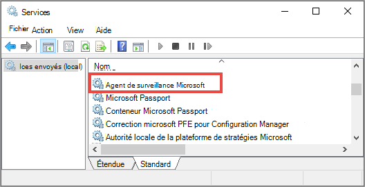

- <span data-ttu-id="be9d8-386">Dans **Microsoft Monitoring Agent** Azure Log Analytics (OMS), vérifiez les espaces de travail et vérifiez que l’état est en cours  >  d’exécution.</span><span class="sxs-lookup"><span data-stu-id="be9d8-386">In **Microsoft Monitoring Agent** > **Azure Log Analytics (OMS)**, check the Workspaces and verify that the status is running.</span></span>

    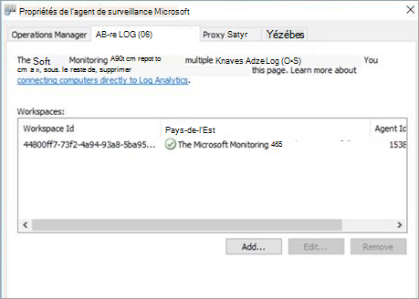

- <span data-ttu-id="be9d8-388">Vérifiez que les appareils sont reflétés dans la liste **Appareils** du portail.</span><span class="sxs-lookup"><span data-stu-id="be9d8-388">Check to see that devices are reflected in the **Devices list** in the portal.</span></span>

## <a name="confirming-onboarding-of-newly-built-devices"></a><span data-ttu-id="be9d8-389">Confirmation de l’intégration des appareils nouvellement créés</span><span class="sxs-lookup"><span data-stu-id="be9d8-389">Confirming onboarding of newly built devices</span></span>

<span data-ttu-id="be9d8-390">Il peut y avoir des instances lors du déploiement de l’intégration sur un appareil nouvellement créé, mais non terminé.</span><span class="sxs-lookup"><span data-stu-id="be9d8-390">There may be instances when onboarding is deployed on a newly built device but not completed.</span></span>

<span data-ttu-id="be9d8-391">Les étapes ci-dessous fournissent des conseils pour le scénario suivant :</span><span class="sxs-lookup"><span data-stu-id="be9d8-391">The steps below provide guidance for the following scenario:</span></span>

- <span data-ttu-id="be9d8-392">Le package d’intégration est déployé sur les appareils nouvellement créés</span><span class="sxs-lookup"><span data-stu-id="be9d8-392">Onboarding package is deployed to newly built devices</span></span>
- <span data-ttu-id="be9d8-393">Le capteur ne démarre pas car l’expérience OOBE (Out-of-Box Experience) ou la première logon</span><span class="sxs-lookup"><span data-stu-id="be9d8-393">Sensor does not start because the Out-of-box experience (OOBE) or first user logon has not been completed</span></span>
- <span data-ttu-id="be9d8-394">L’appareil est désactivé ou redémarré avant que l’utilisateur final effectue une première logon</span><span class="sxs-lookup"><span data-stu-id="be9d8-394">Device is turned off or restarted before the end user performs a first logon</span></span>
- <span data-ttu-id="be9d8-395">Dans ce scénario, le service SENSE ne démarre pas automatiquement même si le package d’intégration a été déployé</span><span class="sxs-lookup"><span data-stu-id="be9d8-395">In this scenario, the SENSE service will not start automatically even though onboarding package was deployed</span></span>

> [!NOTE]
> <span data-ttu-id="be9d8-396">Les étapes suivantes sont pertinentes uniquement lors de l’utilisation de Microsoft Endpoint Configuration Manager.</span><span class="sxs-lookup"><span data-stu-id="be9d8-396">The following steps are only relevant when using Microsoft Endpoint Configuration Manager.</span></span> <span data-ttu-id="be9d8-397">Pour plus d’informations sur l’intégration à l’aide de Microsoft Endpoint Configuration Manager, voir [Microsoft Defender for Endpoint](https://docs.microsoft.com/mem/configmgr/protect/deploy-use/windows-defender-advanced-threat-protection).</span><span class="sxs-lookup"><span data-stu-id="be9d8-397">For more details about onboarding using Microsoft Endpoint Configuration Manager, see [Microsoft Defender for Endpoint](https://docs.microsoft.com/mem/configmgr/protect/deploy-use/windows-defender-advanced-threat-protection).</span></span>

1. <span data-ttu-id="be9d8-398">Créez une application dans Microsoft Endpoint Configuration Manager.</span><span class="sxs-lookup"><span data-stu-id="be9d8-398">Create an application in Microsoft Endpoint Configuration Manager.</span></span>

    

2. <span data-ttu-id="be9d8-400">Sélectionnez **Spécifier manuellement les informations d’application.**</span><span class="sxs-lookup"><span data-stu-id="be9d8-400">Select **Manually specify the application information**.</span></span>

    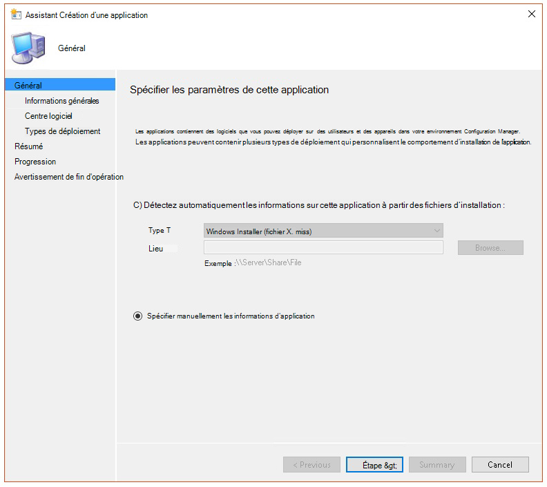

3. <span data-ttu-id="be9d8-402">Spécifiez des informations sur l’application, puis sélectionnez **Suivant**.</span><span class="sxs-lookup"><span data-stu-id="be9d8-402">Specify information about the application, then select **Next**.</span></span>

    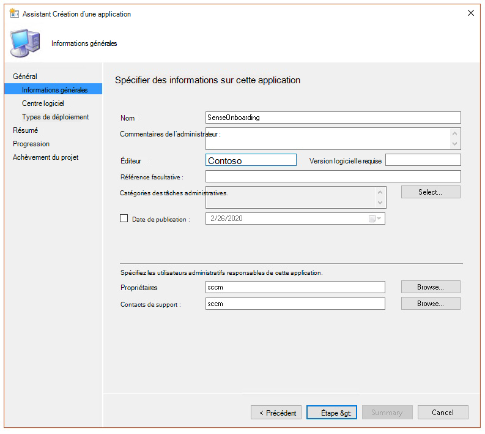

4. <span data-ttu-id="be9d8-404">Spécifiez des informations sur le centre de logiciels, puis sélectionnez **Suivant**.</span><span class="sxs-lookup"><span data-stu-id="be9d8-404">Specify information about the software center, then select **Next**.</span></span>

    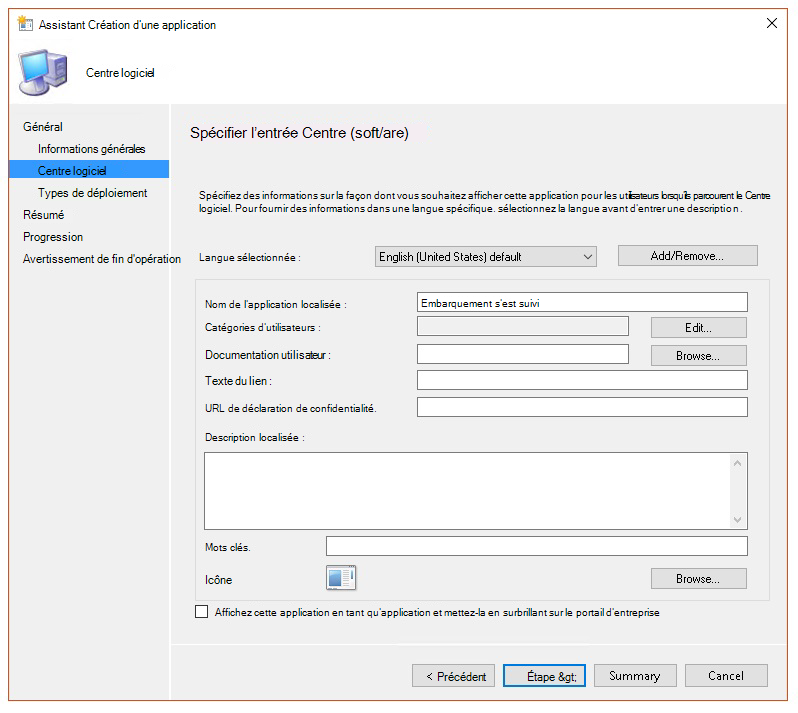

5. <span data-ttu-id="be9d8-406">Dans **les types de déploiement,** **sélectionnez Ajouter.**</span><span class="sxs-lookup"><span data-stu-id="be9d8-406">In **Deployment types** select **Add**.</span></span>

    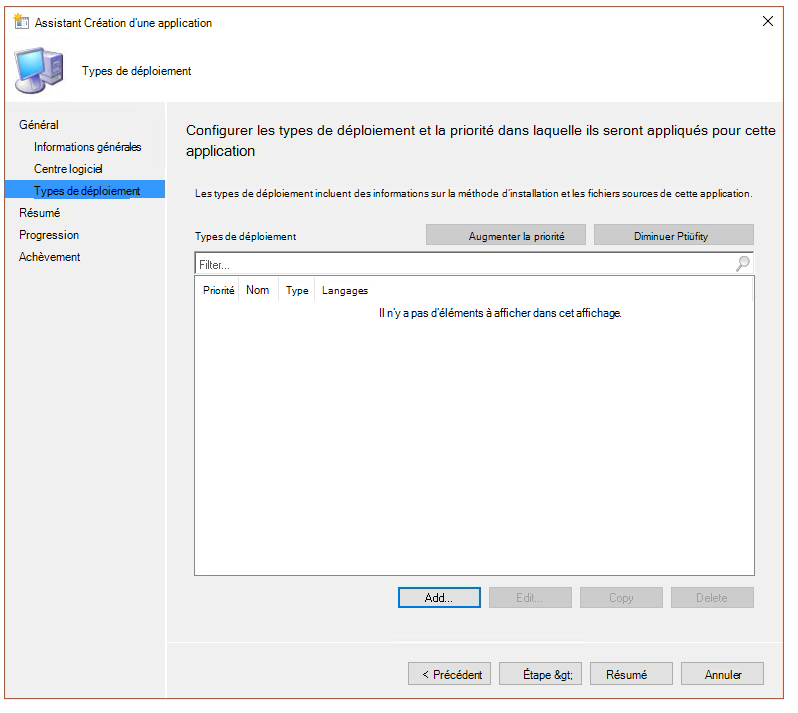

6. <span data-ttu-id="be9d8-408">Sélectionnez **Spécifier manuellement les informations sur le type de déploiement,** puis sélectionnez **Suivant.**</span><span class="sxs-lookup"><span data-stu-id="be9d8-408">Select **Manually specify the deployment type information**, then select **Next**.</span></span>

    

7. <span data-ttu-id="be9d8-410">Spécifiez des informations sur le type de déploiement, puis sélectionnez **Suivant**.</span><span class="sxs-lookup"><span data-stu-id="be9d8-410">Specify information about the deployment type, then select **Next**.</span></span>

    

8. <span data-ttu-id="be9d8-412">Dans **le programme**  >  **d’installation de** contenu, spécifiez la commande : `net start sense` .</span><span class="sxs-lookup"><span data-stu-id="be9d8-412">In **Content** > **Installation program** specify the command: `net start sense`.</span></span>

    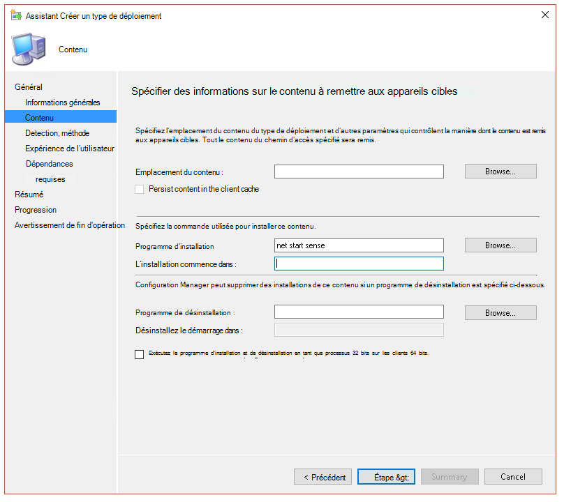

9. <span data-ttu-id="be9d8-414">Dans **la méthode Détection,** **sélectionnez Configurer des règles pour détecter** la présence de ce type de déploiement, puis **sélectionnez Ajouter une clause**.</span><span class="sxs-lookup"><span data-stu-id="be9d8-414">In **Detection method**, select **Configure rules to detect the presence of this deployment type**, then select **Add Clause**.</span></span>

    

10. <span data-ttu-id="be9d8-416">Spécifiez les détails de règle de détection suivants, puis sélectionnez **OK**:</span><span class="sxs-lookup"><span data-stu-id="be9d8-416">Specify the following detection rule details, then select **OK**:</span></span>

    

11. <span data-ttu-id="be9d8-418">Dans **la méthode de détection,** **sélectionnez Suivant.**</span><span class="sxs-lookup"><span data-stu-id="be9d8-418">In **Detection method** select **Next**.</span></span>

    

12. <span data-ttu-id="be9d8-420">Dans **Expérience utilisateur,** spécifiez les informations suivantes, puis sélectionnez **Suivant**:</span><span class="sxs-lookup"><span data-stu-id="be9d8-420">In **User Experience**, specify the following information, then select **Next**:</span></span>

    

13. <span data-ttu-id="be9d8-422">Dans **Les conditions requises,** **sélectionnez Suivant**.</span><span class="sxs-lookup"><span data-stu-id="be9d8-422">In **Requirements**, select **Next**.</span></span>

    

14. <span data-ttu-id="be9d8-424">Dans **Dépendances,** sélectionnez **Suivant.**</span><span class="sxs-lookup"><span data-stu-id="be9d8-424">In **Dependencies**, select **Next**.</span></span>

    

15. <span data-ttu-id="be9d8-426">En **résumé,** sélectionnez **Suivant**.</span><span class="sxs-lookup"><span data-stu-id="be9d8-426">In **Summary**, select **Next**.</span></span>

    

16. <span data-ttu-id="be9d8-428">In **Completion**, select **Close**.</span><span class="sxs-lookup"><span data-stu-id="be9d8-428">In **Completion**, select **Close**.</span></span>

    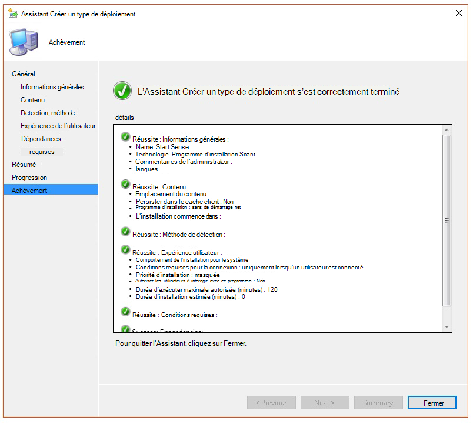

17. <span data-ttu-id="be9d8-430">Dans **les types de** déploiement, sélectionnez **Suivant.**</span><span class="sxs-lookup"><span data-stu-id="be9d8-430">In **Deployment types**, select **Next**.</span></span>

    

18. <span data-ttu-id="be9d8-432">En **résumé,** sélectionnez **Suivant**.</span><span class="sxs-lookup"><span data-stu-id="be9d8-432">In **Summary**, select **Next**.</span></span>

    

    <span data-ttu-id="be9d8-434">L’état est ensuite affiché : </span><span class="sxs-lookup"><span data-stu-id="be9d8-434">The status is then displayed: </span></span>

19. <span data-ttu-id="be9d8-435">In **Completion**, select **Close**.</span><span class="sxs-lookup"><span data-stu-id="be9d8-435">In **Completion**, select **Close**.</span></span>

    

20. <span data-ttu-id="be9d8-437">Vous pouvez maintenant déployer l’application en cliquant avec le bouton droit sur l’application et en sélectionnant **Déployer.**</span><span class="sxs-lookup"><span data-stu-id="be9d8-437">You can now deploy the application by right-clicking the app and selecting **Deploy**.</span></span>

    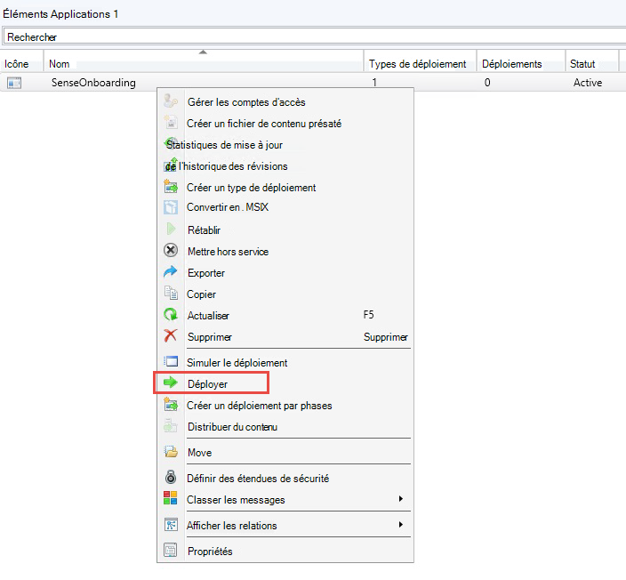

21. <span data-ttu-id="be9d8-439">En **général,** **sélectionnez Distribuer automatiquement le contenu pour les dépendances et** **Parcourir.**</span><span class="sxs-lookup"><span data-stu-id="be9d8-439">In **General** select **Automatically distribute content for dependencies** and **Browse**.</span></span>

    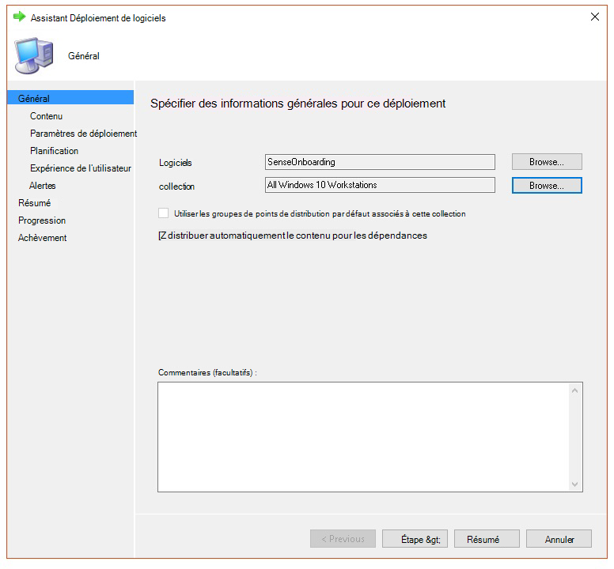

22. <span data-ttu-id="be9d8-441">Dans **le contenu,** **sélectionnez Suivant**.</span><span class="sxs-lookup"><span data-stu-id="be9d8-441">In **Content** select **Next**.</span></span>

    

23. <span data-ttu-id="be9d8-443">Dans **les paramètres de déploiement,** sélectionnez **Suivant.**</span><span class="sxs-lookup"><span data-stu-id="be9d8-443">In **Deployment settings**, select **Next**.</span></span>

    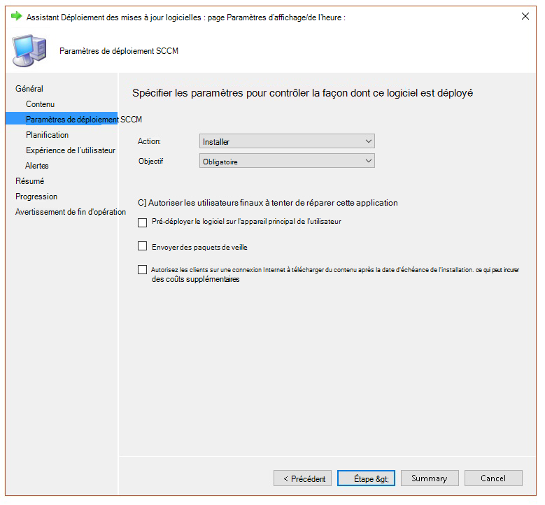

24. <span data-ttu-id="be9d8-445">Dans **la planification,** **sélectionnez Dès que possible après le temps disponible,** puis sélectionnez **Suivant**.</span><span class="sxs-lookup"><span data-stu-id="be9d8-445">In **Scheduling** select **As soon as possible after the available time**, then select **Next**.</span></span>

    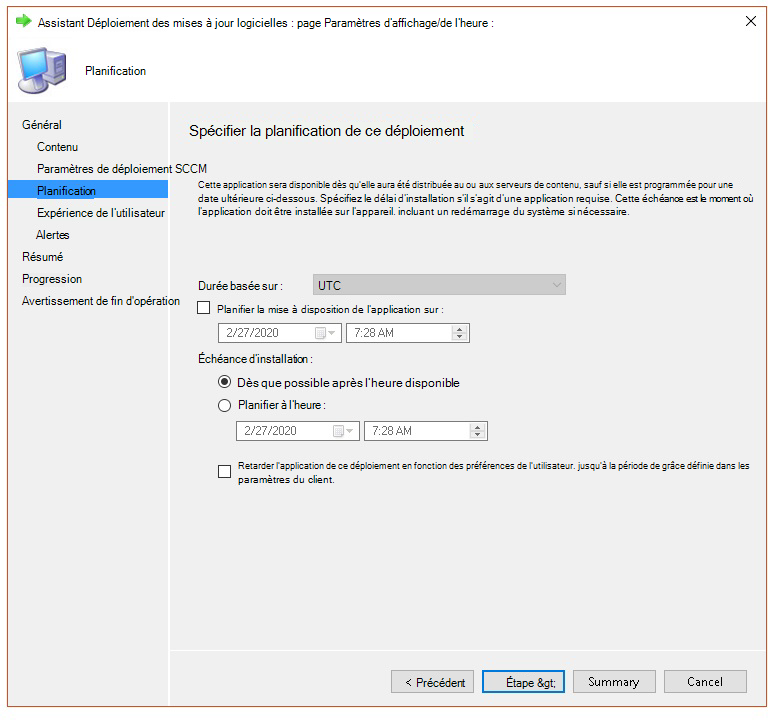

25. <span data-ttu-id="be9d8-447">Dans **l’expérience utilisateur,** sélectionnez Valider les modifications à l’échéance ou pendant une fenêtre de maintenance (nécessite des redémarrages), puis **sélectionnez Suivant**. </span><span class="sxs-lookup"><span data-stu-id="be9d8-447">In **User experience**, select **Commit changes at deadline or during a maintenance window (requires restarts)**, then select **Next**.</span></span>

    

26. <span data-ttu-id="be9d8-449">Dans **les alertes,** **sélectionnez Suivant.**</span><span class="sxs-lookup"><span data-stu-id="be9d8-449">In **Alerts** select **Next**.</span></span>

    

27. <span data-ttu-id="be9d8-451">En **résumé,** sélectionnez **Suivant**.</span><span class="sxs-lookup"><span data-stu-id="be9d8-451">In **Summary**, select **Next**.</span></span>

    

    <span data-ttu-id="be9d8-453">L’état est ensuite affiché </span><span class="sxs-lookup"><span data-stu-id="be9d8-453">The status is then displayed </span></span>

28. <span data-ttu-id="be9d8-454">In **Completion**, select **Close**.</span><span class="sxs-lookup"><span data-stu-id="be9d8-454">In **Completion**, select **Close**.</span></span>

    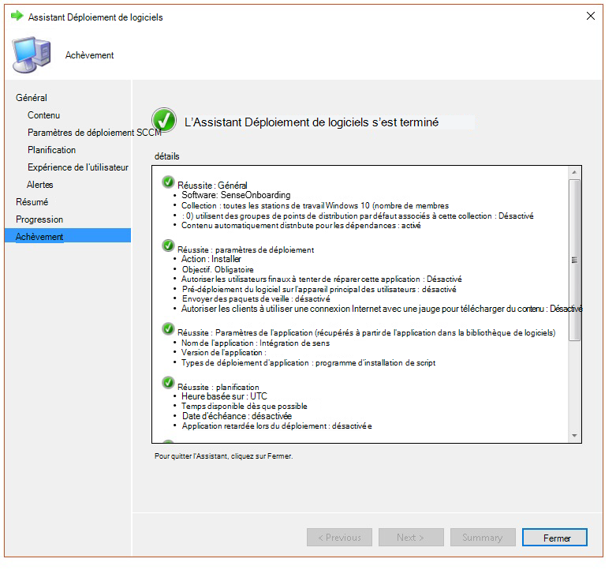


## <a name="related-topics"></a><span data-ttu-id="be9d8-456">Voir aussi</span><span class="sxs-lookup"><span data-stu-id="be9d8-456">Related topics</span></span>

- [<span data-ttu-id="be9d8-457">Résoudre les problèmes de Microsoft Defender pour le point de terminaison</span><span class="sxs-lookup"><span data-stu-id="be9d8-457">Troubleshoot Microsoft Defender for Endpoint</span></span>](troubleshoot-mdatp.md)
- [<span data-ttu-id="be9d8-458">Appareils intégrés</span><span class="sxs-lookup"><span data-stu-id="be9d8-458">Onboard devices</span></span>](onboard-configure.md)
- [<span data-ttu-id="be9d8-459">Configurer les paramètres de proxy d’appareil et de connectivité Internet</span><span class="sxs-lookup"><span data-stu-id="be9d8-459">Configure device proxy and Internet connectivity settings</span></span>](configure-proxy-internet.md)
