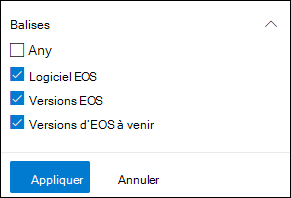
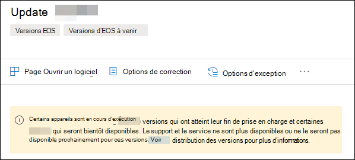
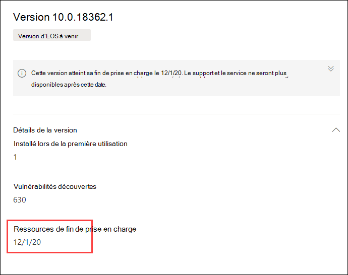

# Planifier les versions logicielles et logicielles de fin de prise en charge avec la gestion des menaces et des vulnérabilitésPlan for end-of-support software and software versions with threat and vulnerability management

[!INCLUDE [Microsoft 365 Defender rebranding](../../includes/microsoft-defender.md)]

**S’applique à :****Applies to:**

- [Microsoft Defender pour point de terminaisonMicrosoft Defender for Endpoint](https://go.microsoft.com/fwlink/?linkid=2154037)
- [Gestion des menaces et des vulnérabilitésThreat and vulnerability management](next-gen-threat-and-vuln-mgt.md)
- [Microsoft 365 DefenderMicrosoft 365 Defender](https://go.microsoft.com/fwlink/?linkid=2118804)

>Vous souhaitez découvrir Microsoft Defender pour le point de terminaison ?Want to experience Microsoft Defender for Endpoint? [Inscrivez-vous à un essai gratuit.Sign up for a free trial.](https://www.microsoft.com/microsoft-365/windows/microsoft-defender-atp?ocid=docs-wdatp-portaloverview-abovefoldlink)

EOS (End-of-support), également appelé end-of-life (EOL), pour les versions logicielles ou logicielles signifie qu’ils ne seront plus pris en charge ou pris en charge et ne recevront pas de mises à jour de sécurité.End-of-support (EOS), otherwise known as end-of-life (EOL), for software or software versions means that they will no longer be supported or serviced, and will not receive security updates. Lorsque vous utilisez des versions logicielles ou logicielles avec prise en charge terminée, vous exposez votre organisation aux vulnérabilités de sécurité, aux risques juridiques et financiers.When you use software or software versions with ended support, you're exposing your organization to security vulnerabilities, legal, and financial risks.

Il est essentiel que les administrateurs informatiques et de sécurité travaillent ensemble et s’assurent que l’inventaire logiciel de l’organisation est configuré pour obtenir des résultats optimaux, une conformité et un écosystème réseau sain.It's crucial for Security and IT Administrators to work together and ensure that the organization's software inventory is configured for optimal results, compliance, and a healthy network ecosystem. Ils doivent examiner les options de suppression ou de remplacement des applications qui ont atteint les versions de fin de prise en charge et de mise à jour qui ne sont plus pris en charge.They should examine the options to remove or replace apps that have reached end-of-support and update versions that are no longer supported. Il est préférable de créer et d’implémenter un **plan** avant la fin des dates de support.It's best to create and implement a plan **before** the end of support dates.

## Rechercher des versions logicielles ou logicielles qui ne sont plus pris en chargeFind software or software versions that are no longer supported

1. Dans le menu gestion des menaces et des vulnérabilités, accédez aux [**recommandations en matière de sécurité.**](tvm-security-recommendation.md)From the threat and vulnerability management menu, navigate to [**Security recommendations**](tvm-security-recommendation.md).
2. Go to the **Filters** panel and look for the tags section.Go to the **Filters** panel and look for the tags section. Sélectionnez une ou plusieurs des options de balise EOS.Select one or more of the EOS tag options. Ensuite, **appliquez**.Then **Apply**.

    

3. Vous verrez une liste de recommandations relatives aux logiciels dont la prise en charge est terminée, aux versions logicielles qui sont en fin de prise en charge ou aux versions dont la prise en charge sera prochainement terminée.You'll see a list of recommendations related to software with ended support, software versions that are end of support, or versions with upcoming end of support. Ces balises sont également visibles dans la page [d’inventaire](tvm-software-inventory.md) logiciel.These tags are also visible in the [software inventory](tvm-software-inventory.md) page.

    

## Liste des versions et des datesList of versions and dates

Pour afficher la liste des versions qui ont atteint la fin de la prise en charge, ou la fin ou la prise en charge prochainement, et ces dates, suivez les étapes ci-dessous :To view a list of versions that have reached end of support, or end or support soon, and those dates, follow the below steps:

1. Un message s’affiche dans le volant de recommandations de sécurité pour les logiciels dont les versions ont atteint la fin de la prise en charge ou qui arriveront bientôt à la fin du support.A message will appear in the security recommendation flyout for software with versions that have reached end of support, or will reach end of support soon.

    

2. Sélectionnez le **lien de distribution** de version pour aller à la page d’accès au logiciel.Select the **version distribution** link to go to the software drill-down page. Vous pouvez y voir une liste filtrée de versions avec des balises les identifiant comme fin de support ou fin de support à venir.There, you can see a filtered list of versions with tags identifying them as end of support, or upcoming end of support.

    

3. Sélectionnez l’une des versions du tableau à ouvrir.Select one of the versions in the table to open. Par exemple, version 10.0.18362.1.For example, version 10.0.18362.1. Un volant s’affiche à la date de fin du support.A flyout will appear with the end of support date.

    

Une fois que vous avez identifié les logiciels et les versions logicielles vulnérables en raison de leur statut de fin de support, vous devez décider s’il faut les mettre à jour ou les supprimer de votre organisation.Once you identify which software and software versions are vulnerable due to their end-of-support status, you must decide whether to update or remove them from your organization. Cela réduit l’exposition de votre organisation aux vulnérabilités et aux menaces persistantes avancées.Doing so will lower your organizations exposure to vulnerabilities and advanced persistent threats.

## Voir aussiRelated topics

- [Vue d’ensemble de la gestion des menaces et des vulnérabilitésThreat and vulnerability management overview](next-gen-threat-and-vuln-mgt.md)
- [Recommandations de sécuritéSecurity recommendations](tvm-security-recommendation.md)
- [Inventaire des logicielsSoftware inventory](tvm-software-inventory.md)
