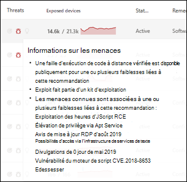
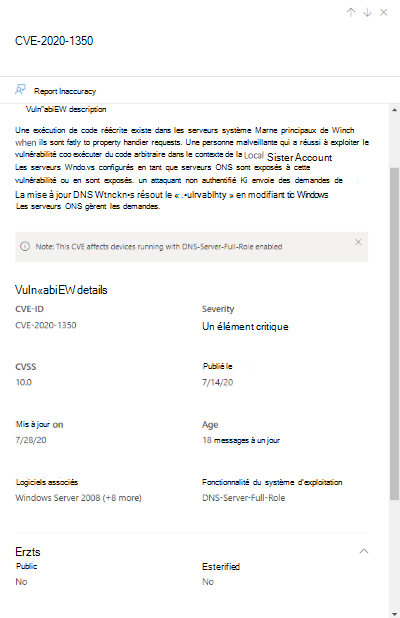
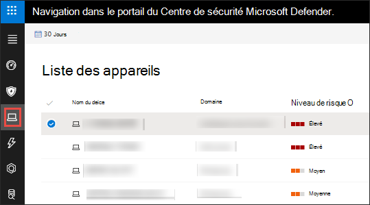
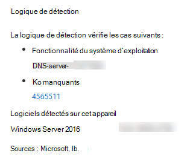

# Vulnérabilités dans mon organisation : gestion des menaces et des vulnérabilitésVulnerabilities in my organization - threat and vulnerability management

[!INCLUDE [Microsoft 365 Defender rebranding](../../includes/microsoft-defender.md)]

**S’applique à :****Applies to:**
- [Microsoft Defender pour point de terminaisonMicrosoft Defender for Endpoint](https://go.microsoft.com/fwlink/?linkid=2154037)
- [Gestion des menaces et des vulnérabilitésThreat and vulnerability management](next-gen-threat-and-vuln-mgt.md)
- [Microsoft 365 DefenderMicrosoft 365 Defender](https://go.microsoft.com/fwlink/?linkid=2118804)

>Vous souhaitez découvrir Microsoft Defender pour le point de terminaison ?Want to experience Microsoft Defender for Endpoint? [Inscrivez-vous à un essai gratuit.Sign up for a free trial.](https://www.microsoft.com/microsoft-365/windows/microsoft-defender-atp?ocid=docs-wdatp-portaloverview-abovefoldlink)

La gestion des menaces et des vulnérabilités utilise les mêmes signaux dans Defender pour la protection des points de terminaison pour analyser et détecter les vulnérabilités.Threat and vulnerability management uses the same signals in Defender for Endpoint's endpoint protection to scan and detect vulnerabilities.

La page **Faiblesses** répertorie les vulnérabilités logicielles que vos appareils sont exposés en répertoriant l’ID CVE (Common Vulnerabilities and Exposures).The **Weaknesses** page lists the software vulnerabilities your devices are exposed to by listing the Common Vulnerabilities and Exposures (CVE) ID. Vous pouvez également afficher la gravité, la notation des vulnérabilités courantes (CVSS), la prévalence dans votre organisation, la violation correspondante, les informations sur les menaces, etc.You can also view the severity, Common Vulnerability Scoring System (CVSS) rating, prevalence in your organization, corresponding breach, threat insights, and more.

>[!NOTE]
>Si aucun ID CVE officiel n’est affecté à une vulnérabilité, le nom de la vulnérabilité est attribué par la gestion des menaces et des vulnérabilités.If there is no official CVE-ID assigned to a vulnerability, the vulnerability name is assigned by threat and vulnerability management.

>[!TIP]
>Pour obtenir des e-mails sur les nouveaux événements de vulnérabilité, voir Configurer les notifications par courrier électronique de vulnérabilité [dans Microsoft Defender pour le point de terminaison](configure-vulnerability-email-notifications.md)To get emails about new vulnerability events, see [Configure vulnerability email notifications in Microsoft Defender for Endpoint](configure-vulnerability-email-notifications.md)

## Accéder à la page FaiblessesNavigate to the Weaknesses page

Accédez à la page Faiblesses de différentes manières :Access the Weaknesses page a few different ways:

- Sélection des **faiblesses dans le** menu de navigation de gestion des menaces et des vulnérabilités dans le Centre de [sécurité Microsoft Defender](portal-overview.md)Selecting **Weaknesses** from the threat and vulnerability management navigation menu in the [Microsoft Defender Security Center](portal-overview.md)
- Recherche globaleGlobal search

### Menu de navigationNavigation menu

Go to the threat and vulnerability management navigation menu and select **Weaknesses** to open the list of CVEs.Go to the threat and vulnerability management navigation menu and select **Weaknesses** to open the list of CVEs.

### Vulnérabilités dans la recherche globaleVulnerabilities in global search

1. Go to the global search drop-down menu.Go to the global search drop-down menu.
2. Sélectionnez **Vulnérabilité et** clé dans l’ID CVE (Common Vulnerabilities and Exposures) que vous recherchez, puis sélectionnez l’icône de recherche.Select **Vulnerability** and key-in the Common Vulnerabilities and Exposures (CVE) ID that you're looking for, then select the search icon. La page **Faiblesses** s’ouvre avec les informations CVE que vous recherchez.The **Weaknesses** page opens with the CVE information that you're looking for.

3. Sélectionnez la CVE pour ouvrir un panneau volant avec plus d’informations, notamment la description de la vulnérabilité, les détails, les informations sur les menaces et les appareils exposés.Select the CVE to open a flyout panel with more information, including the vulnerability description, details, threat insights, and exposed devices.

Pour voir le reste des vulnérabilités dans la page **Faiblesses,** tapez CVE, puis sélectionnez rechercher.To see the rest of the vulnerabilities in the **Weaknesses** page, type CVE, then select search.

## Vue d’ensemble des faiblessesWeaknesses overview

Corriger les vulnérabilités des appareils exposés afin de réduire les risques pour vos ressources et votre organisation.Remediate the vulnerabilities in exposed devices to reduce the risk to your assets and organization. Si la **colonne Appareils** exposés affiche 0, cela signifie que vous n’êtes pas en danger.If the **Exposed Devices** column shows 0, that means you aren't at risk.

### Informations sur les violations et les menacesBreach and threat insights

Affichez les informations sur les violations et menaces associées dans la colonne **Menace** lorsque les icônes sont colorées en rouge.View any related breach and threat insights in the **Threat** column when the icons are colored red.

 >[!NOTE]
 > Toujours hiérarchiser les recommandations associées aux menaces en cours.Always prioritize recommendations that are associated with ongoing threats. Ces recommandations sont marquées avec l’icône d’informations sur les menaces These recommendations are marked with the threat insight icon  et l’icône d’informations sur la violation, dessin  .and breach insight icon .  

L’icône Informations sur les violations est mise en surbrill valeur si une vulnérabilité est trouvée dans votre organisation.The breach insights icon is highlighted if there's a vulnerability found in your organization.
This one says "possible active alert is associated with this recommendation.](images/tvm-breach-insights.png)

L’icône Informations sur les menaces est mise en évidence si la vulnérabilité trouvée dans votre organisation est associée à des exploits.The threat insights icon is highlighted if there are associated exploits in the vulnerability found in your organization. Le pointage sur l’icône indique si la menace fait partie d’un kit d’exploitation ou est connectée à des campagnes avancées persistantes ou à des groupes d’activités spécifiques.Hovering over the icon shows whether the threat is a part of an exploit kit, or connected to specific advanced persistent campaigns or activity groups. Lorsqu’il est disponible, il existe un lien vers un rapport d’analyse des menaces avec les actualités sur l’exploitation zéro jour, les divulgations ou les conseils de sécurité associés.When available, there's a link to a Threat Analytics report with zero-day exploitation news, disclosures, or related security advisories.  

### Obtenir des informations sur les vulnérabilitésGain vulnerability insights

Si vous sélectionnez un contrôle CVE, un panneau volant s’ouvre avec plus d’informations, telles que la description de la vulnérabilité, les détails, les informations sur les menaces et les appareils exposés.If you select a CVE, a flyout panel will open with more information such as the vulnerability description, details, threat insights, and exposed devices.

- La catégorie « Fonctionnalité du système d’exploitation » est affichée dans les scénarios pertinentsThe "OS Feature" category is shown in relevant scenarios
- Vous pouvez passer à la recommandation de sécurité associée pour chaque CVE avec appareil exposéYou can go to the related security recommendation for every CVE with exposed device

 

### Logiciel non pris en chargeSoftware that isn't supported

Les VC pour les logiciels qui ne sont actuellement pas pris en charge par les menaces & gestion des vulnérabilités sont toujours présents dans la page Faiblesses.CVEs for software that isn't currently supported by threat & vulnerability management is still present in the Weaknesses page. Étant donné que le logiciel n’est pas pris en charge, seules des données limitées seront disponibles.Because the software is not supported, only limited data will be available.

Les informations sur l’appareil exposé ne seront pas disponibles pour les VC avec des logiciels non pris en cas de non-gestion.Exposed device information will not be available for CVEs with unsupported software. Filtrez en sélectionnant l’option « Non disponible » dans la section « Appareils exposés ».Filter by unsupported software by selecting the "Not available" option in the "Exposed devices" section.

 

## Afficher les entrées CVE (Common Vulnerabilities and Exposures) à d’autres endroitsView Common Vulnerabilities and Exposures (CVE) entries in other places

### Logiciels les plus vulnérables dans le tableau de bordTop vulnerable software in the dashboard

1. Go to the [threat and vulnerability management dashboard](tvm-dashboard-insights.md) and scroll down to the Top vulnerable **software** widget.Go to the [threat and vulnerability management dashboard](tvm-dashboard-insights.md) and scroll down to the **Top vulnerable software** widget. Vous verrez le nombre de vulnérabilités trouvées dans chaque logiciel, ainsi que des informations sur les menaces et une vue d’exposition de haut niveau de l’appareil au fil du temps.You will see the number of vulnerabilities found in each software, along with threat information and a high-level view of device exposure over time.

    

2. Sélectionnez le logiciel que vous souhaitez examiner pour aller à une page d’exercice.Select the software you want to investigate to go to a drilldown page.
3. Sélectionnez **l’onglet Vulnérabilités découvertes.**Select the **Discovered vulnerabilities** tab.
4. Sélectionnez la vulnérabilité que vous souhaitez examiner pour plus d’informations sur les détails de la vulnérabilitéSelect the vulnerability you want to investigate for more information on vulnerability details

    

### Découvrir les vulnérabilités dans la page d’appareilDiscover vulnerabilities in the device page

Afficher les informations sur les faiblesses associées dans la page de l’appareil.View related weaknesses information in the device page.

1. Go to the Microsoft Defender Security Center navigation menu bar, then select the device icon.Go to the Microsoft Defender Security Center navigation menu bar, then select the device icon. La page **Liste des périphériques** s’ouvre.The **Devices list** page opens.
2. Dans la page **Liste des** appareils, sélectionnez le nom de l’appareil que vous souhaitez examiner.In the **Devices list** page, select the device name that you want to investigate.

    

3. La page de l’appareil s’ouvre avec des détails et des options de réponse pour l’appareil que vous souhaitez examiner.The device page will open with details and response options for the device you want to investigate.
4. Sélectionnez **vulnérabilités découvertes.**Select **Discovered vulnerabilities**.

    

5. Sélectionnez la vulnérabilité que vous souhaitez examiner pour ouvrir un panneau volant avec les détails CVE, tels que : description de la vulnérabilité, informations sur les menaces et logique de détection.Select the vulnerability that you want to investigate to open up a flyout panel with the CVE details, such as: vulnerability description, threat insights, and detection logic.

#### Logique de détection CVECVE Detection logic

Comme pour la preuve logicielle, nous montrons maintenant la logique de détection que nous avons appliquée sur un appareil afin de l’afficher comme vulnérable.Similar to the software evidence, we now show the detection logic we applied on a device in order to state that it's vulnerable. La nouvelle section est appelée « Logique de détection » (dans toute vulnérabilité détectée dans la page de l’appareil) et affiche la logique et la source de détection.The new section is called "Detection Logic" (in any discovered vulnerability in the device page) and shows the detection logic and source.

La catégorie « Fonctionnalité du système d’exploitation » est également affichée dans les scénarios pertinents.The "OS Feature" category is also shown in relevant scenarios. Une CVE affecterait les appareils qui exécutent un système d’exploitation vulnérable uniquement si un composant de système d’exploitation spécifique est activé.A CVE would affect devices that run a vulnerable OS only if a specific OS component is enabled. Supposons que Windows Server 2019 présente une vulnérabilité dans son composant DNS.Let's say Windows Server 2019 has vulnerability in its DNS component. Avec cette nouvelle fonctionnalité, nous n’attacherons cette CVE qu’aux appareils Windows Server 2019 avec la fonctionnalité DNS activée dans leur système d’exploitation.With this new capability, we’ll only attach this CVE to the Windows Server 2019 devices with the DNS capability enabled in their OS.

## Report inaccuracyReport inaccuracy

Signalez un faux positif lorsque vous voyez des informations vagues, inexactes ou incomplètes.Report a false positive when you see any vague, inaccurate, or incomplete information. Vous pouvez également signaler les recommandations de sécurité qui ont déjà été corrigés.You can also report on security recommendations that have already been remediated.

1. Ouvrez la CVE sur la page Faiblesses.Open the CVE on the Weaknesses page.
2. Sélectionnez **l’imprécision du rapport** et un volet volant s’ouvre.Select **Report inaccuracy** and a flyout pane will open.
3. Sélectionnez la catégorie d’imprécision dans le menu déroulant et remplissez votre adresse e-mail et les détails d’imprécision.Select the inaccuracy category from the drop-down menu and fill in your email address and inaccuracy details.
4. Sélectionnez **Envoyer**.Select **Submit**. Vos commentaires sont immédiatement envoyés aux experts en gestion des menaces et des vulnérabilités.Your feedback is immediately sent to the threat and vulnerability management experts.

## Articles connexesRelated articles

- [Vue d’ensemble de la gestion des menaces et des vulnérabilitésThreat and vulnerability management overview](next-gen-threat-and-vuln-mgt.md)
- [Recommandations de sécuritéSecurity recommendations](tvm-security-recommendation.md)
- [Inventaire des logicielsSoftware inventory](tvm-software-inventory.md)
- [Tableau de bord des informationsDashboard insights](tvm-dashboard-insights.md)
- [Afficher et organiser la liste Microsoft Defender pour les appareils de point de terminaisonView and organize the Microsoft Defender for Endpoint Devices list](machines-view-overview.md)
