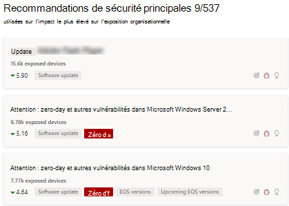
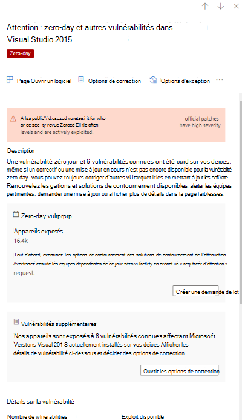

# Atténuer les vulnérabilités du jour zéro : Gestion des menaces et des vulnérabilitésMitigate zero-day vulnerabilities - threat and vulnerability management

[!INCLUDE [Microsoft 365 Defender rebranding](../../includes/microsoft-defender.md)]

**S’applique à :****Applies to:**

- [Microsoft Defender pour point de terminaisonMicrosoft Defender for Endpoint](https://go.microsoft.com/fwlink/?linkid=2154037)
- [Menaces et gestion des vulnérabilitésThreat and vulnerability management](next-gen-threat-and-vuln-mgt.md)
- [Microsoft 365 DefenderMicrosoft 365 Defender](https://go.microsoft.com/fwlink/?linkid=2118804)

>Vous souhaitez découvrir Microsoft Defender pour le point de terminaison ?Want to experience Microsoft Defender for Endpoint? [Inscrivez-vous à un essai gratuit.Sign up for a free trial.](https://www.microsoft.com/microsoft-365/windows/microsoft-defender-atp?ocid=docs-wdatp-portaloverview-abovefoldlink)

Une vulnérabilité « zero-day » est une vulnérabilité publiquement divulguée pour laquelle aucune mise à jour de sécurité ou correctifs officiels n’a été publié.A zero-day vulnerability is a publicly disclosed vulnerability for which no official patches or security updates have been released. Les vulnérabilités du jour zéro ont souvent des niveaux de gravité élevés et sont activement exploitées.Zero-day vulnerabilities often have high severity levels and are actively exploited.

Les menaces et gestion des vulnérabilités afficheront uniquement les vulnérabilités zero-day dont il dispose d’informations.Threat and vulnerability management will only display zero-day vulnerabilities it has information about.

## Trouver des informations sur les vulnérabilités du jour zéroFind information about zero-day vulnerabilities

Une fois qu’une vulnérabilité zéro jour a été trouvée, les informations à ce sujet sont transmises via les expériences suivantes dans le Centre de sécurité Microsoft Defender.Once a zero-day vulnerability has been found, information about it will be conveyed through the following experiences in the Microsoft Defender Security Center.

>[!NOTE]
> La fonctionnalité de vulnérabilité de 0 jour est actuellement disponible uniquement pour Windows produits.0-day vulnerability capability is currently available only for Windows products.

### Tableau de bord des menaces gestion des vulnérabilités de sécuritéThreat and vulnerability management dashboard

Recherchez des recommandations avec une balise « zero-day » dans la carte « Recommandations de sécurité les plus importantes ».Look for recommendations with a zero-day tag in the “Top security recommendations” card.

Recherchez les principaux logiciels avec la balise « zero-day » dans la carte « Logiciels les plus vulnérables ».Find top software with the zero-day tag in the "Top vulnerable software" card.

### Page FaiblessesWeaknesses page

Recherchez la vulnérabilité nommée « zero-day » ainsi qu’une description et des détails.Look for the named zero-day vulnerability along with a description and details.

- Si un ID CVE est affecté à cette vulnérabilité, vous verrez l’étiquette « zero-day » en regard du nom CVE.If this vulnerability has a CVE-ID assigned, you’ll see the zero-day label next to the CVE name.

- Si aucun ID CVE n’est affecté à cette vulnérabilité, vous la trouverez sous un nom interne temporaire qui ressemble à « TVM-XXXX-XXXX ».If this vulnerability has no CVE-ID assigned, you'll find it under an internal, temporary name that looks like “TVM-XXXX-XXXX”. Le nom sera mis à jour une fois qu’un ID CVE officiel a été affecté, mais le nom interne précédent peut toujours être recherché et trouvé dans le panneau latéral.The name will be updated once an official CVE-ID has been assigned, but the previous internal name will still be searchable and found in the side-panel.

### Page Inventaire logicielSoftware inventory page

Recherchez des logiciels avec la balise « zero-day ».Look for software with the zero-day tag. Filtrez par la balise « zero day » pour voir uniquement les logiciels avec des vulnérabilités zero-day.Filter by the "zero day" tag to only see software with zero-day vulnerabilities.

### Page de logicielsSoftware page

Recherchez une balise zero-day pour chaque logiciel affecté par la vulnérabilité zero-day.Look for a zero-day tag for each software that has been affected by the zero–day vulnerability.

### Page Recommandations en matière de sécuritéSecurity recommendations page

Affichez des suggestions claires sur les options de correction et d’atténuation, y compris les solutions de contournement si elles existent.View clear suggestions about remediation and mitigation options, including workarounds if they exist. Filtrez par balise « zero day » pour voir uniquement les recommandations de sécurité concernant les vulnérabilités « zero-day ».Filter by the "zero day" tag to only see security recommendations addressing zero-day vulnerabilities.

S’il existe un logiciel avec une vulnérabilité zéro jour et des vulnérabilités supplémentaires à résoudre, vous recevrez une recommandation sur toutes les vulnérabilités.If there's software with a zero-day vulnerability and additional vulnerabilities to address, you'll get one recommendation about all vulnerabilities.

## Résoudre les vulnérabilités du jour zéroAddressing zero-day vulnerabilities

Go to the security recommendation page and select a recommendation with a zero-day.Go to the security recommendation page and select a recommendation with a zero-day. Un flyout s’ouvre avec des informations sur le jour zéro et d’autres vulnérabilités pour ce logiciel.A flyout will open with information about the zero-day and other vulnerabilities for that software.

Il y aura un lien vers les options d’atténuation et les solutions de contournement si elles sont disponibles.There will be a link to mitigation options and workarounds if they are available. Les solutions de contournement peuvent aider à réduire les risques posés par cette vulnérabilité zero-day jusqu’à ce qu’un correctif ou une mise à jour de sécurité puisse être déployé.Workarounds may help reduce the risk posed by this zero-day vulnerability until a patch or security update can be deployed.

Ouvrez les options de correction et choisissez le type d’attention.Open remediation options and choose the attention type. Une option de correction « attention requise » est recommandée pour les vulnérabilités du jour zéro, dans la mesure où une mise à jour n’a pas encore été publiée.An "attention required" remediation option is recommended for the zero-day vulnerabilities, since an update hasn't been released yet. Vous ne pourrez pas sélectionner une date d’échéance, car aucune action spécifique n’est à effectuer.You won't be able to select a due date, since there's no specific action to perform. S’il existe des vulnérabilités plus anciennes pour ce logiciel que vous souhaitez mettre à jour, vous pouvez remplacer l’option de correction « Attention requise » et choisir « mettre à jour ».If there are older vulnerabilities for this software you wish to remediation, you can override the "attention required" remediation option and choose “update.”

## Suivre les activités de correction du jour zéroTrack zero-day remediation activities

Go to the Gestion des menaces et des vulnérabilités [Remediation](tvm-remediation.md) page to view the remediation activity item.Go to the threat and vulnerability management [Remediation](tvm-remediation.md) page to view the remediation activity item. Si vous avez choisi l’option de correction « Attention requise », il n’y aura aucune barre de progression, état du ticket ou date d’échéance, car il n’existe aucune action réelle que nous pouvons surveiller.If you chose the "attention required" remediation option, there will be no progress bar, ticket status, or due date since there's no actual action we can monitor. Vous pouvez filtrer par type de correction, par exemple « mise à jour logicielle » ou « attention requise », pour voir tous les éléments d’activité dans la même catégorie.You can filter by remediation type, such as "software update" or "attention required," to see all activity items in the same category.

## Correction des vulnérabilités du jour zéroPatching zero-day vulnerabilities

Lorsqu’un correctif est publié pour le jour zéro, la recommandation est modifiée en « Mise à jour » et une étiquette bleue en plus de celle-ci indique « Nouvelle mise à jour de sécurité pour le jour zéro ».When a patch is released for the zero-day, the recommendation will be changed to “Update” and a blue label next to it that says “New security update for zero day.” Il ne sera plus considérer comme un jour zéro, la balise « zero-day » sera supprimée de toutes les pages.It will no longer consider as a zero-day, the zero-day tag will be removed from all pages.

## Articles connexesRelated articles

- [Vue d’ensemble gestion des vulnérabilités menaces et gestion des vulnérabilités menacesThreat and vulnerability management overview](next-gen-threat-and-vuln-mgt.md)
- [Tableau de bordDashboard](tvm-dashboard-insights.md)
- [Recommandations de sécuritéSecurity recommendations](tvm-security-recommendation.md)
- [Inventaire des logicielsSoftware inventory](tvm-software-inventory.md)
- [Les vulnérabilités dans mon organisationVulnerabilities in my organization](tvm-weaknesses.md)
