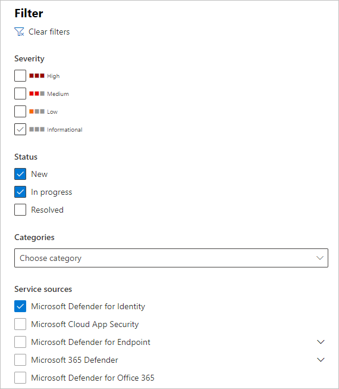
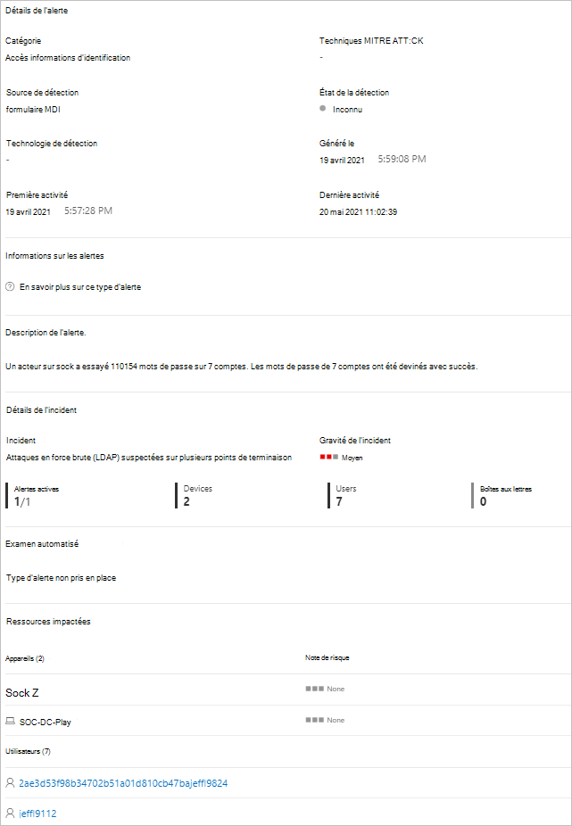
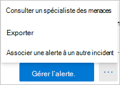

# Alertes de sécurité Defender pour l’identité dans Microsoft 365 DefenderDefender for Identity security alerts in Microsoft 365 Defender

**S’applique à :****Applies to:**

- Microsoft 365 DefenderMicrosoft 365 Defender
- Defender pour l’identitéDefender for Identity

Cet article explique les principes de base de l’utilisation des alertes de sécurité [Microsoft Defender pour](/defender-for-identity) l’identité dans le centre Microsoft 365 de [sécurité.](/microsoft-365/security/defender/overview-security-center)This article explains the basics of how to work with [Microsoft Defender for Identity](/defender-for-identity) security alerts in the [Microsoft 365 security center](/microsoft-365/security/defender/overview-security-center).

Les alertes Defender pour l’identité sont intégrées en natif au centre [de sécurité Microsoft 365](https://security.microsoft.com) avec un format de page d’alerte d’identité dédié.Defender for Identity alerts are natively integrated into the [Microsoft 365 security center](https://security.microsoft.com) with a dedicated Identity alert page format. Il s’agit de la première étape du parcours d’introduction de l’expérience [Microsoft Defender pour l’identité](/defender-for-identity/defender-for-identity-in-microsoft-365-defender)complète dans Microsoft 365 Defender .This marks the first step in the journey to [introduce the full Microsoft Defender for Identity experience into Microsoft 365 Defender](/defender-for-identity/defender-for-identity-in-microsoft-365-defender).

La nouvelle page d’alerte d’identité offre aux clients Microsoft Defender for Identity un meilleur enrichissement de signal entre domaines et de nouvelles fonctionnalités de réponse automatisée aux identités.The new Identity alert page gives Microsoft Defender for Identity customers better cross-domain signal enrichment and new automated identity response capabilities. Il vous permet de rester sécurisé et d’améliorer l’efficacité de vos opérations de sécurité.It ensures that you stay secure and helps improve the efficiency of your security operations.

L’un des avantages de l’examen des alertes par le biais de [Microsoft 365 Defender](/microsoft-365/security/defender/microsoft-365-defender) est que les alertes Microsoft Defender pour l’identité sont davantage corrélées avec les informations obtenues à partir de chacun des autres produits de la suite.One of the benefits of investigating alerts through [Microsoft 365 Defender](/microsoft-365/security/defender/microsoft-365-defender) is that Microsoft Defender for Identity alerts are further correlated with information obtained from each of the other products in the suite. Ces alertes améliorées sont cohérentes avec les autres formats d’alerte Microsoft 365 Defender provenant de [Microsoft Defender](/microsoft-365/security/office-365-security) pour Office 365 et Microsoft Defender pour le point [de terminaison.](/microsoft-365/security/defender-endpoint)These enhanced alerts are consistent with the other Microsoft 365 Defender alert formats originating from [Microsoft Defender for Office 365](/microsoft-365/security/office-365-security) and [Microsoft Defender for Endpoint](/microsoft-365/security/defender-endpoint). La nouvelle page élimine efficacement la nécessité d’accéder à un autre portail de produits pour examiner les alertes associées à l’identité.The new page effectively eliminates the need to navigate to another product portal to investigate alerts associated with identity.

Les alertes provenant de Defender for Identity peuvent désormais déclencher les fonctionnalités d’investigation et de réponse automatisées [(AIR) de Microsoft 365 Defender,](/microsoft-365/security/defender/m365d-autoir) notamment la correction automatique des alertes et l’atténuation des outils et processus qui peuvent contribuer à l’activité suspecte.Alerts originating from Defender for Identity can now trigger the [Microsoft 365 Defender automated investigation and response (AIR)](/microsoft-365/security/defender/m365d-autoir) capabilities, including automatically remediating alerts and the mitigation of tools and processes that can contribute to the suspicious activity.

>[!IMPORTANT]
>Dans le cadre de la convergence avec Microsoft 365 Defender, certaines options et détails ont changé par rapport à leur emplacement dans le portail Defender pour l’identité.As part of the convergence with Microsoft 365 Defender, some options and details have changed from their location in the Defender for Identity portal. Veuillez lire les détails ci-dessous pour découvrir où trouver les fonctionnalités connues et nouvelles.Please read the details below to discover where to find both the familiar and new features.

## Passer en revue les alertes de sécuritéReview security alerts

Les alertes sont accessibles à partir de plusieurs emplacements, y compris la page **Alertes,** la page **Incidents,** les pages des appareils individuels **et** à partir de la page **de** recherche avancée.Alerts can be accessed from multiple locations, including the **Alerts** page, the **Incidents** page, the pages of individual **Devices**, and from the **Advanced hunting** page. Dans cet exemple, nous allons passer en revue la **page Alertes.**In this example, we'll review the **Alerts page**.  

Dans le [centre Microsoft 365 de sécurité,](https://security.microsoft.com/)allez à **Incidents & alertes,** puis aux **alertes.**In the [Microsoft 365 security center](https://security.microsoft.com/), go to **Incidents & alerts** and then to **Alerts**.

Pour voir les alertes de Defender pour l’identité, dans le haut à droite, sélectionnez **Filtre,** puis sous Sources de **service,** sélectionnez **Microsoft Defender pour** l’identité, puis sélectionnez **Appliquer**:To see alerts from Defender for Identity, on the top-right select **Filter**, and then under **Service sources** select **Microsoft Defender for Identity**, and select **Apply**:

Les alertes sont affichées avec des informations dans les **colonnes suivantes** **:** Nom de l’alerte , **Balises**, **Gravité** **,** État de l’enquête , État , **Catégorie**, **Source** de détection **,** Ressources impactées , Première activité et Dernière **activité**. The alerts are displayed with information in the following columns: **Alert name**, **Tags**, **Severity**, **Investigation state**, **Status**, **Category**, **Detection source**, **Impacted assets**, **First activity**, and **Last activity**.

## Gérer des alertesManage alerts

Si vous cliquez sur le nom **de** l’alerte pour l’une des alertes, vous allez sur la page avec des détails sur l’alerte.If you click the **Alert name** for one of the alerts, you'll go to the page with details about the alert. Dans le volet gauche, vous verrez un résumé de ce qui **s’est passé**:In the left pane, you'll see a summary of **What happened**:

Au-dessus de la zone Ce **qui s’est** passé se sont des boutons pour les **comptes,** l’hôte **de destination** et l’hôte **source** de l’alerte.Above the **What happened** box are buttons for the **Accounts**, **Destination Host** and **Source Host** of the alert. Pour d’autres alertes, vous pouvez voir des boutons pour plus d’informations sur des hôtes, des comptes, des adresses IP, des domaines et des groupes de sécurité supplémentaires.For other alerts, you might see buttons for details about additional hosts, accounts, IP addresses, domains, and security groups. Sélectionnez l’une d’elles pour obtenir plus de détails sur les entités impliquées.Select any of them to get more details about the entities involved.

Dans le volet droit, vous verrez les détails de **l’alerte.**On the right pane, you'll see the **Alert details**. Vous pouvez y voir plus de détails et effectuer plusieurs tâches :Here you can see more details and perform several tasks:

- **Classifier cette alerte** : ici, vous pouvez désigner cette alerte en tant qu’alerte **True** ou **False****Classify this alert** - Here you can designate this alert as a **True alert** or **False alert**

    

- **État de l’alerte** - Dans **Définir la classification,** vous pouvez classer l’alerte comme **True** ou **False**.**Alert state** - In **Set Classification**, you can classify the alert as **True** or **False**. Dans **Assigné à**, vous pouvez affecter l’alerte à vous-même ou la désattribuer.In **Assigned to**, you can assign the alert to yourself or unassign it.

    

- **Détails** de l’alerte : sous **Détails** de l’alerte, vous trouverez plus d’informations sur l’alerte spécifique, suivez un lien vers la documentation sur le type d’alerte, consultez l’incident auquel l’alerte est associée, examinez les enquêtes automatisées liées à ce type d’alerte et consultez les appareils et les utilisateurs touchés.**Alert details** - Under **Alert details**, you can find more information about the specific alert, follow a link to documentation about the type of alert, see which incident the alert is associated with, review any automated investigations linked to this alert type, and see the impacted devices and users.

    

- **Commentaires &'historique** : vous pouvez ajouter vos commentaires à l’alerte et consulter l’historique de toutes les actions associées à l’alerte.**Comments & history** - Here you can add your comments to the alert, and see the history of all actions associated with the alert.

    

- **Gérer l’alerte** : si vous sélectionnez **Gérer** l’alerte, vous allez dans un volet qui vous permettra de modifier les :**Manage alert** - If you select **Manage alert**, you'll go to a pane that will allow you to edit the:
  - **État** : vous pouvez choisir **Nouveau,** **Résolu** ou **En cours.****Status** - You can choose **New**, **Resolved** or **In progress**.
  - **Classification** : vous pouvez choisir une **alerte True ou** **False.****Classification** - You can choose **True alert** or **False alert**.
  - **Commentaire** : vous pouvez ajouter un commentaire sur l’alerte.**Comment** - You can add a comment about the alert.

    Si vous sélectionnez les trois points à côté de Gérer l’alerte, vous pouvez consulter un **expert** en **menaces,** exporter l’alerte vers un fichier Excel ou établir un lien vers **un autre incident.**If you select the three dots next to **Manage alert**, you can **Consult a threat expert**, **Export** the alert to an Excel file, or **Link to another incident**.

    

    >[!NOTE]
    >Dans le Excel, deux liens sont désormais disponibles : Afficher dans **Microsoft Defender** pour l’identité et Affichage dans **Microsoft 365 Defender.**In the Excel file, you now have two links available: **View in Microsoft Defender for Identity** and **View in Microsoft 365 Defender**. Chaque lien vous permet d’être sur le portail approprié et d’y fournir des informations sur l’alerte.Each link will bring you to the relevant portal, and provide information about the alert there.

## Voir aussiSee also

- [Examiner les alertes dans Microsoft 365 DefenderInvestigate alerts in Microsoft 365 Defender](../defender/investigate-alerts.md)
