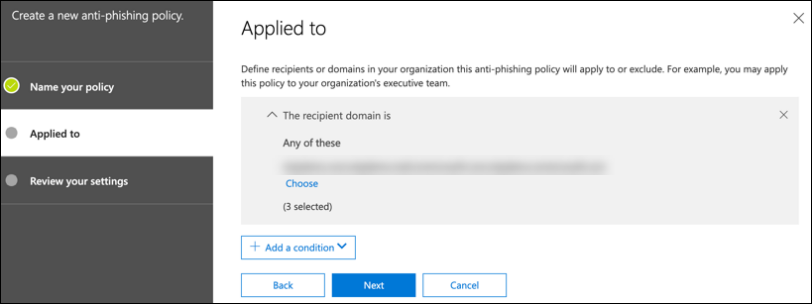
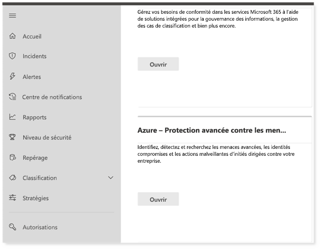
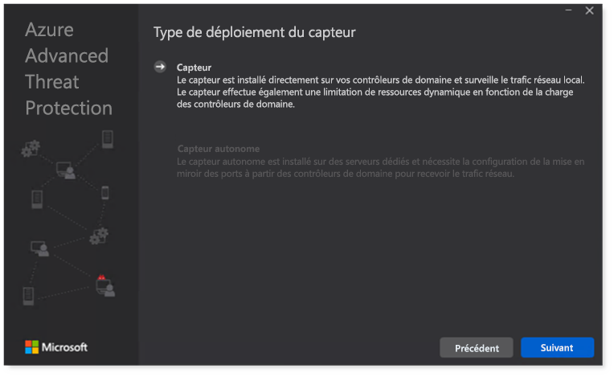
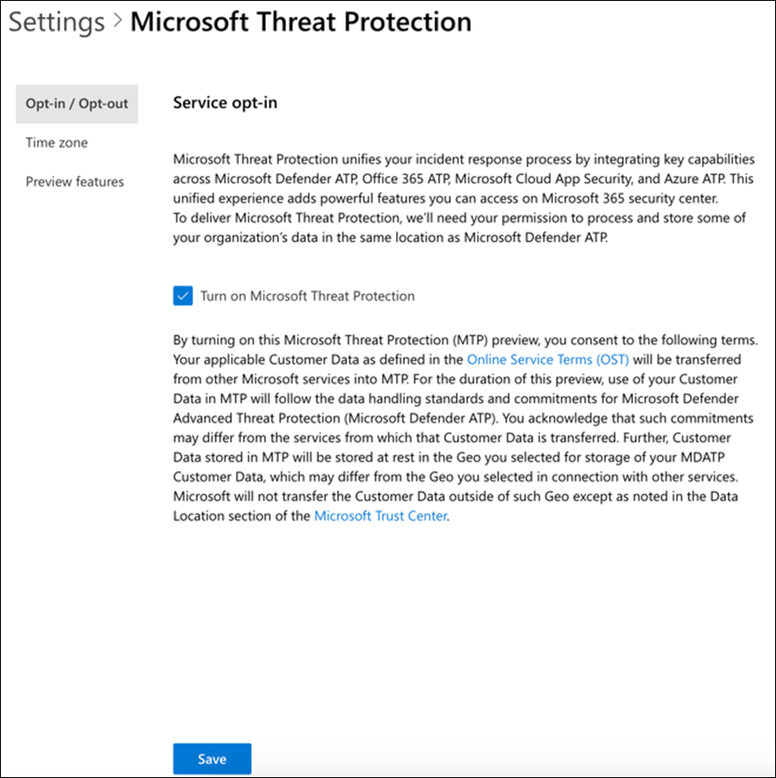

# Configurer les piliers de protection contre les menaces Microsoft pour votre environnement de laboratoire d’évaluation

**S’applique à :**
- Protection Microsoft contre les menaces

La création d’un environnement de laboratoire de test Microsoft Threat Protection et son déploiement est un processus en trois phases :

 
<table border="0" width="100%" align="center">
  <tr style="text-align:center;">
    <td align="center" style="width:25%; border:0;" >
      <a href= "https://docs.microsoft.com/microsoft-365/security/mtp/prepare-mtpeval?view=o365-worldwide"> 
        
       Phase 1 : préparer</a> 
    </td>
     <td align="center">
      <a href="https://docs.microsoft.com/microsoft-365/security/mtp/setup-mtpeval?view=o365-worldwide">
        
       Phase 2 : configuration</a> 
    </td>
    <td align="center" bgcolor="#d5f5e3">
      <a href="https://docs.microsoft.com/microsoft-365/security/mtp/config-mtpeval?view=o365-worldwide">
        
       Phase 3 : configurer & Onboard</a> 
</td>

  </tr>
</table>

Vous êtes actuellement en phase de configuration.

La préparation est essentielle à tout déploiement réussi. Dans cet article, vous serez guidé sur les points que vous devrez prendre en compte lors de la préparation du déploiement de Microsoft Defender ATP.

## Pilier de la protection Microsoft contre les menaces
La protection contre les menaces Microsoft se compose de quatre piliers. Bien qu’un seul pilier puisse déjà fournir de la valeur à la sécurité de votre organisation réseau, l’activation des quatre piliers de protection de Microsoft contre les menaces permettra à votre organisation de bénéficier de la plus grande valeur.

  

Cette section vous guidera dans la configuration des éléments suivants :
-   Office 365-Protection avancée contre les menaces
-   Azure Advanced Threat Protection 
-   Microsoft Cloud App Security
-   Microsoft Defender – Protection avancée contre les menaces

## Configurer la protection avancée contre les menaces Office 365
>[!NOTE]
>Ignorez cette étape si vous avez déjà activé la protection avancée contre les menaces d’Office 365. 

Il existe un module PowerShell appelé *Office 365 Advanced Threat Protection Recommended Configuration Analyzer (ORCA)* qui permet de déterminer certains de ces paramètres. Lorsqu’il est exécuté en tant qu’administrateur dans votre client, Get-ORCAReport permet de générer une évaluation du blocage du courrier indésirable, des hameçons et d’autres paramètres d’hygiène des messages. Vous pouvez télécharger ce module à partir de https://www.powershellgallery.com/packages/ORCA/ . 

1. Accédez à la stratégie de gestion des menaces du [Centre de sécurité & conformité Office 365](https://protection.office.com/homepage)  >  **Threat management**  >  **Policy**.
  
 
2. Cliquez sur **protection contre le hameçonnage ATP**, sélectionnez **créer** et renseignez le nom et la description de la stratégie. Cliquez sur **Suivant**.
  

>[!NOTE]
>Modifiez votre stratégie anti-hameçonnage avancée ATP. Remplacez le **seuil d’hameçonnage avancé** par **2**.
 

3. Cliquez sur le menu déroulant **Ajouter une condition** , puis sélectionnez vos domaines en tant que domaine du destinataire. Cliquez sur **Suivant**.
  
 
4. Vérifiez vos paramètres. Cliquez sur **créer cette stratégie** pour confirmer. 
  
 
5. Sélectionnez **pièces jointes fiables ATP** et sélectionnez l’option Activer la protection avancée contre les menaces **pour SharePoint, OneDrive et Microsoft teams** .  
  

6. Cliquez sur l’icône + pour créer une stratégie de pièces jointes fiables, appliquez-la en tant que domaine de destinataire à vos domaines. Cliquez sur **Enregistrer**.
  
 
7. Ensuite, sélectionnez la stratégie de **liens approuvés ATP** , puis cliquez sur l’icône représentant un crayon pour modifier la stratégie par défaut.

8. Assurez-vous que l’option **ne pas suivre lorsque les utilisateurs cliquent sur les liens approuvés** n’est pas sélectionnée, tandis que les autres options sont sélectionnées. Pour plus d’informations, voir [paramètres de liens fiables](https://docs.microsoft.com/microsoft-365/security/office-365-security/recommended-settings-for-eop-and-office365-atp?view=o365-worldwide) . Cliquez sur **Enregistrer**. 
  

9. Sélectionnez ensuite la stratégie **anti-programme malveillant** , sélectionnez la valeur par défaut, puis cliquez sur l’icône représentant un crayon.

10. Cliquez sur **paramètres** , puis sélectionnez **Oui et utilisez le texte de notification par défaut** pour activer la **réponse de détection de programmes malveillants**. Activez le **filtre types de pièces jointes courantes** . Cliquez sur **Enregistrer**.
   
  
11. Accédez à [Office 365 Security & Compliance Center](https://protection.office.com/homepage)  >  **Search**  >  **audit log Search** and Turn Auditing on.  
  

12. Intégrer la protection avancée contre les menaces Office 365 à Microsoft Defender ATP. Accédez à [Office 365 Security & Compliance Center](https://protection.office.com/homepage)  >  **Threat management**  >  **Explorer Management Explorer** et sélectionnez **WDATP Settings** dans le coin supérieur droit de l’écran. Dans la boîte de dialogue connexion Microsoft Defender ATP, activez **connexion à Windows ATP**.
  

## Configuration d’Azure protection avancée contre les menaces
>[!NOTE]
>Ignorez cette étape si vous avez déjà activé Azure protection avancée contre les menaces.

1. Accédez au [Centre de sécurité Microsoft 365](https://security.microsoft.com/info) > sélectionnez **plus de ressources**  >  **Azure Advanced Threat Protection**.
  

2. Cliquez sur **créer** pour démarrer l’Assistant protection avancée contre les menaces. 
   

3. Choisissez **fournir un nom d’utilisateur et un mot de passe pour vous connecter à votre forêt Active Directory**.  
  

4. Entrez vos informations d’identification locales Active Directory. Il peut s’agir de n’importe quel compte d’utilisateur qui dispose d’un accès en lecture à Active Directory.
  

5. Ensuite, choisissez **Télécharger le programme d’installation du capteur** et transférer le fichier vers votre contrôleur de domaine. 
  

6. Exécutez le programme d’installation du capteur ATP Azure et commencez à suivre l’Assistant.
   
 
7. Cliquez sur **suivant** dans le type de déploiement du capteur.
   
 
8. Copiez la clé d’accès, puis entrez-la dans l’Assistant.
  
 
9. Copiez la clé d’accès dans l’Assistant, puis cliquez sur **installer**. 
   

10. Félicitations, vous avez réussi à configurer Azure Advanced Threat Protection sur votre contrôleur de domaine.
  
 
11. Sous la section paramètres [Azure Azure ATP](https://go.microsoft.com/fwlink/?linkid=2040449) , sélectionnez **Windows Defender ATP**, puis activez le bouton bascule. Cliquez sur **Enregistrer**. 
  

>[!NOTE]
>Windows Defender ATP a été rebaptisé en tant que Microsoft Defender ATP. Les modifications apportées à la personnalisation de tous nos portails sont déployées pour la cohérence.

## Configurer la sécurité des applications Cloud Microsoft
>[!NOTE]
>Ignorez cette étape si vous avez déjà activé Microsoft Cloud App Security. 

1. Accédez au [Centre de sécurité Microsoft 365](https://security.microsoft.com/info)  >  **More Resources**  >  **Microsoft Cloud App Security**.
  

2. À l’invite d’informations pour intégrer Azure ATP, sélectionnez **activer l’intégration de données Azure ATP**. 
   

>[!NOTE]
>Si vous ne voyez pas cette invite, cela signifie que votre intégration de données ATP Azure a déjà été activée. Toutefois, si vous n’êtes pas sûr, contactez votre administrateur informatique pour confirmer. 

3. Accédez à **paramètres**, activez l’option **intégration Azure ATP** activée, puis cliquez sur **Enregistrer**. 
  
>[!NOTE]
>Pour les nouvelles instances Azure ATP, ce bouton d’intégration est activé automatiquement. Vérifiez que votre intégration Azure ATP a été activée avant de passer à l’étape suivante.
 
4. Sous paramètres de découverte du Cloud, sélectionnez **intégration de Microsoft Defender ATP**, puis activez l’intégration. Cliquez sur **Enregistrer**.
  

5. Sous paramètres de détection sur le Cloud, sélectionnez enrichissement par l' **utilisateur**, puis activez l’intégration à Azure Active Directory.
  

## Configurer Microsoft Defender-protection avancée contre les menaces
>[!NOTE]
>Ignorez cette étape si vous avez déjà activé la protection avancée contre les menaces Microsoft Defender.

1. Accédez au [Centre de sécurité Microsoft 365](https://security.microsoft.com/info)  >  **plus de ressources**  >  **Microsoft Defender Security Center**. Cliquez sur **Ouvrir**. 
   
 
2. Suivez l’Assistant protection avancée contre les menaces Microsoft. Cliquez sur **Suivant**. 
   

3. Choisissez en fonction de votre emplacement de stockage de données par défaut, de la stratégie de rétention des données, de la taille de l’organisation et du opt-in pour les fonctionnalités d’aperçu. 
   
>[!NOTE]
>Vous ne pouvez pas modifier par la suite certains paramètres, comme l’emplacement de stockage des données. 
 

Cliquez sur **Suivant**. 

4. Cliquez sur **Continuer** pour mettre en service votre locataire Microsoft Defender ATP.
   

5. Intégrez vos points de terminaison via les stratégies de groupe, le gestionnaire de points de terminaison Microsoft ou en exécutant un script local vers Microsoft Defender ATP. Par souci de simplicité, ce guide utilise le script local.

6. Cliquez sur **Télécharger le package** et copiez le script d’intégration à vos points de terminaison.  
   

7. Sur votre point de terminaison, exécutez le script d’intégration en tant qu’administrateur et choisissez Y.
   

8. Félicitations, vous avez intégré votre premier point de terminaison.  
   

9. Copiez-collez le test de détection à partir de l’Assistant Microsoft Defender ATP.
   

10. Copiez le script PowerShell vers une invite de commandes avec élévation de privilèges et exécutez-le. 
   

11. Sélectionnez **commencer à utiliser Microsoft Defender ATP** à partir de l’Assistant.
   
 
12. Visitez le [Centre de sécurité Microsoft Defender](https://securitycenter.windows.com/). Accédez à **paramètres** , puis sélectionnez **fonctionnalités avancées**. 
   

13. Activer l’intégration avec **Azure Advanced Threat Protection**.  
   

14. Activer l’intégration avec **Office 365 Threat Intelligence**.
   

15. Activez l’intégration à la **sécurité des applications Cloud de Microsoft**.
   

16. Faites défiler la liste vers le bas et cliquez sur **enregistrer les préférences** pour confirmer les nouvelles intégrations.
   

## Activer la Protection Microsoft contre les menaces
1. Accédez au [Centre de sécurité Microsoft 365](https://security.microsoft.com/homepage). Accédez à **paramètres** , puis sélectionnez **Microsoft Threat Protection**.
   

2. Activez la case à cocher **activer la protection contre les menaces Microsoft** , puis cliquez sur **Enregistrer**.
   

Félicitations ! Vous venez de créer votre environnement de laboratoire d’évaluation de la protection contre les menaces Microsoft ! Vous pouvez désormais simuler une attaque et voir comment les fonctionnalités du produit peuvent détecter, créer des alertes et répondre automatiquement à une attaque sans fichier sur un point de terminaison.

## Étapes suivantes
[Générer une alerte de test](generate-test-alert.md).
