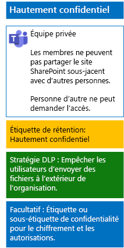

# Protéger des fichiers dans Teams avec des étiquettes de confidentialité

Contrairement à une étiquette de confidentialité pour les données hautement réglementées qu’une personne peut appliquer à n’importe quel fichier, une équipe hautement confidentielle doit avoir sa propre étiquette ou sous-étiquette de sorte que les fichiers auxquels elle est attribuée :

- Soient chiffrés individuellement.
- Contiennent des autorisations personnalisées de sorte que seuls les membres de l’équipe puissent l’ouvrir.

Pour atteindre ce niveau de sécurité supplémentaire pour les fichiers stockés sur le site SharePoint sous-jacent d’une équipe, vous devez configurer une étiquette de confidentialité personnalisée qui est soit sa propre étiquette, soit une sous-étiquette de l’étiquette générale pour les données hautement réglementées. Seuls les membres de l’équipe peuvent consulter l’étiquette ou sous-étiquette personnalisée dans leur liste d’étiquettes.

Utilisez une étiquette de confidentialité lorsque vous avez besoin d’un petit nombre d’étiquettes à la fois pour un usage global et pour des équipes privées individuelles. 

Utilisez une sous-étiquette de confidentialité lorsque vous avez un grand nombre d’étiquettes ou si vous souhaitez organiser les étiquettes pour les équipes hautement confidentielles sous l’étiquette hautement réglementée.

Suivez [ces instructions](https://docs.microsoft.com/microsoft-365/compliance/encryption-sensitivity-labels) pour configurer une étiquette distincte ou une sous-étiquette avec les paramètres suivants :

- Le nom de l’étiquette ou de la sous-étiquette contient le nom de l’équipe
- Le chiffrement est activé
- Le groupe Office 365 de l’équipe possède des autorisations de co-édition

Une fois que vous avez créé, publiez la nouvelle étiquette ou sous-étiquette pour vos utilisateurs, puis appliquez-les aux fichiers en local avant de les charger dans l’équipe ou plus tard une fois que le fichier est stocké dans l’équipe.

Voici la configuration de l’équipe hautement confidentielle qui utilise des étiquettes de confidentialité pour le chiffrement des fichiers et les autorisations.

## Voir aussi

[Sécuriser des fichiers dans Microsoft Teams](secure-files-in-teams.md)
  
[Adoption du cloud et solutions hybrides](https://docs.microsoft.com/office365/enterprise/cloud-adoption-and-hybrid-solutions)
