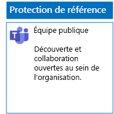
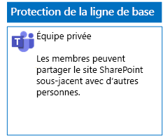
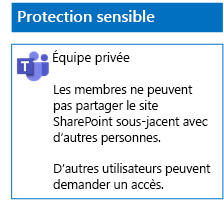

# Déployer des équipes pour trois niveaux de protection des fichiers

Suivez les étapes décrites dans cet article pour créer et déployer des équipes de référence, sensibles et hautement confidentiels. Pour plus d’informations sur ces trois niveaux de protection, consultez [Sécuriser des fichiers dans Microsoft Teams](secure-files-in-teams.md).

## Équipes de référence

La protection Base de référence inclut les équipes publiques et privées. Les équipes publiques peuvent être découvertes et sont accessibles par toute personne de l’organisation. Les sites privés peuvent être découverts et sont accessibles seulement par les membres du groupe Microsoft 365 associé à l’équipe. Ces deux types d’équipes permettent aux membres de partager le site avec d’autres utilisateurs.

### Public

Utilisez les instructions de [cet article](https://support.office.com/article/174adf5f-846b-4780-b765-de1a0a737e2b) pour créer une équipe de référence avec accès et autorisations publics.

Voici la configuration finale.

### Privé

Utilisez les instructions de [cet article](https://support.office.com/article/174adf5f-846b-4780-b765-de1a0a737e2b) pour créer une équipe de référence avec accès et autorisations privés.

Voici la configuration finale.

## Équipes sensibles

Pour une équipe sensible, vous commencez par [créer une équipe privée](https://support.office.com/article/174adf5f-846b-4780-b765-de1a0a737e2b).

Vous configurez ensuite le site SharePoint sous-jacent pour empêcher le partage par les membres de l'équipe.

1. Dans la barre d’outils de l’équipe, cliquez sur **Fichiers**.

2. Cliquez sur les points de suspension, puis sur **Ouvrir dans SharePoint**.

3. Dans la barre d’outils du site SharePoint sous-jacent, cliquez sur l’icône Paramètres, puis cliquez sur **Autorisations du site**.

4. Dans le volet **Autorisations de site**, sous **Paramètres de partage**, cliquez sur **Modifier les paramètres de partage**.

5. Sous **Autorisations de partage**, sélectionnez **Seuls les propriétaires du site peuvent partager des fichiers, des dossiers et le site**, puis cliquez sur **Enregistrer**.

Voici la configuration finale.

## Équipe hautement confidentielles

Avec une équipe hautement confidentielle, vous commencez par [créer une équipe privée](https://support.office.com/article/174adf5f-846b-4780-b765-de1a0a737e2b).

Vous configurez ensuite le site SharePoint sous-jacent pour empêcher le partage par les membres de l'équipe et la demande d’accès par des non-membre de l’équipe.

1. Dans la barre d’outils de l’équipe, cliquez sur **Fichiers**.

2. Cliquez sur les points de suspension, puis sur **Ouvrir dans SharePoint**.

3. Dans la barre d’outils du site SharePoint sous-jacent, cliquez sur l’icône Paramètres, puis cliquez sur **Autorisations du site**.

4. Dans le volet **Autorisations de site**, sous **Paramètres de partage**, cliquez sur **Modifier les paramètres de partage**.

5. Sous **Autorisations de partage**, sélectionnez **Seuls les propriétaires du site peuvent partager des fichiers, des dossiers et le site**.

6. Désactivez **Autoriser les demandes d’accès**, puis cliquez sur **Enregistrer**.

Voici la configuration finale.

## Étape suivante

[Protéger des fichiers dans Teams avec des étiquettes de rétention et la protection contre la perte de données (DLP)](deploy-teams-retention-DLP.md)

## Voir aussi

[Sécuriser des fichiers dans Microsoft Teams](secure-files-in-teams.md)

[Adoption du cloud et solutions hybrides](https://docs.microsoft.com/office365/enterprise/cloud-adoption-and-hybrid-solutions)
