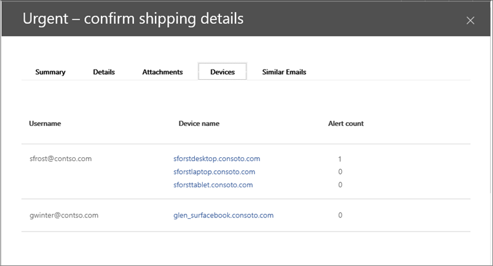

# Intégrer Office 365 Advanced Threat Protection avec Microsoft Defender Advanced Threat Protection

[Office 365 Advanced Threat Protection](https://docs.microsoft.com/microsoft-365/security/office-365-security/office-365-atp?view=o365-worldwide) (Office 365 ATP) peut être configuré pour fonctionner avec [Microsoft Defender Advanced Threat Protection](https://docs.microsoft.com/windows/security/threat-protection) (Microsoft Defender ATP).

L’intégration de la fonctionnalité ATP Office 365 à Microsoft Defender ATP peut aider votre surveillance d’équipe en matière de sécurité et prendre des mesures rapidement si les appareils des utilisateurs sont menacés. Par exemple, une fois l’intégration activée, votre équipe d’opérations de sécurité pourra voir les appareils potentiellement affectés par un message électronique détecté, ainsi que le nombre d’alertes récentes que ces appareils ont dans Microsoft Defender ATP. 

L’image suivante montre l’apparence de l’onglet **appareils** comme l’activation de l’intégration de Microsoft Defender ATP :
  

  
Dans cet exemple, vous pouvez voir que les destinataires du message électronique détecté ont quatre appareils et que l’un d’entre eux comporte une alerte. Si vous cliquez sur le lien d’un appareil, celui-ci s’ouvre dans le centre de sécurité Microsoft Defender ( [https://securitycenter.windows.com](https://securitycenter.windows.com) ).

> [!TIP]
> **[En savoir plus sur le centre de sécurité Microsoft Defender](https://docs.microsoft.com/windows/security/threat-protection/microsoft-defender-atp/use)** (également appelé portail Microsoft Defender ATP).
  
## Configuration requise

- Votre organisation doit disposer d’Office 365 ATP plan 2 (ou Office 365 E5) et de Microsoft Defender ATP.
    
- Vous devez être un administrateur général ou disposer d’un rôle d’administrateur de sécurité (tel que administrateur de sécurité) affecté dans le [ &amp; Centre de sécurité](https://protection.office.com)et de conformité. (Voir [Permissions in the Security &amp; Compliance Center](permissions-in-the-security-and-compliance-center.md))
    
- Vous devez avoir accès à l' [Explorateur (ou aux détections en temps réel)](threat-explorer.md) dans le centre de sécurité & conformité et au centre de sécurité Microsoft Defender.
    
## Pour intégrer la protection avancée contre les menaces Office 365 à Microsoft Defender ATP

L’intégration de la fonctionnalité ATP Office 365 à Microsoft Defender ATP est configurée à l’aide du centre de sécurité & de la sécurité et du centre de sécurité Microsoft Defender.
  
1. En tant qu’administrateur général ou administrateur de sécurité, accédez à [https://protection.office.com](https://protection.office.com) et connectez-vous. (Vous accédez au centre de sécurité & conformité d’Office 365.)
    
2. Dans le volet de navigation, sélectionnez Explorateur de **gestion des menaces**  >  **Explorer**.  
    
3. Dans le coin supérieur droit de l’écran, sélectionnez **paramètres WDATP**.
    
4. Dans la boîte de dialogue connexion Microsoft Defender ATP, activez **connexion à Windows ATP**.  
    
5. Accédez au centre de sécurité Microsoft Defender ( [https://securitycenter.windows.com](https://securitycenter.windows.com) ).

6. Dans la barre de navigation, sélectionnez **paramètres**. Ensuite, sous **général**, choisissez **fonctionnalités avancées**.

7. Faites défiler vers le bas jusqu’à **Office 365 Threat Intelligence Connection**et activez la connexion.  

## Articles connexes

[Fonctionnalités d’enquête et de réponse aux menaces dans Office 365](office-365-ti.md)
  
[Protection avancée contre les menaces dans Office 365](office-365-atp.md)
  
[Microsoft Defender - PACM](https://docs.microsoft.com/windows/security/threat-protection)
