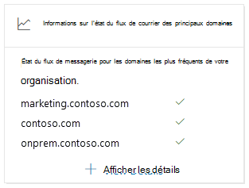

# État du flux de messagerie du domaine le plus approfondi dans le centre de sécurité & conformité

L' **État du flux de messagerie du domaine le plus visible** dans le [tableau de bord de flux de messagerie](mail-flow-insights-v2.md) dans le centre de sécurité & conformité vous donne l’état actuel des domaines de votre organisation en termes de flux de messagerie. Cette vue vous permet d’identifier et de résoudre les problèmes de ***flux de messagerie*** (par exemple, impossible de recevoir des messages électroniques externes), notamment les expirations de domaine ou les domaines avec des enregistrements MX incorrects.

Lorsque vous cliquez sur **afficher les détails** dans le widget, un menu volant d’état de **domaine** s’affiche pour vous afficher des détails supplémentaires sur l’état de chaque domaine :

- **Domaine**
- **Enregistrement MX précédent**
- **Enregistrement MX actuel**
- **État de réception du courrier électronique**
- **État du domaine**: une coche verte indique que l’enregistrement MX actuel (au moment où vous avez cliqué sur le widget) correspond à la valeur que nous avons sur l’enregistrement et que le domaine a reçu la messagerie au cours des deux dernières heures.

  Un X rouge indique que l’enregistrement MX a été modifié et que le domaine n’a pas reçu de courrier au cours des 6 dernières heures. Cela indique probablement que votre domaine a expiré ou que l’enregistrement MX a été mis à jour de manière incorrecte. Vérifiez auprès de votre bureau d’enregistrement de domaines ou de votre service d’hébergement DNS si le domaine a expiré ou si l’enregistrement MX du domaine est incorrect.

Vous pouvez cliquer sur **afficher plus** pour afficher les mêmes informations pour plus de domaines.

## Rubriques connexes

Pour plus d’informations sur les autres informations du tableau de bord de flux de messagerie, consultez [la rubrique mail Flow Insights in the Security & Compliance Center](mail-flow-insights-v2.md).
