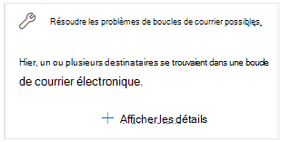

# Corriger les éventuelles boucles de courrier dans le centre de sécurité & conformité

[!INCLUDE [Microsoft 365 Defender rebranding](../includes/microsoft-defender-for-office.md)]

Une boucle de courrier est incorrecte car elle gaspille des ressources système, consomme le quota de volume de courrier de votre organisation et envoie des notifications d’échec de remise confuses (également appelées notifications de non-remise) aux expéditeurs d’origine.

La **fonctionnalité corriger la boucle de courrier possible** dans la zone **recommandé pour vous** du [tableau de bord de flux de messagerie](mail-flow-insights-v2.md) dans le centre de [sécurité & conformité](https://protection.office.com) vous avertit lorsqu’une boucle de courrier est détectée dans votre organisation. Cette vue ne s’affiche qu’une fois la condition détectée (si vous n’avez pas de boucles de courrier, vous ne verrez pas la vue d’ensemble).

Lorsque vous cliquez sur **afficher les détails** dans le widget, un lanceur apparaît avec davantage d’informations :

- **Domaine**
- **Nombre de messages** : vous pouvez cliquer sur **afficher les exemples de messages** pour afficher les résultats du [suivi](message-trace-scc.md) des messages pour un exemple de messages qui ont été affectés par la boucle.
- **Type de domaine** «par exemple, faisant autorité ou ne faisant pas autorité.
- **Enregistrement MX** : l’hôte ( **serveur de messagerie** ) et les valeurs de **priorité** de l’enregistrement MX pour le domaine.
- **Raison** de la boucle et **Comment résoudre** : nous allons essayer d’identifier les scénarios de boucle de courrier les plus courants et de fournir les actions recommandées (le cas échéant) pour corriger la boucle.

## Rubriques connexes

Pour plus d’informations sur les autres informations du tableau de bord de flux de messagerie, consultez [la rubrique mail Flow Insights in the Security & Compliance Center](mail-flow-insights-v2.md).
