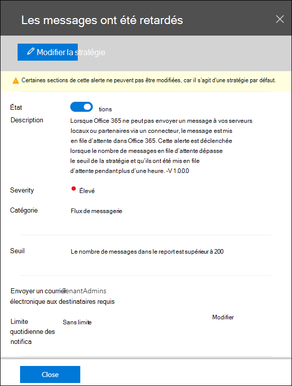
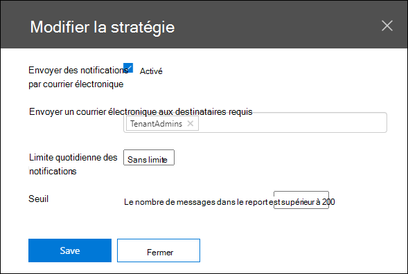
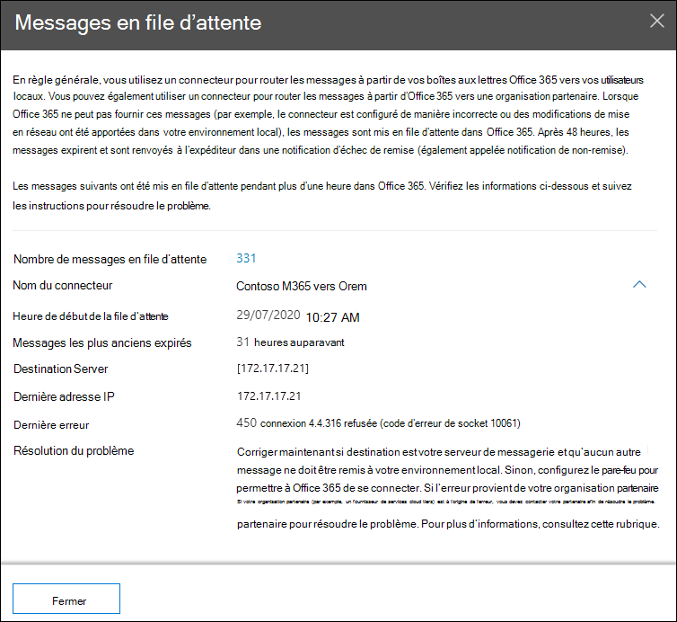

# Files d’attente Insight dans le centre de conformité & Security

[!INCLUDE [Microsoft 365 Defender rebranding](../includes/microsoft-defender-for-office.md)]

Lorsque des messages ne peuvent pas être envoyés de votre organisation à vos serveurs de messagerie locaux ou partenaires à l’aide de connecteurs, les messages sont mis en file d’attente dans Microsoft 365. Les exemples courants qui génèrent cette condition sont les suivants :

- Le connecteur est configuré de manière incorrecte.
- Des modifications de mise en réseau ou de pare-feu ont été apportées dans votre environnement local.

Microsoft 365 continuera à nouvelle tentative de remise pendant 24 heures. Au bout de 24 heures, les messages expirent et seront renvoyés aux expéditeurs dans les notifications d’échec de remise (également appelées notifications de non-remise).

Si le volume de messagerie en file d’attente dépasse le seuil prédéfini (la valeur par défaut est 200 messages), les informations sont disponibles aux emplacements suivants :

- La vue **files d’attente** du [tableau de bord de flux de messagerie](mail-flow-insights-v2.md) dans le centre de [sécurité & conformité](https://protection.office.com). Pour plus d’informations, reportez-vous à la section [files d’attente du tableau de bord du flux de messagerie](#queues-insight-in-the-mail-flow-dashboard) de cette rubrique.
  
- Une alerte est affichée dans les **alertes récentes** le tableau de bord des alertes dans le [Centre de sécurité & conformité](https://protection.office.com) (tableau de bord des **alertes** \> **Dashboard** ou <https://protection.office.com/alertsdashboard> ).

  

- Les administrateurs recevront une notification par courrier électronique en fonction de la configuration de la stratégie d’alerte par défaut nommée **messages ont été retardées**. Pour configurer les paramètres de notification de cette alerte, reportez-vous à la section suivante.

  Pour plus d’informations sur les stratégies d’alerte, consultez [la rubrique Alert Policies in the Security & Compliance Center](../../compliance/alert-policies.md).

## Personnaliser les alertes de file d’attente

1. Dans le [Centre de sécurité & conformité](https://protection.office.com), accédez à **alertes** d' \> **alerte** ou ouvrez <https://protection.office.com/alertpolicies> .

2. Sur la page **stratégies d’alerte** , recherchez et sélectionnez la stratégie nommée **messages ont été retardées**.

3. Dans la fenêtre volante **retardée du message** qui s’ouvre, vous pouvez activer ou désactiver l’alerte et configurer les paramètres de notification.

   

   - **État** : vous pouvez activer ou désactiver l’alerte.

   - **Destinataires du message électronique** et **limite de notification quotidienne** : cliquez sur **modifier** pour configurer les paramètres suivants :

4. Pour configurer les paramètres de notification, cliquez sur **modifier**. Dans le menu volant **modifier la stratégie** qui s’affiche, configurez les paramètres suivants :

   - **Envoyer des notifications par courrier électronique** : la valeur par défaut est activé.
   - **Destinataires du message électronique** : la valeur par défaut est **TenantAdmins**.
   - **Limite quotidienne des notifications** : la valeur par défaut est **aucune limite**.
   - **Seuil** : la valeur par défaut est 200.

   

5. Lorsque vous avez terminé, cliquez sur **Enregistrer** et **Fermer**.

## Vue d’attente dans le tableau de bord de flux de messagerie

Même si le volume des messages mis en file d’attente n’a pas dépassé le seuil et généré une alerte, vous pouvez toujours utiliser l’aperçu **files d’attente** du tableau de bord du [flux de messagerie](mail-flow-insights-v2.md) pour afficher les messages qui ont été mis en file d’attente pendant plus d’une heure et prendre des mesures avant que le nombre de messages en file d’attente devienne trop important.

Si vous cliquez sur le nombre de messages dans le widget, un menu volant en **file d’attente de messages** s’affiche avec les informations suivantes :

- **Nombre de messages en file d’attente**
- **Nom du connecteur** : cliquez sur le nom du connecteur pour gérer le connecteur dans le centre d’administration Exchange.
- **Heure de début de la file d’attente**
- **Messages les plus anciens expirés**
- **Serveur de destination**
- **Dernière adresse IP**
- **Dernière erreur**
- **Résolution** : les problèmes et solutions courants sont disponibles. Si le lien **Fix It Now** est disponible, cliquez dessus pour résoudre le problème. Dans le cas contraire, cliquez sur les liens disponibles pour obtenir plus d’informations sur l’erreur et les solutions possibles.

La même fenêtre mobile s’affiche lorsque vous cliquez sur **afficher la file d’attente** dans l’alerte les détails d’un **message ont été retardé** .

## Voir aussi

Pour plus d’informations sur les autres informations du tableau de bord de flux de messagerie, consultez [la rubrique mail Flow Insights in the Security & Compliance Center](mail-flow-insights-v2.md).
