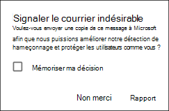

# Signaler le courrier indésirable et le hameçonnage dans Outlook pour iOS et Android dans Exchange Online

[!INCLUDE [Microsoft 365 Defender rebranding](../includes/microsoft-defender-for-office.md)]

Dans les organisations Microsoft 365 avec des boîtes aux lettres dans Exchange Online ou locales utilisant l’authentification moderne [hybride,](https://docs.microsoft.com/microsoft-365/enterprise/hybrid-modern-auth-overview)vous pouvez utiliser les options de rapport intégrées dans Outlook pour iOS et Android pour envoyer des faux positifs (courrier électronique de qualité marqué comme courrier indésirable), des faux négatifs (courrier indésirable autorisé) et des messages de hameçonnage à Exchange Online Protection (EOP).

## Ce que vous devez savoir avant de commencer

- Si vous êtes un administrateur d’une organisation ayant des boîtes aux lettres Exchange Online, nous vous recommandons d’utiliser le portail Soumissions dans le Centre de sécurité & conformité. Pour plus d’informations, voir Utiliser la soumission d’administrateur pour soumettre des messages suspects de courrier indésirable, d’hameçonnage, d’URL et [de fichiers à Microsoft.](admin-submission.md)

- Vous pouvez configurer la copie ou la redirection des messages signalés vers une boîte aux lettres que vous spécifiez. Pour plus d’informations, [voir stratégies de soumission d’utilisateurs.](user-submission.md)

- Pour plus d’informations sur la notification des messages à Microsoft, voir [Signaler des messages et des fichiers à Microsoft.](report-junk-email-messages-to-microsoft.md)

  > [!NOTE]
  > Si le signalement du courrier indésirable est désactivé pour Outlook dans la stratégie de soumission de l’utilisateur, les messages de courrier indésirable ou de hameçonnage sont déplacés vers le dossier Courrier indésirable et ne sont pas signalés à votre administrateur ou Microsoft.

## Signaler le courrier indésirable et les messages de hameçonnage dans Outlook pour iOS et Android

Pour les messages dans la boîte de réception ou tout autre dossier de courrier électronique à l’exception du courrier indésirable, utilisez les étapes suivantes pour signaler le courrier indésirable et les messages de hameçonnage pour iOS et Android :

1. Sélectionnez un ou plusieurs messages.
2. Dans le coin supérieur droit, appuyez sur les trois points verticaux. Le menu Action s’ouvre.

   

3. Appuyez **sur Signaler le courrier** indésirable, puis **sélectionnez Courrier** indésirable ou **Hameçonnage.**

   

4. Dans la boîte de dialogue qui s’affiche, vous pouvez choisir **Rapport** ou **Non merci.** Lorsque vous sélectionnez Non **merci,** si vous avez tapé Courrier indésirable, le message se déplace vers le dossier Courrier indésirable, si vous avez tapé Hameçonnage, le message est envoyé vers le dossier Éléments supprimés.   Sélectionnez **Rapport** pour envoyer également une copie du message à Microsoft.

   

Si vous changez d’avis, **sélectionnez Annuler** dans la notification toast qui s’affiche. Le message reste dans le dossier Boîte de réception.

## Signaler les messages non indésirables à partir du dossier Courrier indésirable dans Outlook pour iOS et Android

Dans le dossier Courrier indésirable, utilisez les étapes suivantes pour signaler les faux positifs du courrier indésirable :

1. Sélectionnez un ou plusieurs messages.
2. Dans le coin supérieur droit, appuyez sur les trois points verticaux. Le menu Action s’ouvre.

   

3. Appuyez **sur Pas de courrier indésirable**.

Une notification toast apparaît que l’e-mail a été déplacé vers votre boîte de réception. Si vous changez d’avis, **sélectionnez Annuler** dans la notification toast. Le courrier électronique reste dans le dossier Courrier indésirable.
