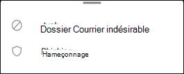

# Signaler le courrier indésirable et le hameçonnage dans Outlook pour iOS et Android dans Exchange OnlineReport junk and phishing email in Outlook for iOS and Android in Exchange Online

[!INCLUDE [Microsoft 365 Defender rebranding](../includes/microsoft-defender-for-office.md)]

**S’applique à****Applies to**
- [Exchange Online ProtectionExchange Online Protection](https://go.microsoft.com/fwlink/?linkid=2148611)
- [Microsoft Defender pour Office 365 plan 1 et plan 2Microsoft Defender for Office 365 plan 1 and plan 2](https://go.microsoft.com/fwlink/?linkid=2148715)
- [Microsoft 365 DefenderMicrosoft 365 Defender](https://go.microsoft.com/fwlink/?linkid=2118804)

Dans les organisations Microsoft 365 avec des boîtes aux lettres dans Exchange Online ou locales utilisant l’authentification moderne [hybride,](https://docs.microsoft.com/microsoft-365/enterprise/hybrid-modern-auth-overview)vous pouvez utiliser les options de rapport intégrées dans Outlook pour iOS et Android pour envoyer des faux positifs (courrier électronique de qualité marqué comme courrier indésirable), des faux négatifs (courrier indésirable autorisé) et des messages de hameçonnage à Exchange Online Protection (EOP).In Microsoft 365 organizations with mailboxes in Exchange Online or on-premises mailboxes using [hybrid modern authentication](https://docs.microsoft.com/microsoft-365/enterprise/hybrid-modern-auth-overview), you can use the built-in reporting options in Outlook for iOS and Android to submit false positives (good email marked as spam), false negatives (bad email allowed), and phishing messages to Exchange Online Protection (EOP).

## Ce que vous devez savoir avant de commencerWhat do you need to know before you begin

- Si vous êtes un administrateur d’une organisation ayant des boîtes aux lettres Exchange Online, nous vous recommandons d’utiliser le portail Soumissions dans le Centre de sécurité & conformité.If you're an admin in an organization with Exchange Online mailboxes, we recommend that you use the Submissions portal in the Security & Compliance Center. Pour plus d’informations, voir Utiliser la soumission d’administrateur pour soumettre des messages suspects de courrier indésirable, d’hameçonnage, d’URL et [de fichiers à Microsoft.](admin-submission.md)For more information, see [Use Admin Submission to submit suspected spam, phish, URLs, and files to Microsoft](admin-submission.md).

- Vous pouvez configurer la copie ou la redirection des messages signalés vers une boîte aux lettres que vous spécifiez.You can configure reported messages to be copied or redirected to a mailbox that you specify. Pour plus d’informations, [voir stratégies de soumission d’utilisateurs.](user-submission.md)For more information, see [User Submissions policies](user-submission.md).

- Pour plus d’informations sur la notification des messages à Microsoft, voir [Signaler des messages et des fichiers à Microsoft.](report-junk-email-messages-to-microsoft.md)For more information about reporting messages to Microsoft, see [Report messages and files to Microsoft](report-junk-email-messages-to-microsoft.md).

  > [!NOTE]
  > Si le signalement du courrier indésirable est désactivé pour Outlook dans la stratégie de soumission de l’utilisateur, les messages de courrier indésirable ou de hameçonnage sont déplacés vers le dossier Courrier indésirable et ne sont pas signalés à votre administrateur ou Microsoft.If junk email reporting is disabled for Outlook in the user submission policy, junk or phishing messages will be moved to the Junk folder and not reported to your admin or Microsoft.

## Signaler le courrier indésirable et les messages de hameçonnage dans Outlook pour iOS et AndroidReport spam and phishing messages in Outlook for iOS and Android

Pour les messages dans la boîte de réception ou tout autre dossier de courrier électronique à l’exception du courrier indésirable, utilisez les étapes suivantes pour signaler le courrier indésirable et les messages de hameçonnage pour iOS et Android :For messages in the Inbox, or any other email folder except Junk Email, use the following steps to report spam and phishing messages for iOS and Android:

1. Sélectionnez un ou plusieurs messages.Select one or more messages.
2. Dans le coin supérieur droit, appuyez sur les trois points verticaux.In the top-right corner tap on the three vertical dots. Le menu Action s’ouvre.The action menu opens.

   

3. Appuyez **sur Signaler le courrier** indésirable, puis **sélectionnez Courrier** indésirable ou **Hameçonnage.**Tap **Report junk** and then select **Junk** or **Phishing**.

   

4. Dans la boîte de dialogue qui s’affiche, vous pouvez choisir **Rapport** ou **Non merci.**In the dialog that appears, you can choose **Report** or **No Thanks**. Lorsque vous sélectionnez Non **merci,** si vous avez tapé Courrier indésirable, le message se déplace vers le dossier Courrier indésirable, si vous avez tapé Hameçonnage, le message est envoyé vers le dossier Éléments supprimés.  On selecting **No Thanks**, if you tapped **Junk** the message moves to the Junk Email folder, if you tapped **Phishing** the message moves to the Deleted Items folder. Sélectionnez **Rapport** pour envoyer également une copie du message à Microsoft.Select **Report** to also send a copy of the message to Microsoft.

   

Si vous changez d’avis, **sélectionnez Annuler** dans la notification toast qui s’affiche.If you change your mind, select **Undo** on the toast notification that appears. Le message reste dans le dossier Boîte de réception.The message remains in the Inbox folder.

## Signaler les messages non indésirables à partir du dossier Courrier indésirable dans Outlook pour iOS et AndroidReport non-spam messages from the Junk folder in Outlook for iOS and Android

Dans le dossier Courrier indésirable, utilisez les étapes suivantes pour signaler les faux positifs du courrier indésirable :In the Junk folder, use the following steps to report spam false positives:

1. Sélectionnez un ou plusieurs messages.Select one or more messages.
2. Dans le coin supérieur droit, appuyez sur les trois points verticaux.In the top-right corner tap on the three vertical dots. Le menu Action s’ouvre.The action menu opens.

   

3. Appuyez **sur Pas de courrier indésirable**.Tap **Not junk**.

Une notification toast s’affiche pour vous faire savoir que l’e-mail a été déplacé vers votre boîte de réception.A toast notification appears that the email has moved to your Inbox. Si vous changez d’avis, sélectionnez **Annuler** dans la notification toast.If you change your mind, select **Undo** on the toast notification. Le courrier électronique reste dans le dossier Courrier indésirable.The email remains in the Junk folder.
