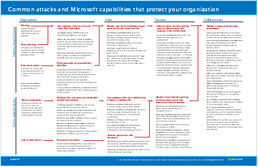

# Illustrations Microsoft Cloud pour les architectes d’entreprise

Ces affiches relatives à l’architecture cloud fournissent des informations sur les services de cloud computing Microsoft (notamment Office 365, Azure Active Directory, Microsoft Intune, Microsoft Dynamics CRM Online), mais aussi sur les solutions hybrides locales et cloud. Ces ressources permettent aux architectes et décisionnaires informatiques d’identifier la solution adaptée à leurs charges de travail et de prendre les décisions adéquates pour leurs composants d'infrastructure de base tels que l’identité et la sécurité.

   

### La mise en réseau dans le cloud Microsoft pour les architectes d’entreprise

Découvrez tout ce que les architectes informatiques doivent savoir sur la mise en réseau pour les plateformes et les services de cloud computing Microsoft.
  
|**Élément**|**Description**|
|:-----|:-----|
|   [PDF](https://github.com/MicrosoftDocs/microsoft-365-docs/raw/public/microsoft-365/downloads/MSFT_cloud_architecture_networking.pdf)  \| [Visio](https://github.com/MicrosoftDocs/OfficeDocs-Enterprise/raw/live/Enterprise/media/Network-Poster/MSFT_cloud_architecture_networking.vsdx)  Mise à jour du 2019 novembre| Ce modèle contient : <ul><li> Évolution de votre réseau pour la connectivité cloud </li><li> Éléments courants de connectivité du cloud Microsoft </li><li> ExpressRoute pour la connectivité au cloud de Microsoft </li><li> Conception de réseaux pour Microsoft SaaS, Azure PaaS et Azure IaaS </li></ul>    |

### L’hybridation dans le cloud Microsoft pour les architectes d’entreprise

Tout ce que les architectes informatiques doivent savoir sur l’hybridation du cloud pour les plateformes et services Microsoft.
  
|**Élément**|**Description**|
|:-----|:-----|
|   [PDF](https://github.com/MicrosoftDocs/microsoft-365-docs/raw/public/microsoft-365/downloads/MSFT_cloud_architecture_hybrid.pdf)  \| [Visio](https://github.com/MicrosoftDocs/OfficeDocs-Enterprise/raw/live/Enterprise/media/Hybrid-Poster/MSFT_cloud_architecture_hybrid.vsdx)  Mise à jour du 2019 novembre | Ce modèle contient : <ul><li> Offres du cloud Microsoft (SaaS, Azure PaaS et Azure IaaS) et leurs éléments communs </li><li> Architecture de Cloud hybride pour les offres Cloud de Microsoft </li><li> Scénarios de cloud hybride pour les services SaaS Microsoft (Office 365), Azure PaaS et Azure IaaS </li></ul> |
   

### Approches d’architecture pour les migrations client-client de Microsoft Cloud 
Cette série de rubriques illustre plusieurs approches d’architecture pour les fusions, les acquisitions, les scissions et d’autres scénarios susceptibles de vous amener à migrer vers un nouveau client cloud. Ces rubriques fournissent des conseils sur la planification de point de départ. 

|**Item**|**Description**|
|:-----|:-----|
|   [PDF](https://github.com/MicrosoftDocs/microsoft-365-docs/raw/public/microsoft-365/downloads/Microsoft-365-tenant-to-tenant-migration.pdf) \| [Visio](https://github.com/MicrosoftDocs/OfficeDocs-Enterprise/raw/live/Enterprise/downloads/Microsoft-365-tenant-to-tenant-migration.vsdx)  Mise à jour du 2019 juillet    |Ce modèle contient : <ul><li>Un mappage des scénarios d’entreprises aux approches de l’architecture</li><li>Considérations en matière de conception</li><li>Flux de migration à événement unique</li><li>Flux de migration à phases</li><li>Flux de déplacement ou de fractionnement du client</li></ul>|

### La sécurité dans le cloud Microsoft pour les architectes d’entreprise

Découvrez tout ce que les architectes informatiques doivent savoir sur la sécurité dans les plateformes et les services de cloud computing Microsoft.
  
|**Élément**|**Description**|
|:-----|:-----|
|[          ](https://www.microsoft.com/download/details.aspx?id=48121)   [PDF](https://go.microsoft.com/fwlink/p/?linkid=842070)  \| [Visio](https://go.microsoft.com/fwlink/p/?LinkId=842071)  \| [Autres langues](https://www.microsoft.com/download/details.aspx?id=48121)  Mise à jour du 2018 décembre | Ce modèle contient : <ul><li>Rôle de Microsoft en tant que fournisseur de services et de plateformes sécurisés</li><li>Responsabilités du client pour limiter les risques de sécurité</li><li>Certifications de sécurité de premier plan </li><li>Offres de sécurité fournies par les services de conseil de Microsoft </ul> |

### Attaques courantes et fonctionnalités Microsoft pour protéger votre organisation
Découvrez les cyberattaques les plus courantes et comment Microsoft peut aider votre organisation à chaque étape d’une attaque. 

|**Élément**|**Description**|
|:-----|:-----|
|   [PDF](https://download.microsoft.com/download/F/A/C/FACFC1E9-FA35-4DF1-943C-8D4237B4275B/MSFT_Cloud_architecture_security_commonattacks.pdf) \| [Visio](https://download.microsoft.com/download/F/A/C/FACFC1E9-FA35-4DF1-943C-8D4237B4275B/MSFT_Cloud_architecture_security_commonattacks.vsdx)   Mise à jour du 2017 août | Cette affiche illustre le chemin des attaques courantes et décrit les fonctionnalités qui aident à arrêter les pirates à chaque étape d’une attaque.  |

###  L’identité dans le cloud Microsoft pour les architectes d’entreprise

Découvrez tout ce que les architectes informatiques doivent savoir sur la conception d’identité pour les organisations utilisant des plateformes et des services de cloud computing Microsoft.
  
|**Élément**|**Description**|
|:-----|:-----|
|[          ](https://www.microsoft.com/download/details.aspx?id=54431)   [PDF](https://go.microsoft.com/fwlink/p/?LinkId=524586)  \| [Visio](https://download.microsoft.com/download/2/3/8/238228E6-9017-4F6C-BD3C-5559E6708F82/MSFT_cloud_architecture_identity.vsd)           \| [Autres langues](https://www.microsoft.com/download/details.aspx?id=54431)  Mise à jour du 2016 août | Ce modèle contient : <ul><li>Introduction aux identités avec le cloud de Microsoft </li><li>Fonctions IDaaS d’Azure AD </li><li>Intégration de comptes Active Directory Domain Services locaux avec Microsoft Azure Active Directory </li><li>Placement de composants d’annuaire dans Azure </li><li>Options des services de domaine pour les charges de travail dans Azure IaaS </li></ul> |
   