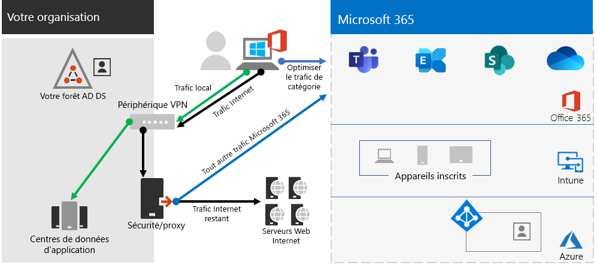
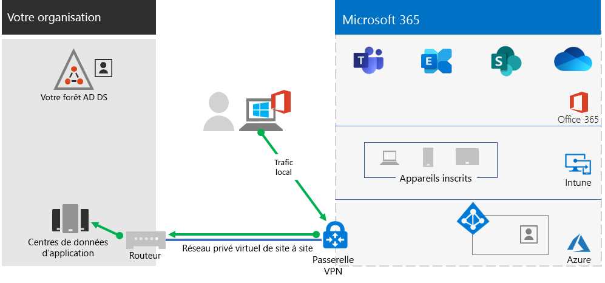
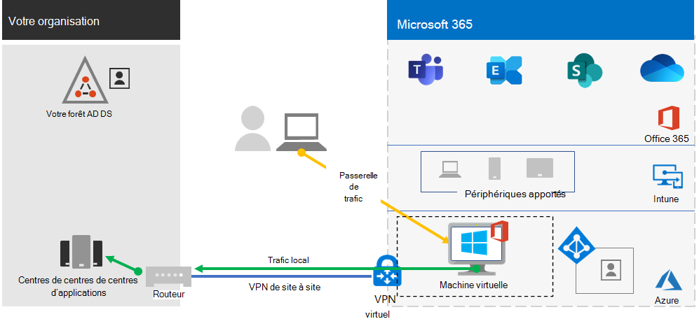
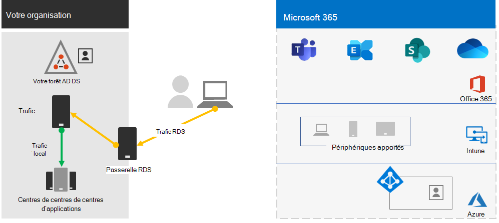

# Étape 2.Step 2. Fournir l’accès à distance aux applications et services locauxProvide remote access to on-premises apps and services

Si votre organisation utilise une solution VPN d’accès à distance, généralement avec les serveurs VPN sur la périphérie de votre réseau et les clients VPN installés sur les appareils de vos utilisateurs, vos utilisateurs peuvent utiliser les connexions VPN d’accès à distance pour accéder aux applications et serveurs locaux.If your organization uses a remote access VPN solution, typically with VPN servers on the edge of your network and VPN clients installed on your users' devices, your users can use remote access VPN connections to access on-premises apps and servers. Mais vous devrez peut-être optimiser le trafic vers les services cloud de Microsoft 365.But you may need to optimize traffic to Microsoft 365 cloud-based services.

Si vos utilisateurs n’utilisent pas de solution VPN, vous pouvez utiliser le proxy d’application Azure Active Directory (Azure AD) et le VPN Azure Point-to-Site (P2S) pour fournir un accès, si toutes vos applications sont basées sur le web.If your users do not use a VPN solution, you can use Azure Active Directory (Azure AD) Application Proxy and Azure Point-to-Site (P2S) VPN to provide access, depending on whether all your apps are web-based.

Il existe trois configurations principales :There are three primary configurations:

1. Vous utilisez déjà une solution VPN d’accès à distance.You are already using a remote access VPN solution.
2. Vous n’utilisez pas une solution VPN d’accès à distance, vous avez une identité hybride, et vous avez besoin d’un accès à distance uniquement pour les applications web locales.You are not using a remote access VPN solution, you have hybrid identity, and you need remote access only to on-premises web-based apps.
3. Vous n’utilisez pas de solution VPN d’accès à distance et vous avez besoin d’accéder à des applications locales, dont certaines ne sont pas basées sur le web.You are not using a remote access VPN solution and you need access to on-premises apps, some of which are not web-based.

Consultez cet organigramme pour accéder aux options de configuration de l’accès à distance décrites dans cet article.See this flowchart for the remote access configuration options discussed in this article.

Avec les connexions d’accès à distance, vous pouvez également utiliser le [Bureau à distance](https://support.microsoft.com/help/4028379/windows-10-how-to-use-remote-desktop) pour connecter vos utilisateurs à un PC local.With remote access connections, you can also use [Remote Desktop](https://support.microsoft.com/help/4028379/windows-10-how-to-use-remote-desktop) to connect your users to an on-premises PC. Par exemple, un employé distant peut utiliser le Bureau à distance pour se connecter au PC de son bureau à partir de son appareil Windows, iOS ou Android.For example, a remote worker can use Remote Desktop to connect to the PC in their office from their Windows, iOS or Android device. Lorsqu’il est connecté à distance, il peut l’utiliser comme s’il était assis face à son PC.Once they are remotely connected, they can use it as if they were sitting in front of it.

## Optimiser les performances des clients VPN d’accès à distance aux services cloud de Microsoft 365Optimize performance for remote access VPN clients to Microsoft 365 cloud services

Si vos employés à distance utilisent un client VPN traditionnel pour obtenir l’accès à distance au réseau de votre organisation, vérifiez que le client VPN a une prise en charge de la segmentation de tunnel.If your remote workers are using a traditional VPN client to obtain remote access to your organization network, verify that the VPN client has split tunneling support.

Sans cette segmentation, l’ensemble de votre trafic de travail à distance est envoyé sur la connexion VPN, où il doit être transféré vers les appareils Microsoft Edge de votre organisation, être traité, puis envoyé sur Internet.Without split tunneling, all of your remote work traffic gets sent across the VPN connection, where it must be forwarded to your organization’s edge devices, get processed, and then sent on the Internet.

Le trafic Microsoft 365 doit emprunter une route indirecte au sein de votre organisation, qui peut être transférée vers un point d’entrée réseau Microsoft éloigné loin de l’emplacement physique du client VPN.Microsoft 365 traffic must take an indirect route through your organization, which could be the forwarded to a Microsoft network entry point far away from the VPN client’s physical location. Ce chemin d’accès indirect ajoute de la latence au trafic réseau et réduit les performances globales.This indirect path adds latency to the network traffic and decreases overall performance. 

La segmentation de tunnel vous permet de configurer votre client VPN pour empêcher l’envoi de certains types de trafic sur la connexion VPN vers le réseau de l’organisation.With split tunneling, you can configure your VPN client to exclude specific types of traffic from being sent over the VPN connection to the organization network.

Pour optimiser l’accès aux ressources cloud de Microsoft 365, configurez vos clients VPN avec la segmentation de tunnel afin d’exclure le trafic vers la catégorie **Optimiser** des points de terminaison Microsoft 365 sur la connexion VPN.To optimize access to Microsoft 365 cloud resources, configure your split tunneling VPN clients to exclude traffic to the **Optimize** category Microsoft 365 endpoints over the VPN connection. Pour plus d’informations, consultez [Catégories de points de terminaison Office 365](https://docs.microsoft.com/microsoft-365/enterprise/microsoft-365-network-connectivity-principles#new-office-365-endpoint-categories).For more information, see [Office 365 endpoint categories](https://docs.microsoft.com/microsoft-365/enterprise/microsoft-365-network-connectivity-principles#new-office-365-endpoint-categories). Consultez la liste des points de terminaison de catégorie Optimiser [ici](https://docs.microsoft.com/microsoft-365/enterprise/urls-and-ip-address-ranges).See the list of Optimize category endpoints [here](https://docs.microsoft.com/microsoft-365/enterprise/urls-and-ip-address-ranges).

Cela permet au client VPN d’envoyer et de recevoir du trafic de service cloud Microsoft 365 crucial directement via Internet et vers le point d’entrée le plus proche dans le réseau Microsoft.This allows the VPN client to send and receive crucial Microsoft 365 cloud service traffic directly over the Internet and to the nearest entry point into the Microsoft network.

Pour plus d’informations et de conseils, voir [Optimiser la connectivité d’Office 365 pour les utilisateurs à distance à l’aide de la segmentation de tunnel de VPN](https://docs.microsoft.com/microsoft-365/enterprise/microsoft-365-vpn-split-tunnel??).For more information and guidance, see [Optimize Office 365 connectivity for remote users using VPN split tunneling](https://docs.microsoft.com/microsoft-365/enterprise/microsoft-365-vpn-split-tunnel??).

## Déployer l’accès à distance lorsque toutes vos applications sont des applications web et que vous avez une identité hybrideDeploy remote access when all your apps are web apps and you have hybrid identity

Si vos employés distants n’utilisent pas de client VPN classique et que vos comptes d’utilisateurs et groupes locaux sont synchronisés avec Azure AD, vous pouvez utiliser le proxy d’application Azure AD pour fournir un accès à distance sécurisé pour les applications web hébergées sur les serveurs intranet.If your remote workers are not using a traditional VPN client and your on-premises user accounts and groups are synchronized with Azure AD, you can use Azure AD Application Proxy to provide secure remote access for web-based applications hosted on intranet servers. Les applications web incluent les sites SharePoint, les serveurs Outlook Web Access ou toute autre application métier basée sur le web.Web-based applications include SharePoint sites, Outlook Web Access servers, or any other web-based line of business applications. 

Voici les composants du proxy d’application Azure AD.Here are the components of Azure AD Application Proxy.

Si vous souhaitez obtenir plus d’informations, consultez cette [vue d’ensemble des proxy d’application Azure AD](https://docs.microsoft.com/azure/active-directory/manage-apps/application-proxy) et la [Partie 3 de la vidéo sur l’utilisation des proxy d’Azure AD](https://resources.techcommunity.microsoft.com/enabling-remote-work/#security).For more information, see this [overview of Azure AD Application Proxy](https://docs.microsoft.com/azure/active-directory/manage-apps/application-proxy) and the [Part 3 video on using Azure AD Application Proxy](https://resources.techcommunity.microsoft.com/enabling-remote-work/#security).

>[!Note]
>Le proxy d’application Azure AD ne fait pas partie de l’abonnement Microsoft 365.Azure AD Application Proxy is not included with a Microsoft 365 subscription. Vous devez payer pour son utilisation avec un abonnement Azure distinct.You must pay for usage with a separate Azure subscription.
>

## Déployer l’accès à distance lorsque l’ensemble de vos applications ne sont pas des applications webDeploy remote access when not all your apps are web apps

Si vos employés distants n’utilisent pas de client VPN classique et que l’une de vos applications n’est pas basée sur le web, vous pouvez utiliser un réseau privé virtuel (P2S) Azure.If your remote workers are not using a traditional VPN client and any of your apps are not web-based, you can use an Azure Point-to-Site (P2S) VPN.

Une connexion VPN P2S crée une connexion sécurisée entre un appareil de travail distant et le réseau de votre organisation via un réseau virtuel Azure.A P2S VPN connection creates a secure connection from a remote worker’s device to your organization network through an Azure virtual network. 

Si vous souhaitez en savoir plus, consultez la page [Présentation de P2S VPN](https://docs.microsoft.com/azure/vpn-gateway/point-to-site-about).For more information, see this [overview of P2S VPN](https://docs.microsoft.com/azure/vpn-gateway/point-to-site-about).

>[!Note]
>Azure P2S VPN n’est pas inclus dans l’abonnement Microsoft 365.Azure P2S VPN is not included with a Microsoft 365 subscription. Vous devez payer pour son utilisation avec un abonnement Azure distinct.You must pay for usage with a separate Azure subscription.
>

## Déployer l’application de Windows Virtual Desktop pour fournir l’accès distant aux travailleurs à distance en utilisant des appareils personnelsDeploy Windows Virtual Desktop to provide remote access for remote workers using personal devices 

Pour prendre en charge les travailleurs distants qui peuvent uniquement utiliser leurs appareils personnels et non gérés, utilisez l’application de Windows Virtual Desktop dans Azure pour créer et attribuer des bureaux virtuels à vos utilisateurs pour qu’ils les utilisent à partir de leur domicile.To support remote workers who can only use their personal and unmanaged devices, use Windows Virtual Desktop in Azure to create and allocate virtual desktops for your users to use from home. Les PC virtualisés peuvent agir comme des PC connectés au réseau de votre organisation.Virtualized PCs can act just like PCs connected to your organization network.

Si vous souhaitez plus d’informations, reportez-vous aux rubriques suivantes :For more information, see: 

- [Cette vue d’ensemble de Windows Virtual Desktop](https://docs.microsoft.com/azure/virtual-desktop/overview).[This overview of Windows Virtual Desktop](https://docs.microsoft.com/azure/virtual-desktop/overview).
- [La partie 2 de la vidéo sur l’utilisation de l’application de Windows Virtual Desktop pour les travailleurs à distance](https://resources.techcommunity.microsoft.com/enabling-remote-work/#productivity).[The Part 2 video on using Windows Virtual Desktop for remote workers](https://resources.techcommunity.microsoft.com/enabling-remote-work/#productivity).

>[!Note]
>Windows Virtual Desktop n’est pas inclus dans l’abonnement Microsoft 365.Windows Virtual Desktop is not included with a Microsoft 365 subscription. Vous devez payer pour son utilisation avec un abonnement Azure distinct.You must pay for usage with a separate Azure subscription.
>

## Protéger vos connexions aux Services Bureau à distance avec la Passerelle des services Bureau à distanceProtect your Remote Desktop Services connections with the Remote Desktop Services Gateway

Si vous utilisez les Services Bureau à distance (RDS) pour permettre aux employés de se connecter à des ordinateurs Windows sur votre réseau local, vous devez utiliser une Passerelle des services Bureau à distance Microsoft dans votre réseau de périmètre.If you are using Remote Desktop Services (RDS) to allow employees to connect into Windows-based computers on your on-premises network, you should use a Microsoft Remote Desktop Services gateway in your edge network. La passerelle utilise le protocole SSL (Secure Sockets Layer) pour chiffrer les communications et empêche le système hébergeant les services Bureau à distance d’être directement exposé à Internet.The gateway uses Secure Sockets Layer (SSL) to encrypt communications and prevents the system hosting RDS from being directly exposed to the Internet.

Si vous souhaitez plus d’informations, consultez [cet article](https://www.microsoft.com/security/blog/2020/04/16/security-guidance-remote-desktop-adoption/).See [this article](https://www.microsoft.com/security/blog/2020/04/16/security-guidance-remote-desktop-adoption/) for more information.

## Ressources techniques dédiées aux administrateurs pour l’accès à distanceAdmin technical resources for remote access

- [Comment optimiser rapidement le trafic Office 365 pour les membres du personnel à distance et réduire la charge sur votre infrastructureHow to quickly optimize Office 365 traffic for remote staff & reduce the load on your infrastructure](https://techcommunity.microsoft.com/t5/office-365-blog/how-to-quickly-optimize-office-365-traffic-for-remote-staff-amp/ba-p/1214571)
- [Optimiser la connectivité d’Office 365 pour les utilisateurs à distance à l’aide de la segmentation de tunnel VPNOptimize Office 365 connectivity for remote users using VPN split tunneling](https://docs.microsoft.com/microsoft-365/enterprise/microsoft-365-vpn-split-tunnel?)

## Résultats de l’étape 2Results of Step 2

Après le déploiement d’une solution d’accès à distance pour vos employés à distance :After deployment of a remote access solution for your remote workers:

| Configuration de l’accès à distanceRemote access configuration | RésultatsResults |
|:-------|:-----|
| Une solution VPN d’accès à distance est en placeA remote access VPN solution is in place | Vous avez configuré votre client VPN d’accès distant pour la segmentation de tunnel et pour la catégorie Optimiser des points de terminaison Microsoft 365.You have configured your remote access VPN client for split tunneling and for the Optimize category of Microsoft 365 endpoints. |
| Aucune solution VPN d’accès à distance et vous avez besoin d’un accès à distance uniquement pour les applications web localesNo remote access VPN solution and you need remote access only to on-premises web-based apps | Vous avez configuré l’application proxy Azure.You have configured Azure Application Proxy. |
| Aucune solution VPN d’accès à distance et vous avez besoin d’accéder à des applications locales, dont certaines ne sont pas basées sur le webNo remote access VPN solution and you need access to on-premises apps, some of which are not web-based | Vous avez configuré Azure P2S VPN.You have configured Azure P2S VPN. |
| Les employés à distance utilisent leurs appareils personnels chez euxRemote workers are using their personal devices from home | Vous avez configuré Windows Virtual Desktop.You have configured Windows Virtual Desktop. |
| Les employés distants utilisent les connexions aux services Bureau à distance vers des systèmes locauxRemote workers are using RDS connections to on-premises systems | Vous avez déployé une passerelle des services Bureau à distance sur votre réseau de périmètre.You have deployed a Remote Desktop Services gateway in your edge network. |
|||

## Étape suivanteNext step

Continuez avec l’[Étape 3](empower-people-to-work-remotely-security-compliance.md) pour déployer les services de sécurité et de conformité Microsoft 365 pour protéger vos applications, données et appareils.Continue with [Step 3](empower-people-to-work-remotely-security-compliance.md) to deploy Microsoft 365 security and compliance services to protect your apps, data, and devices.

