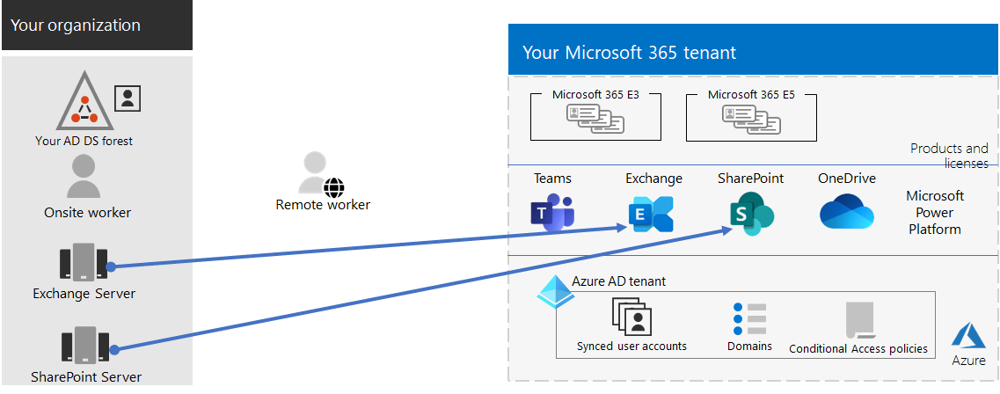

# Étape 4. Migration pour vos clients Microsoft 365 pour entreprise

La plupart des organisations d’entreprise ont un environnement hétérogène qui inclut plusieurs sorties de systèmes d’exploitation, de logiciels clients et de logiciels serveur. Microsoft 365 pour entreprise inclut les versions les plus sécurisées des composants clés de votre infrastructure informatique. Il inclut également des fonctionnalités de productivité conçues pour tirer parti des technologies cloud.

Pour optimiser la valeur commerciale de la suite intégrée microsoft 365 pour entreprise, commencez à planifier et à implémenter une stratégie pour migrer ces produits :

| De | À |
|:-------|:-----|
| Windows 7 et Windows 8.1 | Windows 10 Entreprise |
| Produits clients Office installés sur les appareils de vos travailleurs | Applications Microsoft 365 for entreprise |
| Produits serveur Office installés sur des serveurs locaux | Leurs services cloud équivalents dans Microsoft 365 |
|  |  |

## Migration vers Windows 10

Chaque licence Microsoft 365 pour entreprise inclut une licence pour Windows 10 Entreprise. Pour migrer vos appareils qui exécutent Windows 7 ou Windows 8.1, vous pouvez mettre à niveau sur place. Le support a pris fin pour Windows 7 *le 14 janvier 2020.* 

Pour d’autres méthodes d’installation de Windows 10 Entreprise au-delà d’une mise à niveau sur place, voir scénarios de [déploiement de Windows 10.](https://docs.microsoft.com/windows/deployment/windows-10-deployment-scenarios) Vous pouvez également [planifier le déploiement de Windows 10](https://aka.ms/planforwin10deployment) par vous-même.

## Migration vers Microsoft 365 Apps for enterprise

Microsoft 365 pour entreprise inclut Microsoft 365 Apps for enterprise, une version des produits clients Office (Word, PowerPoint, Excel et Outlook) installée et mise à jour à partir du cloud Microsoft. Pour plus d’informations, voir [à propos des applications Microsoft 365 pour les entreprises.](https://docs.microsoft.com/deployoffice/about-microsoft-365-apps)

Au lieu de maintenir vos ordinateurs à jour pour Office 2019 ou les versions antérieures, prenez les mesures suivantes :

1. Obtenez et attribuez une licence Microsoft 365 à vos utilisateurs.
2. Désinstallez Office 2013 ou Office 2016 sur leurs ordinateurs.
3. Installez Microsoft 365 Apps pour entreprise, individuellement ou pendant un déploiement informatique. Pour plus d’informations, voir [le guide de déploiement de Microsoft 365 Apps.](https://docs.microsoft.com/deployoffice/deployment-guide-microsoft-365-apps)

Microsoft 365 Apps pour entreprise installe automatiquement les mises à jour de sécurité et les nouvelles mises à jour de fonctionnalités et peut tirer parti des services basés sur le cloud dans Microsoft 365 pour améliorer la sécurité et la productivité.

## Migration de serveurs et de données locaux vers Microsoft 365

Microsoft 365 pour entreprise inclut des versions basées sur le cloud des services serveur Office qui utilisent certains des mêmes outils que les versions sur site des logiciels serveur Office, tels que les navigateurs web et le client Outlook. Ces services basés sur le cloud sont automatiquement mis à jour pour la sécurité et les nouvelles fonctionnalités. Après la migration, votre service informatique peut gagner du temps pour la maintenance et la mise à jour des serveurs locaux.

Utilisez les ressources suivantes pour plus d’informations sur la migration des utilisateurs et des données pour des charges de travail Microsoft 365 spécifiques :

- [Déplacer des boîtes aux lettres de l’Exchange Server vers Exchange Online](https://docs.microsoft.com/exchange/hybrid-deployment/move-mailboxes)
- [Migrer des données SharePoint de SharePoint Server vers SharePoint Online](https://docs.microsoft.com/sharepointmigration/migrate-to-sharepoint-online)
- [Migrer Skype Entreprise Online vers Microsoft Teams](https://docs.microsoft.com/microsoftteams/migration-interop-guidance-for-teams-with-skype)

## Transition de l'ensemble de votre organisation

Pour obtenir une meilleure image de la façon de déplacer l’ensemble de votre organisation vers les produits et services dans Microsoft 365 pour entreprise, téléchargez cette affiche de transition :

Cette affiche de deux pages est un moyen rapide d'inventorier vos infrastructures existantes. Utilisez-le pour obtenir des conseils pour passer à un produit ou un service dans Microsoft 365 pour entreprise. Il présente les produits Windows et Office, ainsi que d’autres éléments d’infrastructure et de sécurité tels que la gestion des appareils, la protection des identités et des menaces, ainsi que la protection et la conformité des informations.

## Résultats de l’étape 4

Pour la migration de votre client Microsoft 365, vous avez déterminé :

- Les appareils exécutant Windows 7 ou Windows 8.1 et le plan de mise à jour vers Windows 10 Entreprise.
- Quels appareils exécutent les applications clientes Office et envisagez de les mettre à jour vers les applications Microsoft 365 pour entreprise.
- Les services serveur Office locaux qui doivent être migrés vers leur équivalent Microsoft 365 et le plan de migration de ces services et de leurs données.

Voici un exemple de client avec une migration terminée de serveurs locaux.

Dans cette illustration, l’organisation a :

- Migration de ses boîtes aux lettres Exchange Server vers Exchange Online.
- Migration de ses données et sites SharePoint Server locaux vers SharePoint dans Microsoft 365.

## Maintenance continue pour la migration

Régulièrement, vous devrez peut-être :

- En fonction de l’état de votre migration de boîtes aux lettres Exchange, continuez à déployer la transition vers Exchange Online vers votre organisation.
- En fonction de l’état de votre migration de site SharePoint local, continuez à déployer la transition vers SharePoint dans Microsoft 365 vers votre organisation.

## Étape suivante

Poursuivez la [gestion des appareils et des applications](tenant-management-device-management.md) pour déployer la gestion des appareils et des applications.
